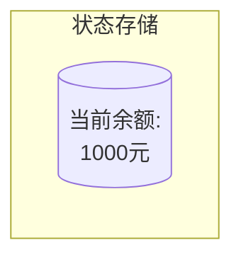
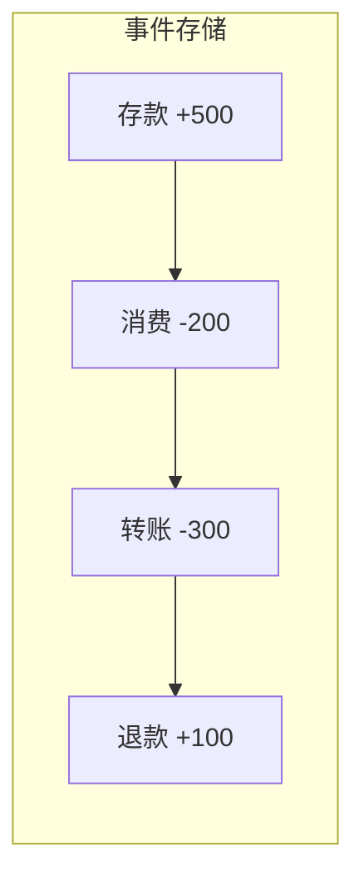
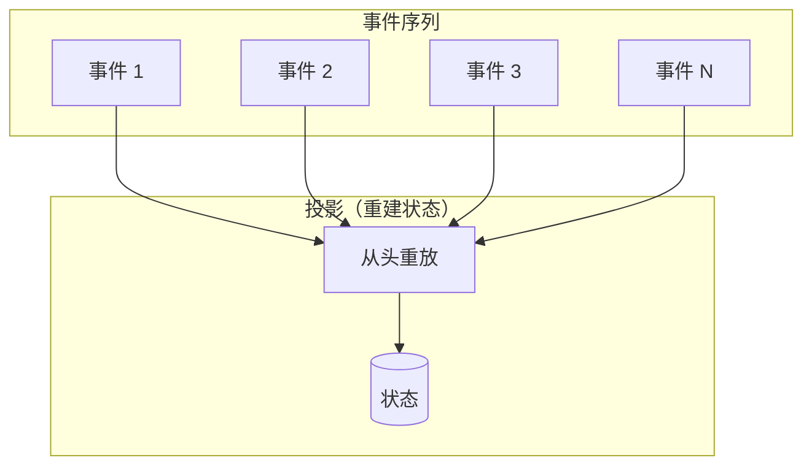
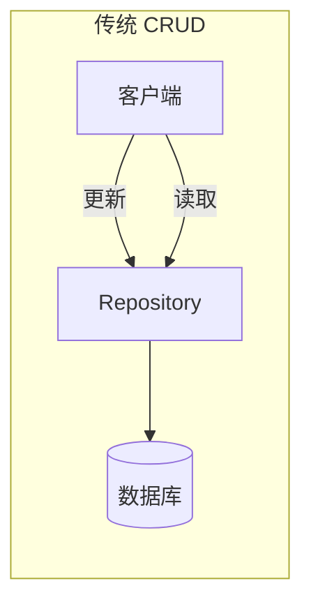
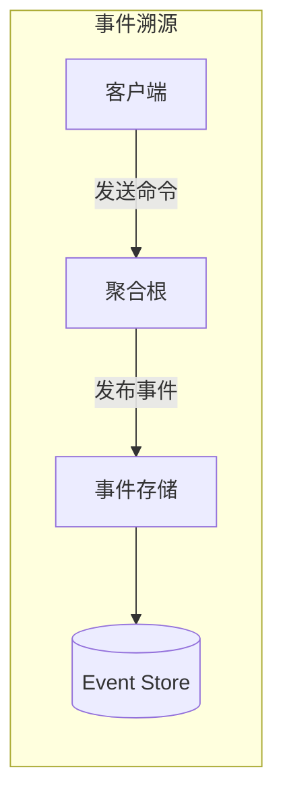
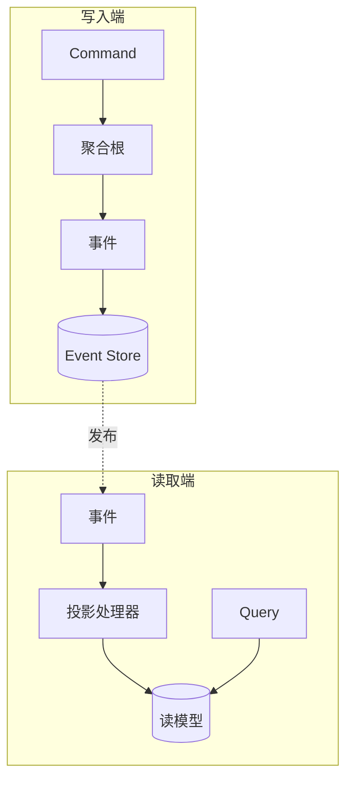

# 事件溯源

你去银行柜台打印流水，柜员问：「您要打印哪天的余额？」你愣了一下：「流水不是应该从第一条记录开始吗？」柜员说：「不好意思，我们系统只保留最终余额，不保留历史。」

你发现没有？这家银行记录的是**状态**，而不是**交易**。如果某笔转账有争议，你很难追溯「钱是怎么没的」。

事件溯源（Event Sourcing）提出了一个不同的思路：**不要存储状态，存储事件**。余额不是「查」出来的，是「算」出来的。

## 事件溯源的核心思想

传统的数据存储方式是**状态存储**：



事件溯源的数据存储方式是**事件存储**：



通过重放所有事件，可以得到任何时间点的状态。这就是事件溯源的核心：**事件是唯一真相来源**。



## 事件溯源 vs 传统 CRUD

### 传统 CRUD



**工作方式**：CURD 操作直接修改数据。

```java
// 传统 CRUD - 修改状态
@Service
public class AccountService {

    @Autowired
    private AccountRepository repository;

    public void transfer(Long fromId, Long toId, BigDecimal amount) {
        Account from = repository.findById(fromId);
        Account to = repository.findById(toId);

        from.setBalance(from.getBalance().subtract(amount));
        to.setBalance(to.getBalance().add(amount));

        repository.save(from);
        repository.save(to);
    }
}
```

### 事件溯源



**工作方式**：发送命令，聚合根生成事件，事件存储事件，读取时通过投影重建状态。

```java
// 事件溯源 - 用事件驱动
public class AccountAggregate {

    private Long id;
    private BigDecimal balance;
    private List<DomainEvent> uncommittedEvents = new ArrayList<>();

    // 从事件重建
    public static AccountAggregate fromEvents(List<DomainEvent> events) {
        AccountAggregate aggregate = new AccountAggregate();
        for (DomainEvent event : events) {
            aggregate.apply(event);
        }
        return aggregate;
    }

    // 处理命令
    public void transferTo(AccountAggregate target, BigDecimal amount) {
        if (this.balance.compareTo(amount) < 0) {
            throw new InsufficientBalanceException();
        }

        // 生成事件，而不是直接修改状态
        this.uncommittedEvents.add(new MoneyDebitedEvent(this.id, amount, target.getId()));
        target.uncommittedEvents.add(new MoneyCreditedEvent(target.getId(), amount, this.id));

        // 应用事件
        this.apply(new MoneyDebitedEvent(this.id, amount, target.getId()));
        target.apply(new MoneyCreditedEvent(target.getId(), amount, this.id));
    }

    private void apply(DomainEvent event) {
        if (event instanceof MoneyDebitedEvent) {
            MoneyDebitedEvent e = (MoneyDebitedEvent) event;
            this.balance = this.balance.subtract(e.getAmount());
        } else if (event instanceof MoneyCreditedEvent) {
            MoneyCreditedEvent e = (MoneyCreditedEvent) event;
            this.balance = this.balance.add(e.getAmount());
        }
    }

    public List<DomainEvent> getUncommittedEvents() {
        return uncommittedEvents;
    }

    public void markEventsCommitted() {
        uncommittedEvents.clear();
    }
}
```

## 事件设计

事件是事件溯源的核心。一个好的事件设计应该包含：

### 事件结构

```java
// 事件基类
public abstract class DomainEvent {
    private final String eventId;
    private final LocalDateTime occurredAt;
    private final String aggregateId;

    protected DomainEvent(String aggregateId) {
        this.eventId = UUID.randomUUID().toString();
        this.occurredAt = LocalDateTime.now();
        this.aggregateId = aggregateId;
    }
}
```

```java
// 具体事件
public class OrderCreatedEvent extends DomainEvent {
    private final String orderId;
    private final String customerId;
    private final List<OrderLineItem> lineItems;
    private final BigDecimal totalAmount;

    public OrderCreatedEvent(String orderId, String customerId,
                             List<OrderLineItem> lineItems, BigDecimal totalAmount) {
        super(orderId);
        this.orderId = orderId;
        this.customerId = customerId;
        this.lineItems = lineItems;
        this.totalAmount = totalAmount;
    }

    // Getter...
}
```

### 事件命名规范

事件命名应该反映**过去发生的事情**，而不是未来的操作：

| 好的命名 | 不好的命名 | 原因 |
| --- | --- | --- |
| `OrderCreatedEvent` | `CreateOrderCommand` | 事件是已发生的 |
| `MoneyDebitedEvent` | `DebitMoneyCommand` | 用被动语态 |
| `InventoryReservedEvent` | `ReserveInventoryCommand` | 描述结果而非操作 |

### 事件不可变性

事件一旦写入，就**不应该修改**。这是事件溯源的基础原则。

如果需要修改，应该通过**补偿事件**（Compensating Event）来处理：

```java
// 错误：不应该修改历史事件
public void correctMistake(String eventId, String correction) {
    Event event = eventStore.findById(eventId);
    event.setData(correction);  // 绝对不要这样做
    eventStore.save(event);
}

// 正确：通过补偿事件修正
public void reverseOrder(String orderId, String reason) {
    // 发布一个「订单已撤销」事件
    publishEvent(new OrderReversedEvent(orderId, reason, LocalDateTime.now()));
}
```

## 事件存储（Event Store）

Event Store 是事件溯源的核心组件，负责存储和检索事件序列。

### 事件存储的 API

```java
public interface EventStore {

    /**
     * 保存事件
     */
    void append(String aggregateId, DomainEvent event);

    /**
     * 批量保存事件
     */
    void append(String aggregateId, List<DomainEvent> events);

    /**
     * 获取聚合根的所有事件
     */
    List<DomainEvent> getEvents(String aggregateId);

    /**
     * 获取聚合根从特定版本之后的事件（用于乐观锁）
     */
    List<DomainEvent> getEvents(String aggregateId, long fromVersion);

    /**
     * 获取所有事件（用于投影重建）
     */
    Stream<DomainEvent> getAllEvents();
}
```

### 事件存储实现

```java
@Repository
public class JdbcEventStore implements EventStore {

    @Autowired
    private JdbcTemplate jdbcTemplate;

    @Override
    public void append(String aggregateId, DomainEvent event) {
        String sql = """
            INSERT INTO events (aggregate_id, event_type, event_data, occurred_at, version)
            VALUES (?, ?, ?, ?, ?)
            """;
        jdbcTemplate.update(sql,
            aggregateId,
            event.getClass().getSimpleName(),
            serialize(event),
            event.getOccurredAt(),
            event.getVersion()
        );
    }

    @Override
    public List<DomainEvent> getEvents(String aggregateId) {
        String sql = """
            SELECT * FROM events WHERE aggregate_id = ? ORDER BY version ASC
            """;
        return jdbcTemplate.query(sql, (rs, rowNum) -> {
            String eventType = rs.getString("event_type");
            String eventData = rs.getString("event_data");
            return deserialize(eventType, eventData);
        }, aggregateId);
    }
}
```

## 投影（Projection）

投影是从事件重建读模型的过程。当事件发生变化时，需要更新各种查询视图。

```java
// 投影处理器
@Service
public class OrderProjectionService {

    @Autowired
    private OrderWriteRepository writeRepository;
    @Autowired
    private OrderReadRepository readRepository;

    @KafkaListener(topics = "order-events", groupId = "order-projection")
    public void handleEvent(DomainEvent event) {
        if (event instanceof OrderCreatedEvent) {
            projectCreated((OrderCreatedEvent) event);
        } else if (event instanceof OrderCancelledEvent) {
            projectCancelled((OrderCancelledEvent) event);
        }
    }

    private void projectCreated(OrderCreatedEvent event) {
        OrderReadModel readModel = new OrderReadModel();
        readModel.setOrderId(event.getOrderId());
        readModel.setCustomerId(event.getCustomerId());
        readModel.setTotalAmount(event.getTotalAmount());
        readModel.setStatus("CREATED");
        readModel.setCreatedAt(event.getOccurredAt());
        readRepository.save(readModel);
    }

    private void projectCancelled(OrderCancelledEvent event) {
        readRepository.updateStatus(event.getOrderId(), "CANCELLED");
    }
}
```

### 投影与 CQRS

投影是 CQRS 中**读模型更新**的关键机制：



## 快照（Snapshot）

当聚合根的事件历史很长时，每次重建状态都需要重放所有事件，这会影响性能。快照可以解决这个问题。

```java
// 快照服务
@Service
public class SnapshotService {

    @Autowired
    private EventStore eventStore;
    @Autowired
    private SnapshotRepository snapshotRepository;

    public AccountAggregate getAggregate(String accountId) {
        // 尝试获取最新的快照
        Optional<Snapshot> latestSnapshot = snapshotRepository.findLatest(accountId);

        if (latestSnapshot.isPresent()) {
            // 从快照恢复
            AccountAggregate aggregate = deserialize(latestSnapshot.get().getState());

            // 从快照之后的事件开始重放
            List<DomainEvent> events = eventStore.getEventsAfter(
                accountId,
                latestSnapshot().getVersion()
            );

            for (DomainEvent event : events) {
                aggregate.apply(event);
            }

            return aggregate;
        } else {
            // 没有快照，从头重建
            List<DomainEvent> events = eventStore.getEvents(accountId);
            return AccountAggregate.fromEvents(events);
        }
    }

    public void takeSnapshot(AccountAggregate aggregate) {
        Snapshot snapshot = new Snapshot();
        snapshot.setAggregateId(aggregate.getId());
        snapshot.setVersion(aggregate.getVersion());
        snapshot.setState(serialize(aggregate));
        snapshot.setTakenAt(LocalDateTime.now());
        snapshotRepository.save(snapshot);
    }
}
```

快照策略通常是**基于事件数量或时间间隔**：

```java
@Configuration
public class SnapshotConfiguration {

    @Bean
    public SnapshotTrigger snapshotTrigger() {
        // 每 100 个事件拍一次快照
        return new EventCountSnapshotTrigger(100);
        // 或者基于时间：return new TimeBasedSnapshotTrigger(Duration.ofHours(1));
    }
}
```

## 事件溯源的优缺点

### 优点

**完整的历史记录**：可以追溯任何时间点的状态，这对于审计、合规、问题排查非常有价值。

**强大的审计能力**：不需要额外的审计日志表，事件本身就是审计记录。

**支持时间旅行查询**：可以查询「上个月用户余额是多少」这类问题。

**事件驱动架构天然契合**：下游系统可以通过订阅事件来保持同步。

### 缺点

**复杂度高**：需要管理事件序列、版本升级、快照等。

**事件膨胀**：长期运行的应用可能积累大量事件，影响性能。

**查询能力弱**：不能直接查询「当前余额是多少」，必须通过投影重建。

**事件 schema 变更**：当业务规则变化时，需要处理旧事件的兼容性。

## 适用场景与不适用场景

| 场景 | 推荐程度 | 说明 |
| --- | --- | --- |
| 金融系统 | **强烈推荐** | 需要完整审计历史 |
| 库存系统 | **推荐** | 需要追踪每一次变动 |
| 订单系统 | **推荐** | 需要订单全流程追溯 |
| 简单 CRUD 系统 | **不推荐** | 过度设计 |
| 需要复杂报表的系统 | **谨慎** | 需要频繁从事件重建状态 |

:::tip 经验之谈

事件溯源最大的坑是**低估了复杂度**。很多团队看到「审计功能强大」「支持时间旅行」就决定上，结果发现：

1. **事件 schema 变更很痛苦**：旧事件怎么处理？历史数据怎么迁移？
2. **投影的一致性难以保证**：事件发布了但投影失败了怎么办？
3. **调试困难**：异步事件流出问题，很难追踪因果关系

建议先在局部场景试点（如退款流程），验证效果后再全面推广。

:::

## 总结

事件溯源是一种**用事件代替状态**的数据存储方式。通过存储完整的事件序列，可以重建任何时间点的状态，支持强大的审计能力。

**事件溯源的核心组件**：
- **事件**：描述已发生的事情，不可变
- **聚合根**：生成事件，应用事件，从事件重建
- **事件存储**：持久化事件序列
- **投影**：从事件重建读模型
- **快照**：优化长事件序列的读取性能

**事件溯源的代价**：
- 复杂度显著增加
- 查询不如关系型数据库直观
- 需要处理事件 schema 变更

理解了事件溯源，下一个话题是**事件驱动架构（EDA）**，它关注的是如何通过事件来解耦系统组件。

