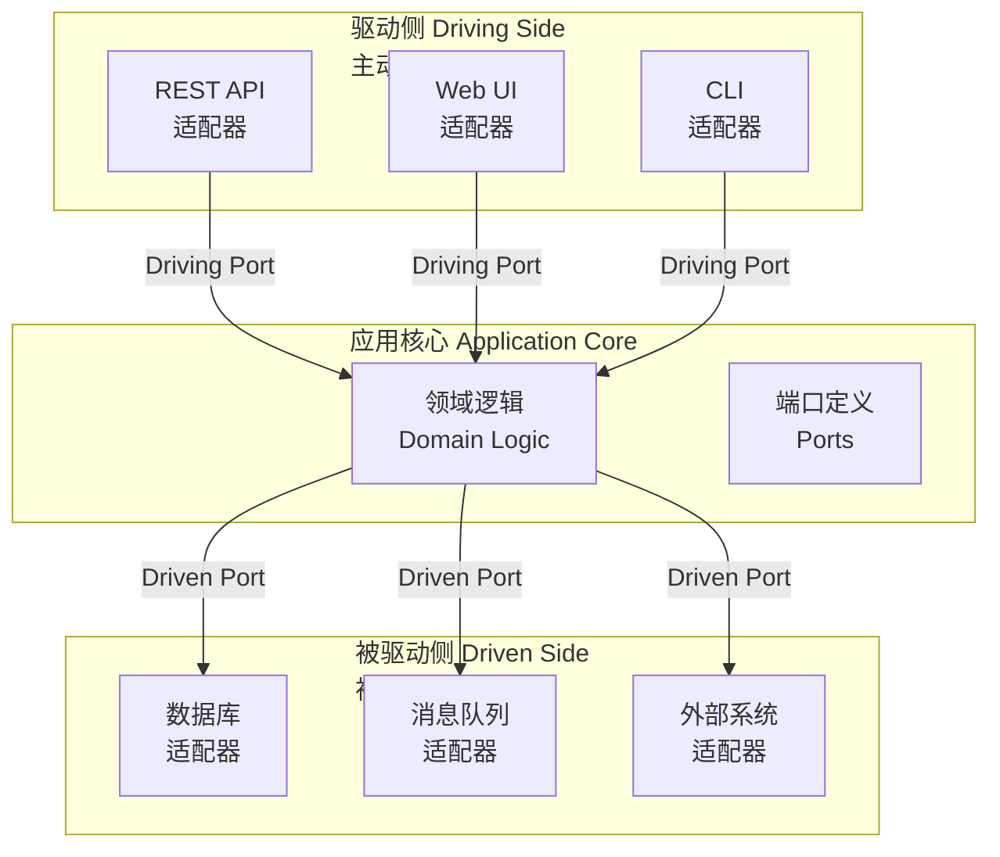
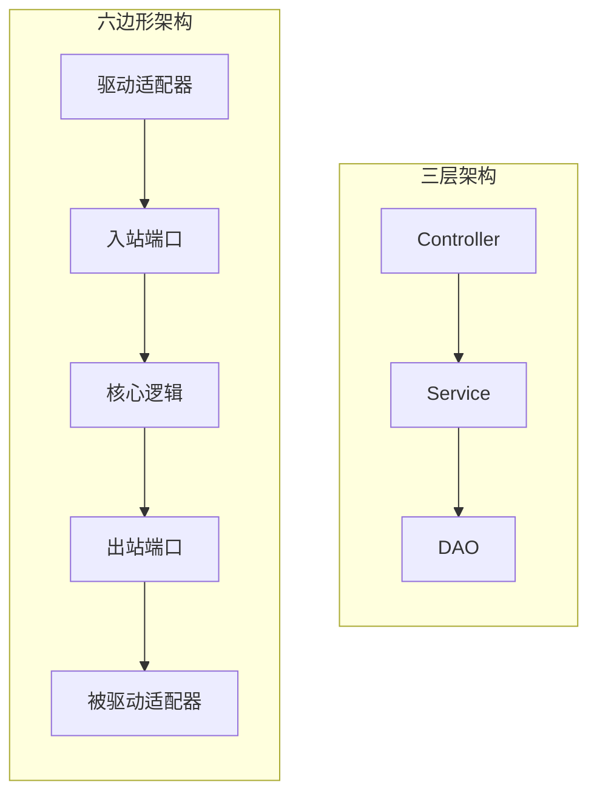
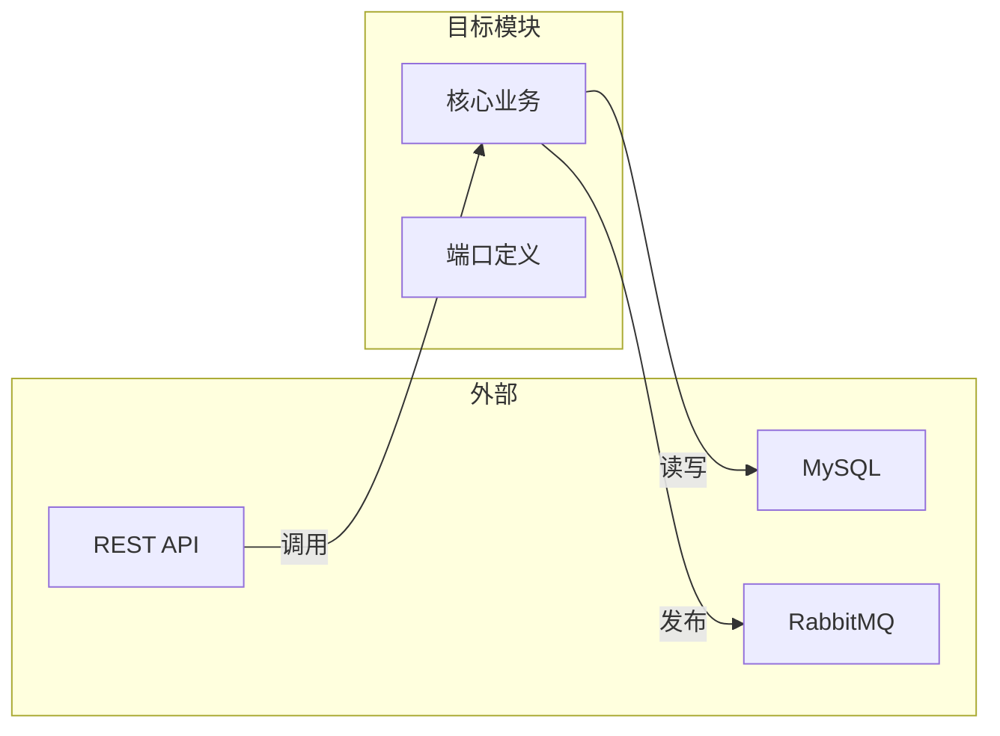

# 六边形架构

你们的系统用了三年 MySQL，产品部门决定迁移到 PostgreSQL，理由是「团队更熟悉 PostgreSQL的 JSON 支持」。听起来合理，但等你开始评估工作量时发现：Service 层有大量 MySQL 特有的 SQL 语法，DAO 层散落着各种数据库特定的处理逻辑，测试用例直接依赖真实数据库连接。迁移成本比你想象的高得多——**问题出在架构上**。

为什么换一个数据库这么难？因为你的业务逻辑「紧耦合」在数据层。Service 直接调用 DAO，DAO 直接写 SQL，当底层存储变了，所有依赖它的上层都要改。

六边形架构（Hexagonal Architecture）正是来解决这个问题的。它的核心思想是：**让应用能够轻松地连接各种外部设备，而不影响核心业务逻辑**。

## 六边形架构的核心概念

六边形架构由 Alistair Cockburn 在 2005 年提出，也叫**端口与适配器架构**（Ports and Adapters）。它的核心主张是：**应用的业务逻辑应该放在中央，周围是端口和适配器**。



驱动侧（Driving Side）代表**主动发起操作的外部系统**，如 REST API、Web UI、CLI。被驱动侧（Driven Side）代表**被应用调用的外部系统**，如数据库、消息队列、外部 API。

## 端口：应用的边界

端口是应用核心与外部世界交互的**接口定义**。它分为两种类型：

### 入站端口（Driving Port / Primary Port）

由外部主动调用的接口，定义在应用核心中。比如订单服务需要提供「创建订单」的接口，这就是一个入站端口。

```java
// 入站端口 - 定义在核心层
public interface CreateOrderUseCase {
    OrderId execute(CreateOrderCommand command);
}
```

### 出站端口（Driven Port / Secondary Port）

应用需要调用外部系统时定义的接口。比如订单服务需要「保存订单」「查询用户信息」「发送消息」，这些就是出站端口。

```java
// 出站端口 - 定义在核心层
public interface OrderRepository {
    void save(Order order);
    Order findById(OrderId id);
}

// 出站端口
public interface UserQueryService {
    User findById(UserId id);
}

// 出站端口
public interface EventPublisher {
    void publish(OrderCreatedEvent event);
}
```

**关键点**：端口定义在核心层，由外部适配器实现。这样核心层完全不依赖外部世界。

## 适配器：连接内外

适配器是端口的具体实现。根据连接的方向，分为：

### 驱动适配器（Driving Adapter）

实现入站端口，把外部请求转换成核心能理解的调用。常见的驱动适配器有 REST Controller、Web Controller、CLI Command 等。

```java
// 驱动适配器 - REST API 实现入站端口
@RestController
public class OrderRestAdapter implements CreateOrderUseCase {

    private final CreateOrderUseCase createOrderUseCase;

    @PostMapping("/orders")
    public ResponseEntity<OrderResponse> createOrder(@RequestBody CreateOrderRequest request) {
        CreateOrderCommand command = toCommand(request);
        OrderId orderId = createOrderUseCase.execute(command);
        return ResponseEntity.created(location(orderId)).build();
    }
}
```

### 被驱动适配器（Driven Adapter）

实现出站端口，把核心的调用转换成对外部系统的操作。常见的被驱动适配器有 JPA Repository、Redis Client、HTTP Client、Message Producer 等。

```java
// 被驱动适配器 - JPA 实现出站端口
@Repository
public class JpaOrderRepository implements OrderRepository {

    @Autowired
    private EntityManager entityManager;

    @Override
    public void save(Order order) {
        entityManager.persist(order);
    }

    @Override
    public Order findById(OrderId id) {
        return entityManager.find(Order.class, id.getValue());
    }
}
```

```java
// 被驱动适配器 - Redis 实现缓存端口
@Repository
public class RedisCacheAdapter implements CachePort {

    @Autowired
    private StringRedisTemplate redisTemplate;

    @Override
    public void put(String key, Object value, Duration ttl) {
        redisTemplate.opsForValue().set(key, serialize(value), ttl);
    }

    @Override
    public Optional<Object> get(String key) {
        String value = redisTemplate.opsForValue().get(key);
        return Optional.ofNullable(value).map(this::deserialize);
    }
}
```

## 六边形 vs 三层架构

很多人容易把六边形架构和三层架构搞混，它们看起来都「分层」，但有本质区别：

| 维度 | 三层架构 | 六边形架构 |
| --- | --- | --- |
| **依赖方向** | 上层依赖下层（Controller → Service → DAO） | 外层依赖内层（适配器 → 核心） |
| **数据库位置** | 数据层是「底层」，Service 依赖它 | 数据库是「外部」，核心不依赖它 |
| **可测试性** | 测试 Service 需要 DAO | 测试核心只需要 Mock 适配器 |
| **换数据库代价** | 高，需要改 Service 层 | 低，只需要换适配器 |
| **核心定义** | 业务逻辑在 Service 层 | 业务逻辑在核心层 |

三层架构中，数据库是最底层，所有上层都依赖它。六边形架构中，核心在中间，数据库是外部插件。



## 依赖倒置的应用

六边形架构的核心是**依赖倒置原则**（DIP）：高层模块不应该依赖低层模块，两者都应该依赖抽象。

在代码层面，这意味着：

1. **核心层只定义接口（抽象）**，不包含实现
2. **适配器层实现接口**，把外部世界的复杂性挡在外面

```java
// ========== 核心层 ==========
// 领域模型 - 核心层
public class Order {
    private OrderId id;
    private Customer customer;
    private Money totalAmount;
    private OrderStatus status;

    // 核心业务逻辑
    public void confirm() {
        if (this.status != OrderStatus.PENDING) {
            throw new InvalidOrderStateException("只有待确认订单可以确认");
        }
        this.status = OrderStatus.CONFIRMED;
    }
}

// 入站端口 - 核心层定义
public interface OrderService {
    OrderId createOrder(CreateOrderCommand command);
    void confirmOrder(OrderId orderId);
}

// 出站端口 - 核心层定义
public interface OrderRepository {
    void save(Order order);
    Order findById(OrderId id);
}
```

```java
// ========== 适配器层 ==========
// 驱动适配器 - REST 实现入站端口
@RestController
public class OrderController implements OrderService {

    private final OrderService orderServiceDelegate;

    @PostMapping("/orders")
    public ResponseEntity<OrderResponse> createOrder(@RequestBody CreateOrderRequest request) {
        OrderId id = orderServiceDelegate.createOrder(toCommand(request));
        return ResponseEntity.created(URI.create("/orders/" + id)).build();
    }
}

// 被驱动适配器 - JPA 实现出站端口
@Repository
public class JpaOrderRepository implements OrderRepository {

    private final EntityManager em;

    @Override
    public void save(Order order) {
        em.persist(order);
    }
}
```

## 从三层架构迁移到六边形

很多团队想从三层架构迁移到六边形，但不知道从哪里开始。这里提供一个**渐进式迁移策略**：

### 第一步：识别核心与边界

从最稳定的业务模块开始，画出这个模块与外部世界的交互：



### 第二步：创建端口接口

把现有的 Service 方法提取成入站端口，把现有的 DAO 方法提取成出站端口：

```java
// 在核心层创建接口
public interface OrderRepository {
    void save(Order order);
}

public interface OrderService {
    OrderId createOrder(CreateOrderCommand command);
}
```

### 第三步：让现有代码实现端口

```java
// 改造现有 Service，让它实现端口接口
@Service
@Transactional
public class OrderServiceImpl implements OrderService {

    @Autowired
    private OrderRepository orderRepository;

    @Override
    public OrderId createOrder(CreateOrderCommand command) {
        // 现有逻辑...
    }
}
```

### 第四步：注入适配器

通过依赖注入把适配器连接到核心：

```java
@Configuration
public class HexagonalConfiguration {

    @Bean
    public OrderService orderService(OrderRepository orderRepository) {
        return new OrderServiceImpl(orderRepository);
    }
}
```

## 适用场景与不适用场景

| 场景 | 推荐程度 | 说明 |
| --- | --- | --- |
| 需要频繁切换数据库 | **强烈推荐** | 六边形为此而生 |
| 需要接入多个外部系统 | **强烈推荐** | 端口统一了外部依赖 |
| 领域驱动设计（DDD）项目 | **强烈推荐** | 六边形天然支持 DDD |
| 小型 CRUD 项目 | **不推荐** | 过度设计，徒增复杂度 |
| 团队不熟悉接口设计 | **谨慎** | 需要先培训，否则容易搞成「换汤不换药」 |

:::tip 经验之谈

六边形架构最大的价值不是「代码结构」，而是**思维方式**的转变。它让你从「数据库是基础」变成「数据库是插件」。当你能轻松换数据库时，你会发现换消息队列、换缓存、换外部 API 也变得简单了。

但六边形架构不是银弹。它增加了接口层的复杂度，如果你的系统不需要频繁切换外部依赖，带来的收益可能抵不上成本。

:::

## 总结

六边形架构的核心是**端口与适配器的分离**。通过把外部依赖定义成接口（端口），让核心业务逻辑完全不依赖外部世界，从而实现：

- **可测试性**：核心逻辑可以完全独立于外部系统进行测试
- **可替换性**：换数据库、换消息队列、换外部 API，只需要换一个适配器
- **清晰边界**：端口定义了核心与外部的边界，避免业务逻辑散落各处

下一个话题是**洋葱架构**，它和六边形架构非常相似，但有一个关键的演进点。

