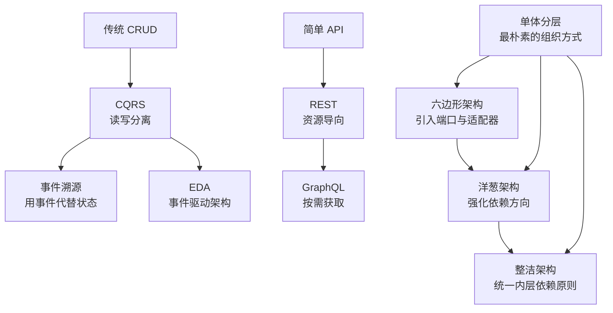

# 架构风格

系统变慢了。你加了几台服务器、换了更快的数据库、上线了缓存，但效果还是不明显。问题到底在哪？

很多团队在这个阶段会继续在细节上打转——换个 ORM、换个连接池、换个消息队列。但真正的问题，往往在更高层：**你的架构风格，正在成为系统扩展的瓶颈**。

架构风格不是「用什么框架」那么简单。它决定了你如何划分系统边界、如何管理依赖关系、如何应对需求变化。当业务简单时，架构风格的影响不明显；当业务复杂到一定程度，架构风格的优劣会直接决定你是「快速迭代」还是「每次改一行代码都要改一周」。

本模块聚焦后端架构的核心风格，从分层架构到六边形架构，从事件驱动到 CQRS，帮你建立完整的架构视野。

## 模块结构

本模块按主题分为以下子模块：

| 子模块 | 核心问题 | 典型场景 |
| --- | --- | --- |
| 分层架构 | 如何用层次划分组织代码 | 企业级单体应用、传统 Web 系统 |
| 六边形架构 | 如何实现依赖倒置与端口适配 | 需要频繁切换持久化方案的领域驱动设计 |
| 洋葱架构 | 如何保证核心业务不受外部框架影响 | 中台服务、业务中台 |
| 整洁架构 | 如何实现清晰的依赖方向与职责分离 | 大型复杂业务系统、需要长期维护的核心模块 |
| CQRS | 如何分离读写操作以获得更好的扩展性 | 读多写少的数据平台、需要复杂查询的场景 |
| 事件溯源 | 如何用事件流代替状态快照记录业务 | 金融系统、需要审计日志的场景 |
| EDA 事件驱动 | 如何用事件实现松耦合的系统交互 | 微服务解耦、物联网数据采集 |
| 微内核架构 | 如何设计插件化系统 | IDE、编辑器、浏览器 |
| 管道-过滤器 | 如何组合数据处理流程 | 数据流水线、日志处理、ETL |
| MVC/MVVM | UI 层如何与业务逻辑分离 | Web 应用、桌面应用、移动端 |
| REST 架构 | 如何设计 Web API | 开放平台、移动端后端 |
| GraphQL 架构 | 如何解决 API 聚合与字段冗余 | 移动端、多端统一 API |

## 核心演进路径

架构风格不是「最新的最好」，而是「最合适的最好」。理解各种风格的演进逻辑，能帮助你做出更合理的技术选型：

## 与设计模式的区别

很多人容易把架构风格和设计模式混为一谈，这里做一个澄清：

| 维度 | 设计模式 | 架构风格 |
| --- | --- | --- |
| **粒度** | 代码层面的组织方式，如「单例模式」「观察者模式」 | 系统层面的组织方式，如「分层」「微服务」 |
| **范围** | 针对某个具体问题的解决方案 | 针对整个系统的结构和约束 |
| **灵活性** | 可以灵活组合使用 | 通常是系统的主导结构 |
| **抽象层次** | 代码结构层面的抽象 | 模块/组件层面的抽象 |

设计模式是战术层面的工具，架构风格是战略层面的决策。一个好的架构应该能让设计模式发挥最佳效果，而不是限制它们的使用。

## 为什么需要了解架构风格

架构风格是技术选型的起点。不同业务场景需要不同的架构，没有银弹，但有更合适的选择。

**小团队（`<=` 5人）、简单业务（CRUD + 少量并发）**：

- 推荐分层架构
- 不要过度设计，避免把简单问题复杂化
- 随着团队成长再考虑迁移

**中等规模团队（5~20人）、中等复杂度业务**：

- 考虑六边形架构或整洁架构
- 核心是建立清晰的边界和依赖规则
- 不要盲目引入 CQRS 或事件溯源

**大规模团队（20人以上）、复杂业务**：

- 根据具体场景选择 CQRS + EDA
- 需要配套的运维、监控、事务管理能力
- 架构风格的变更成本很高，前期决策要谨慎

:::tip 经验之谈

很多团队的问题是「架构过度」而不是「架构不足」。一个日活 1 万的小系统，上来就搞微服务 + CQRS + 事件溯源，最后维护成本比业务开发成本还高。

架构复杂度应该与团队能力和业务规模匹配。好的架构师不是用最「先进」的技术，而是用最「合适」的技术。

:::

## 本章文章导读

如果你时间有限，可以按以下优先级阅读：

1. **必读**：分层架构（Layered）—— 这是理解其他架构的基础
2. **推荐**：六边形架构（Hexagonal）—— 理解依赖倒置的核心思想
3. **推荐**：整洁架构（Clean）—— 与六边形一脉相承，理解内层不依赖外层的原则
4. **选读**：CQRS + 事件溯源—— 如果你有读写分离或审计追踪的需求
5. **选读**：EDA 事件驱动 —— 如果你在做微服务解耦或数据集成
6. **了解**：微内核、管道-过滤器、MVC/MVVM、REST、GraphQL —— 根据具体场景查阅

准备好了吗？让我们从最经典的**分层架构**开始。
