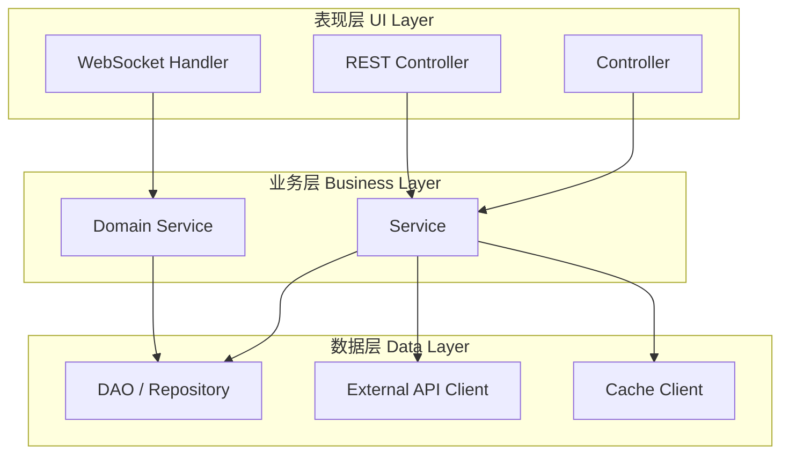
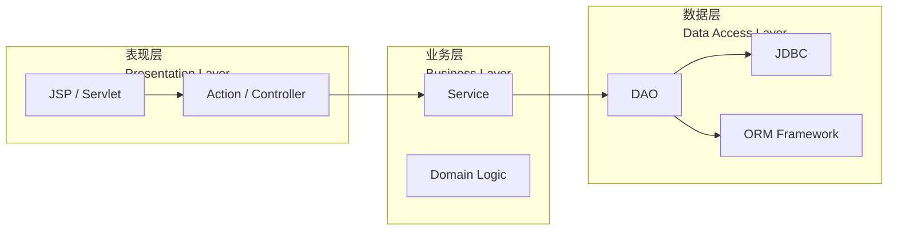
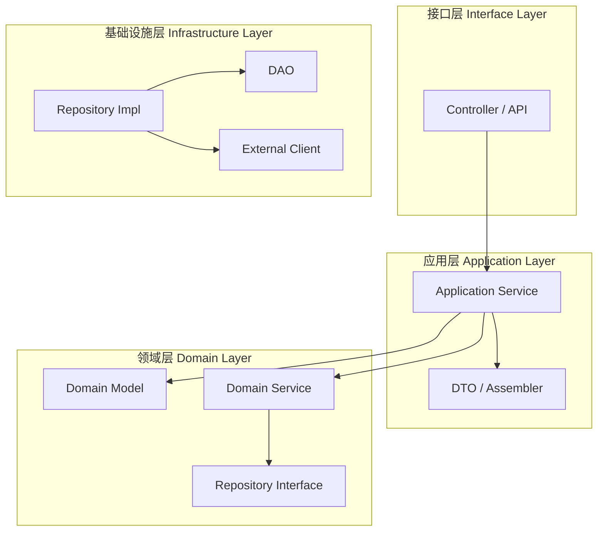

# 分层架构

你在一个中型团队工作，代码库已经有 3 年历史。某天产品经理说：「把用户模块从 MySQL 迁移到 PostgreSQL」。你打开代码，发现 Controller 调用 Service，Service 调用 DAO，DAO 直接写 SQL。听起来很清晰，对吧？等你改完 DAO 层的 SQL 后，发现 Service 层的某些逻辑也需要调整——因为某些 SQL 特性在不同数据库间不兼容。这就是传统分层架构最常见的问题：**层层传递导致的耦合**。

分层架构是大多数 Java 后端开发者接触的第一个架构模式，也是被误解最多的一个。很多人觉得「分了层就万事大吉」，但真正的问题在于：**分层架构本身不解决依赖问题**。

## 为什么需要分层

在讨论分层架构之前，先回答一个更根本的问题：为什么要分层？

**关注点分离**。人脑处理复杂度的能力有限，当我们把代码按职责分成不同层级时，每一层只需要关心自己的问题。Controller 不需要知道数据怎么存，DAO 不需要知道业务规则是什么。当你在调试「为什么订单金额计算错了」的时候，你只需要在 Service 层找答案，而不用看 SQL 怎么写。

**团队协作**。分层让不同团队可以并行工作。前端团队只关心 Controller 层怎么调用，后端团队只关心 Service 层怎么写业务逻辑，运维团队只关心数据库怎么配置。如果不分层，所有人都在同一个代码池里，改一行代码可能引发连锁反应。

**代码复用**。同样的 DAO 层可以给不同的 Service 使用，同样的 Service 可以暴露给不同的 Controller 调用。没有分层的话，你可能需要在每个业务模块里重复写「查询用户」「保存订单」这样的代码。



## 传统三层架构

最经典的分层架构是**三层架构**（Three-Tier Architecture），来自 Java EE 时代的 MVC 模式：



表现层负责与用户交互，业务层负责核心业务逻辑，数据层负责与数据库交互。每一层都只和相邻的层通信。

```java
// 表现层 - Controller
@Controller
@RequestMapping("/order")
public class OrderController {

    @Autowired
    private OrderService orderService;

    @PostMapping("/create")
    public ResponseEntity<OrderDTO> createOrder(@RequestBody CreateOrderRequest request) {
        OrderDTO result = orderService.createOrder(request);
        return ResponseEntity.ok(result);
    }
}
```

```java
// 业务层 - Service
@Service
public class OrderService {

    @Autowired
    private OrderDAO orderDAO;

    @Transactional
    public OrderDTO createOrder(CreateOrderRequest request) {
        // 业务逻辑
        validateOrder(request);
        calculateAmount(request);
        
        // 调用数据层
        Order order = convertToEntity(request);
        orderDAO.insert(order);
        
        return convertToDTO(order);
    }
}
```

```java
// 数据层 - DAO
@Repository
public class OrderDAO {

    @Autowired
    private JdbcTemplate jdbcTemplate;

    public void insert(Order order) {
        String sql = "INSERT INTO orders (id, user_id, amount, status) VALUES (?, ?, ?, ?)";
        jdbcTemplate.update(sql, order.getId(), order.getUserId(), 
                          order.getAmount(), order.getStatus());
    }
}
```

## 四层架构的演进

传统三层架构有一个问题：**业务层和数据层之间缺乏清晰的分界**。当业务逻辑变复杂时，Service 层会越来越臃肿，DAO 层反而变得越来越「智能」。

四层架构在三层基础上增加了一层**领域层**（Domain Layer），专门放置核心业务逻辑：



**关键变化**：领域层定义了 Repository 接口（而不是实现），基础设施层实现这些接口。这就是**依赖倒置**的核心应用——领域层不依赖具体的数据库实现。

```java
// 领域层 - 定义接口
public interface OrderRepository {
    void save(Order order);
    Order findById(Long id);
    List<Order> findByUserId(Long userId);
}
```

```java
// 基础设施层 - 实现接口
@Repository
public class JpaOrderRepository implements OrderRepository {

    @Autowired
    private EntityManager em;

    @Override
    public void save(Order order) {
        em.persist(order);
    }

    @Override
    public Order findById(Long id) {
        return em.find(Order.class, id);
    }
}
```

## 分层架构的核心问题

分层架构最大的误解是以为「只要分了层就解耦了」。实际上，传统分层架构存在几个根本性问题：

### 层层传递问题

```java
@Service
public class OrderService {

    @Autowired
    private OrderDAO orderDAO;

    @Autowired
    private UserDAO userDAO;  // 为了校验用户，需要引入 UserDAO

    @Autowired
    private ProductDAO productDAO;  // 为了校验商品，需要引入 ProductDAO

    @Autowired
    private WarehouseService warehouseService;  // 为了扣库存，需要调用其他 Service
}
```

当业务逻辑需要跨越多个数据实体时，Service 层会变成一个**聚合协调器**，把所有 DAO 和 Service 聚合在一起。这不是真正的业务逻辑，而是**贫血模型**的表现。

### 依赖方向问题

在传统三层架构中，业务层依赖数据层。这看起来很自然，但会带来一个问题：**换数据库代价很大**。当你想把 MySQL 换成 PostgreSQL 时，不只是改 DAO 层，某些 Service 层的 SQL 特定逻辑也需要改。

### 层层边界模糊

很多项目的 Controller 里有业务逻辑，Service 里有 SQL，DAO 里有业务校验。分层变成了「物理文件位置的分离」而不是「职责的分离」。

```java
// 这不是真正的分层
@Controller
public class BadOrderController {

    @Autowired
    private OrderDAO orderDAO;  // Controller 直接依赖 DAO，破坏了分层

    @PostMapping("/order")
    public void createOrder() {
        // Controller 里写 SQL
        orderDAO.insert("INSERT INTO...");
    }
}
```

## 分层架构的改进策略

### 依赖倒置原则

要让分层架构真正发挥作用，关键是在**数据访问层引入接口**：

```java
// 领域层 - 定义契约，不依赖具体实现
public interface OrderRepository {
    void save(Order order);
    Order findById(Long id);
}

// 应用层 - 使用接口，不关心实现
@Service
public class OrderService {

    private final OrderRepository orderRepository;  // 依赖接口

    public OrderService(OrderRepository orderRepository) {
        this.orderRepository = orderRepository;
    }
}

// 基础设施层 - 实现接口
@Repository
public class JpaOrderRepository implements OrderRepository {
    // 具体实现...
}
```

这样做的好处是：Service 层只知道自己「有一个订单仓库」，不关心它是 MySQL 实现还是 PostgreSQL 实现。换数据库时，只需要新增一个实现类，不需要修改 Service 层。

### 防腐层（Anti-Corruption Layer）

当你需要调用外部系统时，不要让外部系统的模型直接渗透到你的业务层。创建一个防腐层，把外部系统的模型转换成你自己的模型：

```java
// 外部系统返回的模型
class LegacyUserDTO {
    String USER_NAME;  // 外部系统可能是下划线命名
    int USER_AGE;
}

// 防腐层转换
@Service
public class UserAdapter {

    public User convertToDomain(LegacyUserDTO dto) {
        return User.builder()
            .name(dto.USER_NAME)  // 转换命名风格
            .age(dto.USER_AGE)
            .build();
    }
}
```

### 应用服务 vs 领域服务

区分两种类型的服务：

**应用服务**（Application Service）负责用例编排，调用领域对象完成业务操作，本身不包含业务逻辑。

**领域服务**（Domain Service）包含真正的业务逻辑，当某个操作不属于任何一个实体或值对象时，放在领域服务中。

```java
// 应用服务 - 编排用例
@Service
public class OrderApplicationService {

    public void placeOrder(PlaceOrderCommand command) {
        // 编排：先检查库存，再创建订单
        inventoryService.reserve(command.getProductId(), command.getQuantity());
        Order order = orderFactory.create(command);
        orderRepository.save(order);
    }
}

// 领域服务 - 包含业务逻辑
@Service
public class PricingDomainService {

    public Money calculatePrice(List<OrderLine> lines) {
        // 根据业务规则计算价格
        // 这是真正的业务逻辑，不是简单的数据传递
    }
}
```

## 适用场景与不适用场景

| 场景 | 推荐程度 | 说明 |
| --- | --- | --- |
| 小型项目，团队 `<=` 5 人 | **推荐** | 分层清晰，学习成本低 |
| 传统企业应用，需求稳定 | **推荐** | 分层架构成熟，配套工具完善 |
| 快速迭代的互联网产品 | **谨慎** | 分层架构的层层传递可能拖累迭代速度 |
| 需要频繁切换持久化方案 | **需要改进** | 必须配合依赖倒置，否则改造成本高 |
| 业务逻辑非常复杂 | **需要改进** | 贫血模型会导致 Service 层过于臃肿 |

:::tip 经验之谈

很多团队抱怨分层架构「改不动」，但问题往往不是分层本身，而是**没有真正遵循分层原则**。Controller 直接依赖 DAO、Service 写 SQL、DAO 包含业务逻辑——这些才是真正的问题。

如果你的团队决定用分层架构，第一件事是**制定分层规范并严格执行**，而不是抱怨分层架构不够好。

:::

## 总结

分层架构是最经典的架构模式，它的价值在于提供了清晰的关注点分离和团队协作基础。但它的弱点也很明显：**不解决依赖问题，层层传递会导致耦合**。

记住这几个要点：

1. **分层的目的是分离关注点**，不是「按文件位置放代码」
2. **在数据层引入接口**是改进分层架构的关键
3. **贫血模型是分层架构的常见误区**，核心业务逻辑应该在领域对象中
4. **分层不是银弹**，对于复杂业务，需要结合六边形或整洁架构

理解了分层架构的问题和改进方向，我们就准备好了理解更高级的架构模式。接下来让我们看看**六边形架构**如何解决这些问题。

