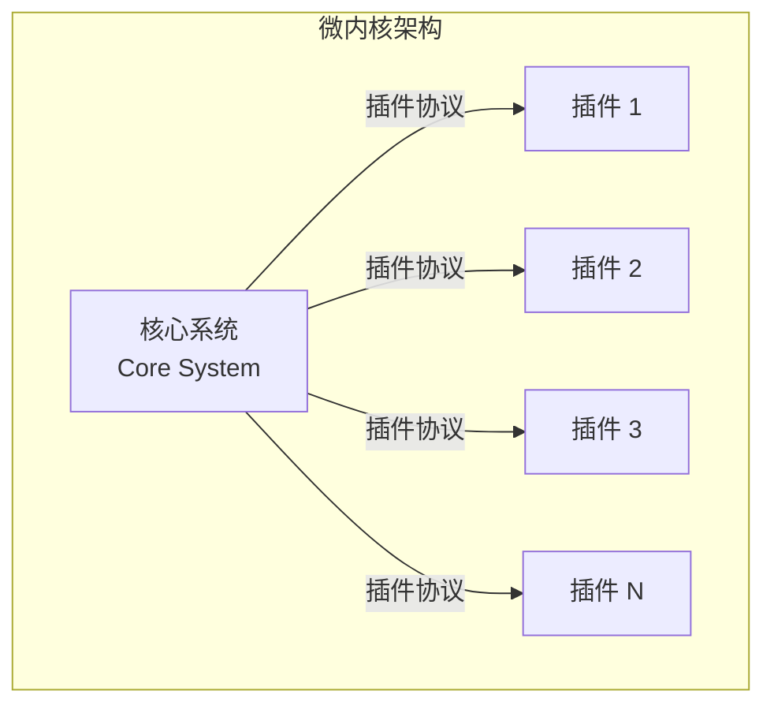
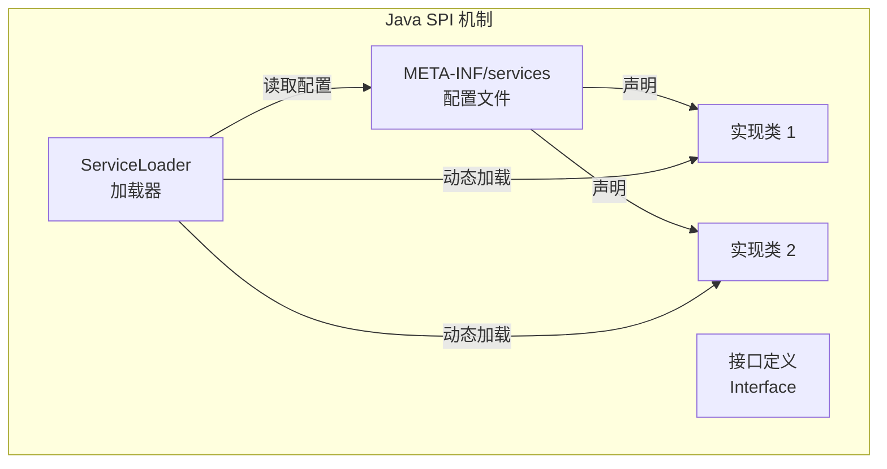
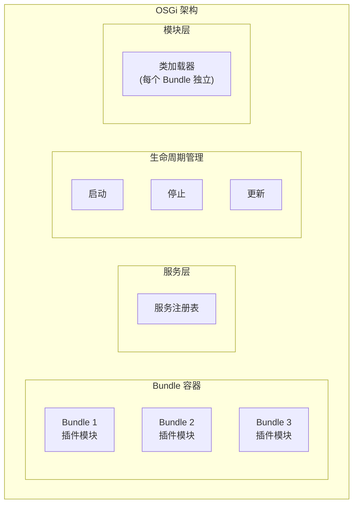
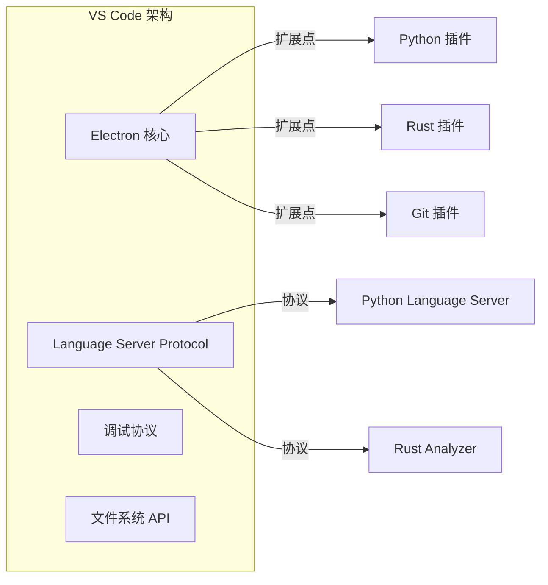
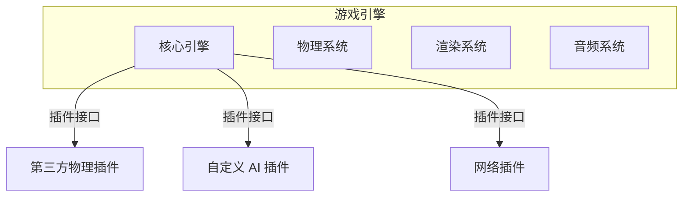

# 微内核架构

VS Code 为什么能装一万多个插件，从 Python 到 Rust、从 Kubernetes 到 Terraform？你在 Notepad++ 里装了一个插件后，整个编辑器崩溃了。VS Code 的插件隔离是怎么做到的？

这就是**微内核架构**（Microkernel Architecture）的力量：**把最核心的功能做成稳定的「内核」，把可变的、实验性的功能做成「插件」**。内核不需要知道插件的存在，插件也不需要修改内核代码。

## 微内核架构的核心概念

微内核架构，也叫**插件架构**（Plug-in Architecture），由 Craig Larman 在《Applying UML and Patterns》中系统阐述。它的核心思想是：

1. **核心系统（Core System）**：包含系统运行所需的最小功能集，稳定且通用
2. **插件模块（Plugin Modules）**：独立的、可替换的功能单元，扩展核心系统的能力



### 内核职责

核心系统通常负责：
- 加载和管理插件
- 插件间的通信路由
- 提供基础的运行时环境
- 管理插件的生命周期（安装、激活、卸载）

### 插件职责

每个插件负责：
- 实现特定的业务功能
- 声明自己需要哪些扩展点
- 与内核和其他插件协作

## 微内核架构的 Java 实现

### SPI 机制（Service Provider Interface）

Java 提供了 SPI 机制来实现插件化。核心思想是：**在配置文件中声明插件实现类，运行时由框架加载**。



**定义扩展点接口**：

```java
// 插件接口 - 定义在核心系统中
public interface OrderPlugin {

    /**
     * 插件名称
     */
    String getName();

    /**
     * 插件初始化
     */
    void initialize(PluginContext context);

    /**
     * 处理订单创建
     */
    void onOrderCreated(Order order);
}
```

**创建插件实现**：

```java
// 插件实现 - 独立的 jar 包
public class SmsNotificationPlugin implements OrderPlugin {

    private PluginContext context;

    @Override
    public String getName() {
        return "sms-notification";
    }

    @Override
    public void initialize(PluginContext context) {
        this.context = context;
        // 从配置读取短信服务地址
    }

    @Override
    public void onOrderCreated(Order order) {
        String phone = order.getCustomer().getPhone();
        String message = formatMessage(order);
        smsClient.send(phone, message);
    }

    private String formatMessage(Order order) {
        return String.format("您的订单 %s 已创建，金额 %s",
            order.getOrderNumber(),
            order.getTotalAmount()
        );
    }
}
```

**注册插件**：

```properties
# META-INF/services/com.example.OrderPlugin
com.example.plugins.SmsNotificationPlugin
com.example.plugins.EmailNotificationPlugin
com.example.plugins.PointsPlugin
```

**核心系统加载插件**：

```java
// 核心系统 - 插件管理器
public class PluginManager {

    private final Map<String, OrderPlugin> plugins = new ConcurrentHashMap<>();
    private final PluginContext context;

    public PluginManager(PluginContext context) {
        this.context = context;
    }

    public void loadPlugins() {
        ServiceLoader<OrderPlugin> loader = ServiceLoader.load(OrderPlugin.class);

        for (OrderPlugin plugin : loader) {
            plugin.initialize(context);
            plugins.put(plugin.getName(), plugin);
        }
    }

    public void onOrderCreated(Order order) {
        // 通知所有插件
        for (OrderPlugin plugin : plugins.values()) {
            try {
                plugin.onOrderCreated(order);
            } catch (Exception e) {
                // 单个插件失败不应该影响其他插件
                log.error("Plugin {} failed: {}", plugin.getName(), e.getMessage());
            }
        }
    }
}
```

## OSGi 架构

OSGi（Open Service Gateway Initiative）是 Java 领域最成熟的插件化框架，被 Eclipse IDE 和很多企业应用使用。

### OSGi 核心概念



**Bundle**：OSGi 中的插件单元，每个 Bundle 有独立的心类加载器。

**Service Layer**：Bundle 可以通过服务注册表注册和发现服务。

**Lifecycle Layer**：管理 Bundle 的安装、启动、停止、更新、卸载。

### OSGi 示例

```java
// 定义服务接口
public interface Calculator {
    int add(int a, int b);
}

// 插件 Bundle
public class BasicCalculator implements Calculator {

    @Override
    public int add(int a, int b) {
        return a + b;
    }
}

// Activator - Bundle 的生命周期钩子
public class BasicCalculatorActivator implements BundleActivator {

    private ServiceRegistration registration;

    @Override
    public void start(BundleContext context) {
        // 注册服务
        registration = context.registerService(
            Calculator.class.getName(),
            new BasicCalculator(),
            new Hashtable<>()
        );
    }

    @Override
    public void stop(BundleContext context) {
        // 注销服务
        registration.unregister();
    }
}
```

## 微内核 vs 模块化单体

很多人把微内核和模块化单体搞混。它们有相似之处，但有关键区别：

| 维度 | 模块化单体 | 微内核架构 |
| --- | --- | --- |
| **模块加载** | 编译时确定 | 运行时动态加载 |
| **模块隔离** | 通过包或模块系统隔离 | 通过独立类加载器隔离 |
| **插件独立部署** | 不支持 | 支持独立部署、升级 |
| **故障隔离** | 较差，一个模块崩溃可能影响全局 | 好，插件崩溃不影响内核 |
| **扩展方式** | 修改代码并重新部署 | 安装新插件，热部署 |
| **典型应用** | Spring Boot 模块化 | IDE、浏览器 |

模块化单体在编译时把所有模块打包成一个应用，模块之间的隔离靠 Java 的 package 访问权限或模块系统（Java 9+）。微内核架构的插件是**独立部署单元**，可以运行时加载和卸载。

## 微内核架构的应用场景

### 1. IDE 和编辑器

VS Code 是微内核架构的典型应用：



VS Code 的扩展机制：
- **激活事件**：定义何时激活插件（如打开特定文件类型）
- **贡献点**：声明插件提供的功能（如语法高亮、代码补全）
- **命令**：注册可以在命令面板调用的命令

### 2. 浏览器

浏览器是另一个微内核架构的典型例子：

- **浏览器内核（Rendering Engine）**：处理 HTML、CSS、渲染页面
- **插件系统**：处理 Flash（已淘汰）、PDF、Java Applet 等扩展

现代浏览器采用多进程架构，每个标签页是一个独立进程，进一步增强了隔离性。

### 3. 游戏引擎

Unity、Unreal Engine 等游戏引擎都采用微内核 + 插件架构：



### 4. 企业应用

在企业应用中，微内核架构适合构建**可扩展的业务平台**：

```java
// 订单平台核心
public class OrderPlatform {

    private final Map<String, OrderExtension> extensions = new HashMap<>();

    public void registerExtension(OrderExtension extension) {
        extensions.put(extension.getId(), extension);
    }

    public void createOrder(Order order) {
        // 核心逻辑
        saveOrder(order);

        // 调用扩展点
        for (OrderExtension ext : extensions.values()) {
            ext.onOrderCreated(order);
        }
    }
}

// 扩展点接口
public interface OrderExtension {
    String getId();
    void onOrderCreated(Order order);
}

// 租户 A 的插件
public class TenantAPlugin implements OrderExtension {
    @Override
    public String getId() { return "tenant-a"; }

    @Override
    public void onOrderCreated(Order order) {
        // 租户 A 的特殊逻辑
        notifyManager(order);
    }
}
```

## 插件隔离与通信

微内核架构的关键挑战是**插件隔离**和**插件间通信**。

### 类加载器隔离

每个插件使用独立的类加载器，防止插件之间的类冲突：

```java
// 简单的类加载器隔离实现
public class PluginClassLoader extends URLClassLoader {

    private final Map<String, Class<?>> loadedClasses = new HashMap<>();

    public PluginClassLoader(URL[] urls, ClassLoader parent) {
        super(urls, parent);
    }

    @Override
    protected Class<?> loadClass(String name, boolean resolve) throws ClassNotFoundException {
        // 首先检查是否已加载
        Class<?> loaded = loadedClasses.get(name);
        if (loaded != null) {
            return loaded;
        }

        // 优先从插件自身 jar 包加载
        try {
            Class<?> cls = findClass(name);
            loadedClasses.put(name, cls);
            return cls;
        } catch (ClassNotFoundException e) {
            // 委托给父类加载器
            return super.loadClass(name, resolve);
        }
    }
}
```

### 插件间通信

插件间通信有几种方式：

**方式一：通过内核中转**：

```java
public class PluginManager {

    public void sendMessage(String fromPlugin, String toPlugin, Object message) {
        PluginContext context = pluginContexts.get(toPlugin);
        if (context != null) {
            context.receiveMessage(fromPlugin, message);
        }
    }
}
```

**方式二：通过事件总线**：

```java
// 定义插件间通信的事件
public class PluginInteropEvent extends ApplicationEvent {

    private final String senderPluginId;
    private final String receiverPluginId;
    private final Object payload;

    public PluginInteropEvent(Object source, String sender, String receiver, Object payload) {
        super(source);
        this.senderPluginId = sender;
        this.receiverPluginId = receiver;
        this.payload = payload;
    }
}

// 发送方
public class SenderPlugin implements OrderExtension {

    @Autowired
    private ApplicationEventMulticaster multicaster;

    @Override
    public void onOrderCreated(Order order) {
        // 向接收方插件发送消息
        multicaster.multicastEvent(new PluginInteropEvent(
            this, "sender-plugin", "receiver-plugin", order
        ));
    }
}
```

## 适用场景与不适用场景

| 场景 | 推荐程度 | 说明 |
| --- | --- | --- |
| 需要插件化扩展的平台 | **强烈推荐** | 如 IDE、编辑器、浏览器 |
| SaaS 多租户平台 | **推荐** | 不同租户使用不同插件 |
| 业务可配置化平台 | **推荐** | 插件化实现业务功能 |
| 简单单体应用 | **不推荐** | 过度设计 |
| 团队缺乏插件化经验 | **谨慎** | 实现复杂度高 |

:::tip 经验之谈

微内核架构最大的挑战不是技术实现，而是**边界划分**。很多团队把微内核做成了「大杂烩」：一半逻辑在内核，一半逻辑在插件，插件之间互相耦合。

**判断标准**：如果一个插件被禁用，核心系统应该仍然能正常运行。如果不能，说明插件边界划分有问题。

:::

## 总结

微内核架构通过**核心系统 + 插件模块**的分离，实现了系统的可扩展性和灵活性。

**微内核架构的核心要素**：
- **核心系统**：包含最小功能集，稳定且通用
- **插件接口**：定义核心与插件之间的契约
- **插件加载器**：运行时动态加载和卸载插件
- **插件隔离**：通过独立类加载器防止冲突

**微内核架构的优势**：
- 支持运行时扩展，无需重新部署核心系统
- 良好的故障隔离，插件崩溃不影响内核
- 适合构建平台型产品

**微内核架构的代价**：
- 实现复杂度高，需要处理类加载、依赖管理、版本兼容等
- 插件间的通信需要专门设计

理解了微内核架构，接下来让我们看看**管道-过滤器架构**，它关注的是如何组合数据处理流程。

