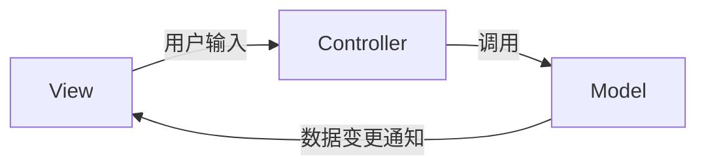
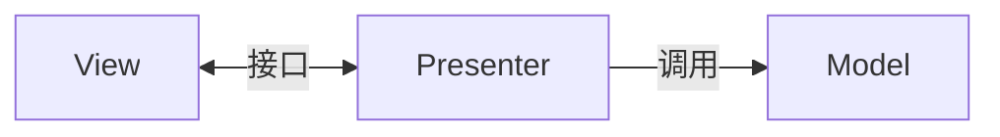

# MVC/MVP/MVVM 架构模式

用户界面架构的核心命题是如何在复杂 UI 场景中保持代码的可维护性和可测试性。从 1970 年代的 Smalltalk-76 开始，**模型-视图-控制器（MVC）** 就开始探索将 UI 代码与业务逻辑分离的路径。此后三十年间，MVP 和 MVVM 作为 MVC 的变体相继出现，每一种都是为了解决前一代模式在特定场景下的不足。

## MVC：第一个范式

MVC 的核心洞察是：**视图负责渲染，模型负责数据，控制器负责协调**。当用户在视图上触发动作时，控制器接收输入、调用模型更新数据，然后决定哪个视图应该被刷新。



MVC 的优点是职责清晰，但在桌面 GUI 时代，Controller 往往变得过于臃肿——它既处理输入路由，又包含大量业务逻辑，还负责更新视图。这种设计在 Web 时代遇到了更大的挑战：HTTP 是无状态的，传统的 MVC 无法自然映射到请求-响应模型。

## MVP：强化视图抽象

**模型-视图-展示器（Model-View-Presenter）** 是 MVC 的第一个重要变体。MVP 的关键改进在于引入了 **Passive View** 的概念：视图不再直接观察模型，而是完全由 Presenter 驱动。Presenter 持有视图的接口引用，当模型数据变化时，Presenter 直接调用视图的更新方法。



这种设计极大提升了可测试性——Presenter 可以在单元测试中脱离真实的 View 进行验证，因为它们只依赖一个接口。然而，MVP 的缺点也很明显：视图和 Presenter 之间的接口往往需要为每个页面单独定义，当页面数量增加时，接口的数量会爆炸式增长。

## MVVM：拥抱数据绑定

**模型-视图-视图模型（Model-View-ViewModel）** 是微软在 2005 年为 WPF 提出的架构模式，后来被 Knockout.js、Vue.js 等前端框架广泛采用。MVVM 的核心创新是 **数据绑定**：ViewModel 暴露可观察的属性和命令，View 通过声明式语法绑定到这些属性，当 ViewModel 的数据变化时，View 自动更新。

```javascript
// Vue 3 Composition API 中的 MVVM 示例
import { ref, computed } from 'vue'

const viewModel = {
  // 响应式数据
  userName: ref(''),
  items: ref([]),
  
  // 计算属性
  filteredItems: computed(() => 
    items.value.filter(item => 
      item.name.includes(userName.value)
    )
  ),
  
  // 方法
  async loadData() { /* ... */ },
  async saveItem() { /* ... */ }
}
```

```html
<!-- View 层只需要声明绑定关系 -->
<input v-model="viewModel.userName" />
<div v-for="item in viewModel.filteredItems">
  {{ item.name }}
</div>
```

这种设计的优势在于 View 层几乎不包含任何逻辑，开发者可以专注于 ViewModel 的业务代码，并通过测试 ViewModel 来验证 UI 行为。但数据绑定也是一把双刃剑——当绑定链过长或过于复杂时，数据变化的追踪会变得困难，过度的隐式更新可能导致难以调试的 bug。

## 现代前端框架中的演进

React 的出现为这场争论带来了新的视角。React 本身并不遵循传统的 MVC/MVP/MVVM 模式，而是采用了 **单向数据流（Unidirectional Data Flow）**：数据从顶层组件向下流动，用户交互触发 Action，Action 调用 Reducer 或 Effect 更新状态。

```jsx
// React 18: useReducer + Context 实现 MVC 风格
const AppContext = createContext(null)

function AppProvider({ children }) {
  const [state, dispatch] = useReducer(appReducer, initialState)
  return (
    <AppContext.Provider value={{ state, dispatch }}>
      {children}
    </AppContext.Provider>
  )
}

// View 层订阅状态
function UserProfile() {
  const { state } = useContext(AppContext)
  return <div>{state.user.name}</div>
}
```

Vue 的组合式 API 则提供了更直接的 MVVM 体验。开发者可以在 `setup` 函数中组织 ViewModel 逻辑，同时保留 Vue 的响应式系统和模板编译优势。

## 模式选择的思考

没有放之四海而皆准的架构模式。小型项目用 MVC 就足够，团队需要强类型和 IDE 支持时可以考虑 MVP，追求开发效率和响应式体验时 MVVM 更合适。在选择时，需要考虑团队的技术栈熟悉度、项目的复杂度、以及对可测试性的要求。过度设计往往比设计不足更危险——当一个页面只有两三个输入项时，引入完整的 MVP 或 MVVM 架构只会增加不必要的复杂度。
