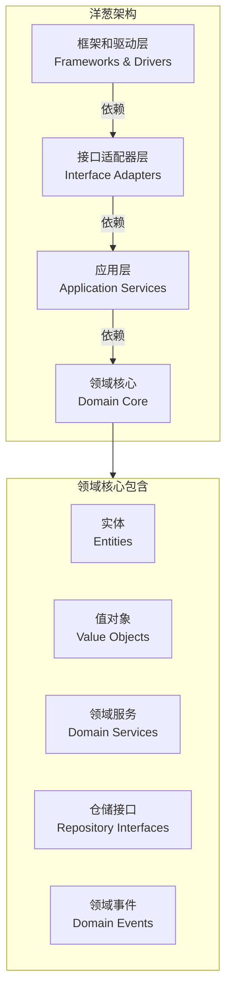
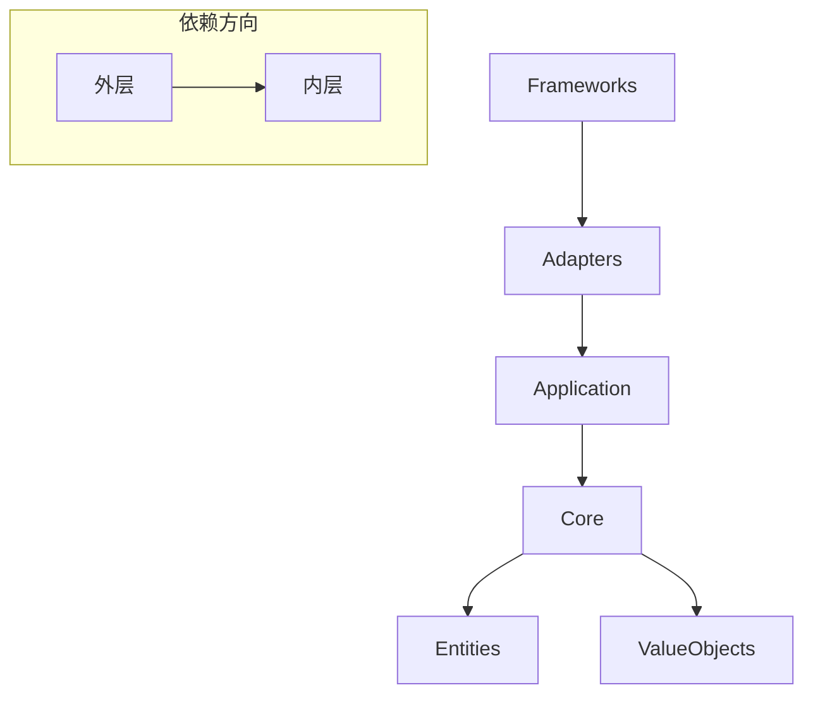

# 洋葱架构

你接手了一个遗留项目，技术栈是 Spring + MyBatis，数据模型是一堆 Map 和 String，业务逻辑散落在 Service 层的各个方法里。某天老板说：「我们要把这套系统改成领域驱动设计，因为业务越来越复杂，改不动了。」你看着 50 万行的代码库，陷入了沉思——**到底应该从哪里开始重构**？

洋葱架构（Onion Architecture）提供了一种思路：把系统想象成一颗洋葱，最核心的部分在最里面，越往外越接近外部世界。核心业务不应该知道外面发生了什么，就像洋葱的内心不需要知道它被谁炒了一样。

## 洋葱架构的核心思想

洋葱架构由 Jeffrey Palermo 在 2008 年提出。它的核心主张是：**应用程序是围绕领域模型组织的，内层定义接口，外层实现接口**。

与六边形架构类似，洋葱架构强调依赖应该指向圆心——**内层不知道外层的存在**。



## 洋葱架构的四层

### 第一层：领域核心（Domain Core）

这是整个架构的圆心，包含最核心的业务知识和规则。它完全不依赖任何外部框架或类库，是系统中最稳定、最不应该变化的部分。

**包含元素**：

- **实体（Entity）**：有唯一标识的业务对象，状态可以变化
- **值对象（Value Object）**：没有唯一标识，通过属性值定义，不可变
- **领域服务（Domain Service）**：当某个业务行为不属于任何实体时，放在领域服务中
- **仓储接口（Repository Interface）**：定义数据访问契约，不包含实现
- **领域事件（Domain Event）**：领域中发生的业务事件

```java
// 实体 - 核心层
public class Order {
    private OrderId id;
    private Customer customer;  // 实体引用
    private List<OrderLine> lines;
    private Money totalAmount;
    private OrderStatus status;

    public void confirm() {
        if (this.status != OrderStatus.PENDING) {
            throw new DomainException("只有待处理订单可以确认");
        }
        this.status = OrderStatus.CONFIRMED;
        this.totalAmount = calculateTotal();
    }

    private Money calculateTotal() {
        return lines.stream()
            .map(OrderLine::getSubtotal)
            .reduce(Money.ZERO, Money::add);
    }
}
```

```java
// 值对象 - 核心层
public class Money {
    private final BigDecimal amount;
    private final Currency currency;

    private Money(BigDecimal amount, Currency currency) {
        this.amount = amount;
        this.currency = currency;
    }

    public Money add(Money other) {
        if (!this.currency.equals(other.currency)) {
            throw new DomainException("货币类型不一致");
        }
        return new Money(this.amount.add(other.amount), this.currency);
    }

    // 工厂方法
    public static Money of(BigDecimal amount, Currency currency) {
        return new Money(amount, currency);
    }
}
```

```java
// 仓储接口 - 核心层定义契约
public interface OrderRepository {
    void save(Order order);
    Order findById(OrderId id);
    List<Order> findByCustomerId(CustomerId customerId);
}

public interface CustomerRepository {
    Customer findById(CustomerId id);
}
```

### 第二层：应用层（Application Services）

应用层包含应用服务，协调领域对象完成业务用例。它不包含业务规则，而是编排业务流程。

```java
// 应用服务 - 定义用例
public interface CreateOrderUseCase {
    OrderId execute(CreateOrderCommand command);
}

public interface QueryOrderUseCase {
    OrderDTO findById(OrderId id);
    List<OrderDTO> findByCustomer(CustomerId customerId);
}
```

```java
// 应用服务实现
@Service
@Transactional
public class OrderApplicationService implements CreateOrderUseCase, QueryOrderUseCase {

    private final OrderRepository orderRepository;
    private final CustomerRepository customerRepository;
    private final EventPublisher eventPublisher;

    public OrderApplicationService(
            OrderRepository orderRepository,
            CustomerRepository customerRepository,
            EventPublisher eventPublisher) {
        this.orderRepository = orderRepository;
        this.customerRepository = customerRepository;
        this.eventPublisher = eventPublisher;
    }

    @Override
    public OrderId execute(CreateOrderCommand command) {
        // 1. 获取客户
        Customer customer = customerRepository.findById(command.getCustomerId());

        // 2. 创建订单（核心业务逻辑在 Order 实体中）
        Order order = Order.create(customer, command.getLines());

        // 3. 保存
        orderRepository.save(order);

        // 4. 发布领域事件
        eventPublisher.publish(new OrderCreatedEvent(order.getId(), order.getCustomer().getId()));

        return order.getId();
    }
}
```

### 第三层：接口适配器层（Interface Adapters）

这层把外部世界的请求转换成应用层能理解的调用，把应用层的响应转换成外部世界能理解的格式。

```java
// REST 适配器 - 接口适配器层
@RestController
@RequestMapping("/api/orders")
public class OrderController implements CreateOrderUseCase, QueryOrderUseCase {

    private final CreateOrderUseCase createOrderUseCase;
    private final QueryOrderUseCase queryOrderUseCase;

    @PostMapping
    public ResponseEntity<OrderResponse> createOrder(@RequestBody CreateOrderRequest request) {
        CreateOrderCommand command = toCommand(request);
        OrderId orderId = createOrderUseCase.execute(command);
        return ResponseEntity.created(URI.create("/api/orders/" + orderId)).build();
    }

    @GetMapping("/{id}")
    public ResponseEntity<OrderResponse> getOrder(@PathVariable String id) {
        OrderDTO order = queryOrderUseCase.findById(OrderId.of(id));
        return ResponseEntity.ok(toResponse(order));
    }
}
```

```java
// DTO - 数据传输对象，也属于接口适配器层
public class OrderDTO {
    private String id;
    private CustomerDTO customer;
    private List<OrderLineDTO> lines;
    private BigDecimal totalAmount;
    private String status;

    // getter/setter...
}
```

### 第四层：框架和驱动层（Frameworks & Drivers）

这是最外层，包含具体的实现代码：数据库访问实现、消息队列客户端、HTTP 客户端、Spring 框架配置等。

```java
// JPA 实现 - 框架层
@Repository
public class JpaOrderRepository implements OrderRepository {

    @Autowired
    private OrderJpaRepository jpaRepository;

    @Override
    public void save(Order order) {
        jpaRepository.save(toJpaEntity(order));
    }

    @Override
    public Order findById(OrderId id) {
        return jpaRepository.findById(id.getValue())
            .map(this::toDomain)
            .orElseThrow(() -> new DomainException("订单不存在"));
    }
}
```

```java
// Spring 配置 - 框架层
@Configuration
public class InfrastructureConfiguration {

    @Bean
    public OrderRepository orderRepository(JpaOrderRepository jpaOrderRepository) {
        return new JpaOrderRepository(jpaOrderRepository);
    }
}
```

## 洋葱架构的依赖规则

洋葱架构有一条铁律：**所有依赖都指向圆心**。



这意味着：
- **领域核心不依赖任何东西**——不依赖 Spring、不依赖 MyBatis、不依赖任何外部类库
- **应用层只依赖领域核心**——使用核心中定义的实体和服务
- **接口适配器层依赖应用层**
- **框架层依赖接口适配器层**

## 洋葱架构 vs 六边形架构

洋葱架构和六边形架构非常相似，都强调依赖指向内部、核心不依赖外部。它们的主要区别在于**层次划分的粒度**：

| 维度 | 六边形架构 | 洋葱架构 |
| --- | --- | --- |
| **核心定义** | 业务逻辑 + 端口 | 领域模型 + 领域服务 |
| **适配器分类** | 入站适配器 / 出站适配器 | 驱动侧 / 被驱动侧 |
| **应用层位置** | 在核心内或核心外 | 独立的一层 |
| **强调点** | 端口是核心的边界 | 同心圆的层次关系 |
| **适合场景** | 需要频繁切换外部依赖 | 需要清晰的领域边界 |

实际上，很多人认为**洋葱架构是六边形架构的一种细化**。它们的核心思想完全一致，只是洋葱架构把「核心」拆成了更细的层次。

## 依赖注入的配合

洋葱架构需要配合**依赖注入**（DI）才能正常工作。因为核心层定义了仓储接口，运行时需要把实现注入进去。

```java
// 领域核心 - 定义接口
public interface EventPublisher {
    void publish(DomainEvent event);
}
```

```java
// 框架层 - 提供实现
@Service
public class DomainEventPublisher implements EventPublisher {

    private final ApplicationEventMulticaster multicaster;

    @Override
    public void publish(DomainEvent event) {
        multicaster.multicastEvent(event);
    }
}
```

```java
// Spring 配置 - 绑定实现
@Configuration
public class DependencyConfiguration {

    @Bean
    public EventPublisher eventPublisher(DomainEventPublisher impl) {
        return impl;  // Spring 自动处理类型匹配
    }
}
```

## 适用场景与不适用场景

| 场景 | 推荐程度 | 说明 |
| --- | --- | --- |
| 业务复杂度高的项目 | **强烈推荐** | 清晰的层次结构有助于管理复杂性 |
| 领域驱动设计（DDD） | **强烈推荐** | 洋葱架构天然支持 DDD 的分层 |
| 需要长期维护的核心系统 | **推荐** | 核心稳定，外层可以演进 |
| 快速迭代的简单项目 | **不推荐** | 增加了不必要的复杂度 |
| 团队不熟悉 DDD | **谨慎** | 需要先学习领域建模 |

:::tip 经验之谈

洋葱架构最难的不是「画圈圈」，而是**真正把业务逻辑写在核心层**。很多团队用了洋葱架构，但业务逻辑仍然散落在应用服务甚至适配器里。这样只是换了个「文件夹结构」，没有发挥洋葱架构的价值。

判断是否正确使用洋葱架构的标准：**当你要修改业务规则时，你是在核心层修改，还是在外层修改？**

:::

## 总结

洋葱架构通过**同心圆的结构**强调了一个核心原则：**依赖指向内部**。最核心的业务知识和规则在圆心，完全不依赖外部；越往外越接近技术实现，依赖关系从外向内。

洋葱架构和六边形架构一脉相承，都解决了「核心业务逻辑被外部依赖污染」的问题。区别在于洋葱架构提供了更细粒度的层次划分，特别适合 DDD 项目。

接下来让我们看看**整洁架构**，它进一步明确了依赖规则，并提供了更完整的层次定义。

