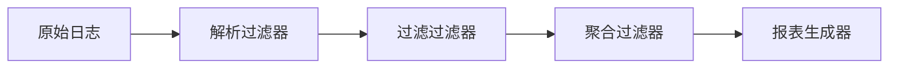
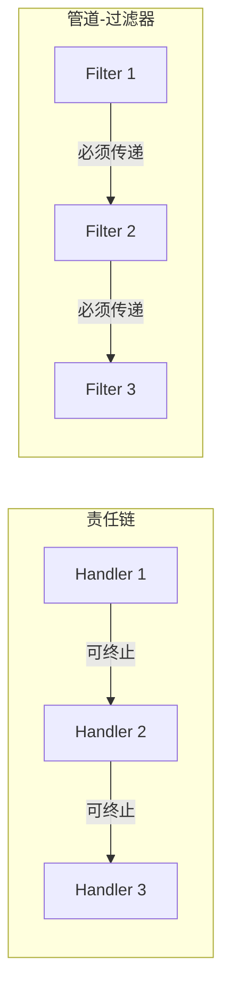

# 管道-过滤器架构

当你打开终端，输入一串用竖线连接的命令——`grep "error" app.log | sort | uniq -c | head -20`——你正在使用一种诞生于 1970 年代、被 Unix 系统推向极致的架构模式：**管道-过滤器（Pipes and Filters）**。这种模式的本质是将复杂的处理流程分解为独立的、可组合的处理单元，数据像水流一样依次通过每个过滤器。

## 模式本质：Unix 管道的启示

Unix 管道的伟大之处不在于任何单个命令的复杂功能，而在于它们可以**自由组合**。`cat`、`grep`、`awk`、`sed` 这些命令各司其职，通过标准输入输出连接起来，就形成了强大的数据处理流水线。每个过滤器只知道两件事：如何从 stdin 读取数据，如何向 stdout 写入数据。它不关心上游是谁，也不关心下游是谁。

这种设计哲学在软件架构中同样适用。假设你正在构建一个日志分析系统，需要：解析日志 → 过滤异常 → 聚合统计 → 生成报表。如果用管道-过滤器架构实现，每个步骤都是一个独立的过滤器，它们之间的连接器就是管道。



## 适用场景与优势

管道-过滤器模式最适合**数据流处理**场景。当输入是一系列离散的数据项，需要经过多个相互独立的转换步骤时，这种架构能够最大化复用性和可维护性。

**音视频处理**是典型场景之一。FFmpeg 的 filtergraph 就是管道-过滤器模式的经典实现：一个视频流可以先解码，然后通过缩放过滤器、转码过滤器、叠加水印过滤器，每一步都可以独立配置、独立替换。

**ETL 数据管道**同样适用。从源数据库提取数据后，需要清洗、转换、验证、加载到目标仓库，每个步骤都是独立的过滤器。用 Apache Beam 或 Airflow DAG 来编排这些过滤器，可以实现灵活的管道配置。

**微服务集成**场景也很常见。当多个服务需要依次处理同一请求（如日志增强、安全扫描、格式转换）时，管道模式可以将这些横切关注点解耦为独立的过滤器，每个过滤器由不同的团队维护。

## 与责任链模式的区别

管道-过滤器容易与**责任链模式（Chain of Responsibility）**混淆。两者的核心区别在于**数据的传递方式**：

- **责任链**：每个处理器决定是否处理这个请求，可能不传递给下一个处理器，请求可能在链的任意位置终止
- **管道-过滤器**：数据必须通过所有过滤器，每个过滤器必须处理并传递给下一个，数据流不会中断



## 实现要点

管道-过滤器架构的实现需要关注几个关键设计。首先是**数据封装**：过滤器之间传递的数据应该被良好封装，避免过滤器直接依赖对方的数据结构。其次是**错误处理策略**：当某个过滤器失败时，需要决定是停止整个管道，还是跳过该数据项继续处理。再次是**背压控制**：当下游过滤器处理速度慢于上游时，需要有机制防止数据在管道中堆积过多。

```python
# Python 中的管道-过滤器实现示例
from abc import ABC, abstractmethod

class DataItem:
    """在过滤器间传递的数据封装"""
    def __init__(self, raw: dict):
        self.raw = raw
        self.headers: list[str] = []

class Filter(ABC):
    @abstractmethod
    def process(self, item: DataItem) -> DataItem:
        pass

class ParserFilter(Filter):
    def process(self, item: DataItem) -> DataItem:
        # 解析原始数据
        item.headers = item.raw.get('headers', [])
        return item

class ValidatorFilter(Filter):
    def process(self, item: DataItem) -> DataItem:
        # 验证数据合法性
        if not item.headers:
            raise ValueError("Missing required headers")
        return item

class Pipeline:
    def __init__(self):
        self.filters: list[Filter] = []
    
    def add(self, filter_: Filter) -> 'Pipeline':
        self.filters.append(filter_)
        return self
    
    def execute(self, data: list[dict]) -> list[DataItem]:
        results = []
        for raw in data:
            item = DataItem(raw)
            for filter_ in self.filters:
                item = filter_.process(item)
            results.append(item)
        return results
```

## 局限性与适用边界

管道-过滤器并非万能模式。当处理步骤之间存在复杂的**数据依赖**（后续步骤需要前面多个步骤的结果聚合）时，简单的线性管道无法优雅处理。当需要**分支和合并**时，纯管道模式会变得复杂。此外，如果每个过滤器的输入输出格式差异很大，强制统一数据封装反而会增加不必要的复杂度。在这些场景下，工作流引擎或状态机可能是更好的选择。
