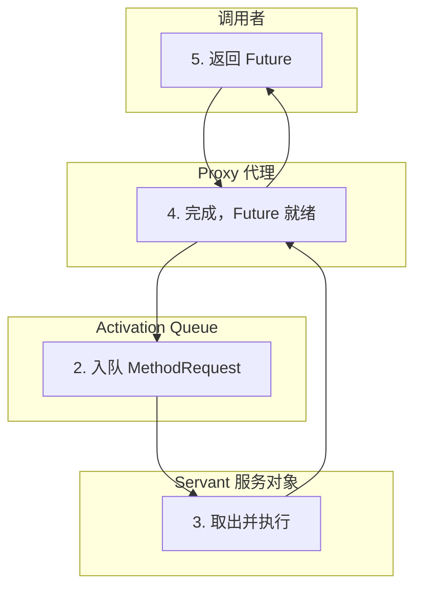

# Active Object 主动对象模式

想象一个银行的 ATM 机。你把银行卡塞进去，按下取款按钮，ATM 立刻吐出凭证——但钱其实还在后台金库里清点。几秒钟后，ATM 显示「交易完成」或「余额不足」。这个「立刻返回、后台处理」的机制，就是 Active Object 模式的核心思想。

## 为什么 GUI 线程不能阻塞

在 GUI 应用中，有一个铁律：**UI 线程（也称 Event Dispatch Thread）不能阻塞**。如果用户在点击按钮后要等 5 秒才有响应，界面会完全卡死，用户体验极差。

```java
// 错误示例：UI 线程被阻塞
button.addActionListener(e -> {
    String result = networkCall(); // 可能阻塞 5 秒
    label.setText(result);         // UI 卡死
});
```

传统解法是开一个后台线程，但回调地狱很快就会失控：

```java
// 回调地狱
new Thread(() -> {
    String result = networkCall();
    SwingUtilities.invokeLater(() -> label.setText(result));
}).start();
```

Active Object 模式提供了更优雅的解决方案：**把「同步调用」变成「异步调用」，调用者立刻返回一个 Future，真实结果通过 Future 异步获取。**

## Active Object 模式结构

Active Object 模式由五个核心组件构成：



| 组件 | 职责 |
| --- | --- |
| **Proxy** | 客户端调用的入口，提供方法签名，但不执行实际逻辑 |
| **ActivationQueue** | 存储待执行的「方法请求」 |
| **Scheduler** | 从队列取请求，决定执行顺序和时机 |
| **Servant** | 真正执行业务逻辑的对象 |
| **Future** | 表示异步执行结果的占位符 |

## Java 实现示例

```java
// 1. 定义方法请求接口
public interface MethodRequest {
    void execute();
}

// 2. 定义 Servant（实际服务对象）
public class OrderService {
    public CompletableFuture<Order> createOrder(OrderRequest request) {
        // 真实的业务逻辑
        return CompletableFuture.supplyAsync(() -> {
            // 模拟耗时操作
            Order order = orderRepository.save(request);
            inventoryService.deduct(request.getItems());
            return order;
        });
    }
}

// 3. 定义 Proxy
public class OrderServiceProxy {
    private final ExecutorService executor;
    private final OrderService servant;

    public OrderServiceProxy(OrderService servant) {
        this.executor = Executors.newCachedThreadPool();
        this.servant = servant;
    }

    // 返回 CompletableFuture 作为 Future
    public CompletableFuture<Order> createOrder(OrderRequest request) {
        // 可以在此处做参数验证、日志记录
        return servant.createOrder(request); // 异步执行
    }
}
```

## 与 Future/Promise 模式的关系

Active Object 和 Future/Promise 模式解决的问题类似：**如何处理异步操作**。但它们的侧重点不同：

| 特性 | Future/Promise | Active Object |
| --- | --- | --- |
| 调用方式 | 直接调用 | 通过 Proxy 间接调用 |
| 请求管理 | 无队列 | 有 Activation Queue |
| 执行控制 | 提交即执行 | 可控制执行时机 |
| 适用场景 | 简单的异步调用 | 需要方法调度、排序的场景 |

实际上，**CompletableFuture 本身可以看作是 Active Object 模式的一个简化实现**。它提供了异步调用的能力，但没有强调 Proxy、Scheduler 这些组件。

## Swing Event Dispatch Thread：Java 中的 Active Object

Java GUI 编程中的 Event Dispatch Thread (EDT) 就是 Active Object 模式的经典应用。

```java
// Swing 中正确的异步处理
public class SwingExample {
    private JButton button;
    private JLabel resultLabel;

    public void onButtonClick() {
        // 1. 在后台线程执行耗时操作
        CompletableFuture.supplyAsync(() -> {
            return networkService.fetchData(); // 不阻塞 EDT
        }).thenAccept(result -> {
            // 2. 结果更新回 EDT
            SwingUtilities.invokeLater(() -> {
                resultLabel.setText(result);
            });
        });
    }
}
```

`SwingUtilities.invokeLater()` 的本质是**把 UI 更新操作放入 EDT 的队列**，由 EDT 在合适的时候执行。这就是典型的「方法请求入队、后台线程执行」的模式。

## Netty ChannelHandler 的异步化

Netty 的 ChannelHandler 处理流程也体现了 Active Object 的思想：

```java
public class BusinessHandler extends ChannelInboundHandlerAdapter {
    @Override
    public void channelRead(ChannelHandlerContext ctx, Object msg) {
        // 这里可以异步处理，不需要等待处理完成就返回
        CompletableFuture
            .supplyAsync(() -> processBusiness((Request) msg), businessPool)
            .thenAccept(response -> {
                // 写回响应
                ctx.writeAndFlush(response);
            })
            .exceptionally(ex -> {
                logger.error("处理失败", ex);
                ctx.fireExceptionCaught(ex);
                return null;
            });
    }

    private Response processBusiness(Request request) {
        // 实际业务逻辑
        return businessService.handle(request);
    }
}
```

Netty 的 Pipeline 中，每个 Handler 都可以异步化：收到消息后立即释放 `ctx`，让 Pipeline 可以继续接收下一个消息，处理结果通过回调写回。

## 方法请求的调度策略

Active Object 的 Scheduler 可以实现不同的调度策略：

**先来先服务（FIFO）**：

```java
public class FIFOScheduler implements Scheduler {
    private final BlockingQueue<MethodRequest> queue =
        new LinkedBlockingQueue<>();

    @Override
    public void enqueue(MethodRequest request) {
        queue.put(request);
    }

    @Override
    public void dispatch() {
        MethodRequest request = queue.take();
        request.execute();
    }
}
```

**优先级调度**：

```java
public class PriorityScheduler implements Scheduler {
    private final PriorityBlockingQueue<MethodRequest> queue =
        new PriorityBlockingQueue<>();

    @Override
    public void enqueue(MethodRequest request) {
        queue.put(request); // MethodRequest 需要实现 Comparable
    }
}
```

**单线程 vs 多线程执行**：

- **单线程 Scheduler**：所有方法请求由同一个线程执行，保证顺序
- **多线程 Scheduler**：使用线程池并行执行，提高吞吐

## 总结与延伸

Active Object 模式的核心价值是**解耦方法的调用与执行**：

**优点**：

- 调用线程不阻塞，立即返回
- 方法执行顺序可控（通过 Scheduler）
- 便于实现限流、熔断

**缺点**：

- 增加了复杂度（Proxy、Scheduler 等组件）
- 调试困难（调用栈不连续）
- 结果获取需要异步处理

**适用场景**：

- GUI 应用，避免 UI 线程阻塞
- 服务器端，高并发请求需要异步处理
- 需要控制执行顺序的场景

在现代 Java 中，CompletableFuture 已经提供了足够强大的异步编程能力，大多数场景不需要手动实现完整的 Active Object。但理解这个模式有助于理解 Netty、Actor Model 等框架的设计哲学。

那么问题来了：如果 Active Object 的 Servant 在执行过程中抛出异常，Future 会怎样？调用者如何感知并处理这些异常？这涉及到 CompletableFuture 的异常传播机制。
