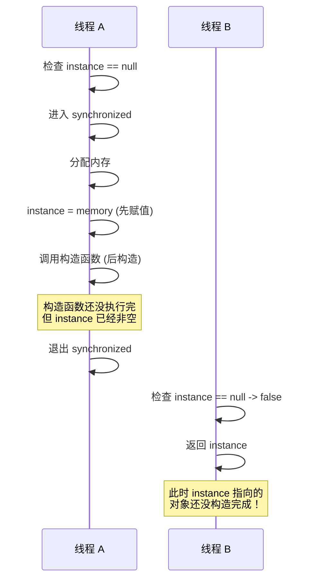

# Double-Checked Locking 双重检查锁

单例模式是最常见的设计模式之一，但如果问「如何线程安全地创建单例」，很多人会脱口而出「加 synchronized」。但 synchronized 的问题是：**每次调用 `getInstance()` 都需要加锁，而 99% 的调用其实只是读取已经创建好的实例**。

双重检查锁（Double-Checked Locking）试图解决这个问题：**大部分情况下不加锁，只有第一次创建时才加锁**。

## 什么是双重检查锁

```java
public class Singleton {
    private static Singleton instance;

    public static Singleton getInstance() {
        if (instance == null) {            // 第一次检查
            synchronized (Singleton.class) { // 加锁
                if (instance == null) {      // 第二次检查
                    instance = new Singleton();
                }
            }
        }
        return instance;
    }
}
```

**为什么叫双重检查？**

- **第一次检查**：不加锁，快速判断 instance 是否已创建。如果已创建，直接返回，跳过同步开销。
- **第二次检查**：加锁后再次检查，确保只有一个线程创建实例。

理论上，这个方案既保证了线程安全，又避免了频繁加锁的开销。

## DCL 的问题：指令重排

然而，上面的代码在 Java 中是**不安全的**。问题出在这一行：

```java
instance = new Singleton();
```

这行代码在 JVM 中会被拆分成三步：

```java
// 1. 分配内存
memory = allocate();

// 2. 调用构造函数
constructor(memory);

// 3. 将引用赋值给 instance
instance = memory;
```

**问题在于**：JIT 编译器可能会进行指令重排，顺序变成：

```java
memory = allocate();
instance = memory;     // 先赋值
constructor(memory);   // 后构造
```

这看起来毫无意义，但在这个上下文中会导致灾难性后果：



线程 B 获取到了一个**未完全构造**的对象，调用其方法会导致不可预测的行为。

## volatile 的作用：禁止指令重排

解决方案是给 instance 加上 `volatile` 修饰符：

```java
public class Singleton {
    // 添加 volatile
    private static volatile Singleton instance; // [!code highlight]

    public static Singleton getInstance() {
        if (instance == null) {
            synchronized (Singleton.class) {
                if (instance == null) {
                    instance = new Singleton();
                }
            }
        }
        return instance;
    }
}
```

`volatile` 在 Java 5+ 中有两个重要作用：

1. **禁止指令重排**：volatile 写入 happens-before volatile 读取，确保 `instance = new Singleton()` 按正确顺序执行。
2. **可见性保证**：一个线程对 volatile 变量的修改，对其他线程立即可见。

** happens-before 规则**保证了：

```
线程 A（写入）
    1. 构造对象
    2. instance = reference  (volatile 写入)

线程 B（读取）
    3. 读取 instance  (volatile 读取)
    4. 使用对象
```

由于 happens-before 关系，线程 B 一定能观察到线程 A 的构造函数执行结果。

## DCL 的正确实现

完整的 DCL 单例模式：

```java
public class Singleton {
    // 1. volatile 禁止指令重排
    private static volatile Singleton instance;

    // 2. 私有构造函数，防止外部 new
    private Singleton() {
        // 防止反射攻击
        if (instance != null) {
            throw new RuntimeException("单例对象已存在，请通过 getInstance() 获取");
        }
    }

    public static Singleton getInstance() {
        // 3. 第一次检查：避免不必要的同步
        if (instance == null) {
            synchronized (Singleton.class) {
                // 4. 第二次检查：确保只有一个线程创建实例
                if (instance == null) {
                    instance = new Singleton();
                }
            }
        }
        return instance;
    }
}
```

:::warning
即使使用 volatile，仍然**不要在构造函数中抛出异常或做耗时操作**。如果构造函数执行时间过长，会加长锁的持有时间，影响并发性能。
:::

## DCL vs 静态内部类单例

除了 DCL，还有另一种更简洁的单例实现方式：**静态内部类**。

```java
public class Singleton {
    private Singleton() {}

    // 静态内部类：延迟加载 + 线程安全
    private static class Holder {
        static final Singleton INSTANCE = new Singleton();
    }

    public static Singleton getInstance() {
        return Holder.INSTANCE;
    }
}
```

**为什么静态内部类是线程安全的？**

JVM 在类加载阶段会初始化静态字段，`final` 静态字段的初始化满足 happens-before 规则，是线程安全的。而且，**类什么时候加载？**——第一次访问 `Holder.INSTANCE` 时。这意味着单例是「懒加载」的，只有调用 `getInstance()` 才会加载 Holder 类，才会创建实例。

**对比**：

| 特性 | DCL (volatile) | 静态内部类 |
| --- | --- | --- |
| 线程安全性 | 正确使用 volatile 后安全 | JVM 保障，绝对安全 |
| 代码复杂度 | 需要两次检查 + synchronized | 简单直观 |
| 性能 | 读操作无锁（快） | 类加载时初始化（快） |
| 延迟加载 | 支持 | 支持 |
| 序列化安全 | 需额外处理 | 需额外处理 |

**推荐**：如果没有特殊需求，优先使用静态内部类方式。代码更简洁，JVM 保障了安全性。

## DCL 的适用场景

DCL 适用于**延迟加载且需要同步保护**的场景：

**场景一：重量级资源的懒加载**

```java
public class DatabaseConnectionPool {
    private static volatile ConnectionPool instance;

    public static ConnectionPool getInstance() {
        if (instance == null) {
            synchronized (DatabaseConnectionPool.class) {
                if (instance == null) {
                    // 创建连接池是耗时操作
                    instance = new ConnectionPool(
                        getConfig("url"),
                        getConfig("username"),
                        getConfig("password")
                    );
                }
            }
        }
        return instance;
    }
}
```

**场景二：依赖注入框架**

Spring 默认使用 DCL + volatile 实现单例 Bean 的延迟加载。

**场景三：配置文件加载**

```java
public class ConfigLoader {
    private static volatile Config config;

    public static Config getConfig() {
        if (config == null) {
            synchronized (ConfigLoader.class) {
                if (config == null) {
                    config = ConfigFactory.load("application.conf");
                }
            }
        }
        return config;
    }
}
```

## 常见误区

**误区一：使用 `synchronized` 方法而不是同步块**

```java
// 错误：性能差，整个方法都加锁
public static synchronized Singleton getInstance() {
    if (instance == null) {
        instance = new Singleton();
    }
    return instance;
}

// 正确：只同步创建部分
public static Singleton getInstance() {
    if (instance == null) {
        synchronized (Singleton.class) {
            if (instance == null) {
                instance = new Singleton();
            }
        }
    }
    return instance;
}
```

**误区二：忘记 volatile**

```java
// 错误：可能返回未构造完成的对象
private static Singleton instance;

// 正确：volatile 保证可见性和有序性
private static volatile Singleton instance;
```

**误区三：对 primitive 类型使用 DCL**

DCL 只适用于对象引用。对于 `int`、`long` 等 primitive 类型，可以使用 `volatile` 直接保护：

```java
private static volatile long value;

public static long getValue() {
    return value;
}

public static void setValue(long v) {
    value = v;
}
```

## 总结与延伸

DCL 是性能优化和线程安全的权衡产物：

**核心思想**：

- 通过第一次检查避免加锁开销
- 通过 volatile 避免指令重排
- 通过 synchronized 保证创建安全

**正确实现要素**：

1. `volatile` 修饰 instance
2. 两次 `null` 检查
3. synchronized 保护创建过程

**现代 Java 建议**：

- 如果不需要延迟加载，直接用 `static final`
- 如果需要延迟加载，优先用**静态内部类**
- 只有在确实需要 DCL 的精细控制时才使用 DCL

理解 DCL 的原理，不仅是为了写单例，更是为了理解 Java 内存模型（JMM）和 happens-before 规则。这些知识在排查并发问题时至关重要。

那么问题来了：如果单例需要序列化，单纯的 volatile 或静态内部类都不够，还需要实现 `readResolve()` 方法防止反序列化创建新对象。这是单例模式的最后一个坑。
