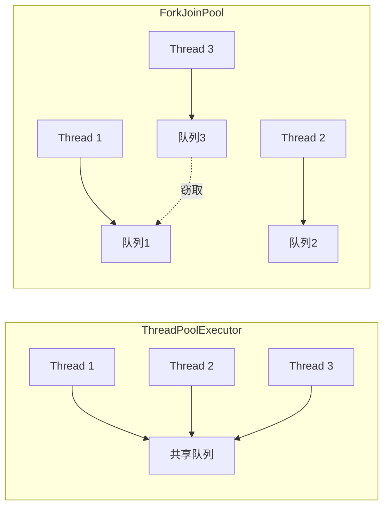
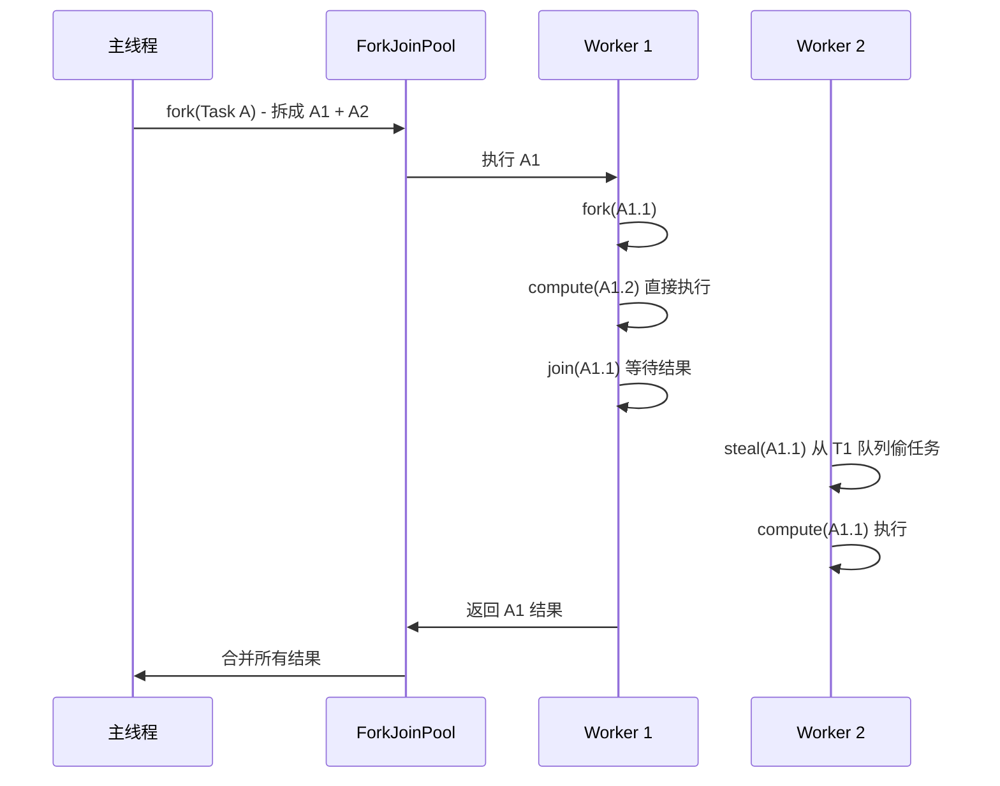

# Fork/Join 分治模式

一道面试题：如何用最高效的方式对 1000 万个整数排序？

如果单线程归并排序，时间复杂度是 `O(n log n)`，但只能用一个核心。如果能把数据分成多份，用多核并行排序，最后再合并结果，时间会大大缩短。

Fork/Join 框架就是为这种**分治并行**场景设计的。

## ForkJoinPool vs ThreadPoolExecutor

JDK 提供了两种线程池，为什么还要 ForkJoinPool？

| 特性 | ThreadPoolExecutor | ForkJoinPool |
| --- | --- | --- |
| 任务队列 | 所有线程共享一个队列 | 每个线程有自己的双端队列 |
| 工作分配 | 任务竞争同一队列 | 工作窃取：闲的线程去偷其他队列的任务 |
| 适用场景 | 独立任务并行 | 分治任务（父子任务有依赖） |
| 线程利用率 | 可能有线程空闲 | 最大化利用，优先让忙的线程继续工作 |



ForkJoinPool 的核心是**工作窃取算法**：每个线程有自己的任务队列，任务执行时会「分叉」（fork）出子任务放回队列。空闲的线程可以从其他线程队列尾部「偷」任务来执行。

## 工作窃取算法

为什么工作窃取比共享队列更好？

**共享队列的问题**：多个线程竞争同一个队列，需要加锁。在高并发下，锁竞争会成为瓶颈。

**工作窃取的优势**：

1. **减少锁竞争**：大部分操作是线程自己的队列，只有窃取时才需要同步
2. **负载均衡**：忙的线程不断产生子任务，闲的线程去偷，自动平衡
3. **提高缓存命中率**：窃取时从队列尾部拿，和拥有线程操作的是不同位置，减少伪共享

```java
// ForkJoinPool 的工作窃取示意
if (localQueue.isNotEmpty()) {
    task = localQueue.pop(); // 自己的队列，直接 pop
} else {
    // 队列空了，去偷别人的
    task = stealFromOtherQueue();
}
```

## RecursiveTask vs RecursiveAction

ForkJoinPool 有两种任务类型：

- `RecursiveTask<V>`：有返回值
- `RecursiveAction`：无返回值

```java
// 计算数组之和，有返回值
public class SumTask extends RecursiveTask<Long> {
    private static final int THRESHOLD = 10000;
    private final long[] array;
    private final int start;
    private final int end;

    public SumTask(long[] array, int start, int end) {
        this.array = array;
        this.start = start;
        this.end = end;
    }

    @Override
    protected Long compute() {
        // 任务足够小，直接计算
        if (end - start <= THRESHOLD) {
            long sum = 0;
            for (int i = start; i < end; i++) {
                sum += array[i];
            }
            return sum;
        }

        // 拆分任务
        int mid = (start + end) / 2;
        SumTask left = new SumTask(array, start, mid);
        SumTask right = new SumTask(array, mid, end);

        // fork：异步执行左半部分
        left.fork();

        // join：等待并获取结果，同时当前线程计算右半部分
        Long rightResult = right.compute();
        Long leftResult = left.join();

        return leftResult + rightResult;
    }
}
```

```java
// 无返回值的任务：打印数组
public class PrintTask extends RecursiveAction {
    private static final int THRESHOLD = 1000;
    private final int[] array;
    private final int start;
    private final int end;

    @Override
    protected void compute() {
        if (end - start <= THRESHOLD) {
            for (int i = start; i < end; i++) {
                System.out.println(array[i]);
            }
            return;
        }

        int mid = (start + end) / 2;
        invokeAll(
            new PrintTask(array, start, mid),
            new PrintTask(array, mid, end)
        );
    }
}
```

**关键点**：`fork()` 异步执行子任务，`join()` 阻塞等待结果。调用 `fork()` 后，当前线程继续计算右半部分，这样右半部分的计算和左半部分的计算是并行的。

## fork() + join() 原理

ForkJoinPool 的执行流程：

1. **Fork**：将大任务拆成小任务，提交到队列
2. **Join**：等待子任务完成，合并结果
3. **Work-Stealing**：空闲线程从其他线程队列尾部偷任务



## Fork/Join 的适用场景

Fork/Join 适合满足以下条件的任务：

1. **可分解**：任务可以递归拆分成更小的子任务
2. **独立性强**：子任务之间没有共享数据的写操作（只读也可以）
3. **计算密集型**：CPU 密集的计算任务，而非大量 I/O 等待

**典型应用场景**：

- **归并排序、QuickSort**：将数组分成多段并行排序，最后合并
- **矩阵运算**：矩阵乘法、转置等可以分块并行
- **树形结构的遍历和聚合**：如文件大小统计、DOM 树遍历
- **并行流（parallelStream）**：JDK 的并行流底层就是 ForkJoinPool

### 归并排序并行化

```java
public class ParallelMergeSort extends RecursiveTask<int[]> {
    private static final int THRESHOLD = 1024;
    private final int[] array;
    private final int left;
    private final int right;

    public ParallelMergeSort(int[] array) {
        this(array, 0, array.length);
    }

    private ParallelMergeSort(int[] array, int left, int right) {
        this.array = array;
        this.left = left;
        this.right = right;
    }

    @Override
    protected int[] compute() {
        int length = right - left;
        if (length <= THRESHOLD) {
            return Arrays.copyOfRange(array, left, right);
        }

        int mid = left + length / 2;

        ParallelMergeSort leftTask = new ParallelMergeSort(array, left, mid);
        ParallelMergeSort rightTask = new ParallelMergeSort(array, mid, right);

        leftTask.fork();
        int[] rightResult = rightTask.compute();
        int[] leftResult = leftTask.join();

        return merge(leftResult, rightResult);
    }

    private int[] merge(int[] left, int[] right) {
        int[] result = new int[left.length + right.length];
        int i = 0, j = 0, k = 0;
        while (i < left.length && j < right.length) {
            result[k++] = left[i] <= right[j] ? left[i++] : right[j++];
        }
        while (i < left.length) result[k++] = left[i++];
        while (j < right.length) result[k++] = right[j++];
        return result;
    }
}
```

## 并行流（parallelStream）底层使用 ForkJoinPool

Java 8 的 `parallelStream` 是 ForkJoinPool 的上层封装，使用起来非常简单：

```java
// 串行流
List<Long> result = list.stream()
    .map(this::heavyComputation)
    .collect(Collectors.toList());

// 并行流（自动使用 ForkJoinPool）
List<Long> parallelResult = list.parallelStream()
    .map(this::heavyComputation)
    .collect(Collectors.toList());
```

**默认使用公共线程池**：`ForkJoinPool.commonPool()`，默认大小是 `Runtime.getRuntime().availableProcessors() - 1`。

**问题**：所有并行流共享同一个池，可能产生竞争。

**解决方案**：为特定任务创建专用的 ForkJoinPool：

```java
ForkJoinPool pool = new ForkJoinPool(
    Runtime.getRuntime().availableProcessors() * 2
);

long result = pool.submit(() ->
    list.parallelStream()
        .mapToLong(this::heavyComputation)
        .sum()
).join();

pool.shutdown();
```

:::warning
parallelStream 看起来很美好，但有几个坑：

1. **任务必须可分解**。如果数据源是 `LinkedList`，分解会很慢，因为它需要随机访问。
2. **避免改变共享状态**。并行流的任务应该是纯函数。
3. **小心装箱**。`parallelStream().map(Long::parseLong)` 会大量装箱，建议用原始类型流。
4. **执行顺序不确定**。如果依赖顺序，用 `forEachOrdered()` 而不是 `forEach()`。
:::

## ForkJoinPool 参数调优

```java
ForkJoinPool pool = new ForkJoinPool(
    parallelism,     // 并行度，默认 CPU 核心数
    factory,         // 线程工厂
    handler,         // 异常处理器
    asyncMode        // true: 异步模式，适合事件型任务
);
```

**parallelism**：期望的并发线程数。通常设为 CPU 核心数。

**asyncMode**：如果任务大多是短暂的小任务（如事件处理），设为 `true`。如果任务较长且需要返回结果，设为 `false`（默认）。

```java
// 推荐配置：并行度设为 CPU 核心数
ForkJoinPool pool = new ForkJoinPool(
    Runtime.getRuntime().availableProcessors()
);
```

## 总结与延伸

Fork/Join 是分治策略在并行计算中的完美实现：

**核心优势**：

- 工作窃取算法，最大化 CPU 利用率
- 自动负载均衡
- 适合递归分治任务

**适用场景**：

- 归并排序、快速排序
- 大数组/大文件的并行处理
- 分形计算、Mandelbrot 集合
- JDK parallelStream 底层实现

**注意事项**：

1. 任务分解要有终止条件，避免无限拆分
2. 避免在任务中执行阻塞操作，否则会浪费工作线程
3. 合理设置阈值，分解成本不能超过合并收益
4. 线程池不要创建过多，通常一个应用一个 ForkJoinPool 即可

那么问题来了：ForkJoinPool 的工作窃取是从队列头部还是尾部拿任务？为什么这样设计？这涉及到伪共享（False Sharing）问题——从尾部窃取可以最大化缓存命中率。
