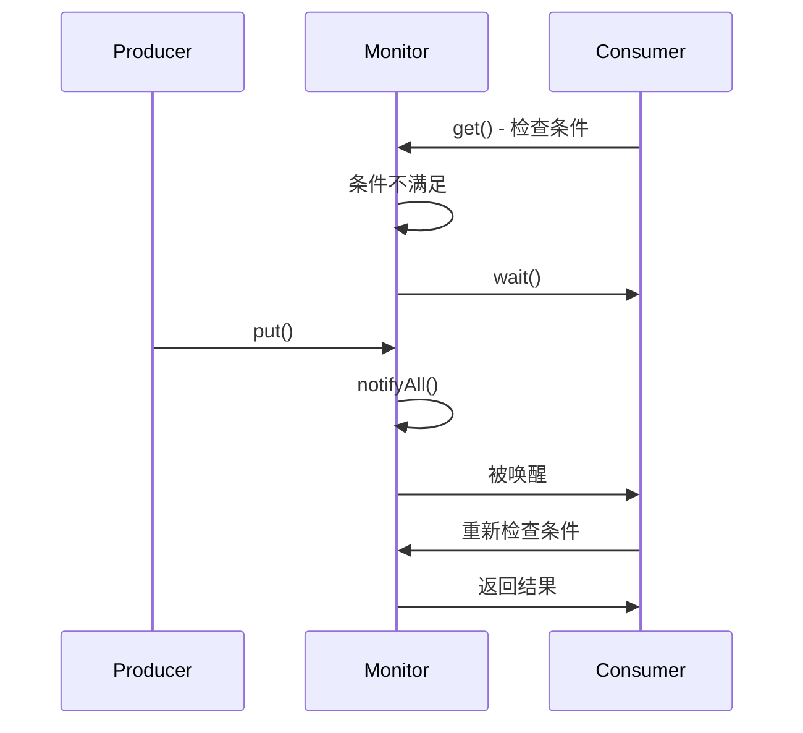

# Guarded Suspension 保护暂停

想象你去奶茶店点单。店员说「现在做不了，你先等着」。你就站在柜台前，直到奶茶做好叫你。如果店员说「你先去逛逛，做好了叫你」，那你就不能继续等着——你得换一个模式。

第一种场景就是 **Guarded Suspension 模式**：**暂停当前线程，直到条件满足再继续执行**。

## Guarded Suspension 模式定义

Guarded Suspension 的核心是**用 while 循环检查条件是否满足**：

```java
public class GuardedQueue<T> {
    private final Queue<T> queue = new LinkedList<>();

    // 取数据：如果队列为空，等待
    public synchronized T get() {
        while (queue.isEmpty()) { // [!code highlight]
            try {
                wait(); // 条件不满足，等待
            } catch (InterruptedException e) {
                Thread.currentThread().interrupt();
            }
        }
        return queue.remove();
    }

    // 存数据：队列有数据时唤醒等待者
    public synchronized void put(T item) {
        queue.add(item);
        notifyAll(); // 唤醒等待的线程
    }
}
```

**Guarded Suspension 的结构**：



**与其他模式的区别**：

| 模式 | 核心思想 |
| --- | --- |
| Guarded Suspension | 条件满足前一直等待 |
| Balking | 条件不满足时直接返回 |
| Producer-Consumer | 通过队列解耦生产者和消费者 |

## while 循环检查条件的必要性

Guarded Suspension 有一个关键细节：**必须用 while 而不是 if 检查条件**。

```java
// 错误写法
public synchronized T get() {
    if (queue.isEmpty()) { // [!code error]
        try {
            wait();
        } catch (InterruptedException e) {}
    }
    return queue.remove();
}
```

为什么 while 是必须的？

**原因一：防止虚假唤醒**

`wait()` 可能在没有被 `notify()` 的情况下返回。JVM 的规范允许虚假唤醒，虽然现代 JVM 很少发生，但代码必须能应对。

**原因二：防止多个消费者**

假设队列中有 1 个元素，两个消费者线程同时 `get()`：

- 消费者 A 拿到元素
- 消费者 B 被唤醒（此时队列已经空了）

如果用 `if`，消费者 B 会直接执行 `remove()`，导致异常。

**原因三：条件可能变化**

即使没有虚假唤醒，其他线程也可能改变条件。比如消费者 A 拿到元素后，消费者 B 被唤醒，但此时另一个线程已经拿走元素了。

## 消息队列实现

Guarded Suspension 是实现消息队列的基础模式之一：

```java
public class MessageQueue<T> {
    private final int capacity;
    private final LinkedList<T> queue = new LinkedList<>();

    public MessageQueue(int capacity) {
        this.capacity = capacity;
    }

    // 生产消息：队列满则等待
    public synchronized void send(T message) throws InterruptedException {
        while (queue.size() >= capacity) {
            wait();
        }
        queue.add(message);
        notifyAll();
    }

    // 接收消息：队列空则等待
    public synchronized T receive() throws InterruptedException {
        while (queue.isEmpty()) {
            wait();
        }
        T message = queue.remove();
        notifyAll();
        return message;
    }

    // 非阻塞发送：队列满则返回 false
    public synchronized boolean trySend(T message) {
        if (queue.size() >= capacity) {
            return false;
        }
        queue.add(message);
        notifyAll();
        return true;
    }

    // 非阻塞接收：队列空则返回 null
    public synchronized T tryReceive() {
        if (queue.isEmpty()) {
            return null;
        }
        T message = queue.remove();
        notifyAll();
        return message;
    }
}
```

## 与 Producer-Consumer 的关系

Guarded Suspension 和 Producer-Consumer 模式紧密相关：

- **Guarded Suspension** 是底层机制：**如何让线程安全地等待条件**
- **Producer-Consumer** 是应用模式：**如何组织生产者和消费者的协作**

```mermaid
flowchart TD
    subgraph ProducerConsumer[Producer-Consumer]
        P[Producer] --> Q[(Queue)]
        Q --> C[Consumer]
    end

    subgraph GuardedSuspension[Guarded Suspension]
        W[while !condition<br/>wait()] --> CN[condition<br/>满足]
        CN --> E[执行]
    end
```

实际上，`BlockingQueue` 的实现就大量使用了 Guarded Suspension——`put()` 用 `while (full) wait()`，`take()` 用 `while (empty) wait()`。

## Tomcat 异步请求处理

Tomcat 的异步 Servlet 用到了 Guarded Suspension 的思想：

```java
@WebServlet("/async")
public class AsyncServlet extends HttpServlet {
    @Override
    protected void doGet(HttpServletRequest req, HttpServletResponse resp)
            throws ServletException, IOException {

        AsyncContext asyncContext = req.startAsync();
        ExecutorService executor = Executors.newFixedThreadPool(10);

        // 异步处理
        executor.submit(() -> {
            try {
                // 模拟耗时操作
                String result = doHeavyWork();

                // 完成时响应
                asyncContext.start(() -> {
                    try {
                        resp.getWriter().write(result);
                        asyncContext.complete();
                    } catch (IOException e) {
                        e.printStackTrace();
                    }
                });
            } catch (Exception e) {
                asyncContext.complete();
            }
        });
    }
}
```

`AsyncContext` 的 `complete()` 类似于 `notifyAll()`——通知等待的 Servlet 线程继续执行。

## 带超时的 Guarded Suspension

实际应用中，无限期等待通常不可接受。需要支持超时机制：

```java
public class TimedGuardedQueue<T> {
    private final Queue<T> queue = new LinkedList<>();
    private static final long TIMEOUT_MS = 5000;

    public synchronized T get() throws TimeoutException {
        long nanosRemaining = TIMEOUT_MS * 1_000_000;

        while (queue.isEmpty()) {
            if (nanosRemaining <= 0) {
                throw new TimeoutException("等待超时");
            }
            try {
                nanosRemaining = wait(nanosRemaining);
            } catch (InterruptedException e) {
                Thread.currentThread().interrupt();
                throw new RuntimeException(e);
            }
        }
        return queue.remove();
    }

    public synchronized void put(T item) {
        queue.add(item);
        notifyAll();
    }
}
```

Java 9 提供了更简洁的 `wait(Nanos)` 方法，直接传入纳秒超时值。

## 总结与延伸

Guarded Suspension 是并发编程的基础模式：

**核心要点**：

1. **while 循环检查条件**——防止虚假唤醒和竞态条件
2. **wait() 必须在 synchronized 中**——保证原子性
3. **notifyAll() 比 notify() 更安全**——防止信号丢失

**适用场景**：

- 消息队列的阻塞操作
- 条件变量的实现
- 任何需要「等待某事发生」的场景

**注意事项**：

1. 始终在 `finally` 中考虑清理
2. 设置合理的超时，避免永久阻塞
3. 注意 notify 和 notifyAll 的选择

Guarded Suspension 是 Java 并发的基础，其他高级工具如 `Condition`、`CountDownLatch`、`CyclicBarrier` 都是在此基础上封装的。理解这个模式，才能真正理解 JDK 并发包的设计。

那么问题来了：如果有多个消费者线程同时等待，用 `notify()` 随机唤醒一个 vs `notifyAll()` 唤醒所有，哪个更好？理论上 `notify()` 效率更高（唤醒更少），但在某些场景下可能导致饥饿。
