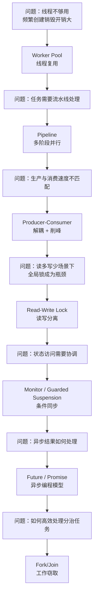

# 并发设计模式

凌晨 2 点，线上告警响起：接口响应时间从 50ms 飙升到 3 秒。你登录服务器查看，发现 CPU 使用率只有 30%，但所有线程都在 `BLOCKED` 状态——线程池被打满了，而上游服务的超时设置是 5 秒。业务正在以每秒 5000 次的频率涌入，但系统只能串行处理 200 个请求。

这不只是「线程池太小」的问题。表面上是资源不够用，实际上是**并发设计缺失**——没有对任务的提交方式、队列容量、拒绝策略做系统性思考。

并发编程的复杂性在于：**正确性**（数据竞争、死锁、活锁）、**性能**（上下文切换、同步开销、伪共享）、**可维护性**（代码可读性、测试难度、调试成本）这三个维度往往相互制约。一个在 QA 环境通过的代码，上线后可能因为 CPU 核心数不同、GC 频率不同、网络延迟不同而暴露出完全不同的行为。

并发设计模式，是前辈们在无数次踩坑之后沉淀下来的**最佳实践**。它们不是为了炫技，而是为了解决真实问题：如何让有限的线程资源服务更多的请求？如何让多个任务有序地协作而不互相伤害？如何用最少的同步成本换取最大的并发收益？

## 为什么需要并发设计模式

普通设计模式解决的是「代码结构」问题——如何组织类与类之间的关系，让系统更容易扩展和维护。但并发设计模式解决的是「执行上下文」问题——在多线程环境下，如何协调多个执行单元的交互。

两者的核心区别在于：

| 维度 | 普通设计模式 | 并发设计模式 |
| --- | --- | --- |
| 关注点 | 对象职责与协作关系 | 线程调度与资源竞争 |
| 运行时 | 单线程顺序执行 | 多线程并行执行 |
| 主要风险 | 耦合、扩展性差 | 死锁、竞争条件、活锁 |
| 解决思路 | 抽象接口、依赖注入 | 同步机制、线程池、无锁设计 |

普通设计模式告诉你「类应该怎么分」，并发设计模式告诉你「线程应该怎么用」。

## Java 并发 API 演进

理解并发设计模式，先要理解 Java 并发 API 的演进历程——每一代 API 都解决了一些问题，但也带来了新的权衡。

**第一代：Thread 直接使用（Java 1.0）**

最早的并发编程是直接操作 `Thread` 对象，创建线程、执行任务、等待结束都在同一个代码路径里。

```java
Thread t = new Thread(new Runnable() {
    public void run() {
        // 业务逻辑
    }
});
t.start();
t.join();
```

问题显而易见：线程是重量级资源，频繁创建和销毁线程会带来巨大的开销；没有统一的生命周期管理，异常处理也缺乏规范。

**第二代：Executor 框架（Java 1.5）**

J.U.C 包（java.util.concurrent）的引入是 Java 并发编程的分水岭。`ExecutorService` 将「任务提交」与「线程管理」解耦，线程池成为标准实践。

```java
ExecutorService executor = Executors.newFixedThreadPool(10);
Future<?> future = executor.submit(() -> {
    // 业务逻辑
});
future.get(); // 阻塞等待结果
executor.shutdown();
```

这一代引入了大量并发原语：`ReentrantLock`、`CountDownLatch`、`CyclicBarrier`、`Semaphore`、`ConcurrentHashMap`……

**第三代：Fork/Join 框架（Java 1.7）**

针对「分治并行」场景，Java 7 引入了 Fork/Join 框架。通过工作窃取算法，空闲线程可以从繁忙线程的队列中「偷」任务，实现负载均衡。

```java
ForkJoinPool pool = new ForkJoinPool();
Integer result = pool.invoke(new RecursiveTask<Integer>() {
    @Override
    protected Integer compute() {
        if (problemSize < THRESHOLD) {
            return solveDirectly();
        }
        int mid = (start + end) / 2;
        RecursiveTask<Integer> left = new MyTask(start, mid);
        RecursiveTask<Integer> right = new MyTask(mid, end);
        left.fork();
        return right.compute() + left.join();
    }
});
```

**第四代：虚拟线程（Java 21）**

虚拟线程（Project Loom）是 Java 21 的标志性特性。它通过在 JVM 层面实现 M:N 线程模型（多个虚拟线程映射到少量 OS 线程），彻底消除了传统线程的开销。

```java
try (var executor = Executors.newVirtualThreadPerTaskExecutor()) {
    Future<?> future = executor.submit(() -> {
        // 业务逻辑
    });
}
```

虚拟线程的诞生不是为了取代现有的并发模式，而是让开发者可以更自由地使用「同步的思维写异步的代码」——少了显式的回调，多了直观的表达。

## 核心模式概览

并发设计模式可以从**目的**和**实现机制**两个维度来分类。按目的分类，更符合学习曲线：

### 线程管理与复用

| 模式 | 核心价值 | 适用场景 |
| --- | --- | --- |
| Worker Pool | 复用线程，减少创建销毁开销 | 任务数量不确定但需要限流 |
| Pipeline | 流水线并行，每个阶段独立 | 日志处理、数据清洗、多阶段计算 |
| Producer-Consumer | 解耦生产与消费，削峰填谷 | 订单处理、消息消费、批处理任务 |

### 线程协作与同步

| 模式 | 核心价值 | 适用场景 |
| --- | --- | --- |
| Guarded Suspension | 条件满足前一直等待 | 等待某个资源就绪 |
| Monitor Object | 封装同步状态，隐式加锁 | 对象内部状态的线程安全 |
| Balking | 状态不对就不执行，避免无意义操作 | 配置重载、延迟初始化 |

### 资源访问控制

| 模式 | 核心价值 | 适用场景 |
| --- | --- | --- |
| Read-Write Lock | 读写分离，增大读并发 | 缓存、配置中心、读多写少的数据 |
| Thread Local | 避免传参，减少锁竞争 | 线程上下文、数据库连接、日期格式 |
| Double-Checked Locking | 减少锁竞争，优化单例初始化 | 延迟初始化的单例对象 |

### 异步与结果处理

| 模式 | 核心价值 | 适用场景 |
| --- | --- | --- |
| Future/Promise | 非阻塞等待结果 | RPC 调用、微服务聚合 |
| Fork/Join | 分治并行，工作窃取负载均衡 | 归并排序、并行遍历、大数据处理 |
| Active Object | 异步执行，方法调用与执行分离 | 事件驱动架构、GUI 编程 |

## 演进路径



## 并发安全原则

无论采用哪种并发模式，都必须遵循以下安全原则。

### 线程安全三要素

**原子性**：一个操作要么全部执行，要么全部不执行，不存在中间状态。`i++` 不是原子操作（包含读取、修改、写入三步），但 `AtomicInteger.incrementAndGet()` 是。

**可见性**：一个线程对共享变量的修改，能被其他线程及时看到。没有 `volatile`，编译器优化和 CPU 缓存可能导致其他线程看到过期数据。

**有序性**：程序代码的执行顺序与代码顺序一致。编译器和 CPU 可能对指令重排序，在单线程下没问题，但在多线程下可能破坏正确性。

### Java 内存模型（JMM）

JMM 定义了线程与主内存之间的抽象关系：每个线程有自己的工作内存，线程对变量的操作都在工作内存中进行，需要同步到主内存才能被其他线程看到。

**happens-before** 是 JMM 的核心规则，它定义了「前一个操作的结果对后一个操作可见」的保证：

- 程序顺序规则：同一线程中，前面的操作 happens-before 后面的操作
- 监视器锁规则：锁的释放 happens-before 后续对这个锁的获取
- `volatile` 变量规则：对 volatile 变量的写 happens-before 后续对该变量的读
- 线程启动规则：`Thread.start()` happens-before 被启动线程中的任何操作
- 线程终止规则：线程中的所有操作 happens-before 其他线程检测到该线程终止

理解 happens-before 是排查并发 Bug 的基础。很多看似「不可思议」的问题（比如一个线程的修改对另一个线程不可见），根源都在于违反了 happens-before 规则。

## 真实案例

### 案例一：Netflix Hystrix 的线程池隔离

在微服务架构中，一个服务的延迟会导致调用方线程被阻塞。如果所有请求都共享一个线程池，一个慢服务可能拖垮整个系统。

Netflix Hystrix（现已停止维护，但设计思路值得借鉴）采用了**线程池隔离**策略：为每个依赖服务分配独立的线程池，某个服务的线程池打满不会影响其他服务。同时，Hystrix 实现了**熔断器模式**——当失败比例超过阈值时，快速失败而不是继续等待。

```java
public class CommandHelloWorld extends HystrixCommand<String> {
    public CommandHelloWorld() {
        super(HystrixCommandGroupKey.Factory.asKey("ExampleGroup"));
    }

    @Override
    protected String run() {
        return "Hello " + name + "!";
    }
}

// 调用
String result = new CommandHelloWorld("World").execute();
```

这种设计的代价是线程资源消耗更大（每个服务都要维护一个线程池），但换来了更好的故障隔离性。

### 案例二：Kafka 的分段锁与高并发设计

Kafka 要在单机上实现百万级 QPS 的写入，靠的不是更快的 CPU，而是精心设计的并发模型。

Kafka 的顺序写设计避免了磁盘随机寻址的开销，但真正让它实现高并发的，是**分段锁**策略：写入时只需持有 leader 分区的写锁，同一分区的读写互不影响；不同分区之间完全独立，可以并行写入。

```java
// Kafka Log 的写入逻辑（简化）
public class Log {
    private final ReentrantLock appendLock = new ReentrantLock();

    public void append(List<LogEntry> entries) {
        appendLock.lock();
        try {
            // 顺序追加到文件
            for (LogEntry entry : entries) {
                buffer.write(entry);
            }
            // 更新索引
            updateOffsetIndex(entries);
            updateTimeIndex(entries);
        } finally {
            appendLock.unlock();
        }
    }
}
```

更进一步的优化是使用**无锁设计**：Kafka 在核心写入路径上使用了 Java NIO 的 `Selector` 和 `Channel`，配合操作系统的 Page Cache 实现近乎无锁的高吞吐。

## 本章节导读

本章节按模式的应用场景组织，每篇文章都会讲解：

- **问题背景**：这个模式解决什么具体问题
- **实现原理**：核心机制是什么，为什么有效
- **代码示例**：Java 实现（覆盖 JDK 原生 API 和第三方库）
- **权衡分析**：什么时候该用，什么时候不该用
- **常见陷阱**：新手容易犯的错误

建议按以下顺序阅读：

1. **Worker Pool**：理解线程复用的核心价值
2. **Producer-Consumer**：掌握任务解耦的思维方式
3. **Future/Promise**：入门异步编程
4. **Read-Write Lock**：理解读写分离的并发优化
5. **Guarded Suspension + Balking**：条件同步的两种风格
6. **Monitor Object**：隐式同步的 Java 惯用法
7. **Thread Local**：避免锁竞争的利器
8. **Fork/Join**：分治并行的标准实现
9. **Active Object**：方法与执行分离的高级模式
10. **Double-Checked Locking**：单例模式的并发优化

准备好开始了吗？让我们从最基础也最重要的 Worker Pool 模式开始。