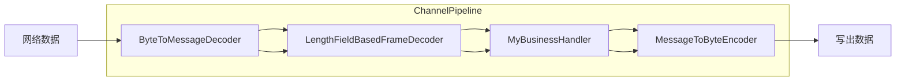
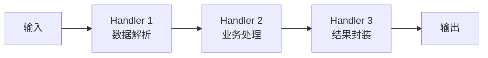
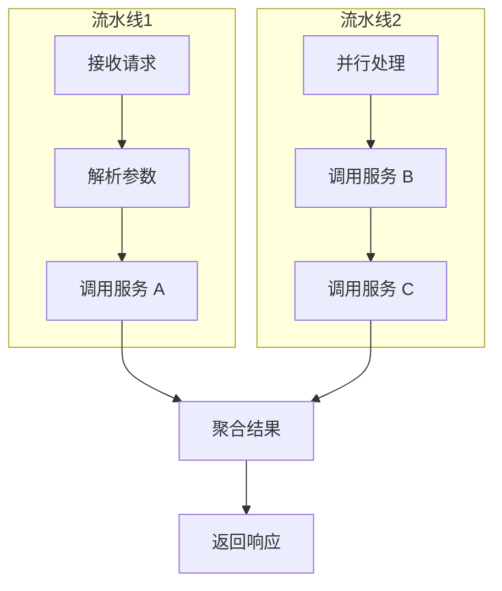
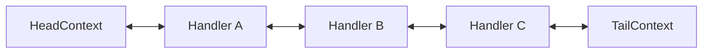

# Pipeline 流水线模式

想象一下汽车组装流水线：第一个人装发动机，第二个人装轮子，第三个人装车门。每辆车依次经过每个工位，最终变成成品。如果某个工位出了故障，整条线都会暂停。

但现实中，流水线比这更聪明——每个工位只做自己的事，完成后立刻把半成品传给下一个工位，自己继续处理下一辆。这种**异步协作、职责分离**的思想，正是 Pipeline 模式的核心。

## 从现实场景理解流水线

在软件开发中，流水线无处不在：

**编译器流水线**。现代编译器不是一次性处理整个源代码，而是分成词法分析、语法分析、语义分析、代码优化、代码生成等多个阶段。每个阶段专注于自己的任务，处理完一批 token 就交给下一阶段。

**Linux 命令管道**。`cat file | grep pattern | sort | uniq -c` 就是典型的流水线——每个命令是一个 stage，数据流像水一样从上一个命令流向下一个。

**Netty 网络框架**。每个入站数据都要经过解码、协议解析、业务处理、编码、发送等多个步骤。Netty 用 ChannelPipeline 把这些步骤串联起来，每个 Handler 专注于自己的逻辑。



## 流水线模式的核心结构

流水线模式将处理流程拆分为多个**阶段（Stage）**，每个阶段只负责一种类型的转换或处理。数据从上一阶段流入，经过处理后流向下一阶段。



在 Java NIO 和 Netty 中，Pipeline 通常由 ChannelHandlerContext 串联：

```java
public class ChannelPipeline {
    // 添加处理器
    ChannelPipeline addLast(ChannelHandler... handlers);

    // 触发Inbound事件（数据读取）
    ChannelPipeline fireChannelRead(Object msg);

    // 触发Outbound事件（数据写出）
    ChannelPipeline write(Object msg);
}
```

每个 Handler 都有机会处理数据，可以选择自己处理后停止传播，或者调用 `ctx.fireChannelRead()` 继续传递给下一个 Handler。

## 流水线 vs 并行处理

流水线不是银弹，它适用于**处理流程有明确顺序、各阶段职责单一**的场景。

**流水线适合的场景**：

- 处理步骤有先后依赖，必须按顺序执行
- 每个步骤的处理逻辑相对独立
- 数据量大，需要流式处理，不适合一次性加载

**并行处理适合的场景**：

- 各任务之间没有依赖，可以独立执行
- 需要聚合多个数据源的结果
- 任务计算量不均衡

两者也可以结合使用：流水线内部各阶段并行执行，用 CompletableFuture 或消息队列连接不同的流水线。



## Netty ChannelPipeline 源码解析

Netty 的 ChannelPipeline 是 Pipeline 模式的经典实现。理解它的设计，能帮助我们设计自己的处理链路。

**Pipeline 的结构**是一个双向链表：



Inbound 事件从 Head 向 Tail 传播，Outbound 事件从 Tail 向 Head 传播。

**Inbound 事件的传播**：

```java
public class SomeHandler extends ChannelInboundHandlerAdapter {
    @Override
    public void channelRead(ChannelHandlerContext ctx, Object msg) {
        // 处理收到的消息
        if (canHandle(msg)) {
            // 自己的业务逻辑
            doSomething(msg);
            // 传递给下一个 Handler
            ctx.fireChannelRead(msg);
        }
        // 如果不想继续传播，就不调用 fireChannelRead
    }
}
```

**Outbound 事件的传播**：

```java
public class SomeHandler extends ChannelOutboundHandlerAdapter {
    @Override
    public void write(ChannelHandlerContext ctx, Object msg,
                      ChannelPromise promise) {
        // 自己的写逻辑
        preProcess(msg);
        // 传递给下一个 Outbound Handler
        ctx.write(msg, promise);
    }
}
```

Handler 可以选择**是否继续传播事件**。如果一个 Handler 已经处理完并决定终止，可以不调用 `ctx.fire...`，这样后面的 Handler 就收不到这个事件了。

## 流水线中的异常处理

Pipeline 中的异常处理是个容易被忽视的问题。如果某个 Handler 抛出了异常但没有捕获，整个 Pipeline 可能中断，后续的数据就无法处理。

**Netty 的异常处理机制**：

```java
public class MyHandler extends ChannelInboundHandlerAdapter {
    @Override
    public void channelRead(ChannelHandlerContext ctx, Object msg) {
        try {
            doHandle(msg);
        } catch (Exception e) {
            // 记录日志
            logger.error("处理消息失败", e);
            // 可以选择是否继续传播异常
            ctx.fireExceptionCaught(e);
        }
    }

    @Override
    public void exceptionCaught(ChannelHandlerContext ctx, Throwable cause) {
        // 异常传播到这里
        logger.error("Pipeline 异常", cause);
        // 关闭连接或进行其他处理
        ctx.close();
    }
}
```

**最佳实践**：在 Pipeline 末尾（TailContext）添加一个全局的 ExceptionHandler，统一处理未捕获的异常，记录日志并决定是否关闭连接。

```java
pipeline.addLast(new ExceptionHandler());
```

## 流水线的背压问题

流水线如果某个阶段处理速度慢于上游，就会产生背压（Backpressure）——上游的数据堆积，无法继续传递。

**问题表现**：

- 队列不断增长，占用大量内存
- 响应时间越来越长
- 最终可能导致 OOM

**解决方案**：

1. **背压传播**：当下游处理速度变慢时，通知上游减慢发送速度
2. **背压丢弃**：当下游过载时，主动丢弃一些数据
3. **背压缓冲**：用有界队列控制缓冲大小，超出时触发拒绝策略

```java
// 使用有界队列，超出容量时拒绝
ThreadPoolExecutor executor = new ThreadPoolExecutor(
    corePoolSize, maxPoolSize, 60L, TimeUnit.SECONDS,
    new ArrayBlockingQueue<>(1000),  // 有界队列
    new ThreadPoolExecutor.CallerRunsPolicy()
);
```

Netty 的 ChannelPipeline 可以配合 `WriteBufferWaterMark` 控制写入速度：

```java
channel.pipeline().addLast(new WriteBufferWaterMark(
    new WriteBufferWaterMark.Low(8 * 1024, 32 * 1024)
));
```

当缓冲区超过上限时，写操作会被暂停，直到缓冲区低于下限。

## 总结与延伸

Pipeline 模式的核心价值是**职责分离和流程编排**。每个 Handler 只关心自己的处理逻辑，通过 Pipeline 将它们串联成完整的处理流程。

在设计 Pipeline 时，需要注意：

1. **Handler 职责单一**。如果一个 Handler 做太多事，就失去了链式组合的灵活性。
2. **异常必须处理**。未捕获的异常会中断整个 Pipeline。
3. **考虑背压**。上游速度可能远快于下游，需要机制保护。
4. **注意内存泄漏**。Pipeline 中的对象引用可能导致内存无法释放。

Netty 的 ChannelPipeline 是 Pipeline 模式的最佳实践之一，它的双向链表结构、事件传播机制、异常处理设计都值得借鉴。如果你在设计自己的处理链路，不妨参考这套机制。

那么问题来了：如果 Handler 之间需要共享状态怎么办？比如认证 Handler 校验通过后，后续 Handler 需要知道当前用户是谁。Netty 通过 `ctx.channel().attr()` 解决这个问题——在 Channel 上绑定属性。这引出了下一个话题：**Thread Local 在流水线中的使用**。
