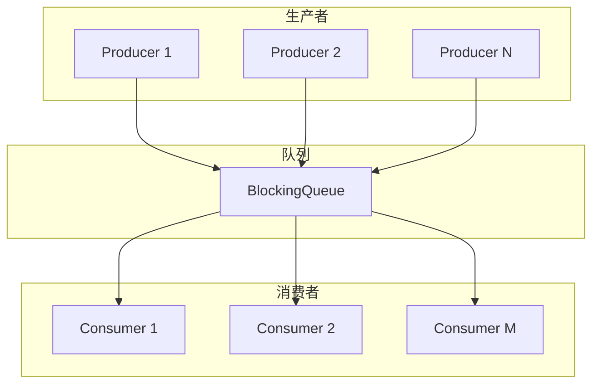

# 生产者-消费者模式

想象一个餐厅的运作模式：厨房里的厨师负责做菜，服务员负责把菜端给客人。厨师不需要关心客人什么时候来、来了多少人，只管把做好的菜放到窗口；服务员不需要关心菜是怎么做出来的，只管从窗口取菜端给客人。

这就是生产者-消费者模式的核心思想：**生产者和消费者通过一个缓冲区进行解耦，双方独立运作，互不阻塞**。

## 从订单处理系统说起

在电商系统中，用户下单后需要做很多后续处理：扣减库存、发送短信通知、记录日志、触发推荐系统等。如果每个步骤都同步执行，用户下单接口的响应时间会非常长。

```java
// 同步处理：用户要等所有步骤完成
public void createOrder(Order order) {
    saveOrder(order);        // 1ms
    deductInventory(order);   // 10ms
    sendNotification(order); // 50ms
    logOrder(order);          // 2ms
    // 总耗时：63ms
}
```

引入生产者-消费者模式后，下单操作只需要把订单信息扔到队列里，立刻返回：

```java
public void createOrder(Order order) {
    saveOrder(order);        // 1ms
    orderQueue.put(order);   // 立即返回
    return;                 // 总耗时：1ms
}

// 后台线程从队列取订单，异步处理
while (true) {
    Order order = orderQueue.take();
    processOrder(order);
}
```

这样用户下单只需要 1ms，订单的后续处理完全异步化。

## BlockingQueue 实现

`BlockingQueue` 是 JDK 提供的线程安全队列，提供了阻塞操作：

- `put()`：队列满时阻塞
- `take()`：队列空时阻塞
- `offer(e, timeout)`：队列满时等待超时后返回 false
- `poll(timeout)`：队列空时等待超时后返回 null

### ArrayBlockingQueue vs LinkedBlockingQueue

```java
// 有界队列，需要指定容量
ArrayBlockingQueue<Order> queue1 = new ArrayBlockingQueue<>(1000);

// 无界队列，容量 Integer.MAX_VALUE
LinkedBlockingQueue<Order> queue2 = new LinkedBlockingQueue<>();
```

两者的核心区别：

| 特性 | ArrayBlockingQueue | LinkedBlockingQueue |
| --- | --- | --- |
| 存储结构 | 数组 | 链表 |
| 容量 | 必须指定，有界 | 可选，无界（默认 Integer.MAX_VALUE） |
| 吞吐量 | 较低（有锁竞争） | 较高（两把锁分离） |
| 内存分配 | 预分配，无需动态分配 | 按需分配，可能频繁 GC |

:::warning
`LinkedBlockingQueue` 的无界特性是一把双刃剑。如果生产者速度远超消费者，队列会无限增长，最终导致 OOM。**生产环境务必使用有界队列**，并配合合理的拒绝策略。
:::

### 生产者-消费者代码实现

```java
public class OrderProcessor {
    private final BlockingQueue<Order> queue;
    private final ExecutorService consumerPool;

    public OrderProcessor(int queueCapacity, int consumerCount) {
        this.queue = new ArrayBlockingQueue<>(queueCapacity);

        // 创建消费者线程池
        this.consumerPool = Executors.newFixedThreadPool(consumerCount);

        // 启动消费者
        for (int i = 0; i < consumerCount; i++) {
            consumerPool.submit(new Consumer());
        }
    }

    // 生产者调用
    public void submitOrder(Order order) {
        try {
            queue.put(order); // 队列满则阻塞
        } catch (InterruptedException e) {
            Thread.currentThread().interrupt();
        }
    }

    private class Consumer implements Runnable {
        @Override
        public void run() {
            while (true) {
                try {
                    Order order = queue.take(); // 队列空则阻塞
                    processOrder(order);
                } catch (InterruptedException e) {
                    break; // 收到中断信号，优雅退出
                }
            }
        }

        private void processOrder(Order order) {
            // 扣减库存、发送通知等
        }
    }
}
```

## 多生产者多消费者

单生产者-单消费者的模式很少见，更常见的是多个生产者、多个消费者。



`BlockingQueue` 本身就是线程安全的，多个生产者往同一个队列写、多个消费者从同一个队列读，不需要额外的同步。

```java
public class MultiProducerConsumer {
    private final BlockingQueue<Task> queue = new ArrayBlockingQueue<>(1000);

    // 启动多个生产者
    public void startProducers(int count, Supplier<Task> taskSupplier) {
        ExecutorService producers = Executors.newFixedThreadPool(count);
        for (int i = 0; i < count; i++) {
            producers.submit(() -> {
                while (true) {
                    Task task = taskSupplier.get();
                    queue.put(task);
                }
            });
        }
    }

    // 启动多个消费者
    public void startConsumers(int count, Consumer<Task> processor) {
        ExecutorService consumers = Executors.newFixedThreadPool(count);
        for (int i = 0; i < count; i++) {
            consumers.submit(() -> {
                while (true) {
                    Task task = queue.take();
                    processor.accept(task);
                }
            });
        }
    }
}
```

## 有界队列 vs 无界队列

选择有界还是无界队列，需要权衡系统的不同需求：

**无界队列的特点**：

- 生产者不会因队列满而阻塞，永远可以提交任务
- 队列长度可能无限增长
- 风险：内存耗尽

**有界队列的特点**：

- 队列满时，`put()` 会阻塞生产者
- 系统有自我保护能力，不会无限堆积
- 需要设置合理的容量和拒绝策略

**拒绝策略的选择**：

```java
BlockingQueue<Order> queue = new ArrayBlockingQueue<>(1000);

// 方案一：调用者执行（背压机制）
ThreadPoolExecutor callerRuns = new ThreadPoolExecutor(
    core, max, 60L, TimeUnit.SECONDS, queue,
    new ThreadPoolExecutor.CallerRunsPolicy()
);

// 方案二：丢弃新任务（保护系统）
ThreadPoolExecutor discardNew = new ThreadPoolExecutor(
    core, max, 60L, TimeUnit.SECONDS, queue,
    new ThreadPoolExecutor.DiscardOldestPolicy()
);
```

`CallerRunsPolicy` 适合关键业务——如果队列满了，让调用者自己执行，相当于给系统装上了限流阀。但要注意，这可能让调用者线程阻塞，影响整体吞吐量。

## 消息积压处理

线上经常遇到消息积压的问题：消费者处理速度跟不上生产者速度，队列不断增长。

**快速止血方案**：

1. **扩容消费者**。如果有备用机器，增加消费者实例。
2. **降级非核心消费**。暂停某些不重要的消费者，把资源留给核心流程。
3. **跳过异常消息**。如果某些消息处理一直失败（消息损坏、死循环），会阻塞整个队列。需要加入超时和跳过机制。

```java
while (true) {
    try {
        Message msg = queue.poll(1, TimeUnit.SECONDS); // 最多等1秒
        if (msg != null) {
            processWithTimeout(msg, 30, TimeUnit.SECONDS);
        }
    } catch (Exception e) {
        // 记录错误，跳过当前消息，继续处理下一条
        logger.error("处理消息失败，跳过", e);
        // 可选：放入重试队列
    }
}
```

**事后复盘**：

- 消息处理失败率是否异常？
- 消费者线程是否在阻塞？（等待数据库、外部接口）
- 队列容量是否设置合理？

## Disruptor：高性能队列

在某些极致性能场景下，JDK 的 `BlockingQueue` 可能不够用。LMAX Exchange 开源的 Disruptor 是目前已知性能最高的队列实现。

**Disruptor 的核心优势**：

| 特性 | JDK BlockingQueue | Disruptor |
| --- | --- | --- |
| 队列类型 | 有锁队列 | 无锁队列（CAS） |
| 缓存友好 | 伪共享问题 | 填充机制避免伪共享 |
| 等待策略 | 阻塞等待 | 多种策略可选 |
| 吞吐量 | ~100万/秒 | ~1000万/秒 |

**Disruptor 使用示例**：

```java
public class DisruptorOrderProcessor {
    public void init(int bufferSize, int consumerCount) {
        // 创建 RingBuffer
        Disruptor<OrderEvent> disruptor = new Disruptor<>(
            OrderEvent::new,           // Event 工厂
            bufferSize,                // 缓冲区大小（必须是2的幂）
            DaemonThreadFactory.INSTANCE
        );

        // 设置消费者
        disruptor.handleEventsWithWorkerPool(
            createConsumers(consumerCount)
        );

        disruptor.start();
    }

    // 生产者发布消息
    public void publish(Order order) {
        RingBuffer<OrderEvent> ringBuffer = disruptor.getRingBuffer();
        long sequence = ringBuffer.next();
        try {
            OrderEvent event = ringBuffer.get(sequence);
            event.setOrder(order);
        } finally {
            ringBuffer.publish(sequence);
        }
    }
}
```

Disruptor 的性能来自于：

1. **无锁设计**。使用 CAS 操作替代锁。
2. **RingBuffer**。预分配的环形缓冲区，顺序读写，避免 GC。
3. **缓存行填充**。避免伪共享（False Sharing）问题。
4. **消息预取**。消费者可以批量获取消息。

但 Disruptor 的学习曲线较陡，对于大多数场景，JDK 的 `LinkedBlockingQueue` 已经足够。只有在压测发现 Queue 成为瓶颈时，才考虑换 Disruptor。

## 总结与延伸

生产者-消费者模式是架构中最常用的解耦模式之一：

**适用场景**：

- 异步处理（用户下单后异步发邮件、短信）
- 流量削峰（消息队列的核心理念）
- 系统解耦（支付系统和物流系统通过消息解耦）

**核心要点**：

1. 选择合适的队列类型（有界/无界）
2. 设置合理的队列容量
3. 消费者要做好异常处理，避免阻塞队列
4. 监控队列积压情况
5. 优雅关闭时确保消息不丢失

如果你的系统是低延迟敏感型，可以考虑 Disruptor；如果追求简单和通用，JDK 的 BlockingQueue 已经足够好。

那么问题来了：多个消费者共享一个队列时，如何保证消息不被重复消费？或者反过来，如何保证消息一定被消费？这涉及到**消息可靠性**和**幂等性**的设计——这是下一个话题的引子。
