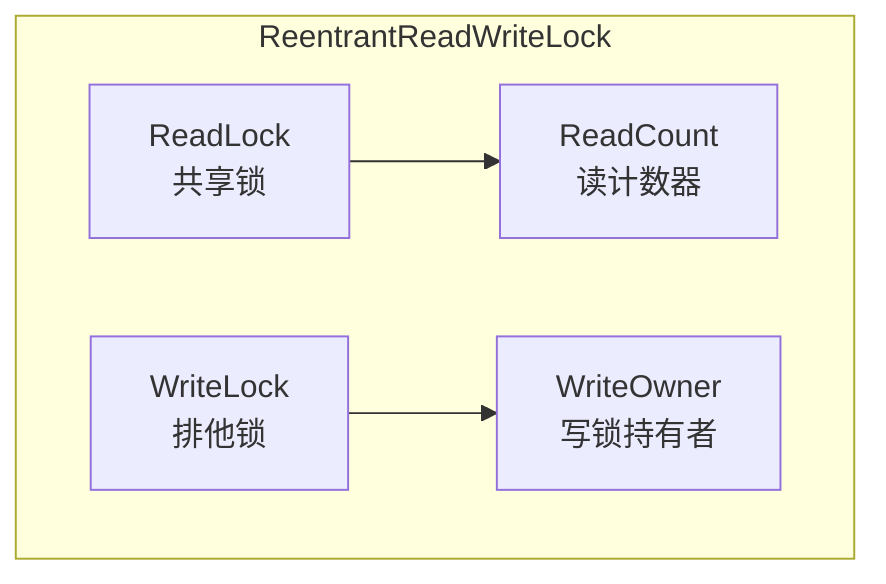

# 读写锁模式

想象一个图书馆的借阅系统：

- **读者**可以同时进入阅览室看书，人数不限
- **作家**进入时，必须清场所有读者，独自写作
- **作家写完后**，通知读者可以重新进入

这就是读写锁的核心思想——**读操作可以并发，写操作必须独占**。在读多写少的场景下，这比普通互斥锁的并发度高出几个数量级。

## 为什么需要读写锁

对于 `Counter` 这个类，普通 `synchronized` 的问题是：即使只是读取 `count`，也必须独占访问：

```java
public class Counter {
    private int count = 0;

    public synchronized void increment() {
        count++;
    }

    public synchronized int get() { // 读取也要独占
        return count;
    }
}
```

如果有 1000 个线程同时读，`synchronized` 只能串行执行。读写锁允许 1000 个读操作并发：

```java
public class RWCounter {
    private int count = 0;
    private final ReentrantReadWriteLock rwLock = new ReentrantReadWriteLock();

    public void increment() {
        rwLock.writeLock().lock();
        try {
            count++;
        } finally {
            rwLock.writeLock().unlock();
        }
    }

    public int get() {
        rwLock.readLock().lock();
        try {
            return count;
        } finally {
            rwLock.readLock().unlock();
        }
    }
}
```

## ReentrantReadWriteLock 结构

`ReentrantReadWriteLock` 维护了两把锁：**读锁**和**写锁**。



**锁的互斥规则**：

| 操作 | 能否获取读锁 | 能否获取写锁 |
| --- | --- | --- |
| 线程 T 持有读锁 | 可以（重入） | 需要等待所有读锁释放 |
| 线程 T 持有写锁 | 可以（重入） | 可以（重入） |
| 其他线程持有读锁 | 可以 | 需要等待所有锁释放 |
| 其他线程持有写锁 | 需要等待 | 需要等待 |

**代码示例**：

```java
ReentrantReadWriteLock rwLock = new ReentrantReadWriteLock();
ReadLock readLock = rwLock.readLock();
WriteLock writeLock = rwLock.writeLock();

// 读操作：多个线程可以同时进入
readLock.lock();
try {
    // 读取共享状态
    return cache.get(key);
} finally {
    readLock.unlock();
}

// 写操作：独占访问
writeLock.lock();
try {
    // 修改共享状态
    cache.put(key, value);
} finally {
    writeLock.unlock();
}
```

## 读锁 vs 写锁的互斥规则

读写锁的互斥规则比较微妙：

**读锁和读锁不互斥**：多个读操作可以同时进行。这是读写锁提升性能的关键。

**读锁和写锁互斥**：读的时候不能写，写的时候不能读。这是为了防止脏读。

**写锁和写锁互斥**：同一时间只能有一个写操作。

```java
// 线程 A 持有读锁
readLock.lock();
// 线程 B 也想获取读锁 -> 可以（不互斥）
readLock.lock();

// 线程 C 想获取写锁 -> 阻塞，等待 A、B 释放读锁
writeLock.lock();

// 线程 A 释放读锁
readLock.unlock();
readLock.unlock();

// 线程 C 获得写锁
```

**饥饿问题**：如果读操作非常频繁，写锁可能长时间无法获取（写饥饿）。`ReentrantReadWriteLock` 默认是非公平的，但可以通过构造函数指定为公平模式：

```java
// 公平模式：等待时间最长的线程优先获取锁
ReentrantReadWriteLock fairLock = new ReentrantReadWriteLock(true);
```

## 锁降级：写锁 → 读锁

锁降级是指**持有写锁时，可以获取读锁**，但读锁不能升级为写锁。

**为什么需要锁降级**？

```java
public class Cache<K, V> {
    private final Map<K, V> cache = new HashMap<>();
    private volatile boolean cacheLoaded = false;
    private final ReentrantReadWriteLock rwLock = new ReentrantReadWriteLock();

    public V get(K key) {
        // 1. 先尝试读
        rwLock.readLock().lock();
        V value = cache.get(key);
        if (value != null) {
            rwLock.readLock().unlock();
            return value;
        }
        rwLock.readLock().unlock();

        // 2. 缓存未命中，需要加载
        rwLock.writeLock().lock();
        try {
            // 3. 双重检查（防止其他线程已经加载了）
            value = cache.get(key);
            if (value == null) {
                value = loadFromDisk(key); // 耗时操作
                cache.put(key, value);
                cacheLoaded = true;
            }

            // 4. 锁降级：持有写锁的同时获取读锁
            rwLock.readLock().lock(); // [!code highlight]
            return value;
        } finally {
            // 5. 先释放写锁，再释放读锁
            rwLock.writeLock().unlock();
        }
    }

    private V loadFromDisk(K key) {
        // 模拟从磁盘加载
        return (V) new Object();
    }
}
```

**为什么要锁降级而不是释放写锁再获取读锁？**

因为释放写锁后，其他写线程可能插入，导致缓存被破坏。锁降级确保在更新缓存的过程中，始终持有某种形式的锁，防止并发修改。

:::warning
锁降级是安全的，但**锁升级是危险的**：

```java
// 危险！可能导致死锁
readLock.lock();       // 获取读锁
writeLock.lock();      // 尝试获取写锁 -> 死锁！
```

如果有两个线程分别尝试读锁升级，会形成死锁。
:::

## StampedLock：乐观读锁

`ReentrantReadWriteLock` 的读锁是悲观的——每次读取都要加锁。如果读操作远多于写操作，可以考虑 `StampedLock`。

`StampedLock` 提供了三种锁模式：

1. **写锁**：排他锁，和 ReentrantReadWriteLock 的写锁相同
2. **悲观读锁**：和 ReentrantReadWriteLock 的读锁相同
3. **乐观读锁**：不加锁，读取后检查数据是否被修改过

```java
public class Point {
    private double x, y;
    private final StampedLock stampedLock = new StampedLock();

    // 悲观读锁
    public double distanceFromOrigin() {
        stampedLock.readLock().lock();
        try {
            return Math.sqrt(x * x + y * y);
        } finally {
            stampedLock.readLock().unlock();
        }
    }

    // 乐观读锁：性能更好
    public double distanceFromOriginOptimistic() {
        long stamp = stampedLock.tryOptimisticRead(); // [!code highlight]
        double currentX = x;
        double currentY = y;

        // 检查在读取过程中是否发生写操作
        if (!stampedLock.validate(stamp)) { // [!code highlight]
            // 发生了写操作，升级为悲观读
            stamp = stampedLock.readLock().lock();
            try {
                currentX = x;
                currentY = y;
            } finally {
                stampedLock.readLock().unlock();
            }
        }
        return Math.sqrt(currentX * currentX + currentY * currentY);
    }

    // 写操作
    public void move(double deltaX, double deltaY) {
        long stamp = stampedLock.writeLock().lock();
        try {
            x += deltaX;
            y += deltaY;
        } finally {
            stampedLock.unlockWrite(stamp);
        }
    }
}
```

**乐观读的性能优势**：

在读多写少的场景下，乐观读几乎不需要加锁，开销极低。只有在真的发生写冲突时（`validate` 返回 false），才会退化为悲观读。

## 读写锁的适用场景与陷阱

**适用场景**：

- 缓存：读操作远多于写操作
- 配置管理：配置读取频繁，修改稀少
- 统计计数器：累加操作少，查询操作多

**陷阱一：读写锁不能完全替代互斥锁**

如果读操作内部包含对其他共享状态的写操作，读写锁无法保护：

```java
readLock.lock();
try {
    if (map.containsKey(key)) {
        map.remove(key); // 写操作，但用的是读锁！不安全
    }
} finally {
    readLock.unlock();
}
```

**陷阱二：锁饥饿**

在极端读多写少的情况下，写锁可能长时间得不到执行。可以考虑：

- 使用公平模式
- 在写操作时使用 `writeLock()` 的 `tryLock()` 带超时
- 降低读操作的持有时间

**陷阱三：不可重入**

`ReentrantReadWriteLock` 不支持读锁重入为写锁：

```java
readLock.lock();
try {
    // 这里尝试获取写锁 -> 会阻塞
    writeLock.lock(); // 死锁！
} finally {
    readLock.unlock();
}
```

## 总结与延伸

读写锁是读多写少场景下的性能利器：

**选择建议**：

| 场景 | 推荐 |
| --- | --- |
| 读多写少，追求高性能 | StampedLock（乐观读） |
| 读多写少，代码简洁 | ReentrantReadWriteLock |
| 写多读少 | 普通 synchronized 或 ReentrantLock |
| 读写比例不确定 | 先 profiling，再选择 |

**最佳实践**：

1. 读锁和写锁的范围尽可能小
2. 避免在持有读锁时进行写操作
3. 考虑使用 StampedLock 的乐观读提升性能
4. 注意锁降级的正确写法

理解读写锁的设计原理，有助于理解数据库的 MVCC（多版本并发控制）——它们的思想是相通的：读不阻塞读，写阻塞读。

那么问题来了：如果一个线程先获取写锁，再获取读锁（锁降级），这个过程会导致死锁吗？如果不会，JVM 是如何保证安全的？
