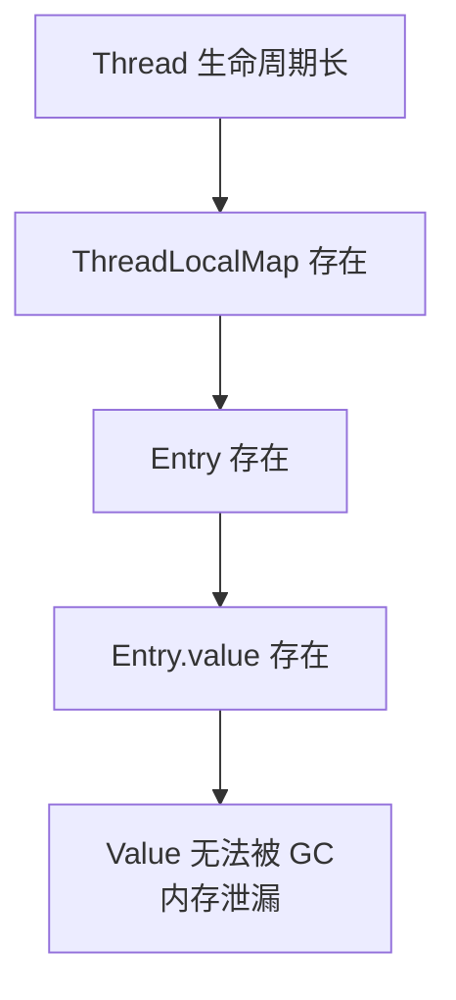

# Thread Local 线程局部存储

一个 HTTP 请求带着用户身份信息进来，Controller 层需要它，Service 层需要它，DAO 层可能也需要它。如果每个方法都加一个参数传递，代码会变得臃肿不堪。

```java
// 层层传递 UserContext，想想都觉得恶心
public User getUser(Long userId, UserContext context) {
    return userDao.query(userId, context.getUserId(), context.getTenantId());
}
```

Thread Local 提供了一种优雅的解法：**让数据「粘」在当前线程上，需要时直接取，不用层层传递。**

```java
// 在入口处设置上下文
UserContext context = new UserContext(userId, tenantId);
UserContextHolder.set(context);

// 后续任意位置直接获取，不用传参
UserContext ctx = UserContextHolder.get();
String userId = ctx.getUserId();
```

## ThreadLocal 原理

每个 Thread 对象内部都有一个 `ThreadLocalMap`，本质上是一个定制的 `HashMap`。当调用 `ThreadLocal.set(value)` 时，ThreadLocal 实例作为 key，value 存入当前线程的 Map 中。

```java
public class ThreadLocal<T> {
    public void set(T value) {
        Thread t = Thread.currentThread();
        ThreadLocalMap map = getMap(t);
        if (map != null) {
            map.set(this, value);
        } else {
            createMap(t, value);
        }
    }

    public T get() {
        Thread t = Thread.currentThread();
        ThreadLocalMap map = getMap(t);
        if (map != null) {
            ThreadLocalMap.Entry e = map.getEntry(this);
            if (e != null) {
                return (T) e.value;
            }
        }
        return initialValue(); // 默认返回 null
    }
}
```

关键在于：**ThreadLocal 实例是 key，而不是 value 本身**。同一个 ThreadLocal，在不同线程中 set 值，互不影响，因为底层是两个不同的 Map。

```mermaid
flowchart LR
    subgraph Thread-1
        TL1[ThreadLocal: key] --> V1[Value: "张三"]
    end

    subgraph Thread-2
        TL2[ThreadLocal: key] --> V2[Value: "李四"]
    end

    TL1 -.->|相同实例| TL2
```

```java
ThreadLocal<String> name = new ThreadLocal<>();

Thread t1 = new Thread(() -> {
    name.set("张三");
    System.out.println(name.get()); // 张三
});

Thread t2 = new Thread(() -> {
    name.set("李四");
    System.out.println(name.get()); // 李四
});

t1.start();
t2.start();

System.out.println(name.get()); // null（主线程从未设置）
```

## 内存泄漏问题

Thread Local 看似简单，但有一个隐藏的陷阱：**内存泄漏**。

ThreadLocalMap 的 Entry 继承自 `WeakReference<ThreadLocal<?>>`：

```java
static class Entry extends WeakReference<ThreadLocal<?>> {
    Object value;
    Entry(ThreadLocal<?> k, Object v) {
        super(k);
        value = v;
    }
}
```

**为什么用弱引用？** 如果 ThreadLocal 是强引用，那么即使 ThreadLocal 已经不再被使用（外部没有强引用了），线程仍然持有一个引用，ThreadLocal 就无法被回收。

但问题来了——**弱引用只能保护 key（ThreadLocal 实例），不能保护 value**。当 ThreadLocal 被 GC 后，Entry 的 key 变成 null，但 value 仍然被 Entry 持有，而 Entry 还被 ThreadLocalMap 持有。只要线程还活着，ThreadLocalMap 就存在，value 就无法被回收。



**线程池场景尤为严重**。在线程池中，线程是复用的，不会销毁。如果使用线程池的服务不断创建 ThreadLocal 但忘记清理，这些 ThreadLocal 和对应的 value 就会一直占用内存。

**正确做法**：用完即删。

```java
try {
    UserContextHolder.set(context);
    // 业务逻辑
} finally {
    UserContextHolder.remove(); // finally 中清理
}
```

:::warning
ThreadLocal 使用时必须配合 finally 块清理，否则在高并发、长生命周期的线程池环境下，可能导致内存泄漏。
:::

## 父子线程共享：InheritableThreadLocal

普通 ThreadLocal 无法在父子线程间传递。当在主线程创建一个子线程时，子线程的 ThreadLocal 是独立的：

```java
ThreadLocal<String> tl = new ThreadLocal<>();
tl.set("主线程的值");

Thread child = new Thread(() -> {
    System.out.println(tl.get()); // null，子线程无法获取
});
child.start();
```

`InheritableThreadLocal` 解决了这个问题。它会在创建子线程时，把父线程的 InheritableThreadLocal 值复制过去：

```java
InheritableThreadLocal<String> itl = new InheritableThreadLocal<>();
itl.set("父线程的值");

Thread child = new Thread(() -> {
    System.out.println(itl.get()); // 父线程的值
});
child.start();
```

**但 InheritableThreadLocal 在线程池中有问题**。线程池中的线程是复用的，不会重新创建（除非设置 `poolSize` 增加新线程）。这意味着子线程继承的值是**第一次创建时的快照**，而不是父线程当前的值。

```java
InheritableThreadLocal<String> itl = new InheritableThreadLocal<>();

// 主线程设置
itl.set("第一次");
executor.submit(() -> System.out.println(itl.get())); // 打印 "第一次"

// 主线程再次设置
itl.set("第二次");
executor.submit(() -> System.out.println(itl.get())); // 仍然是 "第一次"！
```

## TransmittableThreadLocal：异步传递的救星

阿里开源的 `TransmittableThreadLocal`（TTL）解决了父子线程值传递的问题，而且支持线程池场景。

**TTL 的核心机制**：在线程池提交任务时，主动捕获当前线程的 ThreadLocal 值，然后在执行任务时恢复。

```java
// Maven 依赖
<dependency>
    <groupId>com.alibaba</groupId>
    <artifactId>transmittable-thread-local</artifactId>
    <version>2.14.2</version>
</dependency>
```

**使用方式一：修饰 Runnable/Callable**（最简单）

```java
TransmittableThreadLocal<String> context = new TransmittableThreadLocal<>();
context.set("用户上下文");

// 使用 TtlRunnable 包装
Runnable task = TtlRunnable.get(() -> {
    System.out.println(context.get()); // 能获取到值
});

executor.submit(task);
```

**使用方式二：使用 TtlExecutorService**（推荐，自动包装）

```java
// 包装后的 ExecutorService 会自动处理 ThreadLocal 传递
ExecutorService executor = TtlExecutors.getTtlExecutorService(
    Executors.newFixedThreadPool(10)
);

// 每次提交任务时，会自动捕获当前的 TransmittableThreadLocal
context.set("用户A");
executor.submit(() -> System.out.println(context.get())); // 用户A

context.set("用户B");
executor.submit(() -> System.out.println(context.get())); // 用户B
```

**使用方式三：Java Agent 无侵入接入**

```bash
# 启动时加参数
-javaagent:/path/to/transmittable-thread-local-2.14.2.jar
```

使用 Agent 后，不需要修改任何代码，TTL 会自动对线程池进行增强。

## 替代方案：请求上下文对象

ThreadLocal 虽然方便，但也是隐式状态的发源地。如果滥用，会让代码难以测试和理解。有些团队干脆禁用 ThreadLocal，改用显式的上下文对象传递。

**上下文对象模式**：

```java
public class RequestContext {
    private final String userId;
    private final String tenantId;
    private final String traceId;

    public RequestContext(String userId, String tenantId, String traceId) {
        this.userId = userId;
        this.tenantId = tenantId;
        this.traceId = traceId;
    }

    // Getter
}
```

**通过参数传递**：

```java
public class UserService {
    public User getUser(Long id, RequestContext ctx) {
        return userDao.query(id, ctx.getUserId());
    }
}
```

**通过 Context 持有者传递（但不滥用）**：

```java
public class ContextHolder {
    private static final AsyncLocal<RequestContext> CONTEXT =
        new AsyncLocal<>();

    public static void set(RequestContext ctx) {
        CONTEXT.set(ctx);
    }

    public static RequestContext get() {
        return CONTEXT.get();
    }

    public static void clear() {
        CONTEXT.remove();
    }
}
```

`AsyncLocal` 是 ThreadLocal 的升级版，支持在异步场景（如 CompletableFuture）下传递值。

## 总结与延伸

Thread Local 是柄双刃剑：

**优点**：

- 避免参数层层传递，代码更简洁
- 线程隔离，数据互不影响

**缺点**：

- 隐式状态，难以追踪数据来源
- 内存泄漏风险（特别是线程池场景）
- 无法跨线程传递（需要 TransmittableThreadLocal 或 AsyncLocal）

**实践中的一些建议**：

1. **优先使用显式传递**。如果能通过参数传递，就不要用 ThreadLocal。
2. **ThreadLocal 必须在 finally 中清理**。这是铁律。
3. **线程池场景优先考虑 TransmittableThreadLocal**。它专门为异步场景设计。
4. **不要在 ThreadLocal 中存大对象**。如果必须存，确保及时清理。

那么问题来了：如果在 Filter 中设置了 ThreadLocal，但 Controller 抛出了异常没被捕获，finally 中的清理逻辑还能执行吗？这涉及到异常处理链和 ThreadLocal 生命周期的配合问题——在设计框架时需要特别注意。
