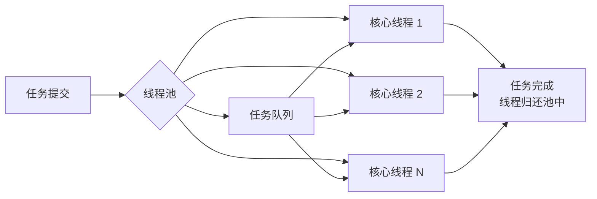
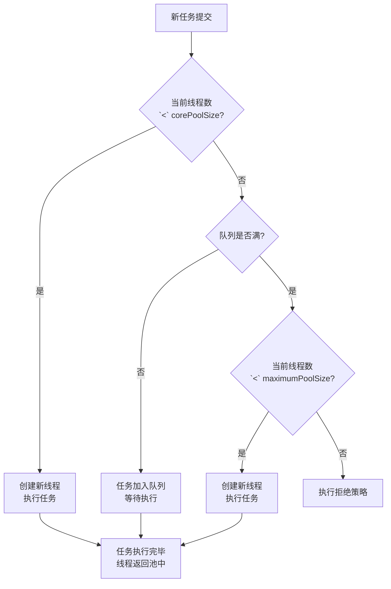

# Worker Pool 线程池模式

凌晨 2 点，线上告警突然响起：接口响应时间从 50ms 飙升到 5 秒。登录服务器一看，CPU 使用率只有 30%，但线程数已经超过了 5000。排查后发现，问题根源是代码里每处理一个请求就 `new Thread().start()`——线程创建和销毁的开销，在高并发下成了性能的隐形杀手。

这就是为什么我们需要线程池。

## 为什么需要线程池

在没有线程池的时代，每来一个任务就创建一个新线程，问题显而易见：

**线程创建销毁的开销不容忽视**。创建一个线程涉及分配线程内核对象、调用内核 API、向 JVM 注册等操作。在 Linux 上，这个过程大约需要 1~2ms。如果每个任务只执行 5ms，那么 60% 的时间都花在了线程管理上，而不是实际业务逻辑。

**线程数量无法控制**。假设同时来了 10000 个请求，就会创建 10000 个线程。线程本身会占用栈内存（默认 1MB），加上调度开销，系统很快就会 OOM 或者陷入频繁的上下文切换。

**缺乏统一管理**。任务完成后线程被遗弃，无法复用。如果有定时任务、优先级任务等需求，全部要从头实现。

线程池的本质是**复用有限的线程去处理大量任务**。核心思想是：预先创建一组工作线程，用完不销毁，而是放回池中等待下一个任务。



## ThreadPoolExecutor 核心参数

`ThreadPoolExecutor` 是 Java 线程池的核心实现，理解它的参数是正确使用线程池的前提。

```java
public ThreadPoolExecutor(
    int corePoolSize,           // 核心线程数
    int maximumPoolSize,        // 最大线程数
    long keepAliveTime,         // 空闲线程存活时间
    TimeUnit unit,              // 时间单位
    BlockingQueue<Runnable> workQueue,      // 任务队列
    ThreadFactory threadFactory,             // 线程工厂
    RejectedExecutionHandler handler         // 拒绝策略
)
```

**corePoolSize** 是线程池的「常驻人口」。这些线程即使空闲也不会被回收，除非设置了 `allowCoreThreadTimeOut`。

**maximumPoolSize** 是线程池的「上限」。当队列满了之后，线程池会继续创建线程直到达到这个数字。

**keepAliveTime** 控制非核心线程的空闲存活时间。当线程空闲时间超过这个值，且当前线程数大于 corePoolSize 时，线程会被回收。

**workQueue** 是任务缓冲队列。常用实现有：

| 队列类型 | 特点 |
| --- | --- |
| `LinkedBlockingQueue` | 无界队列，可能导致 OOM |
| `ArrayBlockingQueue` | 有界队列，需要预估容量 |
| `SynchronousQueue` | 不存储任务，直接交付 |

**threadFactory** 用来定制线程的创建过程。比如设置线程名前缀、设置为守护线程等。

**handler** 是拒绝策略。当线程池饱和时的处理方式：

| 策略 | 行为 |
| --- | --- |
| `AbortPolicy` | 抛出 `RejectedExecutionException` |
| `CallerRunsPolicy` | 由调用者线程执行 |
| `DiscardPolicy` | 直接丢弃任务 |
| `DiscardOldestPolicy` | 丢弃队列最旧的任务 |

## 线程池工作流程

线程池的处理逻辑可以用一句话概括：**优先利用核心线程，其次加入队列，最后扩展到最大线程数**。



这个流程有几个关键点需要注意：

**线程创建的时机**是提交任务时，而不是创建线程池时。只有当任务来了，才发现没有可用线程，才会创建新线程。

**队列的选择直接影响线程池行为**。使用无界队列（如 `LinkedBlockingQueue`）时，线程数永远到不了 maximumPoolSize，因为队列永远不会满。这在流量可控时很方便，但如果生产者速度远超消费者，系统会不断堆积，最终 OOM。

**CallerRunsPolicy 是一把双刃剑**。它会让调用线程去执行任务，起到**背压**作用——如果调用者是主线程，系统的自我保护机制会降低提交速度。但这也意味着调用者线程会被阻塞，可能影响整体吞吐量。

## Executors 工具类的陷阱

`Executors` 提供了几个便捷的静态工厂方法，但它们并不是万能的。

```java
// 固定线程数线程池
ExecutorService fixed = Executors.newFixedThreadPool(10);

// 可缓存线程池
ExecutorService cached = Executors.newCachedThreadPool();

// 定时线程池
ScheduledExecutorService scheduled = Executors.newScheduledThreadPool(5);
```

**FixedThreadPool 使用无界队列**。由于队列无界，maximumPoolSize 参数形同虚设。如果任务提交速度持续大于处理速度，内存会不断增长直到 OOM。

**CachedThreadPool 的最大线程数是 Integer.MAX_VALUE**。在任务短平快的场景下表现良好，但如果提交了大量长时间阻塞的任务，线程数会疯狂膨胀，同样导致 OOM。

**ScheduledThreadPool 的问题类似**。它的 maximumPoolSize 也是无界的。

:::warning
在生产环境中，**永远不要直接使用 Executors 创建线程池**。必须显式指定队列容量和线程数上下限。
:::

正确做法是手动创建 `ThreadPoolExecutor`，或者使用阿里开源的 `Hippo4j`、`DynamicTp` 等动态线程池框架。

```java
ThreadPoolExecutor executor = new ThreadPoolExecutor(
    10,                                    // 核心线程数
    20,                                    // 最大线程数
    60L, TimeUnit.SECONDS,                 // 空闲存活时间
    new LinkedBlockingQueue<>(1000),       // 有界队列
    new ThreadFactoryBuilder()              // 带上业务标识，便于排查
        .setNameFormat("biz-pool-%d")
        .build(),
    new ThreadPoolExecutor.AbortPolicy()  // 队列满时拒绝
);
```

## 线程池监控与优雅关闭

线程池如果不监控，就是一个黑盒。线上出问题很难定位。

**基本监控指标**：

```java
// 获取当前线程池状态
ThreadPoolExecutor executor = ...;

// 活跃线程数
int activeCount = executor.getActiveCount();

// 队列中的任务数
int queueSize = executor.getQueue().size();

// 已完成任务数
long completedTaskCount = executor.getCompletedTaskCount();

// 线程池当前线程数
int poolSize = executor.getPoolSize();
```

**使用 Micrometer 暴露指标**：

```java
// 接入 Prometheus 监控
new ThreadPoolExecutorMetrics(executor)
    .register(meterRegistry);
```

这样可以在 Grafana 中看到线程池的活跃度、队列积压情况，为容量规划提供数据支撑。

**优雅关闭线程池**：

```java
// 1. 禁止接收新任务
executor.shutdown();

// 2. 等待已提交任务执行完成（带超时）
boolean terminated = executor.awaitTermination(30, TimeUnit.SECONDS);

if (!terminated) {
    // 3. 超时后强制中断
    executor.shutdownNow();

    // 4. 再次等待
    executor.awaitTermination(10, TimeUnit.SECONDS);
}
```

`shutdown()` 会让正在执行的任务继续执行，但不再接受新任务。`shutdownNow()` 会尝试中断所有正在执行的任务，但这依赖于任务本身正确响应中断——如果任务没有检查中断状态，可能无法及时停止。

:::tip
如果线程池中的任务会阻塞（比如等待 I/O），需要确保任务内部会检查中断状态。否则 shutdownNow 也无法让它们停止。
:::

## 如何合理设置线程池大小

线程池大小不是拍脑袋决定的，需要根据任务类型来计算。

**CPU 密集型任务**应该把线程数设置为 CPU 核心数 + 1。这是因为 CPU 密集型任务几乎一直占着 CPU，增加更多线程只会增加上下文切换开销。

```java
// CPU 核心数
int cpuCores = Runtime.getRuntime().availableProcessors();

// CPU 密集型线程数
int poolSize = cpuCores + 1;
```

**IO 密集型任务**的线程数可以远大于 CPU 核心数。因为任务大部分时间在等待 I/O 完成，CPU 是空闲的。

经验公式是：`线程数 = CPU 核心数 * (1 + I/O 时间 / CPU 时间)`

如果 I/O 时间是 CPU 时间的 4 倍，那么线程数可以是核心数的 5 倍。

```java
// 假设 I/O 时间 / CPU 时间 = 4
int cpuCores = Runtime.getRuntime().availableProcessors();
int poolSize = cpuCores * (1 + 4); // 5 倍
```

但这只是起点。实际项目中，线程池参数需要结合压测数据来调优。观察以下指标：

- **CPU 使用率**：如果 CPU 使用率低，说明线程不够用，可以增加线程
- **队列积压**：如果队列持续增长，说明处理能力不足
- **响应时间**：如果延迟上升，可能是线程竞争激烈

## 常见陷阱与反模式

**陷阱一：使用线程池处理定时任务**。定时任务的执行周期可能重叠，如果上一个任务还没结束，下一个又开始了，会导致并发问题。正确做法是使用 `ScheduledThreadPoolExecutor`，它内部会用DelayQueue 保证同一任务不会并发执行。

**陷阱二：共享线程池**。所有任务混用一个线程池，很难针对不同类型任务进行调优。推荐按业务类型拆分线程池：IO 密集型任务用大线程池，CPU 密集型任务用小线程池。

**陷阱三：忘记处理 RejectedExecutionException**。当任务被拒绝时，如果什么都不做，任务就丢失了。生产环境至少要打日志告警。

**陷阱四：线程池参数从不调整**。流量是动态的，线程池参数也需要根据业务峰值调整。可以使用动态线程池框架实现热更新。

## 总结与延伸

线程池是 Java 并发编程的基础设施，合理使用可以显著提升系统吞吐量。但它也是一把双刃剑——配置不当会导致 OOM、线程泄漏、性能退化等一系列问题。

实践中，有几个关键原则：

1. **显式创建线程池**，不要使用 Executors 默认实现
2. **根据任务类型设置参数**，CPU 密集型和 IO 密集型分开
3. **做好监控**，线程池是系统透明度的盲区
4. **优雅关闭**，确保任务不丢失

如果你的系统对线程池管理有更高要求，比如需要运行时调整参数、查看线程堆栈、获取任务执行快照等，可以考虑引入 `Hippo4j` 或 `Arthas` 这样的工具。

那么问题来了：如果任务执行时间差异很大——有些只需要 1ms，有些需要 10 秒——如何让线程池既能快速响应短任务，又不会被长任务占满？这就涉及到线程池的**队列选择**和**优先级调度**问题了。
