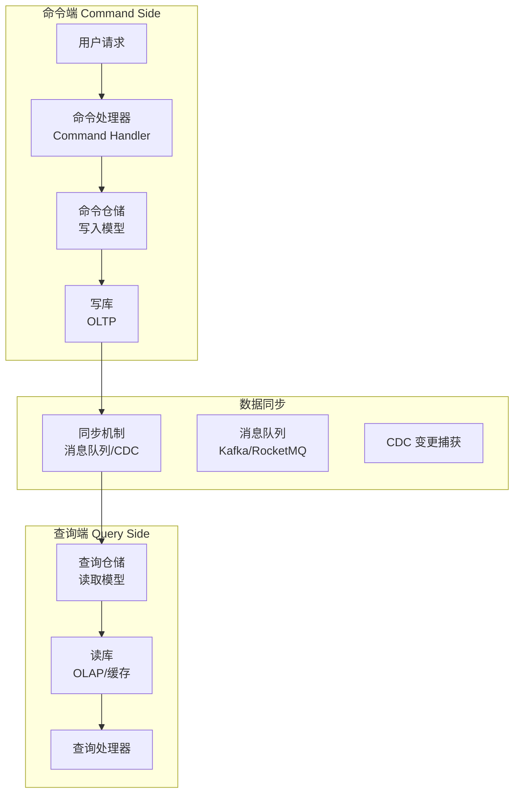
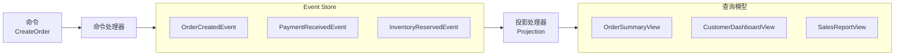

# CQRS 数据读写分离

电商平台的商品列表页需要展示：商品名称、价格、销量、评价数量、折扣信息、库存状态——这些数据来自商品表、订单表、评价表、促销表、库存表。一次列表查询可能涉及五六张表的 JOIN，查询耗时 500ms。用户说我只是想看个商品列表，怎么比下单还慢？问题根源在于：读写混合在同一套数据库模型上，互相争夺资源。写操作需要事务锁，读操作需要扫描大量数据，两者放在同一个数据库里，苍蝇老虎一把抓，谁都跑不快。CQRS（Command Query Responsibility Segregation，命令查询职责分离）正是来解决这个问题的：让写操作和读操作使用不同的数据模型，甚至不同的存储。

## CQRS 核心架构

CQRS 的核心思想是"命令"和"查询"分离。命令（Command）执行创建、更新、删除操作，返回执行结果；查询（Query）只负责读取数据，返回视图化的结果。两者使用不同的数据模型和存储，可以独立优化。



命令端的写入模型通常采用面向业务的领域模型（如 Order、Product 实体），追求事务能力和业务表达力；查询端的读取模型通常采用面向查询的扁平化模型（如 OrderView、ProductListItem），追求查询性能和字段冗余。

## 同步复制 vs 异步复制

命令端的数据同步到查询端有两种模式：同步复制和异步复制。

同步复制的优势是数据延迟低，命令执行完成后查询端立即可见。缺点是命令执行时间会增加（需要等待同步完成），而且如果查询端存储故障，命令端也会受影响。这种模式适合对数据一致性要求较高的场景，但实际应用中较少。

```java
public class SynchronousCQRSService {
    private final CommandRepository commandRepo;
    private final QueryRepository queryRepo;

    @Transactional
    public void createOrder(OrderCommand command) {
        // 1. 写入命令模型
        Order order = commandRepo.save(command.toOrder());

        // 2. 同步构建查询模型
        OrderView orderView = buildOrderView(order);
        queryRepo.save(orderView);

        // 3. 两者都成功才算成功
    }
}
```

异步复制的优势是命令执行速度快，不受查询端影响；缺点是存在数据延迟，命令执行后查询端需要一段时间才能看到最新数据。这是 CQRS 最常用的同步模式。

```java
public class AsynchronousCQRSService {
    private final CommandRepository commandRepo;
    private final EventPublisher eventPublisher;

    public void createOrder(OrderCommand command) {
        Order order = commandRepo.save(command.toOrder());

        // 发布领域事件，异步同步到查询端
        eventPublisher.publish(new OrderCreatedEvent(order));
    }
}

// 查询端监听事件并更新读取模型
@KafkaListener(topics = "order-events")
public void handleOrderCreated(OrderCreatedEvent event) {
    OrderView orderView = buildOrderView(event.getOrder());
    queryRepo.save(orderView);
}
```

延迟多久取决于消息队列的吞吐量和查询端的消费能力。通常控制在毫秒到秒级，对于大多数业务场景是可接受的。但如果业务要求命令执行后立即查询到最新状态，就不能使用纯异步模式，需要结合其他策略（如同步写入查询模型）。

## Event Sourcing 组合

CQRS 常常与 Event Sourcing（事件溯源）一起使用，形成一套完整的数据架构。在这种组合下，命令端写入的不是聚合根的当前状态，而是一系列领域事件。这些事件被持久化到 Event Store，作为系统的单一真相来源；查询端通过"投影"（Projection）机制从事件流中构建出各种查询视图。



这种组合的优势是完整保留了系统的所有变更历史，支持任意时间点的状态回放和重投影；缺点是架构复杂度高，事件 Schema 变更（Upcasting）需要谨慎处理。关于 Event Sourcing 的详细内容，可参考[事件溯源（Event Sourcing）详解](/patterns/data-architecture/event-sourcing-deep)。

## 读写模型差异设计

命令端的写入模型和查询端的读取模型通常存在显著差异。写入模型追求业务语义的完整表达，支持复杂的业务规则验证；读取模型追求查询效率，字段可能经过预计算、反范式化、甚至物化。

例如，一个订单写入模型可能是这样的：

```java
// 写入模型：完整业务语义
public class Order {
    private OrderId id;
    private CustomerId customerId;
    private List<OrderLineItem> lineItems;
    private OrderStatus status;
    private PaymentInfo paymentInfo;
    private ShippingAddress shippingAddress;

    public void addItem(Product product, int quantity) {
        // 业务规则：检查库存、计算价格、应用促销
    }

    public void pay(Payment payment) {
        // 业务规则：验证支付金额、更新状态、触发事件
    }
}
```

对应的查询模型可能是这样的：

```java
// 查询模型：扁平化、预计算
public class OrderSummaryView {
    private OrderId id;
    private String customerName;
    private String customerAvatar;
    private long itemCount;
    private BigDecimal totalAmount;
    private String totalAmountDisplay; // 预格式化："¥1,234.56"
    private String statusText; // 预翻译："待发货"
    private long createdAtTimestamp; // 时间戳，秒级
    private long updatedAtTimestamp;
}
```

查询模型的字段往往是冗余的、预处理的。例如 `totalAmountDisplay` 直接存储带货币符号和千分位的字符串，避免每次查询时格式化；`statusText` 直接存储中文文案，避免前端做状态翻译。代价是写入时需要额外计算和转换这些字段。

## 数据同步延迟问题

异步复制模式下，查询端的数据存在延迟。这个延迟可能来自：消息队列的投递延迟、查询端处理能力的限制、网络抖动、甚至故障导致的消息积压。延迟可能从毫秒级到分钟级不等。

对于大多数场景，秒级延迟是可以接受的。但有几类问题需要特别处理：

**重复读取问题**：用户刚创建了订单，立即刷新订单列表，订单还没同步过来，用户看不到自己的订单。解决方案是在命令端同步写入一个缓存或查询模型，读取时先查缓存再查查询模型；或者在 UI 层做乐观处理——创建成功后直接在前端添加新订单的临时显示。

**状态不一致问题**：订单状态从"已支付"变更为"已发货"，但用户查询到的状态还是"已支付"。这需要评估业务影响：如果状态变更是用户主动触发的（如点击"确认收货"），命令端可以同步更新查询模型；如果是后端异步触发的，需要在事件处理完成后做一次确认或轮询。

**并发冲突问题**：两个并发请求同时修改同一订单，事件顺序可能因为消息队列的异步投递而颠倒。例如"取消订单"事件先于"完成支付"事件到达查询端，导致订单状态显示为已取消但支付状态显示为已完成。解决方案是事件本身携带版本号或时间戳，查询端按时间戳排序处理，或者在命令端引入乐观锁版本号。

## 适用场景与权衡

CQRS 适合的场景包括：读写比例严重不均（如内容平台，读请求是写请求的 100 倍）、查询复杂度高（多表 JOIN、聚合计算）、需要独立优化读写性能、团队有足够能力维护多套模型。

不适用的场景包括：业务简单、读写模型差异不大、团队经验不足导致过度设计。一句话总结：CQRS 是解决特定问题的工具，不是银弹。如果读写混合的数据库能跑得动，就不要强行拆开。
