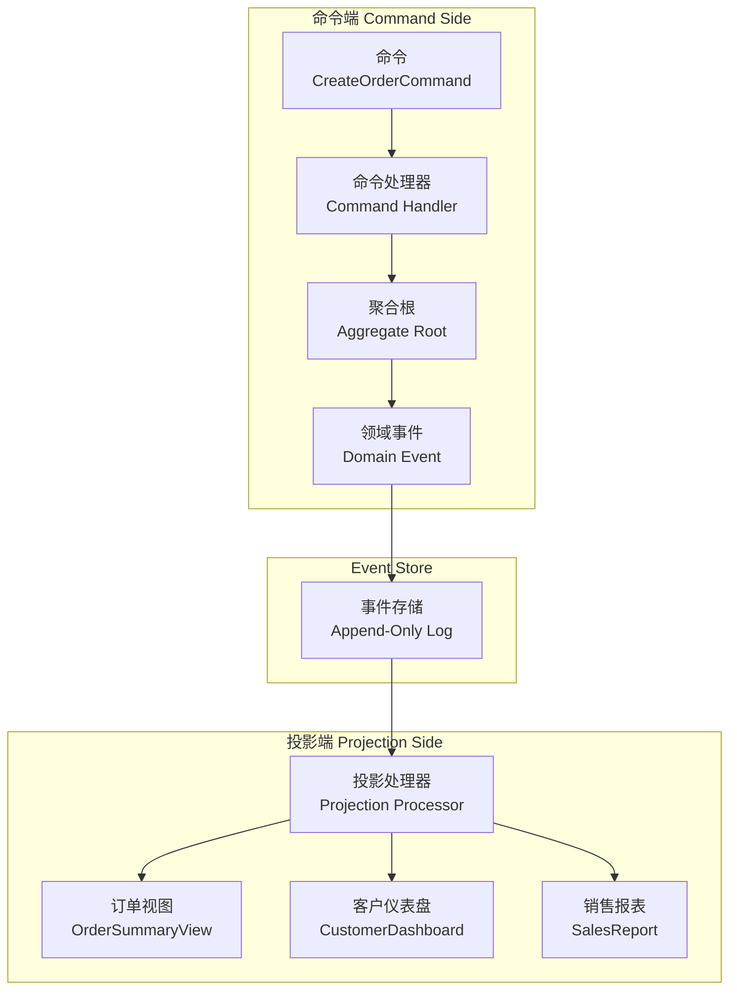

# CQRS + Event Sourcing 组合实战

很多资料提到 CQRS 时会顺便提 Event Sourcing，提到 Event Sourcing 时也会带上 CQRS。两者究竟是什么关系？为什么总是"成对出现"？简单来说，CQRS 是一种架构模式，解决读写分离问题；Event Sourcing 是一种持久化方式，解决状态存储问题。当两者组合时，CQRS 的命令端写入 Event Sourcing 作为单一真相来源，查询端通过投影从事件流构建各种读取视图——这形成了一套完整的数据架构，能解决传统 CRUD 无法应对的复杂场景。

## 组合架构详解

CQRS + ES 组合的核心流程是：命令端接收命令（Command），验证业务规则后生成领域事件（Domain Event），事件被追加到 Event Store；Event Store 中的事件被投影处理器（Projection Processor）消费，构建各种查询视图（Read Model）。



命令端不知道查询端的存在，只负责处理命令、生成事件。查询端通过订阅事件来构建视图，完全独立。这种解耦带来了极大的灵活性：可以随时新增一个投影来满足新的查询需求，不需要修改任何业务逻辑。

## 事件投影的构建过程

投影是将事件转换为查询视图的过程。投影处理器监听 Event Store 中的事件，按顺序重放并更新查询视图。

```java
public class OrderSummaryProjection {
    private final JdbcTemplate jdbcTemplate;
    private final ObjectMapper objectMapper;

    @EventHandler
    public void on(OrderCreatedEvent event) {
        String sql = """
            INSERT INTO order_summary_view
            (order_id, customer_id, customer_name, total_amount, item_count, status, created_at)
            VALUES (?, ?, ?, ?, ?, ?, ?)
            ON DUPLICATE KEY UPDATE
                total_amount = VALUES(total_amount),
                status = VALUES(status),
                updated_at = NOW()
        """;
        jdbcTemplate.update(sql,
            event.getOrderId(),
            event.getCustomerId(),
            event.getCustomerName(),
            event.getTotalAmount(),
            event.getItemCount(),
            event.getStatus().name(),
            event.getOccurredOn()
        );
    }

    @EventHandler
    public void on(OrderPaidEvent event) {
        String sql = """
            UPDATE order_summary_view
            SET status = 'PAID', paid_at = ?, updated_at = NOW()
            WHERE order_id = ?
        """;
        jdbcTemplate.update(sql, event.getOccurredOn(), event.getOrderId());
    }

    @EventHandler
    public void on(OrderCancelledEvent event) {
        String sql = """
            UPDATE order_summary_view
            SET status = 'CANCELLED', cancelled_at = ?, updated_at = NOW()
            WHERE order_id = ?
        """;
        jdbcTemplate.update(sql, event.getOccurredOn(), event.getOrderId());
    }
}
```

投影处理器需要保证幂等性，因为事件可能被重复投递（网络抖动、消息队列重试）。幂等性可以通过"检查再执行"或"唯一约束"来实现。例如：插入订单摘要时使用 `ON DUPLICATE KEY UPDATE`，保证重复插入不会创建重复记录。

## 投影重建：零 Downtime 迁移

当查询视图需要变更时（如增加字段、调整结构），需要重建投影。最理想的方式是零 downtime 迁移——在系统运行期间完成重建，用户无感知。

零 downtime 迁移的步骤：

1. **部署新版本投影处理器**。新旧两个投影处理器同时运行，旧处理器继续消费新事件并更新旧视图，新处理器开始从头重放所有历史事件并构建新视图。

2. **全量重放历史事件**。新处理器从 Event Store 的第一条事件开始重放，直到追上当前时间点。这个过程可能需要几小时甚至几天，取决于历史事件数量。

```java
public class ProjectionRebuilder {
    private final EventStore eventStore;
    private final OrderSummaryProjection newProjection;

    public void rebuild() {
        // 1. 获取所有事件流
        List<String> streamIds = eventStore.getAllStreamIds();

        for (String streamId : streamIds) {
            // 2. 获取该聚合的所有事件
            List<DomainEvent> events = eventStore.getEvents(streamId);

            // 3. 重放每个事件
            for (DomainEvent event : events) {
                newProjection.handle(event);
            }
        }

        // 4. 标记重建完成
        markRebuildComplete();
    }
}
```

3. **灰度切换读取来源**。新视图构建完成后，可以先将 1% 的读取流量切换到新视图，观察无异常后逐步放量。

4. **下线旧版本**。确认所有流量切换到新视图后，下线旧投影处理器和旧视图表。

## 快照策略

如果聚合根的历史事件很多，每次从零重放所有事件会非常慢。快照（Snapshot）是一种优化策略：定期保存聚合根在某个时间点的状态，恢复时先加载最新快照，再从快照之后的第一个事件开始重放。

```java
public class SnapshottingAggregate extends AggregateRoot {
    private static final int SNAPSHOT_INTERVAL = 100; // 每 100 个事件做一次快照

    public void applyEvent(DomainEvent event) {
        super.applyEvent(event);

        // 达到快照间隔，创建快照
        if (this.version % SNAPSHOT_INTERVAL == 0) {
            createSnapshot();
        }
    }

    private void createSnapshot() {
        Snapshot snapshot = new Snapshot(
            this.getClass().getName(),
            this.id,
            this.version,
            this.captureState()
        );
        snapshotStore.save(snapshot);
    }
}

public class AggregateWithSnapshot {
    private final EventStore eventStore;
    private final SnapshotStore snapshotStore;

    public void restore(String aggregateId) {
        // 1. 加载最新快照
        Snapshot latestSnapshot = snapshotStore.getLatest(aggregateId);

        if (latestSnapshot != null) {
            // 2. 恢复快照状态
            this.restoreState(latestSnapshot.getState());
            this.version = latestSnapshot.getVersion();

            // 3. 从快照之后的事件开始重放
            List<DomainEvent> events = eventStore.getEventsSince(aggregateId, this.version);
            for (DomainEvent event : events) {
                apply(event);
            }
        } else {
            // 4. 没有快照，从头重放
            List<DomainEvent> events = eventStore.getEvents(aggregateId);
            for (DomainEvent event : events) {
                apply(event);
            }
        }
    }
}
```

快照频率的选择需要权衡：快照太频繁会占用大量存储，快照太稀疏会导致恢复时间过长。通常建议根据事件数量（如每 100 个事件）和时间间隔（如每小时）两个维度同时判断。

## Axon Framework 实战

Axon Framework 是 Java 生态中最成熟的 CQRS + ES 框架，提供了聚合根生命周期管理、事件发布订阅、投影构建、Saga 编排等开箱即用的功能。

```java
// 定义聚合根
@Aggregate
public class OrderAggregate {
    @AggregateIdentifier
    private String orderId;
    private OrderStatus status;
    private BigDecimal totalAmount;

    @CommandHandler
    public OrderAggregate(CreateOrderCommand command) {
        apply(OrderCreatedEvent.builder()
            .orderId(command.getOrderId())
            .customerId(command.getCustomerId())
            .totalAmount(command.getTotalAmount())
            .build());
    }

    @EventSourcingHandler
    public void on(OrderCreatedEvent event) {
        this.orderId = event.getOrderId();
        this.status = OrderStatus.CREATED;
        this.totalAmount = event.getTotalAmount();
    }

    @CommandHandler
    public void handle(PayOrderCommand command) {
        if (this.status != OrderStatus.CREATED) {
            throw new IllegalStateException("Order cannot be paid in status: " + this.status);
        }
        apply(OrderPaidEvent.builder()
            .orderId(this.orderId)
            .paidAmount(command.getPaidAmount())
            .build());
    }

    @EventSourcingHandler
    public void on(OrderPaidEvent event) {
        this.status = OrderStatus.PAID;
    }
}

// 定义查询处理器
@ProjectionBean
public class OrderSummaryProjection {
    @EventHandler
    public void on(OrderCreatedEvent event) {
        // 构建订单摘要视图
    }

    @QueryHandler
    public OrderSummaryView handle(FindOrderSummaryQuery query) {
        return orderSummaryRepository.findById(query.getOrderId());
    }
}
```

Axon Server 是配套的事件存储和消息中间件，提供了 Event Store、Command Bus、Query Bus 的分布式实现。如果不想自建基础设施，可以直接使用 Axon Server。

关于 CQRS 的详细内容，可参考[CQRS 数据读写分离](/patterns/data-architecture/cqrs-data)；关于 Event Sourcing 的详细内容，可参考[事件溯源（Event Sourcing）详解](/patterns/data-architecture/event-sourcing-deep)。
