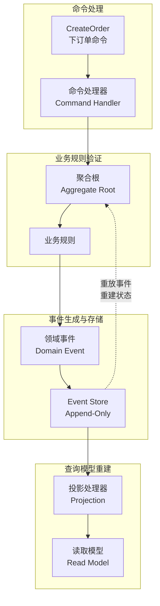
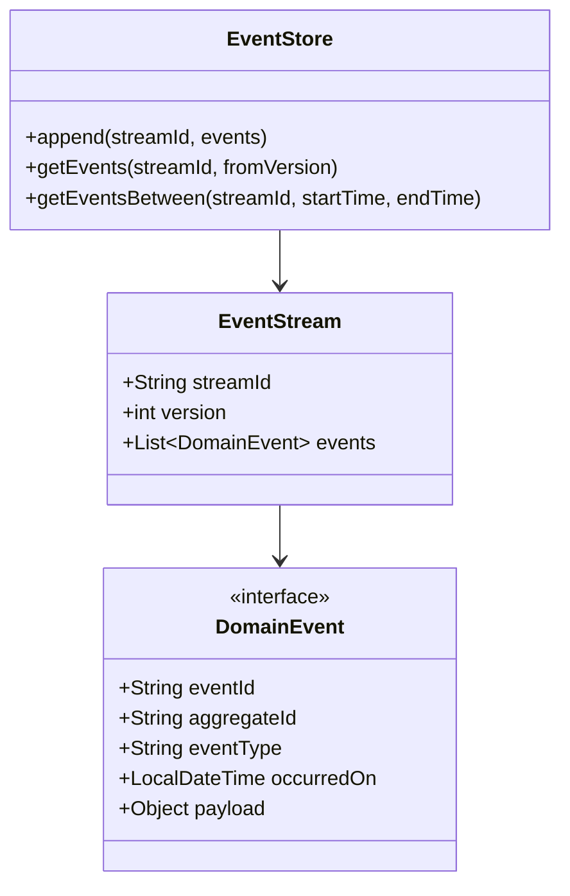

# 事件溯源（Event Sourcing）详解

银行转账系统里，账户余额是 10000 元。但这个数字是怎么来的？是昨天存了 5000，前天取了 2000，上周转入了 7000？光看当前余额，你无法知道资金的流动轨迹。传统的数据库存储方式是"记录当前状态"——只保存余额这个结果，丢失了过程。事件溯源（Event Sourcing）反其道而行之：它不存储账户余额，只存储交易流水；想知道余额，就把所有流水从头到尾累加一遍。听起来效率很低，但在某些场景下，这种"审计日志即数据"的思路，能解决传统方案无法解决的问题。

## 事件溯源完整流程

事件溯源的核心思想是把"状态变化"作为一等公民来存储。每次业务状态发生变化，就产生一个领域事件（Domain Event），这些事件被追加（Append）到事件存储（Event Store）中。查询状态时，通过"重放"（Replay）这些事件来重建当前状态。



完整流程是这样的：用户发起一个命令（如"创建订单"），命令处理器验证命令的合法性，如果验证通过，聚合根生成领域事件（如 `OrderCreatedEvent`），事件被追加到 Event Store。事件存储完成后，触发投影处理器异步构建各种查询视图。查询时，直接从查询视图读取，不需要重放事件。

## Event Store 设计

Event Store 是事件溯源的核心组件，它本质上是一个只追加（Append-Only）的日志存储。与普通数据库的区别在于：它不是存储"当前状态"，而是存储"状态变更序列"。



Event Store 的设计要点包括：

**事件不可变性**：事件一旦写入就不能修改。这是审计日志的本质要求，也是事件溯源的基石。如果业务规则发生变化，需要通过"事件升级"（Upcasting）来处理旧事件，而不是直接修改历史数据。

**乐观并发控制**：每个聚合根有一个版本号（Version），每次状态变更后版本号递增。当重放事件时，如果发现版本号不连续，说明中间有事件丢失，数据不一致。聚合根的版本号同时用于解决并发冲突——两个命令同时修改同一个聚合根，先提交的获胜，后提交的因版本号不匹配被拒绝。

```java
public class EventStore {
    private final JdbcTemplate jdbcTemplate;

    public void append(String streamId, int expectedVersion, List<DomainEvent> events) {
        String sql = """
            INSERT INTO events (stream_id, version, event_type, payload, occurred_on)
            VALUES (?, ?, ?, ?, ?)
        """;

        jdbcTemplate.batchUpdate(sql, new BatchPreparedStatementSetter() {
            @Override
            public void setValues(PreparedStatement ps, int i) throws SQLException {
                DomainEvent event = events.get(i);
                ps.setString(1, streamId);
                ps.setInt(2, expectedVersion + i + 1);
                ps.setString(3, event.getClass().getSimpleName());
                ps.setString(4, objectMapper.writeValueAsString(event));
                ps.setTimestamp(5, Timestamp.valueOf(event.getOccurredOn()));
            }

            @Override
            public int getBatchSize() {
                return events.size();
            }
        });
    }
}

public class AggregateRoot {
    protected String id;
    protected int version;

    protected void apply(DomainEvent event) {
        this.version++;
        // 状态更新逻辑
    }

    public void replay(List<DomainEvent> events) {
        for (DomainEvent event : events) {
            apply(event);
        }
    }
}
```

**事件分块（Snapshots）**：如果聚合根的历史事件很多，每次重建状态都要从头重放所有事件，性能会急剧下降。解决方案是定期创建快照（Snapshot），保存聚合根在某个时间点的状态。恢复时先加载最新的快照，再从快照之后的第一个事件开始重放。

## 投影重建状态

投影（Projection）是从事件流中构建查询视图的过程。每个投影定义了如何将事件转换为查询模型中的一份数据。投影可以随时重新运行（Re-projection），从零构建出全新的查询视图，且不需要修改任何业务逻辑。

```java
public class OrderProjection {
    private final JdbcTemplate jdbcTemplate;

    @EventHandler
    public void on(OrderCreatedEvent event) {
        String sql = """
            INSERT INTO order_read_model (order_id, customer_id, total_amount, status, created_at)
            VALUES (?, ?, ?, ?, ?)
        """;
        jdbcTemplate.update(sql,
            event.getOrderId(),
            event.getCustomerId(),
            event.getTotalAmount(),
            "CREATED",
            event.getOccurredOn()
        );
    }

    @EventHandler
    public void on(OrderPaidEvent event) {
        String sql = """
            UPDATE order_read_model SET status = 'PAID', paid_at = ?
            WHERE order_id = ?
        """;
        jdbcTemplate.update(sql, event.getOccurredOn(), event.getOrderId());
    }

    @EventHandler
    public void on(OrderCancelledEvent event) {
        String sql = """
            UPDATE order_read_model SET status = 'CANCELLED', cancelled_at = ?
            WHERE order_id = ?
        """;
        jdbcTemplate.update(sql, event.getOccurredOn(), event.getOrderId());
    }
}
```

**即时投影 vs 快照**：即时投影（Eager Projection）是指事件处理完成后立即更新查询模型；快照投影（Snapshot Projection）是指先缓存中间结果，积累到一定量后再批量更新。两者各有优劣：即时投影延迟低，但可能产生"部分更新"的中间状态；快照投影可以减少数据库写入次数，但增加了投影处理的复杂度。

**零 downtime 迁移**：当查询模型需要变更（如增加字段、调整结构）时，可以在不停服的情况下重建投影。具体做法是：先部署新投影处理器，同时运行新旧两个投影；旧投影继续处理新事件，新投影从头重放所有历史事件；新投影追上进度后，切换读取来源到新模型；旧投影下线。

## CQRS 组合

事件溯源与 CQRS 是天然搭档。在 CQRS 架构中，命令端写入领域事件，事件存储作为单一真相来源；查询端通过投影构建各种读取视图。两者结合形成了完整的数据架构闭环：命令写入事件，事件驱动投影，投影支撑查询。

这种组合的优势包括：完整的审计追踪（每个状态变更都有记录）、灵活的多视图支持（同一份事件可以投影出不同的查询模型）、轻松实现时间旅行查询（查询任意时间点的状态）。代价是架构复杂度高，事件 Schema 变更需要谨慎处理。

关于 CQRS 的详细内容，可参考[CQRS 数据读写分离](/patterns/data-architecture/cqrs-data)。

## 事件版本升级

随着业务演进，事件的 Payload 结构可能需要变更。例如早期的 `OrderCreatedEvent` 只有 `orderId` 和 `amount`，后来需要增加 `customerId` 和 `shippingAddress`。直接修改历史事件的 Payload 违反了事件不可变性原则——历史事件是不可变的。解决方案是使用 Upcasting（事件升级器）。

```java
// 旧版本事件（已存储）
public class OrderCreatedEventV1 {
    private String orderId;
    private BigDecimal amount;
}

// 新版本事件（业务逻辑使用）
public class OrderCreatedEvent {
    private String orderId;
    private BigDecimal amount;
    private String customerId;
    private ShippingAddress shippingAddress;
}

// 事件升级器：将 V1 升级为当前版本
public class OrderCreatedEventUpcaster extends AbstractUpcaster {
    @Override
    public boolean canUpcast(String typeName, int version) {
        return "OrderCreatedEvent".equals(typeName) && version == 1;
    }

    @Override
    public DomainEvent doUpcast(DomainEvent event) {
        OrderCreatedEventV1 v1 = objectMapper.readValue(event.getPayload(), OrderCreatedEventV1.class);

        OrderCreatedEvent current = new OrderCreatedEvent();
        current.setOrderId(v1.getOrderId());
        current.setAmount(v1.getAmount());
        current.setCustomerId("UNKNOWN"); // 旧数据缺失，设为默认值
        current.setShippingAddress(null);

        return new UpgradedEvent(event, current, 2);
    }
}
```

事件升级器的注册顺序很重要：从旧版本逐步升级到当前版本。如果有 V1、V2、V3 三个版本，升级器链就是 V1→V2→V3。升级器链设计不当可能导致数据丢失或格式错误。

## 事件溯源的优缺点

**优势**：完整的审计追踪，每个状态变更都有记录，支持任意时间点回放和重投影；简化了领域模型，状态变更通过事件表达，聚合根不需要关心如何持久化；天然支持 CQRS，事件直接驱动投影；支持时间旅行查询，可以查看"三个月前的余额是多少"这类历史状态查询；松耦合，事件是接口，发布者和订阅者通过事件通信，互相不直接依赖。

**缺点**：学习曲线陡峭，团队需要理解事件溯源思维方式；事件 Schema 变更需要 Upcasting，增加了维护成本；查询灵活性受限，如果查询需求是临时性的，从事件重放可能很慢；事件存储的容量随时间线性增长，需要归档策略；调试复杂，重放事件来复现问题比直接查看当前状态更困难。

**适用场景**：审计日志要求极高的系统（如金融、订单、财务）、需要完整历史追踪的系统、需要支持时间旅行和状态回放的场景、需要灵活多视图的 CQRS 系统。

**不适用场景**：简单的 CRUD 应用、业务模型不稳定的早期项目、性能要求极高且无法接受事件重放延迟的场景。
