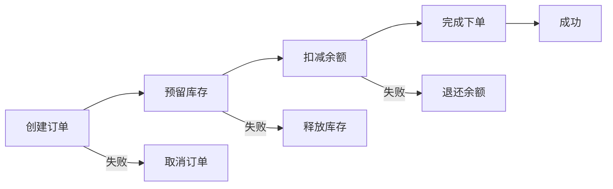
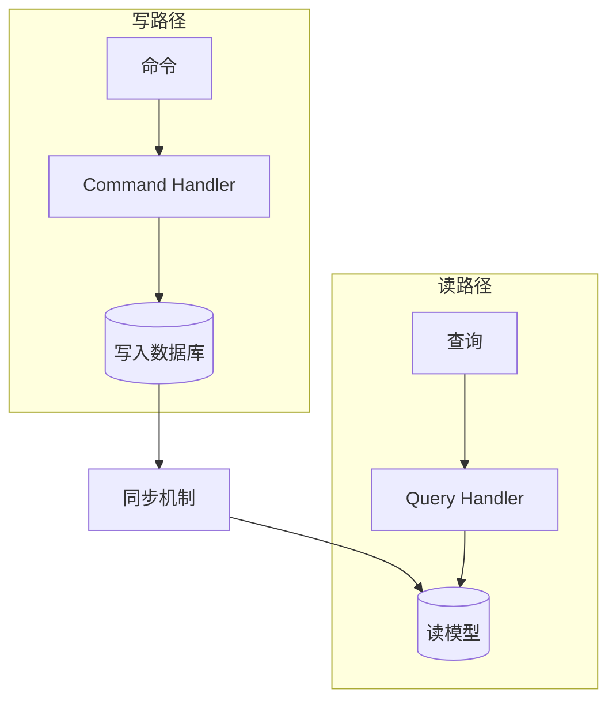
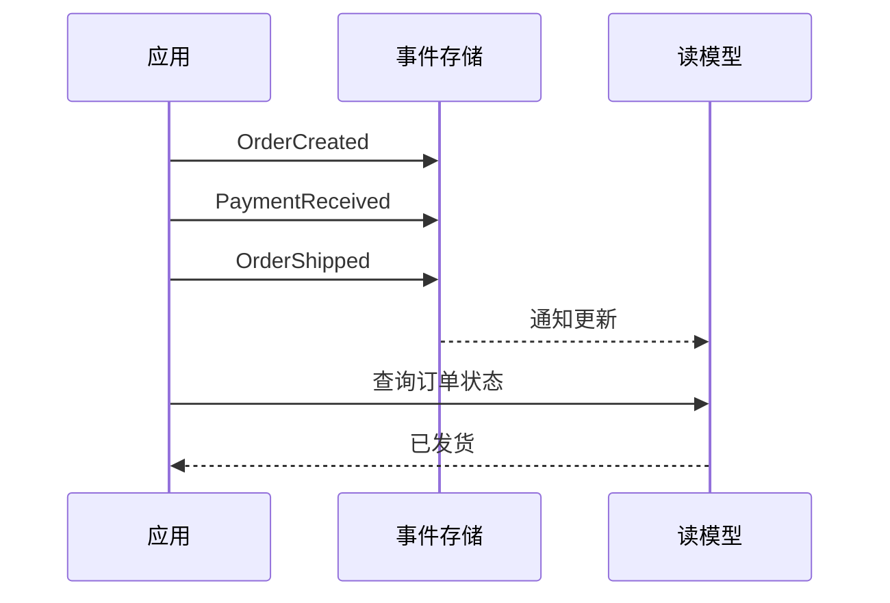
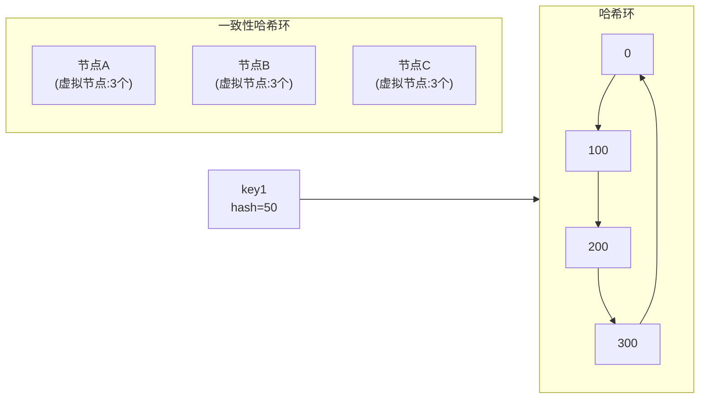

# 数据架构模式

凌晨 2 点，双十一秒杀活动进入倒计时。数据库监控大屏突然闪红——单表 5000 万行的订单数据，因为一次看似简单的「按状态查询订单」操作，索引失效，全表扫描，整个库被打满。应用层加的缓存完全没用，因为业务逻辑绕过了缓存直接查库。

这是数据架构失效最常见的形式：**不是系统挂了，而是数据组织方式撑不住业务复杂度**。

很多团队在应用层投入大量精力——微服务拆分、缓存优化、异步化改造——却忽视了数据架构的设计。导致的结果是：服务拆分很彻底，但数据库成了单点瓶颈；缓存加了十几层，但数据一致性问题层出不穷；系统扩容了 10 倍，但查询还是慢。

数据架构是整个系统的地基。地基不稳，上层建筑再漂亮也会出问题。

## 为什么数据架构需要专门的设计模式

应用代码可以随时重写，但数据是持久化的。一旦业务定型、数据量上来，数据架构的改动成本极高。

数据架构与应用架构的核心区别在于：**数据有状态，有历史，有一致性要求**。应用层可以无状态化，可以水平扩展，但数据库不行——它要保证 ACID，要维护索引，要处理事务。

这也解释了为什么 CAP 定理在数据架构中体现得最为明显：

- **一致性（Consistency）**：所有节点在同一时刻看到相同的数据
- **可用性（Availability）**：每个请求都能收到响应
- **分区容忍性（Partition Tolerance）**：系统能在网络分区的情况下继续运行

分布式数据库必须在 C 和 A 之间做权衡。CP 系统（如 ZooKeeper、etcd）保证一致性，但网络分区时可能拒绝写入；AP 系统（如 Cassandra、DynamoDB）保证可用性，但可能返回过期数据。

理解这一点，是设计数据架构的前提。

## Saga 分布式事务模式

在分布式系统中，跨服务的数据一致性是一个经典难题。两阶段提交（2PC）看似是解决方案，但它有严重的阻塞问题：协调者在提交阶段挂掉，所有参与者只能无限等待。

Saga 模式的核心思想是：用「补偿事务」代替「回滚」。把一个分布式事务拆成多个本地事务，每个步骤都有对应的「补偿动作」。如果第 N 步失败，就按倒序执行第 N-1、N-2...1 的补偿操作。

与 TCC（Try-Confirm-Cancel）相比，Saga 更轻量：TCC 要求每个服务实现 Try、Confirm、Cancel 三个接口，而 Saga 只需要实现正向操作和补偿操作。对于业务逻辑复杂、步骤多的场景，Saga 的实现成本更低。

但 Saga 有个前提：**补偿操作必须是幂等的**。因为网络超时可能导致补偿动作被执行多次。

## 数据读写分离模式

传统的关系型数据库把所有操作放在同一个模型里——增删改查都用同一套表结构。这在小规模场景下没问题，但当读请求是写的 100 倍时，单库就成了瓶颈。

CQRS（Command Query Responsibility Segregation，命令查询职责分离）解决的是读写耦合问题。它的核心思想是：**把写操作（Command）和读操作（Query）分开，使用不同的数据模型**。

写入时，数据进入写模型；读取时，从专门优化的读模型查询。写模型和读模型之间通过事件同步。

这与传统的读写分离有本质区别。读写分离是「同一个库，主备复制」，读写分离的备库数据是主库的镜像；而 CQRS 是「不同的模型，用事件驱动同步」，读模型可以是为查询专门设计的结构，甚至可以放在不同的存储引擎里。

## 事件溯源（Event Sourcing）

传统 CRUD 的问题是：**只有当前状态，没有历史**。用户修改了订单 10 次，你只知道最终状态是「已发货」，但不知道它经历了什么过程。

Event Sourcing 的核心思想是：**存储的是事件，而不是状态**。每次状态变化，都记录一个不可变的事件。查询时，通过重放事件计算当前状态。

与 CRUD 对比：

| 维度 | CRUD | Event Sourcing |
|---|---|---|
| 存储内容 | 当前状态 | 完整事件历史 |
| 审计能力 | 需要额外表 | 原生支持 |
| 时间回溯 | 困难 | 通过重放事件轻松实现 |
| 查询性能 | 即时 | 需要投影计算 |
| 存储成本 | 低 | 高（但可压缩归档） |

CQRS 和 Event Sourcing 经常一起使用：Event Sourcing 提供事件流，CQRS 根据需要构建不同的读模型投影。Event Store（如 EventStoreDB）是专门为 Event Sourcing 设计的数据库。

## 数据分片与复制

当单表数据量超过 5000 万行，索引维护成本急剧上升，即使加了缓存也扛不住。此时需要从数据层解决——分片。

### Sharding 分片模式

分片的核心思想是：**把数据分散到多个节点，每个节点只负责一部分数据**。

分片策略有两种主要方式：

- **范围分片**：按 ID 区间或时间范围划分。优点是范围查询高效，缺点是容易产生热点
- **哈希分片**：通过哈希函数决定数据落在哪个分片。优点是数据分布均匀，缺点是范围查询低效

一致性哈希是一种改进：数据不落在固定分片上，而是落在一个哈希环上。增加节点时，只需要迁移环上的一小段数据，而不是重新分配所有数据。

### 数据复制模式

复制解决了两个问题：**高可用和数据冗余**。

- **主从复制**：一个主库写，多个从库读。从库异步同步，可能有少量延迟。优点是实现简单，缺点是主库挂了需要人工介入
- **多主复制**：多个节点都可以写，通过复制协议同步。优点是无单点，缺点是冲突处理复杂
- **无主复制**：客户端直接写入多个节点，Quorum 机制保证一致性。Cassandra 使用这种模式

## 高级数据架构模式

### 数据归档与清理模式

业务数据不是越久越有价值。过期的历史数据占用存储，增加查询成本，甚至影响索引效率。

数据归档模式的核心是：**定期把冷数据迁移到归档存储（对象存储、数据湖），主库只保留热数据**。

常见策略：

- 时间归档：订单超过 1 年自动归档到对象存储
-容量归档：当表数据量超过阈值时，按时间顺序归档最早的数据
- 访问频率归档：统计每个分区的访问频率，长期无访问的分区归档

归档后，主库的查询范围缩小，索引效率提升，存储成本降低。

### 多租户数据架构

SaaS 系统中，多个租户共享同一套基础设施，但需要保证数据隔离。

隔离策略的选择：

- **独立数据库**：每个租户独立数据库实例。隔离性最强，但成本高，适合大客户
- **共享数据库，独立 Schema**：同一数据库，不同 Schema。平衡成本与隔离性
- **共享 Schema**：同一 Schema，通过 tenant_id 字段区分。成本最低，但隔离性最弱

选择取决于合规要求、数据量、租户规模。

### 数据版本化模式

业务逻辑变更时，数据模型也需要演进。数据版本化解决的是：**如何让数据库 schema 变更不停服、不丢数据**。

常见策略：

- **蓝绿部署**：两套数据库，新旧系统并行，通过路由切换
- **膨胀策略**：不修改旧字段，只添加新字段。兼容旧代码
- **影子表**：新表结构上线后，新旧表同时写入，逐步切换读流量

每种策略都有适用场景，选择时需要考虑变更类型（是否破坏性）、团队运维能力、允许的停机窗口。

### 变更数据捕获（CDC）

CDC（Change Data Capture）监听数据库的变更日志，把增量数据实时同步到下游系统。下游可以是数据仓库、搜索索引、缓存、另一个数据库。

CDC 的价值在于：**解耦生产库与分析/搜索系统**。不用在主库上跑复杂报表，不用在写入链路里加搜索同步逻辑。

常见实现：

- **基于日志**：MySQL 的 binlog、PostgreSQL 的 WAL、MongoDB 的 oplog
- **基于轮询**：定期查询变更时间戳或版本号，适合简单场景
- **第三方工具**：Debezium、Maxwell、Canal

日志-based CDC 是目前的主流方案，性能影响小，不依赖触发器，是生产系统的首选。

## 数据架构选型矩阵

### 一致性要求 vs 架构选择

| 一致性要求 | 推荐模式 | 不推荐模式 |
|---|---|---|
| 强一致性（金融、库存） | 2PC/Saga + 分布式锁 | 最终一致性方案 |
| 最终一致性可接受 | Saga + 补偿、TCC | 强一致分布式事务 |
| 高可用优先 | 多主复制、无主复制 | 单主库 + 从库 |

### 数据规模 vs 分片策略

| 数据规模 | 推荐策略 | 说明 |
|---|---|---|
| `<` 1000 万行 | 不分片，优化索引 | 过早分片增加复杂度 |
| 1000 万 ~ 1 亿行 | 哈希分片（4~16 分片） | 按 shard_key 均匀分布 |
| `>` 1 亿行 | 一致性哈希 + 读写分离 | 需要结合业务特点进一步拆分 |

### 团队能力 vs 模式复杂度

| 团队成熟度 | 推荐模式 | 说明 |
|---|---|---|
| 初创/小团队 | CRUD + 读写分离 | 避免过度设计 |
| 中型团队 | CQRS + 事件同步 | 有能力维护读写模型 |
| 大型团队 | Saga + CDC + 分片 | 需要完整的工程能力支撑 |

> 模式复杂度要与团队能力匹配。再好的架构，如果团队运维不了，也是负担。

## 本章节文章导读

本章节按由浅入深的顺序组织文章。

**入门篇**——先理解基础模式，建立数据架构的基本认知：

- [读写分离模式](/patterns/data-architecture/read-write-split)：最常见的性能优化手段，从主从复制到半同步复制
- [数据复制模式](/patterns/data-architecture/replication)：主从、多主、无主复制三种模式的选择与权衡

**进阶篇**——进入分布式数据架构的核心挑战：

- [Saga 分布式事务模式](/patterns/data-architecture/saga)：跨服务数据一致性问题的完整解决方案
- [CQRS 数据读写分离](/patterns/data-architecture/cqrs-data)：深入理解命令查询职责分离的原理与实现
- [数据分片（Sharding）模式](/patterns/data-architecture/sharding)：分片策略、路由算法、跨分片查询

**高阶篇**——面向复杂业务场景的深度模式：

**专题篇**——面向特定场景的模式选择（待完善）：

建议按顺序阅读，或根据实际遇到的问题选择对应章节。每篇文章都围绕「解决了什么问题」「代价是什么」「什么场景不该用」三个核心问题展开，帮助你建立真正的数据架构判断力。
