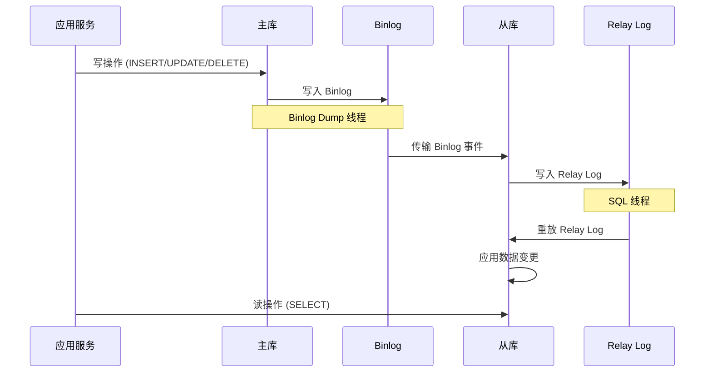

# 读写分离模式

业务高峰期，报表查询把主库 CPU 打满了，影响了核心的订单写入，用户开始投诉下单失败。问题很典型：读写混合，互相影响。解决方案是"读写分离"——主库负责写，从库负责读。写完主库后，通过复制同步到从库，从库承担所有只读查询的压力。这种架构在互联网项目中极为常见，是数据库扩展的第一步。

## 主从复制原理

MySQL 主从复制的核心是 Binlog（Binary Log）。主库执行的所有写操作（INSERT、UPDATE、DELETE）都会记录到 Binlog 中，从库通过 I/O 线程读取主库的 Binlog，然后在本地执行一遍，达到数据同步的目的。



复制涉及三个线程：**Binlog Dump 线程**运行在主库，持续监听 Binlog 变化，有新事件时推送给从库的 I/O 线程；**I/O 线程**运行在从库，连接主库接收 Binlog 事件，写入本地 Relay Log；**SQL 线程**运行在从库，读取 Relay Log 并在本地重放，执行数据变更。

从库默认以只读模式运行（`read_only=ON`），防止应用误操作从库导致数据不一致。`super_read_only=ON` 可以进一步限制拥有 SUPER 权限的用户也只能只读。

## 异步复制 vs 半同步复制 vs 全同步复制

MySQL 支持三种复制模式，区别在于主库等待从库确认的程度不同。

**异步复制**是默认模式。主库执行完事务后，立即返回客户端成功，不等待从库确认。主库故障时，从库可能丢失最后一部分数据。异步复制的延迟从毫秒级到秒级不等，取决于网络条件和从库负载。

异步复制的配置如下：

```sql
-- 主库：启用 Binlog
log-bin = mysql-bin
server-id = 1

-- 从库：配置主库连接
CHANGE MASTER TO
    MASTER_HOST = '主库IP',
    MASTER_USER = 'repl_user',
    MASTER_PASSWORD = 'password',
    MASTER_LOG_FILE = 'mysql-bin.000001',
    MASTER_LOG_POS = 154;

START SLAVE;
```

**半同步复制（Semi-sync Replication）**在主库执行完事务后，等待至少一个从库确认接收到 Binlog 事件，然后返回客户端成功。如果超时未收到确认，退化为异步复制。半同步复制确保至少有一个从库拥有最新数据，但主库故障时仍可能丢失少量数据（如果从库未确认）。

```sql
-- 主库：安装半同步插件并启用
INSTALL PLUGIN rpl_semi_sync_master SONAME 'semisync_master.so';
SET GLOBAL rpl_semi_sync_master_enabled = ON;

-- 从库：安装半同步插件并启用
INSTALL PLUGIN rpl_semi_sync_slave SONAME 'semisync_slave.so';
SET GLOBAL rpl_semi_sync_slave_enabled = ON;
```

**全同步复制（Group Replication）**是 MySQL Group Replication（MGR）提供的模式。主库执行完事务后，等待所有从库确认并应用完成，才返回客户端成功。数据零丢失，但性能损耗最大，适合对一致性要求极高的场景。

## 主从延迟问题与解决方案

主从延迟是读写分离架构的核心问题。从库重放 Relay Log 是单线程的（MySQL 5.7 之前），而主库的并发写可能是多线程的。当主库并发压力大时，从库容易出现延迟积压。

**延迟的典型表现**：用户下单后立即查询订单列表，从从库读取时发现订单不存在——因为主从同步还有延迟。再比如：用户更新了头像，刷新页面后显示的还是旧头像。

**解决方案一：应用层路由控制**。对于需要强一致性的读取（如下单后的订单确认页），强制走主库；对于可以接受延迟的读取（如商品列表、用户资料），走从库。

```java
public class RoutingDataSource extends AbstractRoutingDataSource {
    private static final ThreadLocal<Boolean> forceMaster = new ThreadLocal<>();

    public static void forceMaster() {
        forceMaster.set(true);
    }

    public static void clearForceMaster() {
        forceMaster.remove();
    }

    @Override
    protected Object determineCurrentLookupKey() {
        Boolean force = forceMaster.get();
        if (Boolean.TRUE.equals(force)) {
            return "master";
        }
        return "slave";
    }
}

// 使用示例
public Order getOrder(Long orderId) {
    RoutingDataSource.forceMaster(); // 强一致性读取，走主库
    try {
        return orderRepository.findById(orderId);
    } finally {
        RoutingDataSource.clearForceMaster();
    }
}
```

**解决方案二：延迟感知**。应用层记录主库的最新更新时间，读取时对比从库的延迟，如果超过阈值则走主库。MySQL 可以通过 `SHOW SLAVE STATUS` 获取从库延迟（`Seconds_Behind_Master`）。

**解决方案三：并行复制**。MySQL 5.7 引入了基于库（Schema）的并行复制（`slave_parallel_workers`），MySQL 8.0 引入了基于 LOGICAL_CLOCK 的并行复制，允许同一事务内的多个语句并行重放，大幅提升从库回放速度。

## 读写分离中间件

**MySQL Router**是 MySQL 官方提供的轻量级中间件，支持读写分离和故障转移。它作为 MySQL 服务器的代理，将写请求路由到主库，读请求负载均衡到从库。配置简单，适合中小型项目。

```ini
[router]
bind_address = 0.0.0.0
bind_port = 6446
routing_strategy = round-robin

[metadata_cache]
metadata_cache_cluster = myCluster
user = mysql_router_user
password = password
ttl = 5
```

**ShardingSphere**的读写分离功能支持多主多从配置、事务内读写强制主库、负载均衡策略配置（随机、轮询、权重）。如果项目已经使用 ShardingSphere 做分片，读写分离可以无缝集成。

## 读写分离 vs CQRS

读写分离和 CQRS 都解决"读写混合"的问题，但侧重点不同。

| 维度 | 读写分离 | CQRS |
| --- | --- | --- |
| 数据模型 | 同一套 | 独立设计 |
| 数据同步 | 主从复制 | 事件驱动/CDC |
| 一致性 | 最终一致（可能延迟） | 最终一致 |
| 适用场景 | 读多写少、模型差异不大 | 读写模型差异大、需要多视图 |

读写分离适合读写比例不均但模型差异不大的场景，实现简单，无需引入额外的同步机制。CQRS 适合读写模型差异大、需要独立优化的场景，如电商详情页需要聚合多表数据，但下单只需操作订单表。

关于 CQRS 的详细内容，可参考[CQRS 数据读写分离](/patterns/data-architecture/cqrs-data)。
