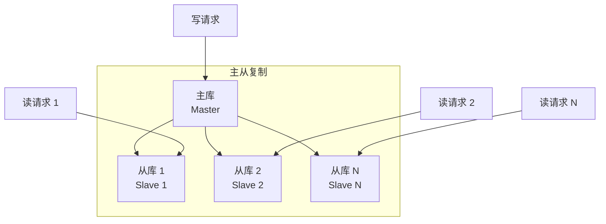
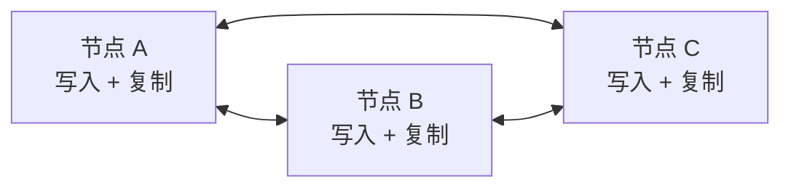

# 数据复制模式（主从/多主/无主）

高可用数据库集群如何保证数据不丢失？一个节点挂了，另一个节点顶上，数据不能有任何丢失。这就需要数据复制——将数据在多个节点间同步。数据复制有三种主要模式：主从复制（Single-Master）、主主复制（Multi-Master）和无主复制（Masterless）。不同的复制模式决定了数据一致性级别、写入冲突处理方式和系统可用性。

## 主从复制

主从复制是最常见的复制模式。一个主节点（Master）处理所有写操作，多个从节点（Slave）通过复制同步数据，提供只读服务。



主从复制的优势是架构简单、故障转移清晰（从库升级为主库）。缺点是写入无法扩展（所有写都到主库）、主库故障可能导致数据丢失（如果采用异步复制）。

## 主主复制

主主复制允许两个或多个节点同时处理写操作，彼此通过复制同步数据。每个节点既是主库也是从库。



主主复制的优势是写入可以水平扩展、任意节点都可以处理写请求。缺点是写入冲突问题——两个节点同时修改同一条记录，以哪个为准？MySQL 的主主复制不支持自动冲突解决，需要业务层处理（如最后写入胜出）。

主主复制的另一个问题是自增 ID 冲突。如果两个节点都使用自增主键，需要配置不同的自增步长（如节点 A 用奇数、节点 B 用偶数），或者使用分布式 ID 生成方案（如雪花算法）。

```sql
-- 节点 A：auto_increment_offset = 1, auto_increment_increment = 2
SET GLOBAL auto_increment_offset = 1;
SET GLOBAL auto_increment_increment = 2;

-- 节点 B：auto_increment_offset = 2, auto_increment_increment = 2
SET GLOBAL auto_increment_offset = 2;
SET GLOBAL auto_increment_increment = 2;
```

主主复制适用于"双活"场景——两个机房各自处理本地的写请求，本质上是通过主主复制做数据同步。但双活场景的写入冲突处理非常复杂，通常需要结合数据路由（按用户/地区划分写入节点）来减少冲突。

## 无主复制

无主复制（Masterless / Dynamo-style Replication）没有固定的主节点，数据通过 Quorum 机制在多个节点间同步写入。Cassandra 和 DynamoDB 是这种模式的典型代表。

```mermaid
flowchart TB
    subgraph 无主复制
        N1["节点 1"]
        N2["节点 2"]
        N3["节点 3"]
        N4["节点 4"]
        N5["节点 5"]
    end

    Client["客户端"] --> N1
    Client --> N3
    Client --> N5

    Note over Client,N5: Quorum Write: W=3
    Note over Client,N5: Quorum Read: R=3
```

写入时，客户端将数据写入多个节点，只要收到足够数量的确认即认为写入成功。读取时，客户端从多个节点读取数据，取最新版本。

无主复制的优势是去中心化，没有单点故障、写入可水平扩展。缺点是数据一致性需要通过 Quorum 机制保证，一致性和性能的平衡需要仔细配置。

## Quorum 机制

Quorum 机制是理解无主复制的核心。三个参数 N、W、R 定义了复制行为：

- **N（Replication Factor）**：数据的副本总数
- **W（Write Quorum）**：写入成功需要的确认节点数
- **R（Read Quorum）**：读取成功需要的节点数

一致性保证的条件是：`W + R > N`。这意味着写入和读取的节点集合一定有交集，读到的数据一定包含最新写入。

```java
public class QuorumConfig {
    // 5 个副本
    private int n = 5;
    // 写入需要 3 个节点确认
    private int w = 3;
    // 读取需要 3 个节点返回
    private int r = 3;

    public boolean isConsistent() {
        return w + r > n; // 3 + 3 > 5，满足
    }
}
```

常见的配置组合：`N=3, W=2, R=2`——写入快（只需 2/3 确认），读取需要合并两个版本；`N=3, W=3, R=1`——写入慢（需全部确认），读取快（只需 1 个节点）；`N=3, W=1, R=3`——写入快，读取慢，读取保证强一致。

实际应用中，需要在性能和一致性之间做权衡。如果业务对写入延迟敏感，选择 W 较小的配置；如果业务对读取一致性要求高，选择 R 较大的配置。

## 冲突解决策略

无主复制和主主复制都可能遇到写入冲突。同一份数据在多个节点被同时修改，以哪个为准？常见策略包括：

**最后写入胜出（Last Write Wins, LWW）**：每个写入携带时间戳，保留时间戳最新的写入。这是最简单的策略，但可能导致数据丢失——后写入的数据覆盖了先写入的业务含义。

```java
public class LWWResolver {
    public String resolve(String existing, String candidate) {
        LocalDateTime existingTime = parseTimestamp(existing);
        LocalDateTime candidateTime = parseTimestamp(candidate);
        return candidateTime.isAfter(existingTime) ? candidate : existing;
    }
}
```

**向量时钟（Vector Clock）**：记录每个版本被哪些节点修改过，通过比较向量时钟判断版本之间的因果关系。如果两个版本没有因果关系（并发修改），需要业务层介入解决冲突。

```java
public class VectorClock {
    private Map<String, Long> clock = new HashMap<>();

    public void increment(String nodeId) {
        long version = clock.getOrDefault(nodeId, 0L) + 1;
        clock.put(nodeId, version);
    }

    public boolean happenedBefore(VectorClock other) {
        for (String nodeId : clock.keySet()) {
            long thisVersion = this.clock.get(nodeId);
            long otherVersion = other.clock.getOrDefault(nodeId, 0L);
            if (thisVersion > otherVersion) {
                return false;
            }
        }
        return true;
    }

    public boolean isConcurrent(VectorClock other) {
        return !this.happenedBefore(other) && !other.happenedBefore(this);
    }
}
```

**业务层冲突解决**：根据业务语义设计冲突解决逻辑。例如：库存扣减取最小值（两个节点都扣了库存，总库存不能多加）、计数器取累加值（两个节点都加了 1，总计数应该是加 2）。

## 一致性级别选择

不同业务场景对一致性要求不同，需要选择合适的复制模式和一致性级别：

**强一致性场景**（如金融转账）：使用同步复制（写入需全部副本确认）、主从复制配合半同步/全同步、主主复制需避免并发写入。

**最终一致性场景**（如社交动态）：使用异步复制、Quorum 配置 W+R `<=` N 允许短暂不一致。

**因果一致性场景**（如评论回复）：需要记录因果关系（通过向量时钟或版本号），确保回复一定在原评论之后。

选择复制模式时，需要综合考虑：数据一致性要求、写入延迟容忍度、系统可用性要求、运维复杂度。没有完美的方案，只有最适合业务场景的方案。
