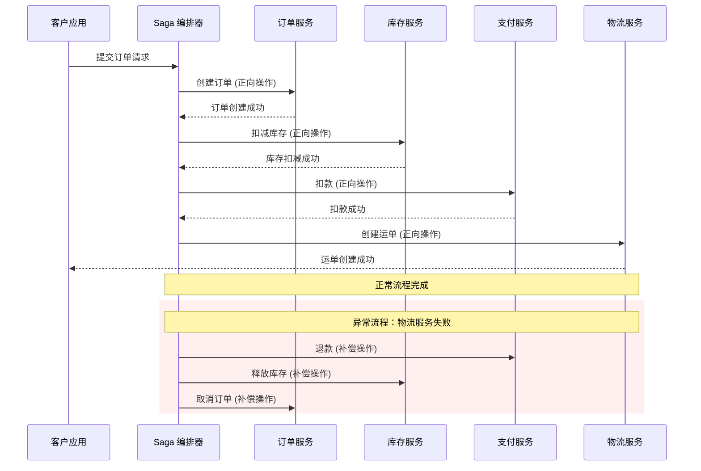
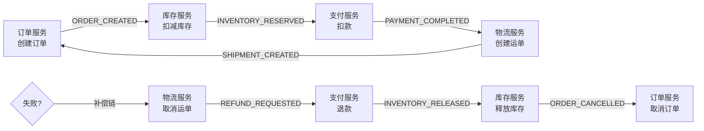
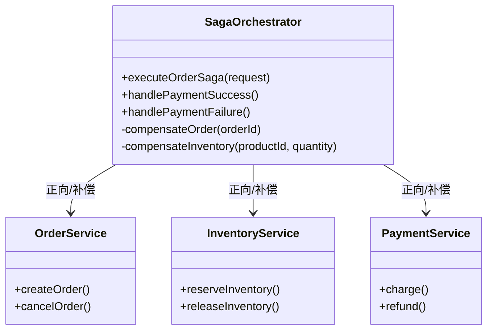

# Saga 分布式事务模式

在微服务架构下，一次业务操作可能涉及多个服务的数据库更新。订单服务要扣库存，支付服务要扣余额，物流服务要创建运单——这三个操作分布在不同的数据库实例上，本地事务完全失效。传统的两阶段提交（2PC）虽然能保证原子性，但存在协调者单点故障、锁定时间过长等问题，在互联网高并发场景下几乎不可用。Saga 模式正是在这个背景下被提出的：它不追求强一致的"一荣俱荣、一损俱损"，而是接受最终一致性，用补偿事务替代回滚，以换取更好的性能和可用性。

## Saga 模式核心思想

Saga 的核心哲学是"正向操作 + 补偿操作"而非"回滚"。每个 Saga 参与者在完成自己的业务操作后，如果后续步骤失败，就执行一次补偿操作来撤销之前的效果。例如：支付失败后，库存服务执行"释放库存"的补偿操作；发货失败后，支付服务执行"退款"的补偿操作。



与 2PC 的核心区别在于：2PC 通过预提交和全局提交/回滚来保证强一致性，而 Saga 通过一系列本地事务 + 补偿事务来保证最终一致性。代价是 Saga 不提供隔离保证，多个 Saga 并发执行时可能出现"部分更新可见"的现象，需要业务层额外处理（如加锁、应用层串行化）。

## 编排式 Saga（Choreography）

编排式 Saga 采用事件驱动架构，每个参与者通过发布和订阅事件来协调。参与者只知道自己的操作和补偿操作，不知道整个流程的全貌。



这种模式的优势是参与者之间松耦合，适合流程简单、参与服务较少的场景。缺点是业务逻辑分散在各个服务中，当流程变复杂时难以追踪整个事务的执行状态，修改一个步骤可能影响多个服务。

编排式 Saga 的实现通常基于消息队列（如 RabbitMQ、RocketMQ），每个服务订阅自己关心的事件，执行后发布下一个事件。需要注意的是，每个参与者必须实现幂等性，因为事件可能被重复投递。

## 编排式 Saga（Orchestration）

编排式 Saga 引入一个中央协调者（Orchestrator）来控制整个事务的执行流程。协调者知道完整的业务步骤，负责调用各个参与者，收集结果，并决定执行补偿还是继续下一步。



编排式 Saga 的优势是业务逻辑集中，便于调试和监控，流程变更只需修改协调者。缺点是协调者可能成为单点故障，需要自身具备高可用设计。

```java
public class OrderSagaOrchestrator {
    private final OrderService orderService;
    private final InventoryService inventoryService;
    private final PaymentService paymentService;

    public OrderResult executeOrderSaga(OrderRequest request) {
        // 1. 创建订单
        Order order = orderService.createOrder(request);
        try {
            // 2. 扣减库存
            inventoryService.reserveInventory(request.getProductId(), request.getQuantity());
            try {
                // 3. 扣款
                paymentService.charge(request.getUserId(), request.getAmount());
                try {
                    // 4. 创建运单
                   物流服务.createShipment(order.getId());
                    return OrderResult.success(order);
                } catch (ShipmentException e) {
                    // 补偿：退款
                    paymentService.refund(request.getUserId(), request.getAmount());
                    throw e;
                }
            } catch (PaymentException e) {
                // 补偿：释放库存
                inventoryService.releaseInventory(request.getProductId(), request.getQuantity());
                throw e;
            }
        } catch (Exception e) {
            // 补偿：取消订单
            orderService.cancelOrder(order.getId());
            throw new SagaExecutionFailedException("Order saga failed", e);
        }
    }
}
```

## Saga vs 2PC vs TCC

| 维度 | Saga | 2PC | TCC |
| --- | --- | --- | --- |
| 一致性模型 | 最终一致性 | 强一致性 | 最终一致性 |
| 协调方式 | 本地事务 + 补偿 | 统一提交/回滚 | Try-Confirm-Cancel |
| 性能 | 高（无全局锁） | 低（两阶段锁定） | 中（两阶段但无锁） |
| 适用场景 | 长事务、跨服务 | 短事务、同库 | 中等复杂度 |
| 隔离性 | 无（需业务层处理） | 有 | 有 |
| 实现复杂度 | 中（需补偿逻辑） | 低（数据库原生） | 高（三接口设计） |

2PC 的优势在于强一致性，但全局锁导致性能急剧下降，且协调者故障会阻塞整个事务。TCC（Try-Confirm-Cancel）将补偿逻辑显式化为三个阶段，性能和隔离性介于 Saga 和 2PC 之间，但业务侵入性最强——每个业务操作都需要实现 Try、Confirm、Cancel 三个接口。

Saga 适合长活事务（Long-Running Transaction），因为它不持有锁，不会因为一个步骤的延迟导致整个系统阻塞。但 Saga 不提供隔离保证，如果业务需要"多步操作对外部不可见"，需要额外加锁（如悲观锁、乐观锁版本控制）。

## Saga 异常处理

Saga 失败的场景比本地事务复杂得多，主要包括三类异常：

**参与者超时**：协调者发出调用后未收到响应，可能是参与者处理太慢、网络丢包、参与者崩溃。解决方案是实现超时检测 + 重试机制，但必须确保参与者的幂等性。

**参与者业务失败**：参与者本地执行成功，但返回的业务结果是失败（如库存不足）。这属于正常失败，协调者直接触发后续补偿。

**协调者崩溃**：协调者在执行过程中崩溃，已执行的部分 Saga 状态丢失。这是最危险的场景，解决方法是引入 Saga 日志（持久化存储Saga 执行状态）和持久化消息队列。

```java
public class PersistentSagaState {
    private String sagaId;
    private SagaState state; // PENDING, IN_PROGRESS, COMPLETED, COMPENSATING, FAILED
    private List<SagaStep> completedSteps; // 已完成步骤的补偿信息
    private LocalDateTime createdAt;
    private LocalDateTime updatedAt;
}

public class SagaWithRecovery {
    private final SagaLog sagaLog;
    private final OrderService orderService;
    private final InventoryService inventoryService;

    public void executeSaga(OrderRequest request) {
        String sagaId = UUID.randomUUID().toString();

        try {
            // 持久化 Saga 状态
            sagaLog.logSagaStarted(sagaId, request);

            // 执行步骤并记录
            Order order = orderService.createOrder(request);
            sagaLog.logStepCompleted(sagaId, "createOrder", order);

            inventoryService.reserveInventory(request.getProductId(), request.getQuantity());
            sagaLog.logStepCompleted(sagaId, "reserveInventory", null);

            sagaLog.logSagaCompleted(sagaId);
        } catch (Exception e) {
            // 崩溃恢复时重新加载并执行补偿
            sagaLog.logSagaFailed(sagaId, e.getMessage());
            recoverAndCompensate(sagaId);
        }
    }

    private void recoverAndCompensate(String sagaId) {
        List<SagaStep> completedSteps = sagaLog.getCompletedSteps(sagaId);
        // 逆序执行补偿
        for (int i = completedSteps.size() - 1; i >= 0; i--) {
            SagaStep step = completedSteps.get(i);
            compensateStep(step);
        }
    }
}
```

幂等性是 Saga 设计的核心原则。由于网络重试、消息重复消费等场景，同一个操作可能被执行多次。参与者必须能够识别重复请求并返回相同结果。常见的幂等实现方式包括：

基于唯一请求 ID（每次 Saga 启动时生成全局唯一 ID，参与者用这个 ID 做去重）、基于数据库唯一约束（将请求 ID 写入数据库，利用唯一索引防止重复）、基于乐观锁版本号（更新操作携带版本号，数据库层面保证只执行一次）。

## 适用场景与不适用场景

**Saga 适合的场景**：长活事务（如订单履约、供应链流程）、跨服务边界的业务流程、追求高可用而愿意牺牲强一致性的场景、需要高并发且不能长时间锁定资源的场景。

**Saga 不适合的场景**：需要强一致性保证的业务（如金融转账）、短事务但对隔离性要求极高的场景、业务逻辑简单但需要强一致性的场景。

选择 Saga 还是其他分布式事务方案，本质上是在"一致性强度"和"系统性能/可用性"之间做权衡。如果业务能够接受数据短暂的不一致，Saga 是性价比最高的选择；如果业务对一致性有严格要求，需要引入分布式事务，但也要接受相应的性能代价。
