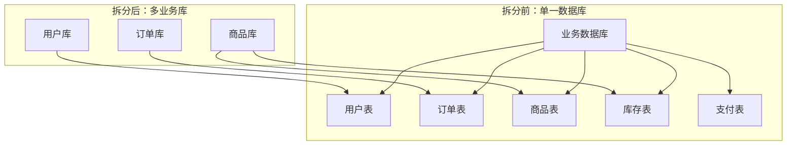
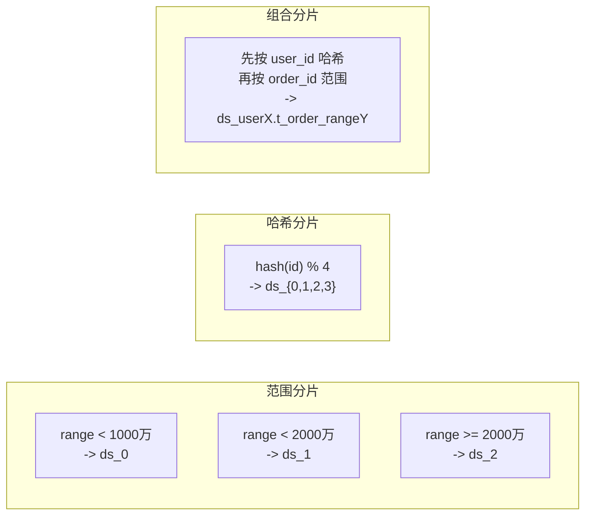

# 数据库分库分表

业务快速增长，单库每秒快扛不住 2000 QPS 了。DBA 说可以扩容，但主库的磁盘已经用掉了 80%，单库容量眼看着要触顶。增加从库可以分担读压力，但写压力还在主库；加缓存可以扛大部分读，但写不进去缓存。数据分片的核心思路是：把数据分散到多个数据库实例，让每个实例只负责一部分数据的读写。单表数据量太大就分表，单库连接数不够就分库，分库分表是水平拆分的一体两面。

## 分库分表的动机与代价

分库分表不是银弹，它解决的是单机数据库的容量和性能上限问题。在动手之前，需要明确动机：是因为数据量太大（单表超过 5000 万行）、还是并发量太高（每秒连接数逼近上限）、还是两者都有？不同的动机对应不同的拆分策略。

分库分表带来的代价包括：架构复杂度大幅提升，跨分片查询需要 Scatter-Gather、分布式事务需要引入 Saga 或 2PC、运维复杂度增加（多套数据库实例的部署、监控、备份）、数据迁移和扩容成本高。正确的做法是先尝试其他方案（读写分离、缓存、优化 SQL），确认瓶颈后再启动分库分表。

## 垂直拆分

垂直拆分有两种维度：按业务拆分和按字段拆分。

**按业务垂直拆分**是指按业务边界将一个大库拆分为多个小库。例如将"用户中心"相关的表（用户、角色、权限、登录日志）拆到一个库，将"交易中心"相关的表（订单、支付、退款）拆到另一个库。



按业务拆分的优势是边界清晰，不同业务的数据隔离良好，单个业务的故障不会影响其他业务。缺点是跨库 JOIN 变得困难，需要通过 API 层聚合或数据冗余解决。

**按字段垂直拆分**是指将大表按字段冷热拆分。例如用户表有 50 个字段，其中"身高、体重、兴趣标签"等扩展字段查询频率很低，可以拆到一张"用户扩展表"中，主表只保留核心字段。还可以将大字段（BLOB、TEXT）单独存储，通过 ID 关联查询。

```sql
-- 主表：核心字段，高频查询
CREATE TABLE user (
    id BIGINT PRIMARY KEY,
    username VARCHAR(50),
    email VARCHAR(100),
    phone VARCHAR(20),
    created_at TIMESTAMP,
    updated_at TIMESTAMP
);

-- 扩展表：大字段、低频字段
CREATE TABLE user_profile (
    user_id BIGINT PRIMARY KEY,
    avatar_url VARCHAR(500),
    bio TEXT,
    interests JSON,
    -- 大字段单独存储
    resume BLOB
);
```

垂直拆分实施相对简单，改造量较小，是分库分表的第一步。但垂直拆分不能解决单表数据量过大的问题，最终还是需要水平拆分。

## 水平拆分

水平拆分是指将同一张表的数据按某个维度分散到多个节点。按主键范围拆分或按哈希拆分是两种常见策略。

**按主键范围拆分**根据主键 ID 的范围来决定数据归属。例如 ID 1-1000 万去库 0，1000-2000 万去库 1。



按主键范围拆分的优势是扩容简单，只需调整范围边界或增加新节点。缺点是容易产生热点——新数据集中在最新的节点，可能导致某个节点压力过大。

**按哈希拆分**根据哈希算法决定数据归属。例如 `hash(user_id) % 4`。

按哈希拆分的优势是数据分布均匀，适合随机读写。缺点是范围查询困难，扩容时需要重新哈希导致大量数据迁移。一致性哈希可以缓解扩容迁移问题，但不能完全消除。

**按时间拆分**是按主键范围拆分的变种，特别适合时序数据。例如按月份拆分订单表，每月一张分表 `t_order_202601`。

按时间拆分的优势是数据清理方便（直接删除旧表）、范围查询效率高（直接定位到特定时间范围的分表）。缺点是可能导致冷热不均（近期数据访问频繁，历史数据几乎不访问）。

## 数据迁移策略

分库分表的核心难题不是拆分本身，而是如何把历史数据从单库迁移到多库，并且保证业务不中断。推荐的分阶段迁移策略：

**阶段一：双写阶段**。在应用层同时写入新旧两个数据库，老库继续提供读写服务，新库记录变更但不提供服务。双写阶段持续一段时间（通常一周到一个月），对比新老库的数据一致性。

**阶段二：历史数据迁移**。将老库的历史数据导出，按新分片规则分发到新库各节点。数据量大时需要分批迁移，避免锁表和主从延迟。

```java
public class DataMigrationJob {
    private final JdbcTemplate sourceJdbc;
    private final JdbcTemplate targetJdbc;
    private final int batchSize = 10000;

    public void migrateOrders() {
        long maxId = getMaxOrderId();
        long offset = 0;

        while (offset < maxId) {
            List<Order> batch = sourceJdbc.query(
                "SELECT * FROM orders WHERE id > ? AND id <= ? ORDER BY id",
                (rs, rowNum) -> mapToOrder(rs),
                offset, offset + batchSize
            );

            // 按新分片规则写入
            for (Order order : batch) {
                String targetDb = determineTargetDb(order.getUserId());
                saveToTarget(order, targetDb);
            }

            offset += batchSize;
        }
    }
}
```

**阶段三：灰度切流**。先切 1% 的流量到新库，观察一周无异常后逐步放量（5%、10%、50%、100%）。灰度期间保留回滚能力，发现问题立即切回老库。

**阶段四：老库下线**。确认所有流量切换到新库后，关闭双写逻辑，下线老库。

## 分库分表后的连表查询

跨分片 JOIN 是分库分表后最棘手的问题。常见解决方案包括：

**应用层聚合**：查询时先在各个分片并行查询，再在应用层合并结果。例如查"用户下的所有订单"，先根据 user_id 找到用户所在的分片，再到该分片查订单。

**字段冗余**：将 JOIN 的字段冗余到同一分片。例如订单表冗余卖家的昵称和头像，查询订单时不需要 JOIN 用户表。

**全局索引表**：单独维护一张"路由表"，记录分片键到分片节点的映射。查询时先查路由表定位分片，再执行查询。

**ES/ClickHouse 异步查询**：对于复杂的分析查询，将数据同步到 Elasticsearch 或 ClickHouse，在这些专门的分析引擎上执行 JOIN 查询。

## 分库分表中间件对比

| 特性 | ShardingSphere | MyCAT | Vitess |
| --- | --- | --- | --- |
| 语言 | Java | Java | Go |
| 架构模式 | JDBC 代理 / 端代理 | MySQL Proxy | Sidecar / Proxy |
| 分片策略 | 哈希、范围、复合 | 哈希、范围 | 范围 |
| 分布式事务 | 支持 Saga / XA | 支持 XA | 支持 XA |
| 社区活跃度 | 活跃（Apache 顶级项目） | 一般 | 活跃（YouTube 出品） |
| 文档完善度 | 完善 | 一般 | 完善 |

选型建议：如果团队偏 Java 技术栈，优先选择 ShardingSphere；如果使用 Vitess 的 Kubernetes 生态，Vitess 是更好的选择。
