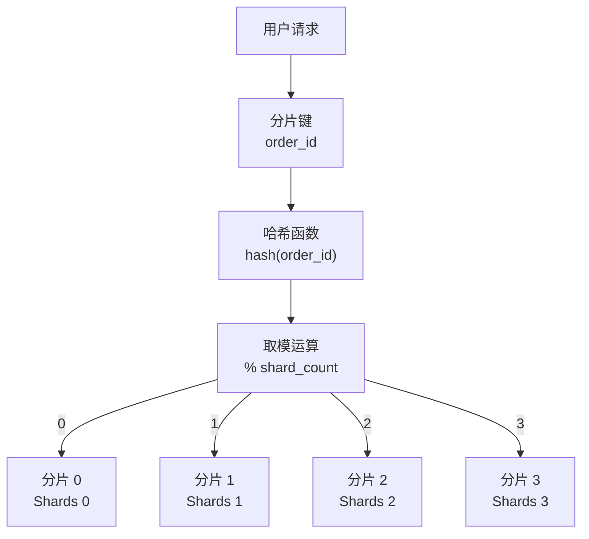

# 数据分片（Sharding）模式

订单表一年破了亿，每天新增几十万条记录。DBA 跑过来告诉你：单表超过 5000 万行，B+ 树的层级变深，查询性能开始明显下降，最慢的一条 SQL 跑了 10 秒。索引优化、SQL 改写、缓存加速——这些手段能治标但不能治本。根本问题是：单机数据库的容量和性能是有上限的，当数据量超过这个上限，必须把数据分散到多个数据库实例上。这就是数据分片（Sharding）要解决的问题：把数据水平拆分到多个节点，每个节点只负责一部分数据的读写，从而突破单机数据库的容量和性能瓶颈。

## 分片策略

分片策略决定了数据如何分布到各个节点。常见的三种策略是哈希分片、范围分片和目录分片。

**哈希分片**根据分片键（Sharding Key）的哈希值来决定数据归属哪个分片。例如 `hash(order_id) % 4`，结果为 0 的去分片 0，结果为 1 的去分片 1，以此类推。



哈希分片的优势是数据分布均匀，适合随机读写场景。缺点是范围查询困难——如果要查"最近一个月的订单"，需要广播到所有分片查询再聚合；还有扩容问题：分片数量变化时，大多数数据需要重新映射，迁移成本高。解决扩容问题的方案是一致性哈希（Consistent Hashing），通过环形哈希空间和虚拟节点，减少扩容时的数据迁移量。

**范围分片**根据分片键的值域范围来决定数据归属。例如 `user_id < 1000000` 去分片 0，`1000000 <= user_id < 2000000` 去分片 1。

范围分片的优势是支持范围查询，查询"ID 在 1000 到 2000 之间的订单"可以直接定位到某个分片；扩容相对简单，只需调整范围边界即可。缺点是可能出现热点问题——如果新用户集中在某个 ID 段，该分片的数据量会明显高于其他分片。

**目录分片**维护一个 Lookup 表，记录分片键到分片节点的映射关系。查询时先查 Lookup 表获取分片节点，再去对应节点查询。

目录分片的优势是灵活性最高，可以根据业务规则自定义数据分布；扩容时可以只修改 Lookup 表，不需要迁移数据。缺点是增加了一层查询开销，Lookup 表本身也需要高可用设计。

```java
public class DirectoryShardingStrategy implements ShardingStrategy {
    private final Map<String, String> lookupTable = new ConcurrentHashMap<>();

    public String getShard(String shardingKey) {
        // 先查 Lookup 表
        String shardId = lookupTable.get(shardingKey);
        if (shardId == null) {
            // 未命中，根据规则计算
            shardId = calculateShard(shardingKey);
            lookupTable.put(shardingKey, shardId);
        }
        return shardId;
    }

    private String calculateShard(String key) {
        // 业务规则：VIP 用户去独立分片
        if (isVipUser(key)) {
            return "shard_vip";
        }
        // 普通用户按哈希分布
        return "shard_" + (Math.abs(key.hashCode()) % 4);
    }
}
```

## 分片键选择原则

分片键的选择直接决定了查询模式和数据分布均匀度，是分片设计中最关键的决策。

**高频查询字段优先**：如果 80% 的查询都是"按用户查订单"，那么 `user_id` 是比 `order_id` 更好的分片键。这样用户相关的订单都在同一个分片，查询性能最优。如果选择了 `order_id` 作为分片键，每次查用户的订单都需要跨分片扫描。

**数据分布均匀**：分片键的值域分布应该尽量均匀，避免出现"一个大分片 + 多个小分片"的极端情况。例如按月份分片在月初和月末数据量差异巨大；按地区分片可能导致经济发达地区的数据量远大于其他地区。

**避免跨分片查询**：跨分片查询（Scatter-Gather）是最影响性能的操作。设计分片键时，应该尽量让高频查询能在单一分片内完成。如果业务确实需要跨分片聚合查询，需要评估是否接受广播查询的性能损耗，或者在应用层做并行查询 + 结果归并。

**避免分片键变更**：分片键确定后很难修改，因为历史数据的分片归属已经确定。如果业务演进导致分片键不再合理，改造成本非常高。设计时需要充分考虑业务发展趋势。

## 分布式 ID 生成

分片后，主键不能再依赖数据库的自增 ID（多个分片自增会冲突）。需要引入分布式 ID 生成方案。

**雪花算法（Snowflake）**是最广泛使用的方案。它通过时间戳 + 机器 ID + 序列号生成 64 位整数，理论上每秒可生成约 400 万个不重复 ID。

```java
public class SnowflakeIdGenerator {
    private final long workerId;
    private final long datacenterId;
    private long sequence = 0L;
    private long lastTimestamp = -1L;

    private static final long EPOCH = 1609459200000L; // 2021-01-01
    private static final long WORKER_ID_BITS = 5L;
    private static final long DATACENTER_ID_BITS = 5L;
    private static final long SEQUENCE_BITS = 12L;

    private static final long MAX_WORKER_ID = ~(-1L << WORKER_ID_BITS);
    private static final long MAX_DATACENTER_ID = ~(-1L << DATACENTER_ID_BITS);

    public SnowflakeIdGenerator(long workerId, long datacenterId) {
        if (workerId > MAX_WORKER_ID || workerId < 0) {
            throw new IllegalArgumentException("worker Id can't be greater than " + MAX_WORKER_ID);
        }
        if (datacenterId > MAX_DATACENTER_ID || datacenterId < 0) {
            throw new IllegalArgumentException("datacenter Id can't be greater than " + MAX_DATACENTER_ID);
        }
        this.workerId = workerId;
        this.datacenterId = datacenterId;
    }

    public synchronized long nextId() {
        long timestamp = timeGen();

        if (timestamp < lastTimestamp) {
            throw new RuntimeException("Clock moved backwards. Refusing to generate id");
        }

        if (lastTimestamp == timestamp) {
            sequence = (sequence + 1) & ((1 << SEQUENCE_BITS) - 1);
            if (sequence == 0) {
                timestamp = tilNextMillis(lastTimestamp);
            }
        } else {
            sequence = 0L;
        }

        lastTimestamp = timestamp;
        return ((timestamp - EPOCH) << (WORKER_ID_BITS + DATACENTER_ID_BITS + SEQUENCE_BITS))
                | (datacenterId << (WORKER_ID_BITS + SEQUENCE_BITS))
                | (workerId << SEQUENCE_BITS)
                | sequence;
    }
}
```

**百度 UIDGenerator**基于雪花算法优化，通过 RingBuffer 预批量生成 ID，减少了锁竞争，支持数据库 ID 段预取。**美团 Leaf**提供两种模式：号段模式（基于数据库批量获取 ID 段）和雪花模式（基于 ZooKeeper 分配 workerId）。

## 分片后的事务问题

本地事务只能在单一数据库实例内生效，分片后跨分片的操作无法保证原子性。这是分片架构的核心挑战之一。

**弱化一致性的方案**：对于大多数互联网业务，可以接受最终一致性。通过消息队列（如 RocketMQ、Kafka）实现可靠消息投递，确保跨分片的操作最终一致。例如扣库存和扣余额分别在两个分片，先扣库存并发送消息，消息消费者负责扣余额；如果扣余额失败，触发补偿操作。

**分布式事务方案**：如果业务对一致性要求极高，可以引入 Saga 或 2PC。但 2PC 在分片场景下性能损耗严重，Saga 是更合理的选择。具体可参考[Saga 分布式事务模式](/patterns/data-architecture/saga)。

**应用层协调**：在应用层实现两阶段提交逻辑：第一阶段向所有分片发送预提交请求，第二阶段根据结果决定全局提交或回滚。这种方案实现复杂且容易出错，仅在特殊场景下使用。

## 分片中间件

ShardingSphere 和 MyCAT 是两个主流的分片中间件。

**ShardingSphere**是一套生态完整的数据库中间件，包括 Sharding-JDBC（JAR 引入，代理模式）和 Sharding-Proxy（独立部署，代理模式）。它支持多种分片策略、分片算法插件化配置、分片后的事务支持（CROSS_SHARD_TRANSACTION），社区活跃，文档完善。

```yaml
spring:
  shardingsphere:
    rules:
      sharding:
        tables:
          t_order:
            actual-data-nodes: ds_${0..1}.t_order_${0..15}
            table-strategy:
              standard:
                sharding-column: order_id
                sharding-algorithm-name: order_inline
            key-generate-strategy:
              column: order_id
              key-generator-name: snowflake
        sharding-algorithms:
          order_inline:
            type: INLINE
            props:
              algorithm-expression: t_order_${order_id % 16}
```

**MyCAT**是早期国产的分片中间件，基于 MySQL Proxy 实现。支持数据分片、读写分离、故障切换等功能。缺点是架构较老，性能和稳定性不如 ShardingSphere，对新特性的支持也较慢。

选型建议：如果团队技术栈偏 Java，ShardingSphere 是首选；如果需要支持异构数据库或多语言环境，可以考虑 MyCAT 或自研分片层。
