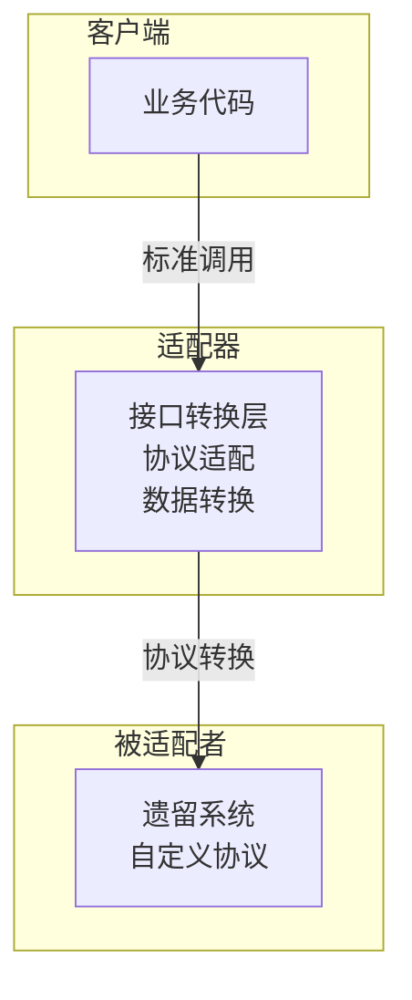
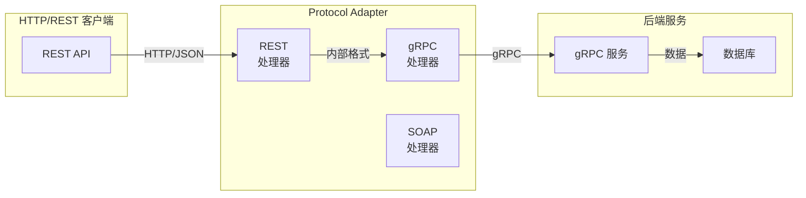
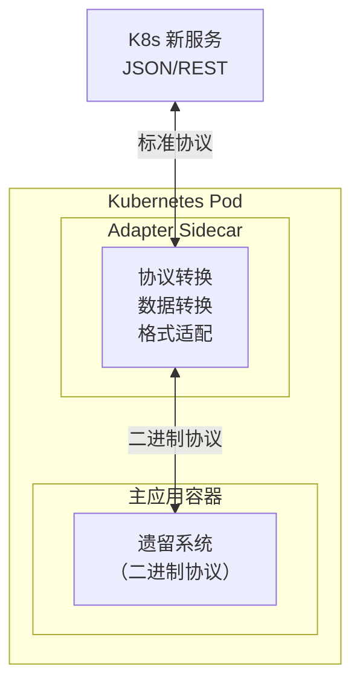
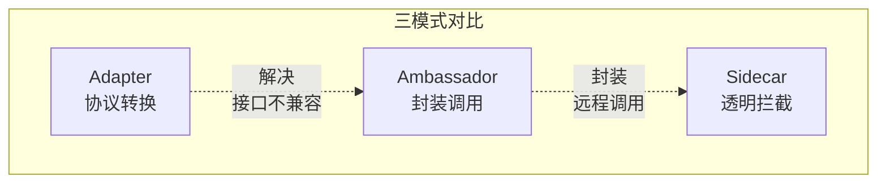

# Adapter 适配器模式

你的团队正在将一个运行了 10 年的单体系统迁移到 Kubernetes。这个老系统使用自定义的 TCP 协议通信，消息格式是公司早年定义的二进制格式，没有任何 REST 接口。当它需要与 Kubernetes 环境中新建的微服务通信时，双方就像说不同语言的人——老系统说「二进制码」，新服务说「JSON」。

怎么办？总不能为了兼容性把 10 年的老代码重写一遍吧。

Adapter 适配器模式正是为这种场景而生：不需要修改老系统，也不要求新服务学习老协议，在中间加一层「翻译官」——适配器——让双方都能用自己熟悉的方式通信。

## 适配器模式的核心思想

适配器模式将一个类的接口转换成客户端期望的另一个接口，使原本由于接口不兼容而无法一起工作的类可以协同工作。



在容器化场景中，适配器通常以 Sidecar 的形式部署在同一个 Pod 中，拦截并转换主应用与外部系统的通信。

## Protocol Adapter：协议互转

### gRPC/HTTP/REST 互转

企业内部常存在多种协议共存的情况：老系统用 SOAP，新系统用 REST，更新的服务用 gRPC。通过 Protocol Adapter 可以实现协议间的透明转换。



### 实现示例

```java
public class HttpToGrpcAdapter {
    private final UserServiceGrpc.UserServiceBlockingStub grpcStub;

    public HttpToGrpcAdapter(ManagedChannel channel) {
        this.grpcStub = UserServiceGrpc.newBlockingStub(channel);
    }

    // REST 接口实现
    @PostMapping("/users")
    public UserResponse createUser(CreateUserRequest request) {
        // 将 REST 请求转换为 gRPC 请求
        GrpcCreateUserRequest grpcRequest = GrpcCreateUserRequest.newBuilder()
            .setName(request.getName())
            .setEmail(request.getEmail())
            .setDepartmentId(request.getDepartmentId())
            .build();

        // 调用 gRPC 服务
        GrpcUserResponse grpcResponse = grpcStub.createUser(grpcRequest);

        // 将 gRPC 响应转换回 REST 格式
        return UserResponse.builder()
            .id(grpcResponse.getId())
            .name(grpcResponse.getName())
            .email(grpcResponse.getEmail())
            .createdAt(Instant.ofEpochSecond(grpcResponse.getCreatedAt()))
            .build();
    }
}
```

## 数据格式适配：JSON/XML/Protobuf 互转

数据格式的不一致是系统集成的另一个痛点。老系统可能使用 XML，新系统使用 JSON，更高性能的场景使用 Protobuf。适配器需要在这几种格式之间自由转换。

```java
public class DataFormatAdapter {
    private final ObjectMapper jsonMapper;
    private final JAXBContext xmlContext;

    public DataFormatAdapter() throws JAXBException {
        this.jsonMapper = new ObjectMapper();
        this.jsonMapper.registerModule(new JavaTimeModule());
        this.xmlContext = JAXBContext.newInstance(LegacyXmlEntity.class);
    }

    // XML 转 JSON
    public String xmlToJson(String xmlPayload) throws Exception {
        StringReader reader = new StringReader(xmlPayload);
        LegacyXmlEntity entity = (LegacyXmlEntity) xmlContext.createUnmarshaller()
            .unmarshal(reader);

        ModernJsonEntity modernEntity = ModernJsonEntity.builder()
            .id(entity.getId())
            .name(entity.getFullName())
            .status(entity.getState())
            .metadata(entity.getExtendedInfo())
            .build();

        return jsonMapper.writeValueAsString(modernEntity);
    }

    // JSON 转 Protobuf
    public byte[] jsonToProtobuf(String jsonPayload) throws Exception {
        ModernJsonEntity jsonEntity = jsonMapper.readValue(jsonPayload, ModernJsonEntity.class);

        ProtobufEntity protoEntity = ProtobufEntity.newBuilder()
            .setId(jsonEntity.getId())
            .setName(jsonEntity.getName())
            .setStatus(jsonEntity.getStatus())
            .putAllMetadata(jsonEntity.getMetadata())
            .build();

        return protoEntity.toByteArray();
    }
}
```

## 容器适配器模式：Sidecar 适配器

在 Kubernetes 环境中，适配器常以 Sidecar 的形式部署。这种模式充分利用了 Sidecar 的优势：与主应用解耦、独立升级、语言无关。



### Kubernetes Adapter Sidecar 实现

```java
public class ProtocolAdapterSidecar {
    private final Server grpcServer;
    private final BinaryProtocolClient legacyClient;
    private final int listenPort;

    public ProtocolAdapterSidecar(String legacyHost, int legacyPort) {
        // 连接遗留系统的二进制协议
        this.legacyClient = new BinaryProtocolClient(legacyHost, legacyPort);

        // 启动 gRPC 服务监听
        this.grpcServer = NettyServerBuilder.forPort(listenPort)
            .addService(new AdapterServiceImpl())
            .build();
    }

    private class AdapterServiceImpl extends AdapterServiceGrpc.AdapterServiceImplBase {
        @Override
        public void getUser(GetUserRequest request, StreamObserver<UserResponse> observer) {
            try {
                // 1. 将 gRPC 请求转换为二进制协议
                byte[] binaryRequest = legacyClient.marshal(
                    "GET_USER",
                    request.getUserId()
                );

                // 2. 调用遗留系统
                byte[] binaryResponse = legacyClient.send(binaryRequest);

                // 3. 将二进制响应转换为 gRPC 响应
                UserResponse response = legacyClient.unmarshalUser(binaryResponse);

                observer.onNext(response);
                observer.onCompleted();
            } catch (Exception e) {
                observer.onError(Status.INTERNAL
                    .withDescription(e.getMessage())
                    .asRuntimeException());
            }
        }
    }
}
```

对应的 Kubernetes 配置：

```yaml
apiVersion: v1
kind: Pod
metadata:
  name: legacy-app-with-adapter
spec:
  containers:
  - name: legacy-app
    image: legacy-system:v10.2
    ports:
    - containerPort: 5000
  - name: protocol-adapter
    image: adapter-sidecar:v2.0
    ports:
    - containerPort: 9090
    env:
    - name: LEGACY_HOST
      value: "localhost"
    - name: LEGACY_PORT
      value: "5000"
```

## Adapter vs Ambassador vs Sidecar 对比

这三个模式都涉及「代理」，但解决的问题和使用场景不同：

| 维度 | Adapter | Ambassador | Sidecar |
| --- | --- | --- | --- |
| **核心职责** | 接口转换、协议适配 | 封装远程调用细节 | 透明拦截所有流量 |
| **关注点** | 让异构系统能通信 | 简化客户端调用逻辑 | 统一治理基础设施 |
| **典型场景** | 遗留系统接入新环境 | 跨语言服务调用 | 服务网格 |
| **是否改写接口** | 是，暴露新接口 | 是，封装旧接口 | 否，流量透明 |
| **与主应用关系** | 可以是 Sidecar | 可以是 Sidecar | 主应用的透明代理 |



## 适配器的设计原则

### 单一职责

适配器只负责转换，不应该包含业务逻辑。如果转换逻辑过于复杂，考虑拆分为主适配器和多个细粒度的转换器。

### 双向适配

好的适配器应该支持双向转换。如果只支持单向（老→新），当新系统需要回调老系统时会遇到麻烦。

```java
public interface BidirectionalAdapter<Source, Target> {
    Target adapt(Source source);
    Source reverse(Target target);
}
```

### 错误处理与日志

适配器是系统间的桥梁，任何一端出问题都会影响另一端。适配器需要完善的错误处理和日志记录，便于排查问题。

```java
public <T, R> R safeAdapt(T input, Adaptor<T, R> adaptor, String operation) {
    try {
        log.debug("开始适配操作: {}, 输入: {}", operation, input);
        R result = adaptor.adapt(input);
        log.debug("适配操作完成: {}, 输出: {}", operation, result);
        return result;
    } catch (Exception e) {
        log.error("适配操作失败: {}, 输入: {}, 错误: {}", 
            operation, input, e.getMessage(), e);
        throw new AdapterException("适配失败: " + operation, e);
    }
}
```

## 容器化场景下的最佳实践

**用 Istio VirtualService 做协议路由**：对于 HTTP/gRPC 的互转，可以直接配置 Istio 的 `DestinationRule` 和 `VirtualService`，而不是自己写适配器。

**Protocol Buffer 作为内部标准**：在适配器内部使用 Protobuf 作为统一的中间表示，可以简化多格式转换的复杂度。

**适配器独立部署**：将适配器作为独立服务或 Sidecar 部署，而不是嵌入主应用，便于独立升级和扩展。

**健康检查**：适配器需要同时检查自身健康和下游服务的健康，当下游不可用时应该及时反馈给调用方。

## 思考题

**问题 1**：适配器模式和装饰器模式（Decorator）有什么区别？

<details>
<summary>参考答案</summary>

适配器模式解决的是**接口不兼容**问题，通过转换接口让本不能一起工作的类可以协同工作；装饰器模式解决的是**功能增强**问题，在不改变接口的前提下动态添加功能。适配器是「翻译官」，让双方用不同的语言交流；装饰器是「增强器」，在原有功能上叠加新能力。在实现上，适配器通常不改变被适配者的行为，只是格式转换；装饰器会调用被装饰者的方法，并在此前后添加逻辑。

</details>

**问题 2**：在微服务架构中，Protocol Adapter 放在哪一层更合理？

<details>
<summary>参考答案</summary>

这取决于适配的场景。如果是为单个遗留系统适配，放置在该服务的 Pod 中（Sidecar Adapter）更合理，便于该服务的所有调用方都能透明使用。如果适配的是多个服务的协议转换，放在 API Gateway 层更合理，避免重复建设。如果适配的是数据格式（如 ETL 场景），放在数据流处理层（如 Kafka Connect）更合理。原则是：适配器应该尽可能靠近「变化源」，让变更的影响范围最小。

</details>

**问题 3**：适配器模式如何保证数据转换的完整性？

<details>
<summary>参考答案</summary>

数据转换完整性需要考虑三个方面：1）字段映射的完整性，使用 Schema Registry 或 JSON Schema 验证输入输出；2）版本兼容性，设计向前向后兼容的字段演进策略；3）转换校验，对关键字段进行范围、非空、格式校验，异常时明确报错而不是静默丢弃。对于关键业务场景，应该编写双向转换的单测，并使用 Property-Based Testing 覆盖各种边界情况。

</details>