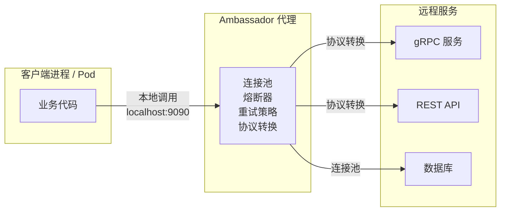
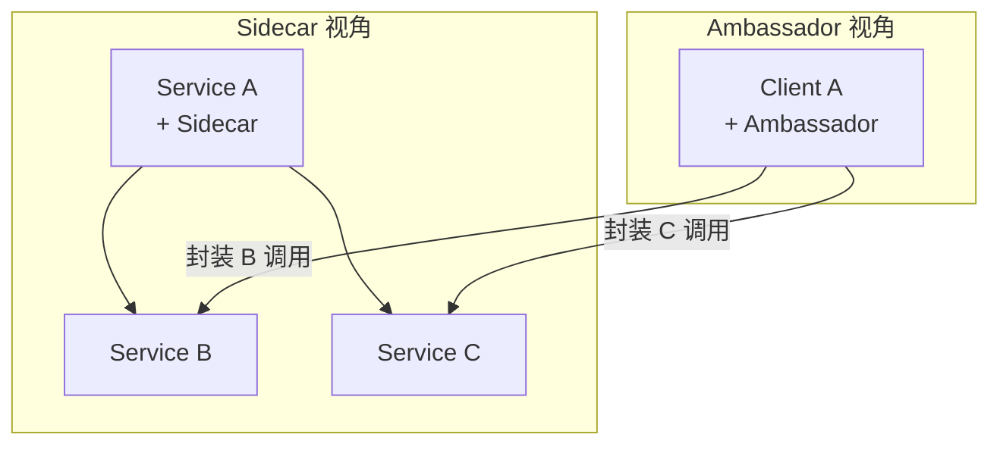
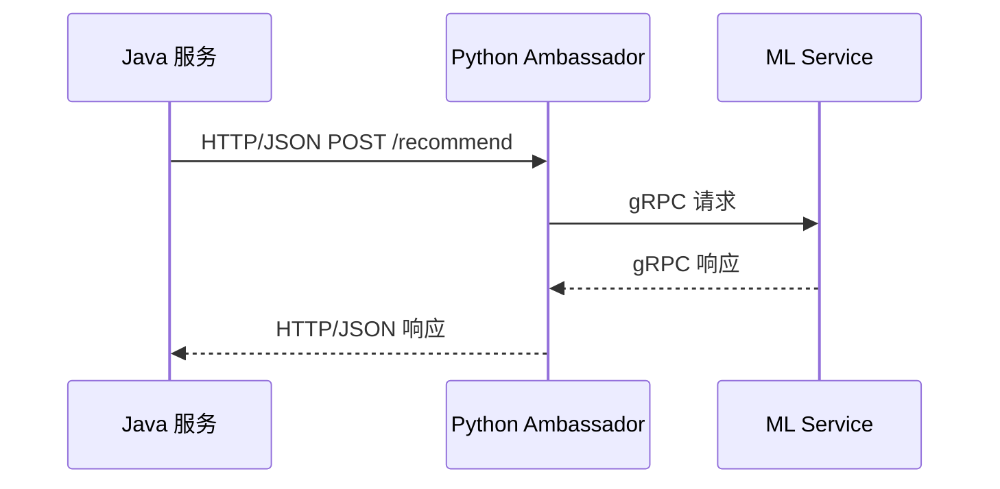

# Ambassador 大使模式

你的电商系统最近引入了一个人工智能推荐服务，由 Python 语言编写，提供 gRPC 接口。Java 订单服务需要调用这个推荐服务，但问题来了：Python 团队只提供了 HTTP/JSON 的 REST 接口，没有 gRPC 客户端 SDK。Java 服务每次调用都需要自己处理协议转换、超时重试、连接池管理。

更糟糕的是，如果以后换成另一个推荐服务，或者推荐服务的接口版本升级，Java 端的代码全部要改。业务代码被底层通信细节污染得面目全非。

Ambassador 模式提供了一种优雅的解决方案：将所有与外部服务通信的复杂性封装在一个「大使」进程中，业务代码只需要像调用本地方法一样调用大使。

## 什么是 Ambassador 模式

Ambassador 模式将客户端库的功能部署为独立服务，与客户端应用共置部署。Ambassador 封装了对远程服务的所有访问细节——连接管理、熔断、超时、重试、协议转换——让业务代码保持简洁。



业务代码看到的只是一个本地地址（`localhost:9090`），完全不知道背后是哪个远程服务、用了什么协议。这种「本地化」的远程调用，极大简化了业务代码的复杂度。

## Ambassador vs Sidecar

Ambassador 和 Sidecar 看似相似，都是「代理」，但关键区别在于**视角不同**：

| 维度 | Sidecar | Ambassador |
| --- | --- | --- |
| **视角** | 被代理服务的视角 | 客户端的视角 |
| **拦截对象** | 所有出站流量 | 特定远程服务的调用 |
| **部署位置** | 与被代理服务同 Pod | 与调用方同进程/Pod |
| **典型用途** | 服务网格、统一治理 | 协议适配、跨语言通信 |
| **控制权归属** | 服务拥有者 | 客户端拥有者 |

简单来说：**Sidecar 站在服务端的角度，所有进入这个服务的流量都要经过它；Ambassador 站在客户端的角度，所有从这个客户端发出的对某个服务的调用都要经过它**。



在 Istio 中，Envoy 代理同时承担了 Sidecar 和 Ambassador 的职责：对入站流量，它扮演 Sidecar；对出站流量，它扮演 Ambassador。

## 智能客户端库

Ambassador 模式的一种变体是「智能客户端库」——将代理逻辑封装在一个轻量级库中，随业务代码一起部署，而不是作为独立进程。

### gRPC 客户端负载均衡

gRPC 内置了智能客户端的概念。gRPC 客户端包含了负载均衡、重试、超时的逻辑，无需额外部署代理。

```java
import io.grpc.ManagedChannel;
import io.grpc.ClientInterceptor;
import io.grpc.util.RoundRobinLoadBalancerFactory;
import io.grpc.LoadBalancer;

public class GrpcClientFactory {
    public static ManagedChannel createChannel(String target) {
        // 使用 RoundRobin 负载均衡器
        LoadBalancer.Registry.getDefaultRegistry()
            .register(RoundRobinLoadBalancerFactory.getInstance());

        // 创建智能通道：内置重试、超时、负载均衡
        return ManagedChannelBuilder
            .forTarget(target)
            .defaultLoadBalancingPolicy("round_robin")
            .enableRetry()
            .maxRetryAttempts(3)
            .build();
    }
}
```

### Hystrix 与 Resilience4j

在微服务架构中，Hystrix（已停止维护）和 Resilience4j 是常见的智能客户端库实现。它们在客户端进程中实现熔断、重试、限流功能，本质上是代码级别的 Ambassador。

```java
import io.github.resilience4j.circuitbreaker.CircuitBreaker;
import io.github.resilience4j.circuitbreaker.CircuitBreakerConfig;

public class RecommendationClient {
    private final CircuitBreaker circuitBreaker;
    private final RecommendationServiceGrpc.RecommendationServiceBlockingStub stub;

    public RecommendationClient(ManagedChannel channel) {
        this.circuitBreaker = CircuitBreaker.ofDefaults("recommendation-service");

        // 包装 stub，自动处理熔断
        this.stub = CircuitBreaker.decorateBlockingStub(
            circuitBreaker,
            RecommendationServiceGrpc.newBlockingStub(channel)
        );
    }

    public List<Recommendation> getRecommendations(String userId) {
        return circuitBreaker.executeSupplier(() ->
            stub.getRecommendations(RecommendationRequest.newBuilder()
                .setUserId(userId)
                .setLimit(10)
                .build())
        );
    }
}
```

## 典型应用场景

### 跨语言服务调用

当 Java 服务需要调用 Python 机器学习服务时，可以部署一个 Python Ambassador 作为中间层。Java 服务通过 HTTP 调用 Ambassador，Ambassador 负责协议转换、连接池管理、健康检查。



### 数据库连接池代理

Ambassador 可以封装数据库连接池逻辑，为无状态的微服务提供统一的数据库访问能力。

```java
public class DatabaseAmbassador {
    private final HikariDataSource dataSource;
    private final CircuitBreaker circuitBreaker;

    public DatabaseAmbassador(String host, int port, String database) {
        HikariConfig config = new HikariConfig();
        config.setJdbcUrl("jdbc:mysql://" + host + ":" + port + "/" + database);
        config.setMaximumPoolSize(20);
        config.setMinimumIdle(5);
        config.setConnectionTimeout(30000);

        this.dataSource = new HikariDataSource(config);
        this.circuitBreaker = CircuitBreaker.ofDefaults("db-ambassador");
    }

    public Connection getConnection() throws SQLException {
        return circuitBreaker.executeSupplier(dataSource::getConnection);
    }
}
```

### 多服务统一入口

Ambassador 可以聚合多个下游服务的调用，统一处理认证、限流、日志。

```java
public class UnifiedGatewayAmbassador {
    private final PaymentClient paymentClient;
    private final InventoryClient inventoryClient;
    private final AuthClient authClient;

    public OrderResponse createOrder(OrderRequest request, String token) {
        // 统一认证
        authClient.validate(token);

        // 并行调用支付和库存
        PaymentResult payment = paymentClient.process(request.getPayment());
        InventoryResult inventory = inventoryClient.reserve(request.getItems());

        return OrderResponse.builder()
            .orderId(generateOrderId())
            .paymentStatus(payment.getStatus())
            .inventoryStatus(inventory.getStatus())
            .build();
    }
}
```

## Ambassador 的优缺点

### 优点

**简化业务代码**：业务代码只需要与本地 Ambassador 通信，不需要处理网络细节。

**统一治理**：所有对某个服务的调用都经过同一个 Ambassador，便于集中配置监控和策略。

**跨语言友好**：Ambassador 可以用任何语言实现，与业务代码语言无关。

**独立升级**：Ambassador 可以独立于业务代码进行升级，不影响业务逻辑。

### 缺点

**额外的网络跳数**：每次调用都多经过一层代理，增加延迟。

**运维复杂度**：需要额外部署和管理 Ambassador 进程。

**调试困难**：调用链路经过 Ambassador 后，定位问题需要额外分析。

**版本同步**：Ambassador 版本与后端服务版本需要匹配，否则可能出现兼容性问题。

## 选型建议

| 场景 | 推荐方案 |
| --- | --- |
| **多语言异构系统** | Ambassador 模式（Sidecar 也可以） |
| **强一致性要求** | 库集成（Resilience4j），减少网络跳数 |
| **需要统一治理** | Sidecar（Istio/Linkerd） |
| **遗留系统封装** | Ambassador（独立的协议适配层） |
| **超低延迟场景** | 直接调用，避免代理开销 |

## 思考题

**问题 1**：Ambassador 模式和 API Gateway 有什么区别？

<details>
<summary>参考答案</summary>

Ambassador 是**客户端代理**，部署在调用方侧，处理对单个服务的调用；API Gateway 是**服务端入口**，处理所有进入系统的请求聚合、路由、认证。Ambassador 解决问题的是「如何优雅地调用外部服务」，API Gateway 解决的问题是「外部请求如何优雅地进入系统」。在微服务架构中，两者往往配合使用：API Gateway 负责南北向流量（外部→内部），Ambassador/Sidecar 负责东西向流量（服务↔服务）。

</details>

**问题 2**：Ambassador 模式中，如果 Ambassador 本身成为性能瓶颈该怎么办？

<details>
<summary>参考答案</summary>

Ambassador 作为单点可能面临两个问题：1）它自身的资源瓶颈（CPU、内存、网络带宽）；2）它连接的后端服务成为瓶颈。对于资源瓶颈，可以水平扩展 Ambassador 实例，使用客户端负载均衡分发请求。对于后端瓶颈，需要在 Ambassador 层实现熔断、降级、超时策略，避免大量请求堆积在 Ambassador 中导致级联故障。

</details>

**问题 3**：什么时候应该用智能客户端库而不是独立的 Ambassador 进程？

<details>
<summary>参考答案</summary>

选择智能客户端库（代码级集成）的场景：追求极低延迟（无额外网络跳数）、团队有能力维护多语言 SDK、需要细粒度控制连接行为。选择独立 Ambassador 进程的场景：业务代码语言不支持所需库、需要跨语言共享连接池、需要在不修改业务代码的情况下增加功能。在云原生环境中，独立 Ambassador（Sidecar）越来越流行，因为它更好地支持多语言和渐进式部署。

</details>