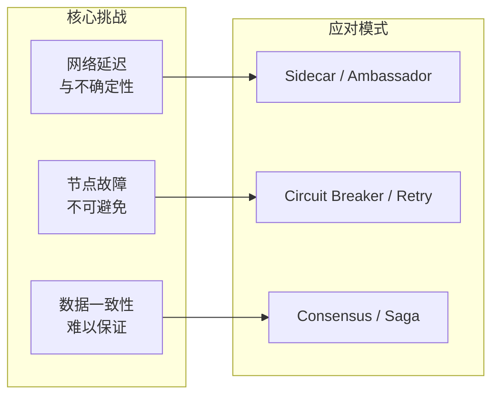
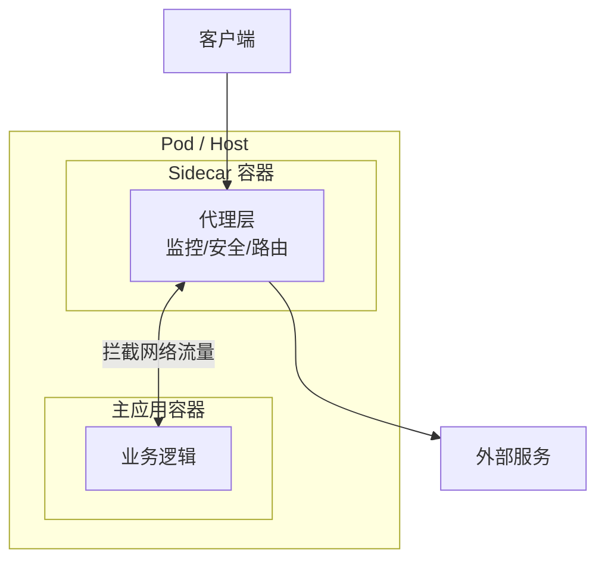
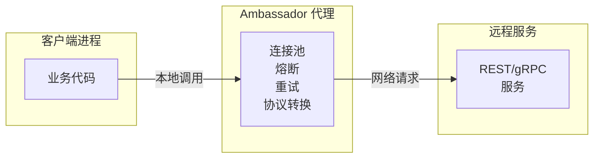
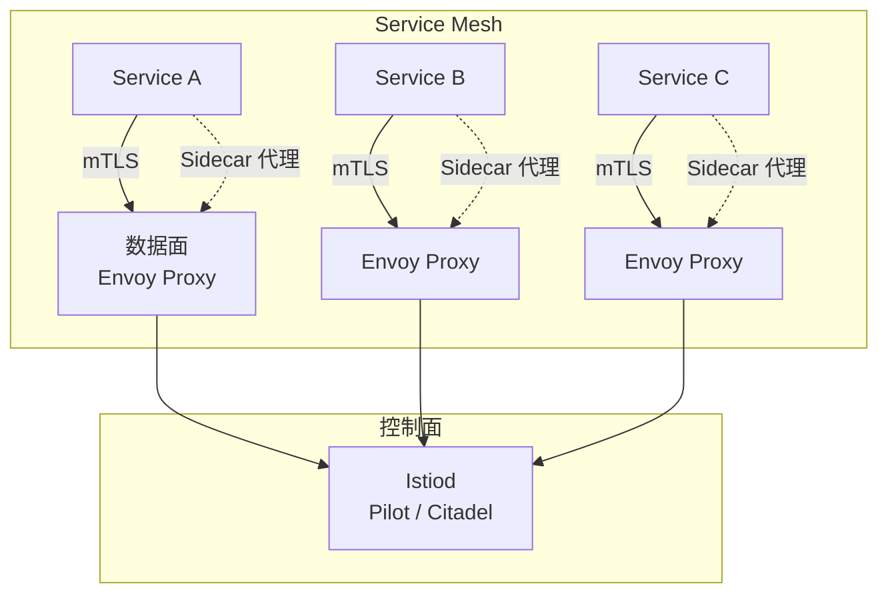

# 分布式模式

凌晨 2 点，线上报警响起：服务 A 偶发性超时。排查后发现，问题出在服务 B 刚刚发布的新版本——它返回的数据格式与旧版本不一致，而服务 A 没有兼容处理。跨服务的协议兼容，成为分布式系统中最容易被忽视却又最致命的隐性技术债。

这只是分布式系统众多挑战中的一个。当系统从单机走向多节点，网络延迟、节点故障、数据一致性等问题接踵而至。单体架构中「调用一个函数」这么简单的事情，在分布式环境下变得异常复杂——你需要考虑网络超时、节点宕机、数据冲突、重试幂等……业务之外的关注点，几乎占据了开发人员一半的精力。

分布式模式，正是为了解决这些问题而生。

## 什么是分布式模式

分布式模式是针对分布式系统中常见问题的通用解决方案。与 Gang of Four 的设计模式不同，分布式模式不仅关注代码结构，更关注**跨进程、跨网络、跨节点**的协同问题。

为什么单体架构不需要这些模式？因为在单机内部，函数调用是确定性的、同步的、不存在网络故障的。但当系统拆分为多个服务，每个服务独立部署、独立扩展时，原本在进程内的协作就变成了网络通信。原本简单的「调用 → 返回」，现在需要考虑超时、重试、熔断、降级。原本的「写入 → 读取」，现在需要考虑数据一致性。

分布式模式的核心思想，是将**基础设施关注点**（网络通信、负载均衡、故障转移、服务发现）从业务代码中分离出来，让开发者专注于业务逻辑。模式提供的是「在哪一层处理什么问题」的指导原则，而不是具体的实现细节。

## 核心挑战与模式对应

在深入具体模式之前，先理解分布式系统的三大核心挑战，以及它们与模式的对应关系：

| 挑战 | 描述 | 典型问题 | 应对模式 |
| --- | --- | --- | --- |
| 网络不确定性 | 延迟、丢包、超时 | 调用失败、重试风暴 | Sidecar、Ambassador、重试策略 |
| 节点故障 | 宕机、网络分区 | 单点失效、雪崩 | 熔断器、负载均衡、多副本 |
| 数据一致性 | CAP 约束 | 写入后读取不到 | Saga、事件溯源、最终一致 |

## Sidecar 边车模式

### 痛点场景

你维护着一个 Java 服务，突然需要增加链路追踪能力。方案一是直接引入 SDK，改代码、加依赖、配环境变量——但这意味着所有服务都要改。方案二是把追踪逻辑抽离成独立进程，通过共享卷或网络通信注入——主应用完全不用改。

方案二就是 Sidecar 模式的核心思想。

### 模式定义

Sidecar 模式将辅助功能（监控、安全、路由）从主应用中分离出来，部署为独立进程或容器，与主应用绑定在同一个主机/Pod 中。Sidecar 与主应用共享网络和命名空间，但不共享进程——它通过代理的方式拦截所有进出主应用的网络流量。

### Envoy 与 Istio 中的 Sidecar

Istio 的 Sidecar 自动注入是 Sidecar 模式的典型实现。每个 Pod 被注入一个 Envoy 代理，所有入站和出站流量都经过 Envoy。Envoy 负责：

- **流量管理**：金丝雀发布、A/B 测试、流量镜像
- **可观测性**：指标收集、分布式追踪、日志聚合
- **安全**：mTLS 加密、服务身份认证
- **弹性**：熔断、重试、超时

主应用完全无感知，不需要引入任何 Istio SDK。

### 适用场景

| 场景 | Sidecar 优势 |
| --- | --- |
| 跨语言服务治理 | 不需要为每种语言实现 SDK |
| 渐进式技术升级 | 旧系统无需改代码即可获得新能力 |
| 功能解耦 | 监控、安全、路由可独立演进 |
| 多租户隔离 | 不同租户的配置可在 Sidecar 层隔离 |

### 权衡分析

Sidecar 不是银弹。它带来的代价包括：

- **资源开销**：每个 Pod 多运行一个 Sidecar 容器
- **延迟增加**：代理层增加了网络跳数
- **运维复杂度**：需要管理 Sidecar 的生命周期和配置
- **调试困难**：流量经过代理后，问题定位需要额外工具

## Ambassador 大使模式

### 痛点场景

你的 Java 服务需要调用一个 Python 机器学习服务。这个 Python 服务有自己的连接池、超时配置、重试策略——但它暴露的是 HTTP API，没有客户端 SDK。如果每次 Java 调用都要处理这些细节，业务代码会变得混乱。

Ambassador 模式提供了另一种思路：在 Java 服务所在的进程或 Pod 中，部署一个「智能客户端代理」，封装所有与 Python 服务的通信细节。业务代码只需要调用本地代理，像调用本地服务一样简单。

### 模式定义

Ambassador 模式将客户端库的功能部署为独立服务，与客户端应用共置部署。Ambassador 封装了对远程服务的所有访问细节——连接管理、熔断、超时、重试——让业务代码保持简洁。

### Ambassador vs Sidecar

两个模式看似相似，关键区别在于**谁使用它**：

| 维度 | Sidecar | Ambassador |
| --- | --- | --- |
| 拦截对象 | 所有出站流量 | 特定远程服务 |
| 部署位置 | 与被代理服务同 Pod | 与调用方同进程/Pod |
| 典型用途 | 服务网格、通用监控 | 协议适配、跨语言通信 |
| 控制权 | 服务拥有者控制 | 客户端拥有者控制 |

### 适用场景

- **跨语言服务调用**：Go 服务调用 Java gRPC 服务，不需要引入 Go gRPC 库
- **遗留系统封装**：旧系统暴露的非标准协议，通过 Ambassador 转换为现代协议
- **多服务统一入口**：聚合多个下游服务的调用，统一处理认证、限流

## 其他分布式模式概览

### Adapter 适配器模式

将异构系统的接口统一为标准接口。例如：一个 Pod 中运行 MySQL 和 MongoDB，通过 Adapter 适配器将它们都转换为统一的存储接口，主应用无需关心底层存储类型。

### Leader-Follower 领导者追随者模式

多个副本中选出一个 Leader 处理所有写入，其他 Follower 只负责同步和读取。当 Leader 故障时，Follower 自动选举出新的 Leader。这是分布式系统实现高可用的基础模式。

典型实现：Raft 协议、ZooKeeper ZAB 协议。

### Work Queue 工作队列模式

将任务提交到队列，多个 Worker 从队列中获取任务并行处理。用于异步处理、任务分发、负载均衡。

典型实现：RabbitMQ、Redis 队列、Kafka。

### Scatter-Gather 散聚模式

将一个请求拆分为多个子请求，并行发送到多个节点，然后将结果聚合返回。用于并行查询、MapReduce、搜索场景。

典型场景：搜索引擎并行查询多个分片、并行压测多个节点。

### Pipeline 管道模式

将数据通过一系列处理阶段流动，每个阶段独立处理。用于数据流处理、日志分析 ETL、事件流处理。

典型实现：Kafka Streams、Flink、Spark Streaming。

### Sharding 分片模式

将数据按照某个维度（如用户 ID）分散到多个节点存储。解决单机存储容量限制和写入瓶颈。

典型实现：MongoDB Sharded Cluster、Cassandra、MySQL 分库分表。

### Replicated Load-Balanced 多副本负载均衡

部署多个服务副本，通过负载均衡器分发请求。实现横向扩展和高可用。

需要注意的是：当副本间数据需要同步时，还需要引入数据复制模式（同步或异步）。

### Strangler Fig 绞杀者模式

在单体系统外围逐步构建新服务，通过路由逐步将流量从旧系统迁移到新系统。避免大爆炸式重写带来的风险。

典型场景：从巨石架构迁移到微服务。

## 模式与微服务架构的关系

分布式模式与微服务架构相辅相成。微服务将系统拆分为独立部署的服务，每个服务都需要解决网络通信、故障处理、服务发现等问题——这正是分布式模式的核心应用场景。

在云原生环境下，Service Mesh 几乎成为分布式模式的集大成者：

- **Sidecar 模式**：每个 Pod 自动注入 Envoy 代理
- **Ambassador 模式**：出口流量通过 Envoy 代理处理
- **Circuit Breaker**：Envoy 内置熔断配置
- **Load Balancing**：Envoy 支持多种负载均衡算法
- **Retries**：Envoy 内置重试策略

理解分布式模式，是理解 Service Mesh 工作原理的基础。

## 本章导读

本章包含 11 篇分布式模式文章，建议按以下顺序学习：

| 模式 | 侧重点 |
| --- | --- |
| Sidecar 边车模式 | 深入讲解 Sidecar 原理、与主应用的关系、Istio 中的实现 |
| Ambassador 大使模式 | Ambassador 与 Sidecar 的区别、跨语言通信场景 |
| Adapter 适配器模式 | 容器化场景下的接口标准化 |
| Leader-Follower 领导者追随者模式 | 主从复制、选举机制、高可用设计 |
| Work Queue 工作队列模式 | 异步任务处理、消息队列选型 |
| Scatter-Gather 散聚模式 | 并行查询、结果聚合、MapReduce |
| Pipeline 管道模式 | 数据流处理、Stream 计算 |
| Sharding 分片模式 | 数据分片策略、分片键选择、跨分片查询 |
| Replicated Load-Balanced | 多副本部署、负载均衡算法 |
| Strangler Fig 绞杀者模式 | 从单体到微服务的渐进式迁移 |

:::tip 学习建议

分布式模式不是孤立的解决方案，它们之间存在天然的联系。例如：Sharding 模式解决数据扩展问题，但引入数据一致性挑战；Leader-Follower 模式解决可用性问题，但引入选举延迟。学习时注意理解模式之间的协作与权衡。

:::
