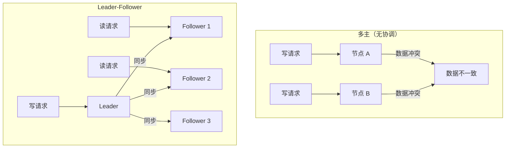
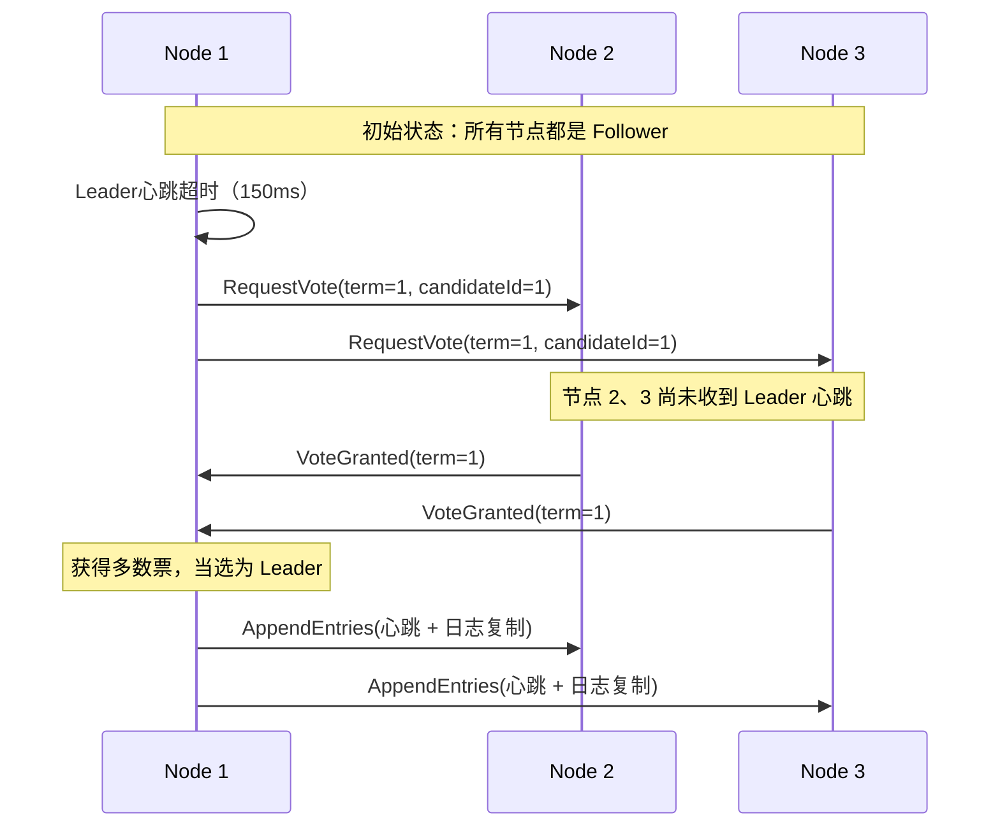
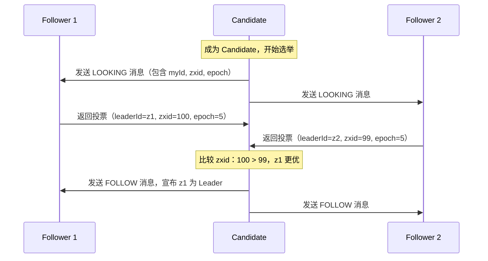

# Leader-Follower 领导者追随者模式

周一早上 9 点，运维群里炸了：ZooKeeper 集群的 Leader 节点宕机了。紧接着，所有依赖 ZooKeeper 进行服务发现的微服务开始出现大量超时错误。业务方纷纷打电话过来询问：「服务怎么又不稳定了？」

但老员工却很淡定：「没事，ZooKeeper 会自动选新的 Leader，等一会儿就好。」

果然，3 秒后，选举出了新的 Leader，服务恢复正常。

这个「自动选新 Leader」的能力，正是 Leader-Follower 模式的核心价值。

## 为什么需要领导者选举

在没有领导者的情况下，多个节点同时处理写操作会导致数据冲突。比如两个节点同时修改同一个配置项，谁的版本是正确的？这种「多主」场景如果没有协调机制，就会陷入「写冲突」的泥潭。

Leader-Follower 模式的核心思想是：**所有写操作都交给一个 Leader 处理，其他 Follower 只负责同步数据和处理只读请求**。这样就避免了多主冲突，同时可以通过增加 Follower 数量来提高系统的读取吞吐量和容灾能力。



## Raft 领导者选举过程

Raft 是目前最流行的领导者选举算法之一，它将问题分解为三个子问题：**领导者选举、日志复制、安全性**。

### 选举过程

Raft 使用任期（Term）的概念来区分不同的时间段。每个任期以一次选举开始，如果选举成功，当选者将在该任期内担任 Leader。



### 选举规则

Raft 的选举遵循以下规则：

| 规则 | 说明 |
| --- | --- |
| **任期比较** | 任期大的节点优先 |
| **日志完整性** | 日志较长的节点（最后一条日志任期更新）优先 |
| **一任期一票** | 每个节点在一个任期内只能投一票 |
| **多数票当选** | 获得集群多数节点投票的候选者成为 Leader |

```java
public class RaftNode {
    private volatile State state = State.FOLLOWER;
    private volatile long currentTerm = 0;
    private volatile String votedFor = null;
    private volatile List<LogEntry> log = new ArrayList<>();

    public RequestVoteResponse handleRequestVote(RequestVoteRequest request) {
        // 规则1：如果请求任期小于当前任期，拒绝
        if (request.getTerm() < currentTerm) {
            return RequestVoteResponse.builder()
                .term(currentTerm)
                .voteGranted(false)
                .build();
        }

        // 规则2：如果当前节点未投票，或投给了请求者
        // 且请求者的日志至少和当前节点一样新
        if (votedFor == null || votedFor.equals(request.getCandidateId())) {
            if (isLogUpToDate(request)) {
                currentTerm = request.getTerm();
                state = State.FOLLOWER;
                votedFor = request.getCandidateId();
                return RequestVoteResponse.builder()
                    .term(currentTerm)
                    .voteGranted(true)
                    .build();
            }
        }

        return RequestVoteResponse.builder()
            .term(currentTerm)
            .voteGranted(false)
            .build();
    }

    // 日志完整性判断：最后一条日志的任期越大越新，任期相同则日志越长越新
    private boolean isLogUpToDate(RequestVoteRequest request) {
        int lastLogIndex = log.size() - 1;
        long lastLogTerm = lastLogIndex >= 0 ? log.get(lastLogIndex).getTerm() : 0;

        return request.getLastLogTerm() > lastLogTerm ||
               (request.getLastLogTerm() == lastLogTerm &&
                request.getLastLogIndex() >= lastLogIndex);
    }
}
```

### 超时随机化

Raft 使用随机化的选举超时时间来避免「split vote」（平票）问题。每个节点的选举超时时间在一个固定范围内随机选择（如 150-300ms），这样大部分情况下只有一个节点会先超时并发起选举。

```java
private int electionTimeout() {
    // 随机选择 150-300ms 之间的超时时间
    return 150 + new Random().nextInt(150);
}
```

随机化的设计保证了：即使所有节点同时启动，也很少会出现多次选举都无法选出 Leader 的情况。

## ZooKeeper 的领导者选举：FastLeaderElection

Apache ZooKeeper 使用 ZAB 协议（ZooKeeper Atomic Broadcast）实现领导者选举和状态同步。FastLeaderElection 是 ZAB 的默认实现，核心流程如下：

1. **发现（Discovery）**：节点收集其他节点的投票，找出拥有最新事务的节点
2. **同步（Synchronization）**：新 Leader 将自己的事务日志同步给 Follower
3. **广播（Broadcast）**：Leader 开始接收并广播事务请求



ZooKeeper 的选举中，`zxid`（事务 ID）越大表示数据越新，优先选择拥有最大 zxid 的节点作为 Leader。这保证了新 Leader 拥有最完整的事务历史。

## Etcd 的 Raft 实现

etcd 是云原生基础设施中常用的分布式键值存储，它直接使用了 Raft 协议实现领导者选举。etcd 的 Raft 实现具有以下特点：

**状态机分离**：etcd 将 Raft 共识逻辑和网络、存储等模块解耦，通过 `Node` 接口与状态机交互。

```go
type Node interface {
    Tick()
    Campaign(ctx context.Context) error
    Propose(ctx context.Context, data []byte) error
    Step(ctx context.Context, msg pb.Message) error
    ApplyConfChange(cc pb.ConfChangeI) *pb.ConfChangeC
    // ...
}
```

**线性一致性读**：etcd 支持线性一致性读取，保证读取到的是最新 Leader 确认的数据，而非 stale read。

```go
// etcd 客户端的线性一致性读取
resp, err := client.Get(ctx, "key", clientv3.WithSerializable())
// WithSerializable 会走 Leader 确认路径
```

## 应用场景

### Kafka Broker 协调

Kafka 使用控制器（Controller）机制实现领导者选举。每个 Broker 都有机会成为控制器，但同一时间只有一个 Broker 是活跃的。控制器负责管理分区的 Leader 选举、主题创建删除等操作。

```mermaid
flowchart TB
    subgraph Kafka["Kafka 集群"]
        C["Controller Broker\n（Leader 角色）"]
        B1["Broker 1\n ISR={0,1,2}"]
        B2["Broker 2\n ISR={0,1,2}"]
        B3["Broker 3\n ISR={0,1,2}"]
    end

    C -->|"管理分区\nLeader 选举"| B1
    C -->|"管理分区\nLeader 选举"| B2
    C -->|"管理分区\nLeader 选举"| B3

    Note over C: Controller 宕机后，ZooKeeper 触发重新选举
```

当 Controller 所在的 Broker 宕机后，ZooKeeper 会通知其他 Broker 重新竞选 Controller。新的 Controller 会接管所有分区的元数据，并触发必要的分区 Leader 选举。

### Redis Sentinel

Redis Sentinel 是 Redis 的高可用解决方案，它监控主从复制集群的健康状态，并在主节点故障时自动进行故障转移。

```mermaid
flowchart TB
    subgraph RedisSentinel["Redis Sentinel 集群"]
        S1["Sentinel 1"]
        S2["Sentinel 2"]
        S3["Sentinel 3"]
    end

    subgraph RedisCluster["Redis 主从集群"]
        M["Master\n（可读写）"]
        R1["Replica 1"]
        R2["Replica 2"]
    end

    S1 -->|"监控"| M
    S2 -->|"监控"| M
    S3 -->|"监控"| M

    M -->|"主从同步"| R1
    M -->|"主从同步"| R2

    Note over S1,S3: Sentinel 使用 Raft 协议选举领导者
    S1 -->|"Leader 发起\n故障转移"| M
```

Sentinel 集群内部使用 Raft 协议选举 Leader，确保只有 Leader 才能发起故障转移，避免「脑裂」（split brain）。

## 领导者故障转移时间

Leader-Follower 模式的一个关键指标是故障转移时间（Failover Time），即从 Leader 宕机到新 Leader 选举完成的时间间隔。

| 阶段 | 时间（典型值） |
| --- | --- |
| Leader 宕机检测 | 150-300ms（选举超时） |
| Leader 选举 | 0-150ms（随机延迟） |
| 日志同步 | 10-50ms（网络延迟） |
| **总故障转移时间** | **约 200-500ms** |

故障转移期间，系统无法处理写请求。对于延迟敏感型业务，这个「不可用窗口」是需要重点关注的指标。

:::tip 减少故障转移时间

如果对可用性要求极高，可以考虑以下优化：

1. **减少选举超时下限**：将超时范围从 150-300ms 调整为 100-200ms（但会增加误判风险）
2. **Pre-Vote 机制**：在真正发起选举前先探查是否会获得多数票，避免不必要的任期增加
3. **领导者静默**：Leader 定期发送心跳，让 Follower 知道 Leader 仍然存活

:::

## 思考题

**问题 1**：Raft 协议中，为什么 Follower 在一个任期内只能投一票？

<details>
<summary>参考答案</summary>

这是为了避免「票数瓜分」问题。如果一个 Follower 可以多次投票，在同一个任期内投给多个候选者，可能导致多个候选者都获得部分票数但都无法达到多数，最终无法选出 Leader。限制一任期一票后，选举只有两种结果：某个候选者获得多数票当选，或没有任何候选者获得多数票（进入下一任期重新选举）。这种设计简化了选举的安全性证明。

</details>

**问题 2**：为什么 Raft 使用随机化的选举超时时间，而不是固定超时？

<details>
<summary>参考答案</summary>

固定超时会引发「split vote」问题：如果所有 Follower 同时超时，它们会同时发起选举，各自获得部分票数，形成僵局。随机化设计打破了这种对称性——通常只有一个节点会先超时并发起选举，获得多数票后成功当选。随机化的范围通常是一个合理的区间（如 150-300ms），既能避免频繁的无效选举，又能保证故障时快速响应。

</details>

**问题 3**：ZooKeeper 和 etcd 在领导者选举上有什么主要区别？

<details>
<summary>参考答案</summary>

主要区别在于协议和一致性模型：ZooKeeper 使用 ZAB 协议，提供线性一致性（linearizable）的写入，但不保证读取的线性一致性（可以通过 sync() 强制读取最新数据）；etcd 使用 Raft 协议，默认提供线性一致性读写。在选举机制上，ZooKeeper 依赖 ZooKeeper 自身做选主（自举），etcd 则通过 Raft 协议内置的选举机制。此外，ZooKeeper 是通用协调服务，etcd 更专注于键值存储和配置管理。

</details>