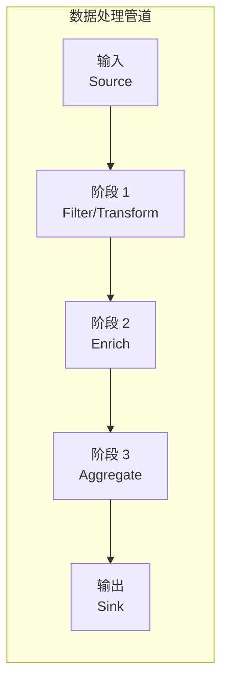
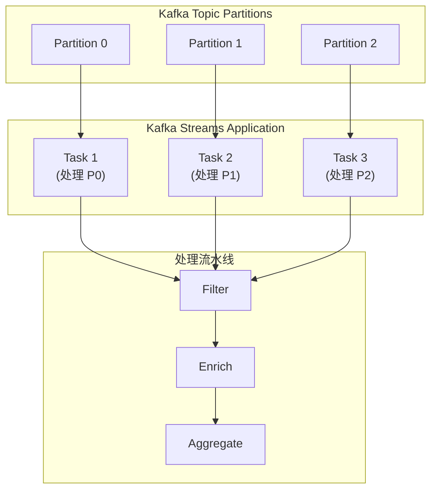
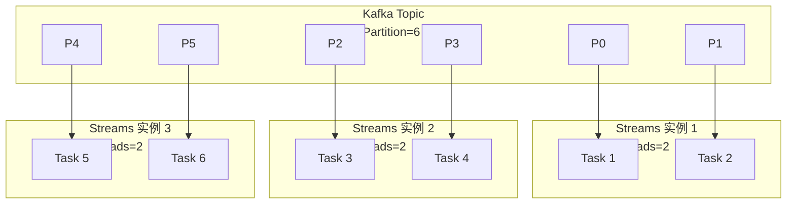

# Pipeline 管道模式

凌晨 3 点，你被一条告警惊醒：Kafka 消费者处理速度跟不上产生速度，消息开始堆积。业务日志显示，用户的实时行为数据从产生到被分析出来，平均延迟超过 5 分钟——这对实时推荐系统来说是不可接受的。

排查发现，问题出在数据处理的某个环节：解析器是单线程的，吞吐量太低。而上游的日志采集和下游的结果写入都已经做了并行化，唯独中间的处理管道成了瓶颈。

这就是 Pipeline 管道模式要解决的问题：**如何设计高效的数据流处理管道，让数据像流水线一样顺畅地从一个处理阶段流动到下一个阶段**。

## 管道模式的核心思想

管道模式将数据处理任务分解为多个阶段（Stage），每个阶段独立处理数据，并将结果传递给下一个阶段。数据像水在管道中流动一样，连续不断地从输入端流向输出端。



与散聚模式不同，管道模式是**串行**的——每个阶段必须等待上一个阶段完成。但每个阶段内部可以是并行的，通过增加并行度来提高吞吐量。

## Kafka Streams 的流处理管道

Kafka Streams 是构建在 Kafka 之上的流处理库，核心概念是 **Processor Topology**：由多个 Processor 节点组成的有向图。

```java
public class UserEventPipeline {
    public static void main(String[] args) {
        StreamsBuilder builder = new StreamsBuilder();

        // 定义流处理拓扑
        KStream<String, UserEvent> source = builder.stream("user-events");

        // 阶段 1：过滤无效事件
        KStream<String, UserEvent> filtered = source.filter((userId, event) ->
            event.getType() != null && event.getTimestamp() > 0
        );

        // 阶段 2：转换和丰富数据
        KStream<String, EnrichedEvent> enriched = filtered.map((userId, event) ->
            KeyValue.pair(userId, enrichEvent(event))
        );

        // 阶段 3：聚合
        KTable<String, UserSession> sessions = enriched
            .groupBy((userId, event) -> KeyValue.pair(
                extractSessionId(event),
                event
            ))
            .aggregate(
                UserSession::new,
                (key, event, session) -> session.add(event),
                Materialized.with(Serdes.String(), new SessionSerde())
            );

        // 阶段 4：输出
        sessions.toStream().to("user-sessions", Produced.with(Serdes.String(), new SessionSerde()));

        // 构建并启动应用
        KafkaStreams streams = new KafkaStreams(builder.build(), config);
        streams.start();
    }
}
```

### Kafka Streams 的并行机制

Kafka Streams 通过 **partition** 实现并行处理。每个输入 topic 的 partition 数量决定了最大并行度。



每个 partition 对应一个 Task，Task 是 Kafka Streams 的最小调度单位。一个 Task 包含完整的处理拓扑，可以独立处理分配给它的 partition 的数据。

## 管道容错：Checkpoint 与 Exactly-Once

分布式管道必须处理节点故障、网络中断等问题。Kafka Streams 通过 **checkpoint** 和 **exactly-once** 语义来保证数据不丢失、不重复。

### Checkpoint 机制

```java
public class StatefulPipeline {
    public static void main(String[] args) {
        StreamsBuilder builder = new StreamsBuilder();

        // 配置状态存储
        StoreBuilder<KeyValueStore<String, Long>> countStore =
            Stores.keyValueStoreBuilder(
                Stores.inMemoryKeyValueStore("count-store"),
                Serdes.String(),
                Serdes.Long()
            );

        // 注册状态存储
        builder.addStateStore(countStore);

        KStream<String, Event> source = builder.stream("events");

        // 有状态的处理逻辑
        KStream<String, Long> counts = source
            .transform(() -> new CountTransformer("count-store"), "count-store")
            .mapValues(count -> count);

        counts.to("counts");

        KafkaStreams streams = new KafkaStreams(builder.build(), config);

        // 定期 checkpoint 到 Kafka 主题
        streams.setStateListener((newState, oldState) -> {
            if (newState == KafkaStreams.State.RUNNING) {
                // 持久化状态
                streams.store(StoreQueryParameters.fromNameWithType(
                    "count-store", QueryableStoreType.keyValueStore()
                ));
            }
        });
    }
}

public class CountTransformer<K, V> implements Transformer<K, V, KeyValue<K, Long>> {
    private KeyValueStore<String, Long> store;

    @Override
    public void init(ProcessorContext context) {
        this.store = context.getStateStore("count-store");
        // 定期提交 offset，触发 checkpoint
        context.schedule(Duration.ofSeconds(10));
    }

    @Override
    public KeyValue<K, Long> transform(K key, V value) {
        long count = store.getOrDefault(key.toString(), 0L) + 1;
        store.put(key.toString(), count);
        return KeyValue.pair(key, count);
    }

    @Override
    public void close() {
        // 清理资源
    }
}
```

### Exactly-Once 语义

```java
public class ExactlyOncePipeline {
    public static void main(String[] args) {
        // 配置 exactly-once 处理
        Properties config = new Properties();
        config.put(StreamsConfig.PROCESSING_GUARANTEE_CONFIG,
            StreamsConfig.EXACTLY_ONCE_V2);  // 启用 exactly-once

        config.put(StreamsConfig.REPLICATION_FACTOR_CONFIG, 3);
        config.put(StreamsConfig.NUM_STREAM_THREADS_CONFIG, 3);

        StreamsBuilder builder = new StreamsBuilder();

        KStream<String, OrderEvent> orders = builder.stream("orders");

        // exactly-once 保证：订单处理不会重复，不会丢失
        orders.filter((k, v) -> v.getAmount() > 0)
            .map((k, v) -> KeyValue.pair(v.getProductId(), v))
            .groupByKey()
            .count(Materialized.as("order-counts"))
            .toStream()
            .to("order-counts-output");
    }
}
```

`EXACTLY_ONCE_V2` 使用 Kafka transactions API，确保：

1. 每个消息只被处理一次（不会重复）
2. 处理结果只被提交一次（不会丢失）
3. 状态更新和输出是原子的

## 管道并行度设计

管道并行度影响整体吞吐量。需要考虑两个维度的并行：

| 维度 | 说明 | 配置方式 |
| --- | --- | --- |
| **Partition 并行** | 决定了最大任务数 | Kafka topic partition 数 |
| **线程并行** | 每个实例内的并行线程数 | `num.stream.threads` |



并行度公式：`最大并行度 = partition数 × 实例数 / source processor数`

:::tip 并行度调优

假设 Kafka topic 有 12 个 partition，单机可以跑 3 个实例，每个实例 2 个线程，那么最大并行度是 12。如果要进一步提高并行度，可以增加 partition 数（但 partition 数增加后不可减少），或者增加实例数。

:::

## 管道监控：端到端延迟与吞吐量

监控是管道运维的基础。需要关注三个核心指标：

```java
public class PipelineMonitor {
    private final MeterRegistry meterRegistry;

    public void recordMetrics(PipelineMetrics metrics) {
        // 1. 端到端延迟：从输入到输出的总耗时
        Timer endToEndLatency = Timer.builder("pipeline.latency.endtoend")
            .description("端到端处理延迟")
            .tag("stage", "all")
            .register(meterRegistry);

        endToEndLatency.record(metrics.getEndToEndTime(), TimeUnit.MILLISECONDS);

        // 2. 各阶段延迟
        metrics.getStageLatencies().forEach((stage, latency) -> {
            Timer.builder("pipeline.stage.latency")
                .tag("stage", stage)
                .register(meterRegistry)
                .record(latency, TimeUnit.MILLISECONDS);
        });

        // 3. 吞吐量：每秒处理的消息数
        Meter.builder("pipeline.throughput")
            .description("消息处理吞吐量")
            .tag("stage", "all")
            .register(meterRegistry)
            .mark(metrics.getMessageCount());

        // 4. 积压监控：Lag 越大表示处理能力不足
        Gauge.builder("pipeline.lag", metrics, PipelineMetrics::getLag)
            .description("消费者 Lag")
            .register(meterRegistry);
    }
}
```

### 常见问题与排查

| 问题 | 现象 | 排查方向 |
| --- | --- | --- |
| **处理延迟高** | lag 持续增长 | 下游处理能力不足、异常重试、GC 停顿 |
| **吞吐量低** | CPU 利用率低 | 并行度不够、partition 不足、外部 IO 阻塞 |
| **数据丢失** | count 不一致 | exactly-once 未启用、checkpoint 间隔太长 |
| **重复处理** | count 偏大 | exactly-once 未启用、消费位点回退 |

## 思考题

**问题 1**：Kafka Streams 的 exactly-once 与 Kafka 的 at-least-once 有什么区别？

<details>
<summary>参考答案</summary>

at-least-once 保证消息不会被丢失（可能会重复处理），通过手动提交 offset 实现。exactly-once 保证消息既不丢失也不重复，通过 Kafka transactions API 将 offset 提交和状态更新、输出写入绑定为同一个事务。两者的代价是：exactly-once 需要额外的协调和日志开销，吞吐量可能略低于 at-least-once。选择哪种语义取决于业务对重复的容忍度。

</details>

**问题 2**：如果管道中某个阶段的处理速度远慢于其他阶段，该怎么办？

<details>
<summary>参考答案</summary>

这是典型的「流水线瓶颈」问题。可以考虑：1）增加该阶段的并行度（partition 数或实例数）；2）优化该阶段的处理逻辑（算法复杂度、IO 优化）；3）将该阶段拆分为多个子阶段，实现流水线的更深层次并行；4）使用异步处理 + 背压机制，避免慢阶段拖累整个管道；5）如果瓶颈是外部依赖，考虑添加本地缓存或异步批量接口。

</details>

**问题 3**：Kafka Streams 与 Flink 的管道处理有什么区别？

<details>
<summary>参考答案</summary>

主要区别在于架构和适用场景：Kafka Streams 是「Kafka 原生」的，处理逻辑运行在应用进程中，数据来源于 Kafka 输出到 Kafka，适合简单到中等复杂的流处理；Flink 是独立引擎，有更丰富的算子（窗口、CEP、SQL）、更强的状态管理、更完善的 checkpoint 机制，适合复杂流处理和大规模批流一体。选择取决于需求复杂度、数据规模、团队熟悉度等因素。

</details>