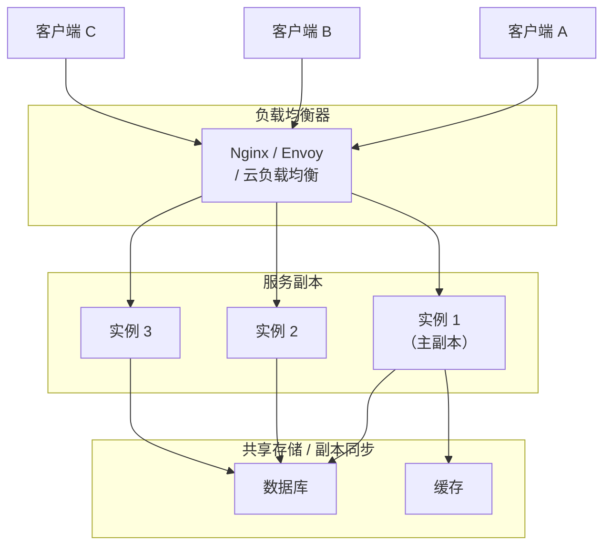
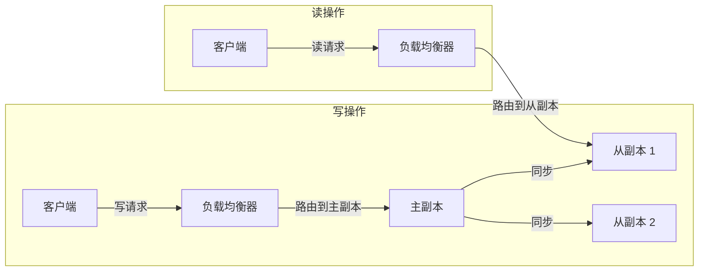
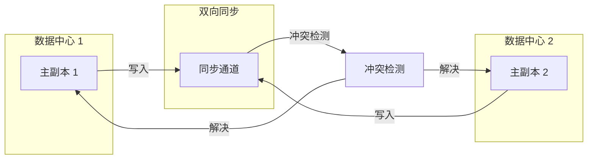

# Replicated Load-Balanced Services 多副本负载均衡

你的微服务上线后流量稳步增长，单机已经接近性能瓶颈。运维团队开始部署多副本：3 台应用服务器，前面加一个 Nginx 负载均衡器。部署完成后，吞吐量提升了 3 倍，看起来一切正常。

但一个月后，用户开始投诉：刚下的订单找不到，明明支付成功了，订单状态却是「未支付」。排查后发现：用户 A 的请求被路由到实例 1 创建订单，支付回调被路由到实例 2，而实例 2 根本不知道这个订单的存在。

多副本部署后，数据一致性成为必须面对的问题。

## 多副本负载均衡的本质

多副本负载均衡解决的是两个问题：**横向扩展（提高吞吐量）** 和 **容错（提高可用性）**。但副本之间如何同步数据、保持一致性，成为架构设计的关键。



## 主从复制模式：读写分离

主从复制是最常见的多副本模式：所有写操作路由到主副本，读操作可以分散到从副本。



### MySQL 主从复制

```java
public class MasterSlaveRouting {
    private final DataSource master;
    private final List<DataSource> slaves;
    private final LoadBalancer loadBalancer;

    public Connection getConnection(boolean readOnly) {
        if (readOnly) {
            // 读操作：路由到从副本
            DataSource slave = loadBalancer.select(slaves);
            return slave.getConnection();
        } else {
            // 写操作：路由到主副本
            return master.getConnection();
        }
    }
}

// Spring 配置
@Bean
public DataSource routingDataSource(
        @Qualifier("masterDataSource") DataSource master,
        @Qualifier("slaveDataSource1") DataSource slave1,
        @Qualifier("slaveDataSource2") DataSource slave2) {

    Map<Object, Object> targetDataSources = new HashMap<>();
    targetDataSources.put("master", master);
    targetDataSources.put("slave1", slave1);
    targetDataSources.put("slave2", slave2);

    RoutingDataSource routingDataSource = new RoutingDataSource();
    routingDataSource.setTargetDataSources(targetDataSources);
    routingDataSource.setDefaultTargetDataSource(master);

    return routingDataSource;
}
```

### 主从复制的延迟问题

主从复制是异步的，从副本的数据可能滞后于主副本。对于强一致性要求的场景，可能出现「主从不一致」的问题：

| 问题 | 现象 | 后果 |
| --- | --- | --- |
| **同步延迟** | 刚写入的数据，从副本读不到 | 读不到最新数据 |
| **半同步复制** | 主副本等待至少一个从副本确认 | 写入延迟增加 |
| **复制中断** | 从副本长时间未同步 | 数据丢失风险 |

```java
public class ReplicationAwareRouting {
    // 检测主从延迟
    public boolean isReplicationLagging(DataSource slave) {
        try (Connection conn = slave.getConnection();
             Statement stmt = conn.createStatement()) {

            ResultSet rs = stmt.executeQuery(
                "SHOW SLAVE STATUS"
            );
            if (rs.next()) {
                long secondsBehindMaster = rs.getLong("Seconds_Behind_Master");
                return secondsBehindMaster > 5;  // 延迟超过 5 秒
            }
        }
        return false;
    }

    // 读操作：根据延迟选择合适的从副本
    public Connection getReadConnection() {
        List<DataSource> healthySlaves = slaves.stream()
            .filter(s -> !isReplicationLagging(s))
            .collect(Collectors.toList());

        // 如果所有从副本都有延迟，强制读主副本
        if (healthySlaves.isEmpty()) {
            return master.getConnection();
        }

        return loadBalancer.select(healthySlaves).getConnection();
    }
}
```

## 多主复制：冲突检测与解决

多主复制允许多个副本同时处理写操作，适合多数据中心部署或需要高写入吞吐量的场景。但多主复制面临的最大挑战是**写冲突**。



### 冲突检测策略

```java
public class ConflictResolution {
    // Last-Writer-Wins：时间戳决定，简单的策略
    public Record resolveLastWriterWins(Record local, Record remote) {
        return local.getVersion() > remote.getVersion() ? local : remote;
    }

    // 版本向量：记录每个副本的更新历史
    public Record resolveVersionVector(Record local, Record remote) {
        Map<String, Long> localVersions = local.getVersionVector();
        Map<String, Long> remoteVersions = remote.getVersionVector();

        // 如果一个版本包含另一个版本，接受新版本
        if (containsAll(localVersions, remoteVersions)) {
            return local;
        } else if (containsAll(remoteVersions, localVersions)) {
            return remote;
        }

        // 真正的冲突：并发修改
        // 使用业务规则或随机策略解决
        return resolveBusinessRule(local, remote);
    }

    // 业务规则解决冲突
    private Record resolveBusinessRule(Record local, Record remote) {
        // 示例：取金额最大的
        if (local instanceof Payment && remote instanceof Payment) {
            Payment localPayment = (Payment) local;
            Payment remotePayment = (Payment) remote;
            return localPayment.getAmount() > remotePayment.getAmount()
                ? local : remote;
        }

        // 默认策略
        return local;
    }
}
```

## 无主复制：Quorum 机制

Cassandra、DynamoDB 等系统采用无主复制，客户端可以直接向任意副本写入，然后通过 Quorum 机制保证一致性。

### Quorum 算法

对于 N 个副本，读取需要 R 个副本确认，写入需要 W 个副本确认。只要 `R + W > N`，就能保证强一致性读取。

```java
public class QuorumReplication {
    private final List<Replica> replicas;
    private final int n;  // 总副本数
    private final int w;  // 写入确认数
    private final int r;  // 读取确认数

    public QuorumReplication(int replicas, int w, int r) {
        this.n = replicas;
        this.w = w;
        this.r = r;
    }

    public void write(String key, String value) {
        // 写入所有副本
        List<CompletableFuture<Boolean>> futures = replicas.stream()
            .map(r -> CompletableFuture.supplyAsync(() -> r.write(key, value)))
            .collect(Collectors.toList());

        // 等待 W 个副本确认
        long successCount = futures.stream()
            .mapToLong(f -> f.join() ? 1 : 0)
            .sum();

        if (successCount < w) {
            throw new WriteFailureException("写入失败：只有 " + successCount + " 个副本确认");
        }
    }

    public String read(String key) {
        // 并行读取 R 个副本
        List<CompletableFuture<ReplicaValue>> futures = replicas.stream()
            .limit(r)  // 读取 R 个副本
            .map(r -> CompletableFuture.supplyAsync(() -> r.read(key)))
            .collect(Collectors.toList());

        // 对比 R 个副本的值
        List<ReplicaValue> values = futures.stream()
            .map(CompletableFuture::join)
            .collect(Collectors.toList());

        // 返回最新值（基于版本号）
        return values.stream()
            .max(Comparator.comparing(ReplicaValue::getVersion))
            .map(ReplicaValue::getValue)
            .orElseThrow(() -> new ReadFailureException("读取失败"));
    }
}
```

### 权衡矩阵

| 场景 | N | R | W | 说明 |
| --- | --- | --- | --- | --- |
| 强一致性 | 3 | 2 | 2 | 写入延迟高，但一致性最强 |
| 高读取 | 3 | 3 | 1 | 读取快，写入需同步所有副本 |
| 高写入 | 3 | 1 | 1 | 写入快，但可能出现不一致 |
| 低延迟 | 3 | 1 | 2 | 平衡读写性能 |

## 一致性级别

不同业务场景对一致性的要求不同：

| 一致性级别 | 说明 | 典型场景 |
| --- | --- | --- |
| **强一致性** | 读取总是返回最新写入 | 金融交易、库存扣减 |
| **顺序一致性** | 读取按写入顺序返回 | 消息队列、时间线 |
| **因果一致性** | 相关操作按因果顺序 | 社交评论、协作编辑 |
| **最终一致性** | 不保证立即一致，最终会一致 | 日志、点赞、阅读量 |

```java
public class ConsistencyLevelRouting {
    private final ConsistencyLevel defaultLevel = ConsistencyLevel.QUORUM;

    public ReadResult read(String key, ConsistencyLevel level) {
        switch (level) {
            case STRONG:
                // 读取所有副本，取最新
                return readAllAndMerge(key);
            case QUORUM:
                // 读取 Quorum 副本
                return readQuorum(key);
            case ONE:
                // 只读一个副本，最快但不保证最新
                return readOne(key);
            default:
                return readQuorum(key);
        }
    }
}
```

## 副本一致性方案对比

| 维度 | 主从复制 | 多主复制 | 无主复制 |
| --- | --- | --- | --- |
| **写入冲突** | 无（只有主写入） | 严重（多主并发写入） | 中等（Quorum 解决） |
| **扩展性** | 写扩展受限 | 写可水平扩展 | 写可水平扩展 |
| **延迟** | 写延迟低，读可能有延迟 | 写延迟低 | 可配置 R/W 平衡延迟 |
| **一致性** | 最终一致（可配同步） | 最终一致（需冲突解决） | 可配置（Strong 到 Eventual） |
| **故障恢复** | 主故障需选主 | 任一副本可继续 | 任一副片可继续 |
| **适用场景** | 读多写少 | 多数据中心 | 大规模分布式存储 |

## 思考题

**问题 1**：如何检测主从复制的数据不一致？

<details>
<summary>参考答案</summary>

检测主从不一致的方法包括：1）定期 checksum 比对，对比主从表的数据校验和；2）使用 pt-table-checksum 工具对整个表进行校验；3）监控 `Seconds_Behind_Master`，当延迟超过阈值时告警；4）应用层在写入后立即读取验证（写后读检测）；5）使用 GTID（全局事务 ID）追踪主从同步状态。生产环境中通常组合使用多种方法。

</details>

**问题 2**：Quorum 机制中，R 和 W 如何选择？

<details>
<summary>参考答案</summary>

选择取决于业务对读写性能和一致性的权衡：1）`R=1, W=N`：写入慢（需所有副本确认），读取极快，适合写少读多且能接受最终一致的场景；2）`R=N, W=1`：写入极快，读取慢，适合写多读少且能接受最终一致的场景；3）`R=2, W=2`（N=3）：平衡方案，保证强一致性，是 Cassandra 的默认配置。选择原则是：确保 `R + W > N`，这样才能读到最新写入的数据。

</details>

**问题 3**：无主复制中，如何处理「脑裂」（split brain）？

<details>
<summary>参考答案</summary>

无主复制通过 Quorum 机制避免脑裂，但网络分区时仍可能出现问题：1）确保 Quorum 设置满足 `W <= N/2`，这样分区期间只有一个分区可以写入；2）使用 Hinted Handoff 机制，在节点恢复后补发未同步的写入；3）使用 Anti-Entropy 定期修复副本间的不一致；4）配置合理的 `consistent_level` 和 `write_policy`。对于极端场景，需要人工介入决策合并策略。

</details>