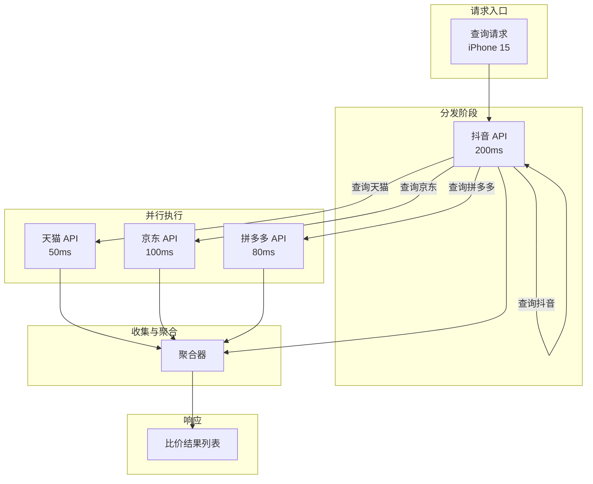
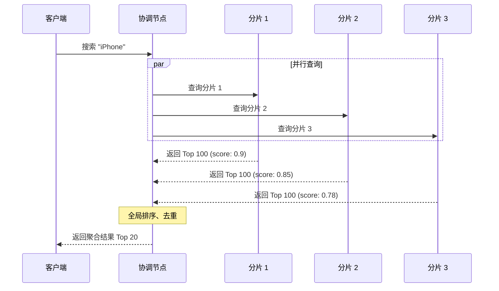

# Scatter-Gather 散聚模式

你在做一个商品比价系统。用户搜索「iPhone 15」，需要同时查询天猫、京东、拼多多、抖音电商等多个平台的价格，然后把结果聚合成一个列表返回给用户。每个平台的 API 响应时间是 50-200ms 不等，如果串行调用，总耗时可能超过 800ms。

但如果并行调用呢？理论上只需要 200ms——也就是最慢那个平台的响应时间。

这就是 Scatter-Gather 散聚模式的核心价值：**将一个请求拆分并行到多个节点，最后将结果聚合返回**。

## 散聚模式的流程

散聚模式包含四个核心步骤：

1. **分发（Scatter）**：将请求拆分为多个子请求
2. **并行执行（Parallel Execute）**：将子请求发送到对应的节点
3. **收集（Collect）**：收集子请求的响应
4. **聚合（Aggregate）**：将结果合并、排序、去重后返回



## 广播查询：搜索引擎并行查询

在分布式搜索引擎（如 Elasticsearch）中，散聚模式用于并行查询多个索引分片。

```java
public class ElasticsearchScatterGather {
    private final RestHighLevelClient esClient;

    public SearchResponse searchProducts(String query, int page, int size) {
        // 1. 获取集群状态，确定分片分布
        ClusterHealthResponse health = esClient.cluster().health();
        int totalShards = health.getNumberOfDataNodes();

        // 2. 构建分散查询请求
        SearchRequest searchRequest = new SearchRequest("products_*");
        SearchSourceBuilder sourceBuilder = new SearchSourceBuilder();
        sourceBuilder.query(QueryBuilders.multiMatchQuery(query, "name", "description"));
        sourceBuilder.from(page * size);
        sourceBuilder.size(size);
        searchRequest.source(sourceBuilder);

        // 3. 分散查询：广播到所有相关分片
        // ES 自动将请求分发到各分片并行执行
        CompletableFuture<SearchResponse> future = new CompletableFuture<>();

        esClient.searchAsync(searchRequest, RequestOptions.DEFAULT,
            new ActionListener<SearchResponse>() {
                @Override
                public void onResponse(SearchResponse response) {
                    future.complete(response);
                }

                @Override
                public void onFailure(Exception e) {
                    future.completeExceptionally(e);
                }
            });

        try {
            // 4. 等待最慢的分片响应（默认超时 30s）
            SearchResponse response = future.get(30, TimeUnit.SECONDS);

            // 5. ES 自动在协调节点聚合各分片结果
            // 包括全局相关性评分、去重、分页等
            return response;
        } catch (Exception e) {
            // 处理超时或部分失败
            throw new SearchException("搜索失败", e);
        }
    }
}
```

### Elasticsearch 的内部散聚机制



## 结果归并

### 超时处理

散聚模式中最关键的设计是超时处理。当部分节点响应超时或失败时，系统需要决定：是完全失败，还是返回部分结果。

```java
public class ScatterGatherExecutor {
    private final ExecutorService executor;
    private final Duration timeout;

    public <T, R> ScatterGatherResult<R> execute(
            List<T> inputs,
            Function<T, R> callable,
            BiFunction<List<R>, List<Failure>, R> aggregator) {

        // 为每个输入创建异步任务
        List<CompletableFuture<R>> futures = inputs.stream()
            .map(input -> CompletableFuture
                .supplyAsync(() -> callable.apply(input), executor)
                .orTimeout(timeout.toMillis(), TimeUnit.MILLISECONDS)
                .exceptionally(ex -> {
                    // 记录失败，但不影响其他任务
                    log.warn("Scatter 任务失败: input={}, error={}",
                        input, ex.getMessage());
                    return null;
                }))
            .collect(Collectors.toList());

        // 等待所有任务完成（或超时）
        CompletableFuture.allOf(futures.toArray(new CompletableFuture[0])).join();

        // 收集结果和失败信息
        List<R> results = new ArrayList<>();
        List<Failure> failures = new ArrayList<>();

        for (int i = 0; i < inputs.size(); i++) {
            R result = futures.get(i).getNow(null);
            if (result != null) {
                results.add(result);
            } else {
                failures.add(new Failure(inputs.get(i), "超时或异常"));
            }
        }

        // 使用聚合器合并结果
        R aggregated = aggregator.apply(results, failures);

        return ScatterGatherResult.<R>builder()
            .result(aggregated)
            .totalCount(inputs.size())
            .successCount(results.size())
            .failureCount(failures.size())
            .failures(failures)
            .build();
    }
}
```

### 部分失败处理

```java
public class PriceAggregator {
    public List<PriceResult> aggregatePrices(List<PlatformPrice> prices, List<Failure> failures) {
        // 记录失败但继续处理
        if (!failures.isEmpty()) {
            log.warn("部分平台查询失败: {}", failures);
        }

        // 按价格排序
        List<PriceResult> results = prices.stream()
            .map(p -> PriceResult.builder()
                .platform(p.getPlatform())
                .price(p.getPrice())
                .url(p.getProductUrl())
                .stockStatus(p.getStockStatus())
                .build())
            .sorted(Comparator.comparing(PriceResult::getPrice))
            .collect(Collectors.toList());

        // 标记不可用的平台
        failures.forEach(f -> {
            results.add(PriceResult.builder()
                .platform("平台-" + f.getInput())
                .price(null)
                .status("查询失败: " + f.getReason())
                .build());
        });

        return results;
    }
}
```

## 与 MapReduce 的关系

散聚模式和 MapReduce 有相似之处，但也有明显区别：

| 维度 | Scatter-Gather | MapReduce |
| --- | --- | --- |
| **适用场景** | 实时查询 | 批量处理 |
| **延迟** | 低（毫秒级） | 高（分钟到小时级） |
| **结果合并** | 并发收集后聚合 | Map 输出写入磁盘，Reduce 读取 |
| **容错** | 超时重试 | 任务失败重跑整个 Job |
| **数据规模** | 中等规模 | 海量数据 |

MapReduce 可以看作是散聚模式的「批量版」：Map 阶段相当于 Scatter，Reduce 阶段相当于 Gather。区别在于 MapReduce 的数据流动是批量化的，而散聚模式是请求级的。

## 典型应用场景

### 多渠道价格比较

```java
public class PriceComparisonService {
    private final ScatterGatherExecutor executor;

    public List<PriceResult> comparePrices(String productId) {
        List<String> platforms = List.of("TMALL", "JD", "PDD", "DOUYIN");

        return executor.execute(
            platforms,
            platform -> queryPlatformPrice(platform, productId),
            this::aggregatePrices
        ).getResult();
    }

    private PlatformPrice queryPlatformPrice(String platform, String productId) {
        // 模拟平台 API 调用
        return switch (platform) {
            case "TMALL" -> tmallClient.getPrice(productId);
            case "JD" -> jdClient.getPrice(productId);
            case "PDD" -> pddClient.getPrice(productId);
            case "DOUYIN" -> douyinClient.getPrice(productId);
            default -> throw new UnsupportedOperationException();
        };
    }
}
```

### 并行压测

```java
public class LoadTestScatterGather {
    public LoadTestReport runLoadTest(LoadTestConfig config) {
        // 生成测试用例
        List<EndpointTestCase> testCases = generateTestCases(config);

        // 并行发送到所有压测节点
        List<CompletableFuture<NodeReport>> futures = testCases.stream()
            .map(this::executeOnNodes)
            .flatMap(List::stream)
            .collect(Collectors.toList());

        // 收集所有节点报告
        List<NodeReport> reports = futures.stream()
            .map(CompletableFuture::join)
            .collect(Collectors.toList());

        // 聚合报告
        return aggregateReports(reports);
    }
}
```

## 性能优化技巧

**减少节点数**：不是越多越好。节点数增加意味着更多网络开销和协调成本。当节点数超过一定阈值后，收益递减。

**预热和缓存**：对于热门查询，可以预先将结果缓存起来，避免每次都散聚到所有节点。

**优雅降级**：当部分节点失败时，返回缓存结果或「部分成功」响应，而不是直接失败。

**并发控制**：设置最大并发数，避免瞬时请求过大压垮下游服务。

## 思考题

**问题 1**：散聚模式中，如果某个节点的响应特别慢，会拖累整体响应时间吗？

<details>
<summary>参考答案</summary>

会的。这是散聚模式的一个核心问题——整体响应时间取决于最慢的节点。解决方案包括：1）设置合理的超时时间，超时后放弃该节点，返回部分结果；2）使用 hedged requests 策略，即向多个节点发送相同请求，取先到达的结果；3）使用投机执行（speculative execution），超时后向其他节点发送相同请求；4）结果分层返回，先返回快速节点的结果，再异步更新慢节点的结果。

</details>

**问题 2**：散聚模式的聚合器设计有哪些常见模式？

<details>
<summary>参考答案</summary>

常见的聚合器模式包括：1）排序合并：将所有结果按某个维度排序后取 Top N；2）去重合并：使用 Set 或 Bloom Filter 去重；3）求和/统计：对数值结果求和、计数、平均；4）版本合并：类似 Git 的三路合并，处理冲突；5）分层聚合：先在每个节点本地聚合，再在协调节点聚合全局结果。选择哪种聚合器取决于业务需求和数据特点。

</details>

**问题 3**：什么时候不适合用散聚模式？

<details>
<summary>参考答案</summary>

不适合散聚模式的场景：1）数据量极大，超过聚合能力（如 TB 级数据）；2）对一致性要求极高，需要跨节点事务；3）下游节点不稳定，失败率很高（散聚会放大失败影响）；4）业务逻辑强依赖某个节点的结果。在这些场景下，可能需要考虑同步串行调用、本地缓存、或分区处理等其他方案。

</details>