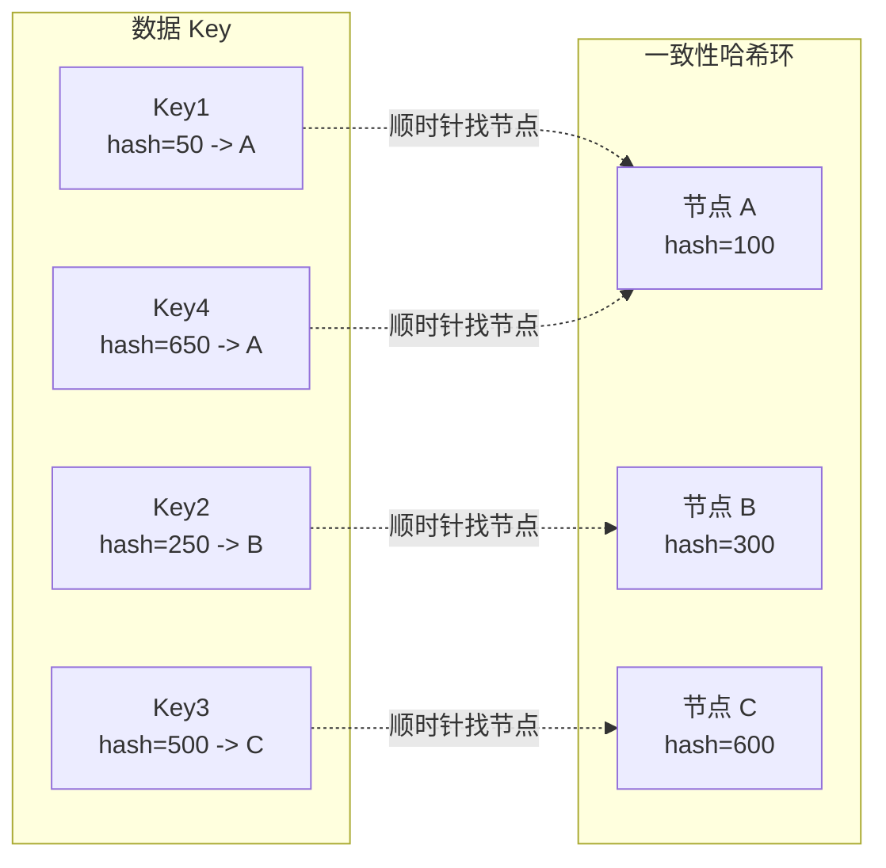

# Sharding 分片模式

你的电商平台用户量突破了 5000 万，订单表已经超过 1 亿行。MySQL 单表查询开始出现明显退化：`SELECT * FROM orders WHERE user_id = ?` 从 5ms 飙升到 200ms，DBA 告诉你：单表超过 5000 万行后，索引维护成本急剧上升，性能会持续恶化。

升级硬件？硬盘已经是最快的 SSD，内存加到 256G 还是不够。读写分离？写操作还是集中在主库。分库分表，被提上了日程。

这就是 Sharding 分片模式要解决的问题：**当单机无法承载全部数据时，如何将数据分散到多个节点，同时保持高效的访问能力**。

## 分片策略

### 哈希分片

哈希分片根据某个字段（如 user_id）的哈希值来决定数据归属的节点。

```java
public class HashShardingStrategy implements ShardingStrategy {
    private final int shardCount;
    private final String shardingColumn;

    public HashShardingStrategy(String shardingColumn, int shardCount) {
        this.shardingColumn = shardingColumn;
        this.shardCount = shardCount;
    }

    @Override
    public int selectShard(Object shardingKey) {
        int hash = Math.abs(shardingKey.hashCode());
        return hash % shardCount;
    }

    @Override
    public String getShardingColumn() {
        return shardingColumn;
    }
}
```

**优点**：

- 数据分布均匀，避免热点
- 写入负载均匀分散

**缺点**：

- 不支持范围查询（如 `WHERE create_time BETWEEN ...`）
- 扩展时需要数据迁移

### 范围分片

范围分片根据数据的数值范围（如时间、ID 区间）来决定归属节点。

```java
public class RangeShardingStrategy implements ShardingStrategy {
    private final String shardingColumn;
    private final List<ShardRange> ranges;

    public RangeShardingStrategy(String shardingColumn, List<ShardRange> ranges) {
        this.shardingColumn = shardingColumn;
        this.ranges = ranges;
    }

    @Override
    public int selectShard(Object shardingKey) {
        long value = ((Number) shardingKey).longValue();

        for (int i = 0; i < ranges.size(); i++) {
            if (value >= ranges.get(i).getStart() && value < ranges.get(i).getEnd()) {
                return i;
            }
        }

        throw new ShardingKeyOutOfRangeException(shardingKey);
    }
}

// 使用示例：按月分片
List<ShardRange> monthlyRanges = List.of(
    new ShardRange(0, 202401),
    new ShardRange(202401, 202402),
    new ShardRange(202402, 202403)
);
```

**优点**：

- 支持范围查询
- 按时间分片时，历史数据与近期数据自然分离

**缺点**：

- 容易产生热点（如当前月份的数据量远大于历史月份）
- 需要预先规划好范围边界

## 分片键选择

分片键是决定数据分配的关键字段。选择不当会导致数据倾斜、访问效率下降。

| 分片键 | 适用场景 | 不适用场景 |
| --- | --- | --- |
| `user_id` | 用户相关查询为主 | 订单查询、报表查询 |
| `order_id` | 订单 ID 查询为主 | 用户维度查询 |
| `created_time` | 时间范围查询为主 | 用户相关查询 |
| `tenant_id` | 多租户系统 | 跨租户查询 |

:::warning 热点数据问题

如果分片键选择不当，可能会出现「热点分片」问题。比如按 `region` 分片，北方用户占了 80%，导致某个分片负载过高。解决方案包括：1）选择基数更大的分片键；2）引入虚拟分片（Virtual Sharding）；3）使用一致性哈希让数据分布更均匀。

:::

```java
public class HotDataShardingStrategy implements ShardingStrategy {
    private final String shardingColumn;
    private final int virtualShardCount;
    private final ConsistentHashRouter<String> router;

    public HotDataShardingStrategy(String shardingColumn, List<String> physicalNodes) {
        this.shardingColumn = shardingColumn;
        this.virtualShardCount = physicalNodes.size() * 150;  // 虚拟节点数

        // 使用一致性哈希，让数据分布更均匀
        this.router = new ConsistentHashRouter<>(physicalNodes, virtualShardCount);
    }

    @Override
    public int selectShard(Object shardingKey) {
        String key = shardingKey.toString();
        String targetNode = router.route(key);

        // 从节点名解析出分片索引
        return extractShardIndex(targetNode);
    }
}
```

## 跨分片查询：Scatter-Gather 模式

当查询条件不包含分片键时，需要查询所有分片，然后聚合结果。这就是散聚模式在分片场景中的应用。

```java
public class CrossShardQuery {
    private final List<Shard> shards;
    private final ExecutorService executor;

    public List<Order> queryByConditions(OrderQuery query) {
        // 1. 向所有分片发送查询
        List<CompletableFuture<List<Order>>> futures = shards.stream()
            .map(shard -> CompletableFuture.supplyAsync(
                () -> shard.query(query), executor
            ))
            .collect(Collectors.toList());

        // 2. 收集所有分片结果
        List<Order> allOrders = futures.stream()
            .map(CompletableFuture::join)
            .flatMap(List::stream)
            .collect(Collectors.toList());

        // 3. 内存中排序和分页
        return allOrders.stream()
            .sorted(Comparator.comparing(Order::getCreatedAt).reversed())
            .skip(query.getOffset())
            .limit(query.getLimit())
            .collect(Collectors.toList());
    }
}
```

### 跨分片聚合

```java
public class CrossShardAggregation {
    public OrderStatistics aggregateSales(long startTime, long endTime) {
        List<CompletableFuture<Long>> futures = shards.stream()
            .map(shard -> CompletableFuture.supplyAsync(
                () -> shard.countOrders(startTime, endTime)
            ))
            .collect(Collectors.toList());

        // 汇总数量
        long totalCount = futures.stream()
            .mapToLong(CompletableFuture::join)
            .sum();

        // 计算平均值（需要额外查询）
        double avgAmount = calculateAverageAmount(startTime, endTime);

        return OrderStatistics.builder()
            .totalCount(totalCount)
            .avgAmount(avgAmount)
            .fromShards(shards.size())
            .build();
    }
}
```

## 分片路由：分片映射表 vs 一致性哈希

### 分片映射表

维护一个「分片键 → 分片节点」的映射表，查询时先查表再路由。

```java
public class ShardMapRouter {
    private final Map<Integer, ShardInfo> shardMap;
    private final LoadingCache<Integer, ShardInfo> cache;

    public ShardMapRouter(List<ShardInfo> shards) {
        this.shardMap = shards.stream()
            .collect(Collectors.toMap(ShardInfo::getShardId, s -> s));

        // 缓存映射表，减少数据库查询
        this.cache = Caffeine.newBuilder()
            .maximumSize(10000)
            .expireAfterWrite(Duration.ofMinutes(5))
            .build(k -> shardMap.get(k));
    }

    public ShardInfo route(int shardKey) {
        int shardId = shardKey % shardMap.size();
        return cache.get(shardId);
    }
}
```

### 一致性哈希

一致性哈希使用环形空间来分配数据，新增或删除节点时只需要迁移少量数据。



## 分片迁移：数据重平衡

当需要扩展分片数量时，必须进行数据迁移。这是一个高风险操作，需要精心设计。

### 迁移步骤

1. **双写**：同时向新旧分片写入数据
2. **历史数据迁移**：将老分片的数据同步到新分片
3. **数据校验**：对比新旧分片数据一致性
4. **切换读**：切读流量到新分片
5. **停写旧分片**：关闭双写，移除旧分片

```java
public class ShardMigration {
    private final ShardRouter router;
    private final DataSyncService syncService;

    public void migrate(int fromShard, int toShard, long batchSize) {
        long totalRecords = syncService.count(fromShard);
        long offset = 0;

        while (offset < totalRecords) {
            // 分批读取数据
            List<Record> batch = syncService.readBatch(fromShard, offset, batchSize);

            // 写入新分片
            for (Record record : batch) {
                // 根据新分片键重新计算路由
                int newShard = router.selectShardNewStrategy(record.getShardingKey());
                syncService.write(toShard, record);
            }

            offset += batchSize;

            // 记录迁移进度
            logProgress(fromShard, toShard, offset, totalRecords);
        }

        // 校验数据一致性
        verifyDataConsistency(fromShard, toShard);
    }
}
```

### 迁移期间的服务保障

| 阶段 | 写操作 | 读操作 |
| --- | --- | --- |
| 迁移前 | 写旧分片 | 读旧分片 |
| 双写期 | 写新旧分片 | 读旧分片（延迟读新分片） |
| 切读期 | 写新旧分片 | 读新分片 |
| 迁移后 | 写新分片 | 读新分片 |

## 思考题

**问题 1**：分片后如何保证全局唯一 ID？

<details>
<summary>参考答案</summary>

分片后无法使用数据库自增 ID，需要使用分布式 ID 生成方案：1）UUID，简单但无序、存储空间大；2）Snowflake 算法，使用时间戳 + 机器 ID + 序列号，适合分片场景；3）数据库号段模式，批量获取 ID 段，减少数��库压力；4）滴滴 Taxi ID 算法，高位时间戳 + 低位机器 + 序列号。分片键本身也可以包含业务含义（如时间 + 随机数），简化 ID 生成。

</details>

**问题 2**：分片数量如何确定？

<details>
<summary>参考答案</summary>

分片数量取决于几个因素：1）预估数据量和增长率，比如 3 年内可能达到 10 亿条，每表 5000 万上限���需要至少 200 个分片；2）单机承载能力，考虑磁盘容量、内存、CPU；3）扩展预留，一般预留 50% 的扩展空间；4）运维复杂度，分片数越多，运维成本越高。建议初期少一些（4-16），按需扩展比过度分片更好。

</details>

**问题 3**：分片键选择后，如何处理非分片键的查询？

<details>
<summary>参考答案</summary>

有几种常用方案：1）建立索引表（Mapping Table），记录分片键到非分片键的映射；2）多写一份数据，使用不同分片键（如用户 ID 和商品 ID 都作为分片键）；3）全文索引或搜索引擎，将数据同步到 ES 中支持复杂查询；4）扫描所有分片并聚合（只适合低频查询）。选择取决于查询频率、数据规模、一致性要求等因素。

</details>