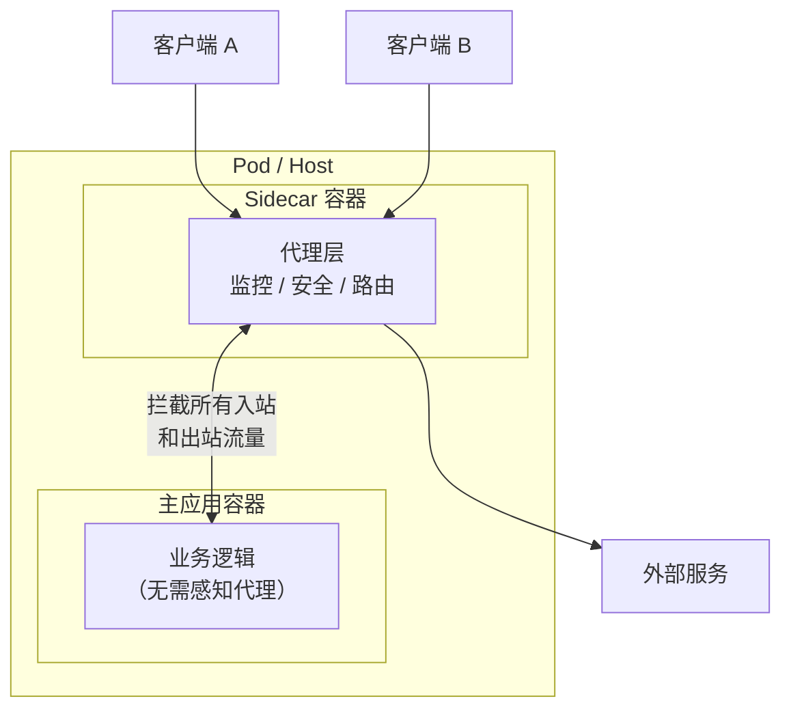
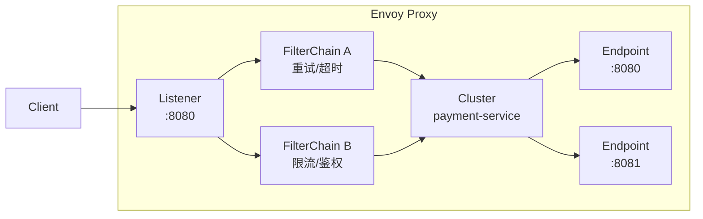

# Sidecar 边车模式

凌晨 2 点，你被拉进一个线上故障会议：支付服务偶发性超时，排查了 2 小时后发现是网络抖动导致的连接断开。问题的根源很清楚，但解决起来却让你头疼——每个调用支付服务的业务模块都需要增加重试逻辑、心跳检测、熔断降级。改一处还好，但要改 20 个模块，每个模块的代码风格还都不一样。

有没有一种方式，让业务代码完全不用改，却能让所有服务都具备熔断、重试、监控能力？

这正是 Sidecar 模式要解决的问题。

## 什么是 Sidecar 模式

Sidecar 模式将辅助功能（监控、安全、路由）从主应用中分离出来，部署为独立进程或容器，与主应用绑定在同一个主机或 Pod 中。Sidecar 与主应用共享网络命名空间，但不共享进程——它通过代理的方式拦截所有进出主应用的网络流量。



主应用完全不知道 Sidecar 的存在，它只是像往常一样发起网络请求，而 Sidecar 在背后默默完成了所有横切关注点的处理。

## Envoy 架构：Listener → FilterChain → Cluster

Istio 中使用的 Envoy 代理是 Sidecar 模式的经典实现。Envoy 的核心架构由三部分组成：

| 组件 | 职责 | 说明 |
| --- | --- | --- |
| **Listener** | 监听入口 | 接收来自下游的连接请求 |
| **FilterChain** | 过滤器链 | 对请求进行认证、限流、路由转换 |
| **Cluster** | 上游服务 | 将请求转发到具体的服务端点 |



Envoy 的配置以 xDS API 为核心，通过控制面（如 Istiod）动态下发。这意味着 Sidecar 的行为可以在不重启容器的情况下实时更新——增加新路由规则、调整熔断阈值、修改限流策略，都不需要改业务代码。

## Istio Service Mesh 中的 Sidecar 注入

Istio 提供两种 Sidecar 注入方式：

**自动注入**：在 Namespace 上添加 `istio-injection=enabled` 标签后，该 Namespace 下所有新建 Pod 会自动注入 Envoy Sidecar。

```yaml
apiVersion: v1
kind: Namespace
metadata:
  name: production
  labels:
    istio-injection: enabled
```

**手动注入**：对于无法自动注入的场景，可以使用 `istioctl` 命令手动注入。

```bash
kubectl apply -f <(istioctl kube-inject -f deployment.yaml)
```

注入后的 Pod 会包含两个容器：主应用容器和 istio-proxy 容器。它们共享网络命名空间，因此 istio-proxy 可以拦截主应用的所有出站流量。

```yaml
spec:
  containers:
  - name: payment-service        # 主应用
    image: payment-service:v1.2
    ports:
    - containerPort: 8080
  - name: istio-proxy            # Sidecar
    image: istio/proxyv2:1.18
    env:
    - name: ISTIO_META_DNS_CAPTURE
      value: "true"
```

## Sidecar 的优势

**语言无关**：不需要为每种编程语言实现 SDK。Java 服务、Go 服务、Python 服务只要部署到 Istio 网格中，就能自动获得相同的流量管理、可观测性、安全能力。

**功能解耦**：监控、安全、路由等横切关注点从业务代码中抽离，业务开发者可以专注于业务逻辑。当需要升级追踪库时，只需要更新 Sidecar，不需要重新部署业务服务。

**独立升级**：Sidecar 可以独立于主应用进行升级和配置变更。在金丝雀发布场景中，可以先更新部分 Sidecar 配置，观察效果后再全量推广。

**透明拦截**：主应用无需修改代码，不需要引入任何 Istio 依赖。Sidecar 在网络层工作，对应用完全透明。

## Sidecar 的代价

Sidecar 不是银弹，它带来的代价包括：

**资源开销**：每个 Pod 需要额外运行一个 Sidecar 容器。在 Kubernetes 环境中，这意味着额外的 CPU 和内存消耗。一个典型的 Envoy Sidecar 占用约 50-100MB 内存，CPU 消耗取决于流量大小。

**延迟增加**：每次网络请求都多经过一层代理。在 Istio 的默认配置下，约增加 1-3ms 的延迟。对于延迟敏感型业务（如高频交易），这可能是不可接受的。

**运维复杂度**：需要管理 Sidecar 的生命周期、配置分发、健康检查。当 Sidecar 配置错误时，可能会导致所有服务无法正常通信。

**调试困难**：流量经过多层代理后，问题定位需要额外的工具支持。需要同时查看业务日志和 Sidecar 日志，才能完整还原调用链路。

## Sidecar vs 库集成

有些团队选择将治理能力（如 Hystrix、Sentinel）直接集成到业务代码中，而不是使用 Sidecar。两种方式各有优劣：

| 维度 | Sidecar 模式 | 库集成 |
| --- | --- | --- |
| **语言依赖** | 语言无关 | 需要每种语言单独实现 |
| **升级方式** | 独立升级，无需重部署业务 | 需要重新编译和部署 |
| **资源占用** | 额外 Sidecar 容器 | 无额外进程，嵌入应用 |
| **延迟开销** | 网络层代理，约 1-3ms | 方法调用级别，开销更低 |
| **运维难度** | 高（需要管理额外组件） | 低（代码即配置） |
| **调试难度** | 高（多层代理） | 低（直接看到调用栈） |

对于微服务数量多、使用多语言架构的团队，Sidecar 是更好的选择。对于延迟敏感、追求极致性能的场景，库集成可能更合适。

## 适用场景

| 场景 | 适用理由 |
| --- | --- |
| **服务网格** | Istio、Linkerd 等网格需要 Sidecar 实现零侵入的流量管理 |
| **多语言服务治理** | 统一管理 Java、Go、Python 等异构服务的网络策略 |
| **遗留系统改造** | 无需修改业务代码即可为老系统增加监控和安全能力 |
| **安全合规** | 在 Sidecar 层统一执行 mTLS、认证、授权 |
| **渐进式技术升级** | 新功能通过 Sidecar 注入，老系统无需重构 |

## 常见陷阱

**陷阱一：Sidecar 配置过于宽松**。为了「不阻塞业务」，很多团队把超时设置得很长（如 30s）、重试次数设得很高（如 10 次），结果导致故障被放大，雪崩风险增加。

**陷阱二：忽视 Sidecar 的资源限制**。没有为 Sidecar 设置合适的 CPU 和内存 limits，导致在高峰时 Sidecar 先于主应用 OOM。

**陷阱三：Sidecar 版本与应用版本不兼容**。新版本 Envoy 可能不支持旧版本的 xDS API，导致配置下发失败。

## 思考题

**问题 1**：为什么 Sidecar 需要与主应用共享网络命名空间？如果不共享会怎样？

<details>
<summary>参考答案</summary>

共享网络命名空间（`networkMode: container:namespacename`）使得 Sidecar 能够拦截主应用的所有出站流量，而不需要主应用显式地将请求发送到 Sidecar 的端口。如果不共享网络命名空间，主应用需要将请求发送到 `localhost:sidecar_port`，这需要修改主应用的网络配置，违反了 Sidecar「零侵入」的原则。

</details>

**问题 2**：在 Sidecar 模式下，如果 Sidecar 本身发生故障会影响主应用吗？

<details>
<summary>参考答案</summary>

这取决于故障类型。如果 Sidecar 完全宕机（进程退出），主应用的出站流量将无法被转发，导致所有外部调用失败。为了避免这种情况，生产环境通常会配置「故障转移」策略，例如：当 Sidecar 无法响应时，允许主应用直接连接（bypass），或者使用 Readiness Probe 让 K8s 自动重启 Sidecar。

</details>

**问题 3**：Sidecar 模式与 Ambassador 模式的核心区别是什么？

<details>
<summary>参考答案</summary>

Sidecar 拦截**所有**出站流量，是一种通用代理；而 Ambassador 通常针对**特定**远程服务进行封装。Sidecar 由服务所有者控制（部署在与被代理服务相同的 Pod 中），Ambassador 由客户端所有者控制（部署在调用方侧）。在 Istio 中，Envoy Sidecar 同时承担了 Sidecar 和 Ambassador 的职责——对入站流量是 Sidecar，对出站流量是 Ambassador。

</details>