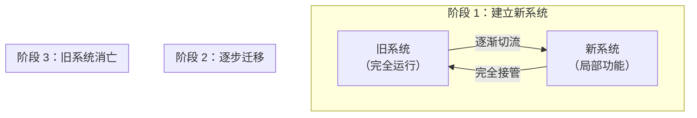

# Strangler Fig 绞杀者模式

2014 年，Netflix 的工程师面对一个艰难的选择：公司的核心系统是一个运行了 8 年的巨石应用，代码量超过 100 万行，每次发布都要排期 2 周，部署一次心惊肉跳。但要重写它？行业数据显示，99% 的大型软件重写项目都以失败告终——要么延期到天荒地老，要么重写到一半发现新系统还不如旧的。

Netflix 最终选择了另一条路：**不是一次性推翻重来，而是在旧系统外围逐步构建新服务，然后慢慢把流量从旧系统迁移到新系统，直到旧系统最终「消亡」**。

这就是 Strangler Fig 绞杀者模式的核心思想。

## 为什么大爆炸重构总失败

大爆炸重构（Big Bang Rewrite）指一次性将旧系统全部替换为新系统。这种方式看似干净利落，实际上隐藏着巨大的风险：

| 风险 | 说明 |
| --- | --- |
| **时间过长** | 大型系统重写可能需要 2-3 年，期间业务无法创新 |
| **知识丢失** | 老工程师熟悉旧系统，新团队往往低估复杂度 |
| **业务中断** | 新系统上线初期必然有各种问题，业务连续性无法保证 |
| **预算超支** | 估算不足，重写到一半发现钱不够 |
| **团队士气** | 长期看不到成果，团队疲惫 |

:::danger 真实案例：Netscape 的教训

1998 年，Netscape 决定重写浏览器核心代码。他们雄心勃勃，打算用 C++ 重写一切。结果：新版本延期 2 年发布，期间市场份额从 80% 暴跌到不足 10%。最终，IE 趁机崛起，Netscape 从此没落。这个案例被 Joel Spolsky 写成文章《Things You Should Never Do, Part I》，成为软件工程界的经典反面教材。

:::

## 绞杀者模式的核心思想

绞杀者模式源自一种植物——绞杀榕（Ficus strangler）。这种植物的种子落在其他树的枝干上，发芽后慢慢长出气根，包裹住宿主树。随着气根越来越多，宿主树逐渐被绞杀，最终只剩下一个「空心」的绞杀榕。



在软件架构中，「绞杀」的过程是通过**路由**逐步将流量从旧系统迁移到新系统：1）新系统只负责新功能；2）老功能每迁移一个，就下线旧系统的对应部分；3）直到旧系统完全「消亡」。

## 路由层：API 网关做流量分发

API 网关是绞杀者模式的核心组件。它像一个「调度员」，根据规则决定请求应该路由到旧系统还是新系统。

```mermaid
flowchart TB
    subgraph Gateway["API 网关"]
        G["流量路由器"]
    end

    subgraph Legacy["旧系统"]
        L1["用户模块"]
        L2["订单模块"]
        L3["商品模块"]
    end

    subgraph Modern["新系统"]
        M1["新用户服务"]
        M2["新订单服务"]
        M3["新商品服务"]
    end

    Client["客户端"] --> G
    G -->|"用户模块流量"| M1
    G -->|"订单模块流量"| M2
    G -->|"商品模块流量"| L3

    Note over G: 已迁移：用户、订单 | 未迁移：商品
```

### Nginx 路由配置

```nginx
# 路由配置示例
upstream legacy_service {
    server 192.168.1.10:8080;
}

upstream new_user_service {
    server 192.168.2.10:8080;
}

upstream new_order_service {
    server 192.168.2.20:8080;
}

server {
    listen 80;

    # 用户模块：已迁移到新服务
    location /api/user {
        proxy_pass http://new_user_service;
        proxy_set_header X-Service "new-user";
    }

    # 订单模块：已迁移到新服务
    location /api/order {
        proxy_pass http://new_order_service;
        proxy_set_header X-Service "new-order";
    }

    # 商品模块：仍在旧系统
    location /api/product {
        proxy_pass http://legacy_service;
        proxy_set_header X-Service "legacy";
    }
}
```

### Spring Cloud Gateway 路由

```java
@Configuration
public class RoutingConfig {
    @Bean
    public RouteLocator customRouteLocator(RouteLocatorBuilder builder) {
        return builder.routes()
            // 用户模块：路由到新服务
            .route("user-service", r -> r
                .path("/api/user/**")
                .filters(f -> f.stripPrefix(0))
                .uri("lb://new-user-service"))
            // 订单模块：路由到新服务
            .route("order-service", r -> r
                .path("/api/order/**")
                .uri("lb://new-order-service"))
            // 商品模块：仍在旧系统
            .route("product-legacy", r -> r
                .path("/api/product/**")
                .uri("http://legacy-service:8080"))
            .build();
    }
}
```

## 功能开关：灰度切量

功能开关（Feature Toggle）是控制流量分配的关键机制。它允许在不重新部署的情况下切换流量路径。

```java
public class FeatureToggleService {
    private final Map<String, Boolean> toggles = new ConcurrentHashMap<>();

    public void setToggle(String feature, boolean enabled) {
        toggles.put(feature, enabled);
        // 可以广播到所有服务实例
        broadcastToggleChange(feature, enabled);
    }

    public boolean isEnabled(String feature) {
        return toggles.getOrDefault(feature, false);
    }

    public <T> T route(String feature, Supplier<T> newService, Supplier<T> legacyService) {
        return isEnabled(feature) ? newService.get() : legacyService.get();
    }
}

// 使用示例
@Service
public class UserServiceClient {
    @Autowired
    private FeatureToggleService toggleService;

    public User getUser(Long userId) {
        return toggleService.route(
            "new-user-service",
            () -> newUserService.getUser(userId),    // 新服务
            () -> legacyUserService.getUser(userId) // 旧服务
        );
    }
}
```

### 基于百分比的灰度

```java
public class PercentageToggle {
    private final double percentage;

    public PercentageToggle(double percentage) {
        this.percentage = percentage;
    }

    public boolean shouldRouteToNew(UserRequest request) {
        // 根据用户 ID 哈希，确保同一用户始终路由到同一版本
        int hash = Math.abs(request.getUserId().hashCode() % 100);
        return hash < percentage;
    }
}

// 灰度策略：先 5% 用户，观察无问题后逐步提升到 100%
// 5% -> 10% -> 30% -> 50% -> 100%
```

## 数据层：双写与数据迁移

迁移过程中，数据层是最复杂的部分。需要同时维护新旧两套数据存储，并通过双写或数据同步保持一致。

### 双写方案

```mermaid
flowchart TB
    subgraph Write["写入流程"]
        App["应用"] --> Legacy["旧数据库"]
        App --> New["新数据库"]
    end

    subgraph Read["读取流程"]
        Read --> |"新服务优先"| New
        Read --> |"降级读取"| Legacy
    end
```

```java
public class DualWriteService {
    private final LegacyRepository legacyRepo;
    private final NewRepository newRepo;
    private final boolean newEnabled;

    @Transactional
    public void createOrder(Order order) {
        // 1. 先写旧数据库（保证兼容性）
        legacyRepo.save(order);

        // 2. 如果新服务启用，再写新数据库
        if (newEnabled) {
            try {
                newRepo.save(order);
            } catch (Exception e) {
                // 新服务写入失败，记录日志但不阻塞业务
                log.error("双写失败，orderId={}", order.getId(), e);
                // 可以加入补偿队列，稍后重试
                compensateQueue.offer(order);
            }
        }
    }
}
```

### 数据同步与回填

对于历史数据，需要进行批量迁移：

```java
public class DataMigration {
    private final LegacyRepository legacyRepo;
    private final NewRepository newRepo;
    private final long batchSize = 1000;

    public void migrateUsers() {
        long totalMigrated = 0;
        long lastId = 0;

        while (true) {
            // 分批读取旧数据
            List<User> batch = legacyRepo.findUsersAfter(lastId, batchSize);
            if (batch.isEmpty()) break;

            // 写入新数据库
            for (User user : batch) {
                try {
                    newRepo.save(user);
                    lastId = user.getId();
                } catch (DuplicateKeyException e) {
                    // 已存在，跳过
                    log.debug("用户已迁移，userId={}", user.getId());
                }
            }

            totalMigrated += batch.size();
            log.info("已迁移 {} 条记录，最后 ID: {}", totalMigrated, lastId);

            // 避免对旧数据库造成压力
            Thread.sleep(100);
        }
    }

    // 迁移完成后进行数据校验
    public void verifyData() {
        long legacyCount = legacyRepo.countUsers();
        long newCount = newRepo.countUsers();

        if (legacyCount != newCount) {
            throw new MigrationException(
                "数据校验失败：旧库 " + legacyCount + " 条，新库 " + newCount + " 条"
            );
        }

        // 抽样校验数据内容
        List<User> samples = legacyRepo.sampleUsers(100);
        for (User user : samples) {
            User newUser = newRepo.findById(user.getId());
            if (!user.equals(newUser)) {
                throw new MigrationException("数据不一致：userId=" + user.getId());
            }
        }
    }
}
```

## 真实案例

### Netflix 的微服务迁移

Netflix 从 2009 年开始，从单体架构逐步迁移到微服务架构。他们采用的就是绞杀者模式：

1. **2009**：将核心的「会员管理」功能抽取为独立服务
2. **2010-2011**：将「播放服务」迁移到云原生架构
3. **2012-2013**：继续拆分其他模块
4. **2014**：完成核心系统的微服务化

整个过程历时 5 年，期间系统保持了持续运行和新功能迭代。

### CERN 大型强子对撞机系统

欧洲核子研究组织（CERN）在升级大型强子对撞机的控制系统时，也采用了绞杀者模式。他们在原有控制系统外围构建新系统，逐步接管控制功能，最终成功完成了升级，且没有中断正在进行的实验。

> **关键经验**：绞杀者模式成功的关键不是技术，而是「增量交付」的思维方式。每迁移一个功能，都能看到业务价值；每次迁移后，都能立即验证效果。这让整个项目始终充满信心和动力。

## 迁移策略选择

| 场景 | 推荐策略 |
| --- | --- |
| **UI 层优先** | 先迁移前端，后端保持兼容 |
| **API 层优先** | 先迁移 API 入口，内部逻辑逐步重构 |
| **数据层优先** | 先迁移数据库，再迁移应用代码 |
| **边缘服务优先** | 先迁移独立的边缘服务，风险最低 |

:::tip 迁移顺序建议

建议从「影响范围小、业务价值高、技术复杂度低」的功能开始。这样可以：1）积累经验；2）建立信心；3）验证工具链；4）尽早获得业务认可。不要一开始就挑战最复杂的核心模块。

:::

## 思考题

**问题 1**：什么时候适合用绞杀者模式？

<details>
<summary>参考答案</summary>

绞杀者模式适合以下场景：1）系统复杂，短时间内无法完成重写；2）业务需要持续迭代，无法长时间「冻结」；3）团队对旧系统有一定了解，但希望引入新技术；4）系统当前稳定，不希望因重写引入风险。简单系统直接重写可能更高效，但如果系统规模大、团队经验不足，绞杀者模式是更稳妥的选择。

</details>

**问题 2**：双写过程中如何保证数据一致性？

<details>
<summary>参考答案</summary>

双写很难保证绝对一致，因为存在「写成功但网络超时」等边界情况。解决方案包括：1）异步双写 + 最终一致，允许短暂不一致；2）事务性双写，使用分布式事务（如 Seata）保证原子性；3）Change Data Capture（CDC），通过监听数据库变更日志同步数据；4）迁移完成后进行数据校验，发现不一致及时���复。实际项目通常组合使用这些方案。

</details>

**问题 3**：如何判断旧系统可以「退休」了？

<details>
<summary>参考答案</summary>

旧系统可以退休的条件包括：1）所有功能都已迁移到新系统；2）所有数据都已迁移并校验一致；3）所有流量都已切换到新系统；4）旧系统没有外部依赖（如定时任务、外部调用）；5）监控确认新系统运行稳定。退休前还需要保留旧系统的文档和备份，以备不时之需。

</details>