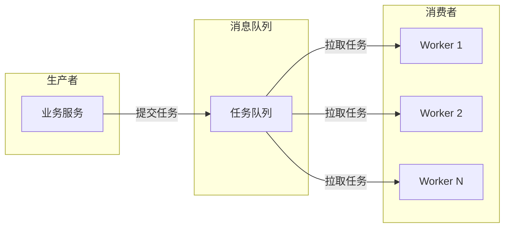
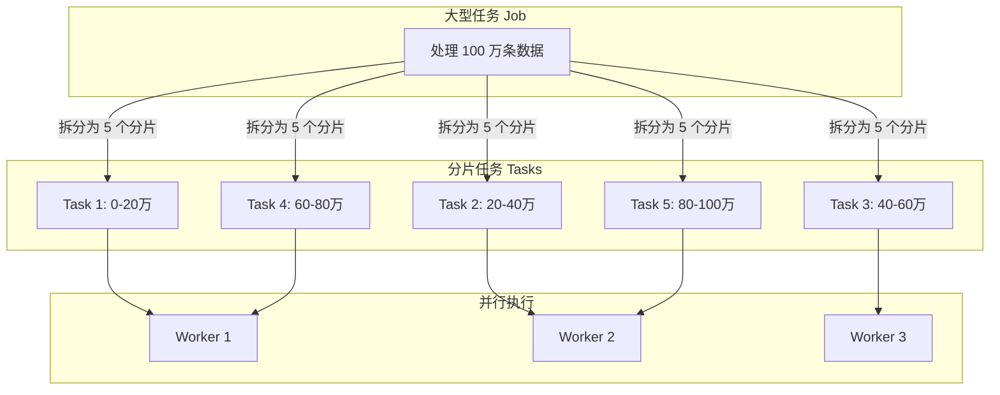
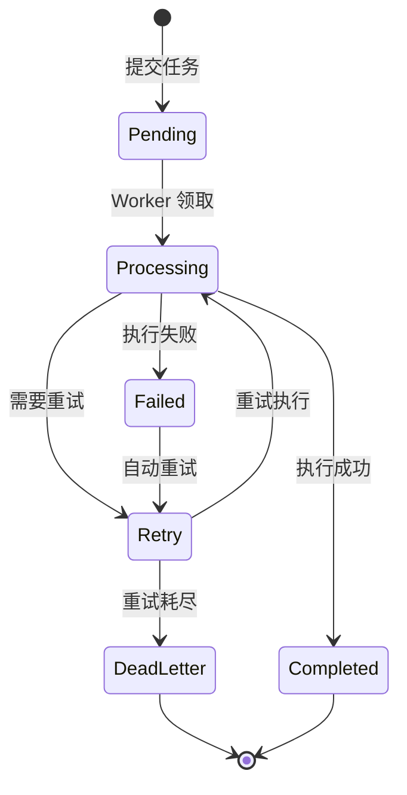

# Work Queue 工作队列模式

晚上 8 点，电商平台的秒杀活动开始了。瞬时间，订单创建请求从平时的 1000 QPS 暴涨到 10 万 QPS。你的服务能承受吗？如果订单处理是同步的，数据库、缓存、外部支付接口都会被瞬间打爆。

但聪明的架构师不会让这种事发生。他们把订单请求先接收下来，扔进一个队列，然后按照系统能承受的速度慢慢处理。这就像三峡大坝的作用——不是让洪水直接冲向下游，而是在库容范围内调节流量。

这就是 Work Queue 工作队列模式的核心思想。

## 工作队列模式的核心思想

Work Queue 模式将任务的**提交**与**执行**解耦。任务发起者不需要等待任务完成，只需要将任务描述扔进队列；worker 从队列中获取任务，按照自己的节奏执行。



这种模式带来了几个关键优势：

1. **削峰填谷**：瞬时高峰被队列吸收，worker 平稳处理
2. **异步处理**：发起者不需要等待任务完成
3. **负载均衡**：多个 worker 分担任务处理
4. **解耦**：生产者和消费者独立演进，互不感知

## 分布式任务队列

### Kafka：高性能日志流

Kafka 适合高吞吐量的日志类任务，如日志收集、事件处理、数据管道。

```java
public class KafkaTaskProducer {
    private final KafkaProducer<String, TaskMessage> producer;
    private final String taskTopic = "work-queue-tasks";

    public void submitTask(Task task) {
        TaskMessage message = TaskMessage.newBuilder()
            .setTaskId(UUID.randomUUID().toString())
            .setTaskType(task.getType())
            .setPayload(task.getPayload())
            .setPriority(task.getPriority())
            .setSubmitTime(System.currentTimeMillis())
            .build();

        // 按任务类型分区，保证同类型任务有序处理
        producer.send(new ProducerRecord<>(
            taskTopic,
            task.getType(),  // partition key
            message
        ));
    }
}

public class KafkaTaskConsumer {
    private final KafkaConsumer<String, TaskMessage> consumer;

    public void processTasks() {
        while (running) {
            ConsumerRecords<String, TaskMessage> records = consumer.poll(Duration.ofSeconds(1));

            for (ConsumerRecord<String, TaskMessage> record : records) {
                TaskMessage task = record.value();
                try {
                    processTask(task);
                    // 手动提交 offset，保证 exactly-once
                    consumer.commitSync();
                } catch (Exception e) {
                    // 任务失败，进入重试队列
                    retryQueue.offer(task);
                }
            }
        }
    }
}
```

### RabbitMQ：灵活的路由

RabbitMQ 适合需要复杂路由、多租户隔离、任务优先级的场景。

```java
public class RabbitTaskProducer {
    private final RabbitTemplate template;

    public void submitTask(Task task) {
        Map<String, Object> headers = new HashMap<>();
        headers.put("x-task-type", task.getType());
        headers.put("x-priority", task.getPriority());
        headers.put("x-retry-count", 0);

        template.convertAndSend(
            "work-exchange",    // 交换机
            "task." + task.getType(),  // 路由键
            task.getPayload(),
            m -> {
                m.getMessageProperties().setHeaders(headers);
                // 消息 TTL，过期后进入死信队列
                m.getMessageProperties().setExpiration("3600000");
                return m;
            }
        );
    }
}

public class RabbitTaskConsumer {
    @RabbitListener(queues = "work-queue", concurrency = "3-10")
    public void processTask(TaskMessage message, Channel channel, @Header(AmqpHeaders.DELIVERY_TAG) long tag) {
        try {
            // 处理任务
            doProcess(message.getPayload());

            // 手动确认
            channel.basicAck(tag, false);
        } catch (Exception e) {
            // 任务失败，消息重新入队
            channel.basicNack(tag, false, true);
        }
    }
}
```

### RocketMQ：事务消息

RocketMQ 提供事务消息能力，适合需要「本地事务 + 消息」原子性的场景。

```java
public class RocketTaskProducer {
    private final TransactionMQProducer producer;

    public void submitTaskWithTransaction(Task task, Runnable localTransaction) {
        Message message = new Message("task-topic", task.getType(), task.getPayload());

        producer.sendMessageInTransaction(message, (msg, arg) -> {
            // 执行本地事务
            localTransaction.run();
            // 返回事务状态
            return LocalTransactionState.COMMIT_MESSAGE;
        }, null);
    }
}
```

## 任务分片：Job 与 Task 的分离

当单个任务处理时间较长时，可以将任务拆分为多个分片并行处理。



```java
public class JobSplitter {
    public List<Task> splitJob(Job job, int shardCount) {
        long totalRecords = job.getTotalRecords();
        long shardSize = (totalRecords + shardCount - 1) / shardCount;

        List<Task> tasks = new ArrayList<>();
        for (int i = 0; i < shardCount; i++) {
            long start = i * shardSize;
            long end = Math.min(start + shardSize, totalRecords);

            tasks.add(Task.builder()
                .jobId(job.getId())
                .shardId(i)
                .startRecord(start)
                .endRecord(end)
                .totalShards(shardCount)
                .build());
        }
        return tasks;
    }
}
```

## 任务持久化与重试

### 持久化策略

任务不能「丢了就丢了」，必须持久化到磁盘或可靠的存储中。

| 持久化级别 | 说明 | 适用场景 |
| --- | --- | --- |
| **内存队列** | 只存内存，宕机丢失 | 开发测试 |
| **磁盘持久化** | 消息落盘，宕机可恢复 | 一般生产环境 |
| **多副本同步** | 多节点同步写入 | 关键任务 |

Kafka 默认将消息持久化到磁盘，并通过操作系统的 Page Cache 优化读写性能。对于更严格的持久化要求，可以配置 `acks=all`，等待所有 ISR（in-sync replica）确认。

### 重试机制

任务执行失败后，需要进入重试流程。常见重试策略：

```java
public class RetryableTaskProcessor {
    private final int maxRetries = 3;
    private final Map<String, Integer> retryCount = new ConcurrentHashMap<>();

    public ProcessingResult process(Task task) {
        int currentRetry = retryCount.getOrDefault(task.getId(), 0);

        try {
            // 执行业务逻辑
            return doProcess(task);
        } catch (TransientException e) {
            // 瞬时错误，可重试
            if (currentRetry < maxRetries) {
                retryCount.put(task.getId(), currentRetry + 1);
                // 指数退避：1s, 2s, 4s
                long delay = (long) Math.pow(2, currentRetry) * 1000;
                scheduleRetry(task, delay);
                return ProcessingResult.RETRY_SCHEDULED;
            } else {
                // 超过重试次数，进入死信队列
                deadLetterQueue.offer(task);
                return ProcessingResult.DEAD_LETTER;
            }
        } catch (PermanentException e) {
            // 永久错误，不重试
            deadLetterQueue.offer(task);
            return ProcessingResult.DEAD_LETTER;
        }
    }
}
```

## 任务状态追踪

对于关键业务任务，需要追踪其完整生命周期。



```java
public class TaskStateTracker {
    private final RedisTemplate<String, String> redis;

    public void updateTaskState(String taskId, TaskState state, String detail) {
        String key = "task:state:" + taskId;

        // 使用 Redis 事务保证原子性
        redis.execute(new SessionCallback<Object>() {
            @Override
            public Object execute(RedisOperations operations) throws DataAccessException {
                operations.multi();
                operations.opsForHash().put(key, "state", state.name());
                operations.opsForHash().put(key, "updatedAt", String.valueOf(System.currentTimeMillis()));
                operations.opsForHash().put(key, "detail", detail);

                // 记录状态变更历史
                operations.opsForList().rightPush("task:history:" + taskId,
                    state.name() + ":" + System.currentTimeMillis());

                return operations.exec();
            }
        });
    }

    public TaskStatus getTaskStatus(String taskId) {
        String key = "task:state:" + taskId;
        Map<Object, Object> state = redis.opsForHash().entries(key);

        return TaskStatus.builder()
            .taskId(taskId)
            .state(TaskState.valueOf((String) state.get("state")))
            .detail((String) state.get("detail"))
            .updatedAt(Long.parseLong((String) state.get("updatedAt")))
            .history(getTaskHistory(taskId))
            .build();
    }
}
```

## 分布式 Work Queue vs 本地线程池

| 维度 | 分布式 Work Queue | 本地线程池 |
| --- | --- | --- |
| **任务范围** | 跨进程、跨机器 | 单进程内 |
| **故障恢复** | 任务持久化，worker 重启后可继续 | worker 重启后任务丢失 |
| **扩展性** | 可以增加 worker 机器 | 受单机资源限制 |
| **延迟** | 有队列和网络开销 | 纯内存，无额外开销 |
| **复杂度** | 需要队列、序列化、网络等 | 简单 |
| **适用场景** | 异步任务、跨服务协作 | 并发处理、批量计算 |

:::tip 选型建议

如果任务处理是**CPU 密集型**且在**单机内完成**，用本地线程池更简单高效；如果任务是**IO 密集型**或需要**跨服务协作**，分布式 Work Queue 是更好的选择。很多系统会同时使用两者：本地线程池负责计算，分布式队列负责分发。

:::

## 思考题

**问题 1**：如果消息队列本身故障了，任务会丢失吗？如何保证不丢失？

<details>
<summary>参考答案</summary>

如果消息队列故障，任务是否会丢失取决于持久化配置和队列架构。对于 Kafka，可以通过以下配置保证不丢失：`replication.factor >= 3`、`min.insync.replicas >= 2`、`acks=all`。对于 RabbitMQ，需要使用镜像队列或仲裁队列（Quorum Queue）。此外，生产者在发送消息时应该使用同步发送并检查返回码，失败时重试或持久化到本地。但要注意：没有绝对不丢失的系统，需要在可靠性、成本、性能之间做权衡。

</details>

**问题 2**：Worker 数量如何确定？是不是越多越好？

<details>
<summary>参考答案</summary>

Worker 数量取决于多个因素：任务类型（CPU 密集还是 IO 密集）、下游服务能力（数据库连接池、API 限流）、队列积压情况。CPU 密集型任务的 Worker 数一般设置为 CPU 核心数；IO 密集型任务可以多一些（因为大部分时间在等待）。但 Worker 过多可能导致资源竞争、下游服务过载。推荐做法是：从小数量开始，通过监控队列积压和消费延迟，动态调整 Worker 数量。

</details>

**问题 3**：如何处理「重复消费」问题？

<details>
<summary>参考答案</summary>

分布式队列在某些情况下（如网络抖动、consumer 重启）可能重复投递消息。幂等性处理是关键：1）业务层面设计幂等接口（如唯一订单号）；2）使用数据库唯一索引防止重复写入；3）Redis Set 记录已处理的 taskId，处理前先检查；4）消息中携带唯一 ID，消费者根据 ID 做去重。对于 Kafka，可以使用事务或 Exactly-Once 语义（需要下游支持事务）。

</details>