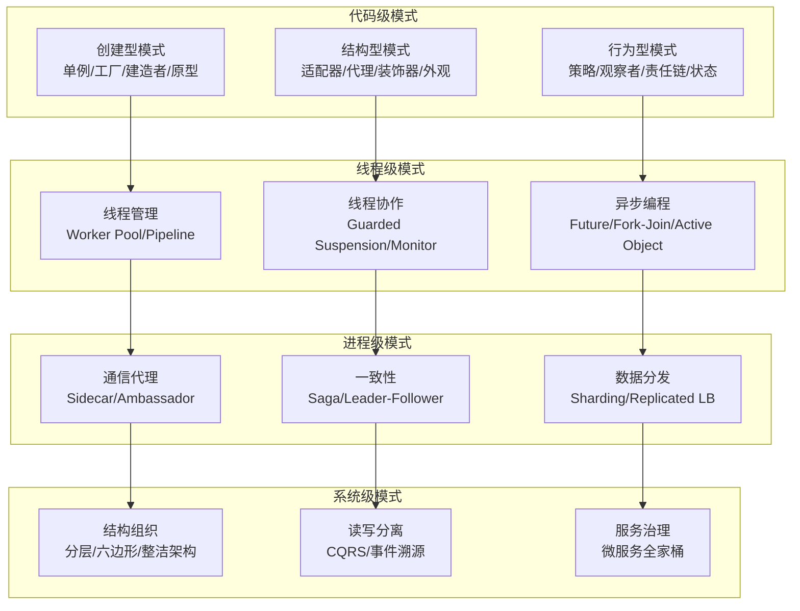
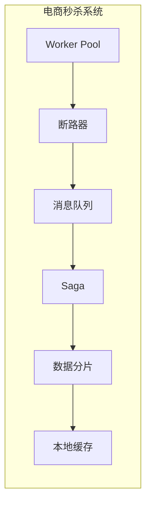
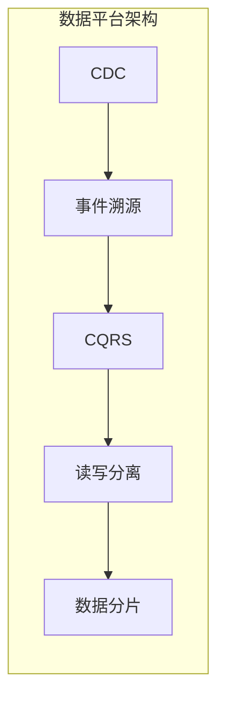

# 设计模式

「这段代码写得不错，用了观察者模式。」

「观察者模式？可是 EventListener 明明是个interface，你直接用接口也行啊，为什么要包装一层？」

这是很多工程师在学设计模式时都会遇到的困惑——**知道模式是什么，却不知道什么时候该用**。

设计模式不是背出来的，是用出来的。死记硬背只会导致「手里有锤子，看什么都像钉子」。真正理解一个模式，意味着你能说出：它解决了什么问题？在什么场景下它比替代方案更好？它的代价是什么？什么情况下不该用它？

本分类聚焦后端开发中最核心的设计模式知识体系，从 GoF 23 种经典模式，到并发编程中的模式，到分布式场景下的模式，再到架构层面的风格选型——帮助你建立从「代码级模式」到「系统级架构」的完整设计思维。

## 模块结构

本分类按粒度和应用场景分为 6 个子分类：

| 子分类 | 核心问题 | 包含内容 |
| --- | --- | --- |
| **应用设计模式** | 代码怎么组织、对象怎么创建 | GoF 23 种经典模式（创建型/结构型/行为型） |
| **并发设计模式** | 多线程环境下怎么协调资源 | Worker Pool、Producer-Consumer、Guarded Suspension、Future/Promise 等 |
| **分布式模式** | 跨进程、跨网络怎么协同 | Sidecar、Ambassador、Leader-Follower、Sharding、Saga 等 |
| **架构风格** | 系统整体结构怎么组织 | 分层、六边形、整洁架构、CQRS、EDA 等 |
| **微服务模式** | 服务怎么治理、怎么通信 | API 网关、断路器、服务注册、链路追踪等 |
| **数据架构模式** | 数据怎么存储、怎么流转 | 读写分离、CQRS、事件溯源、Saga、分片复制等 |

## 模式层次关系

从代码到系统，设计模式分布在不同的抽象层次上：

这张图展示了一个清晰的递进关系：

- **创建型** 解决「对象怎么建」——是并发模式的基础
- **结构型** 解决「类怎么组合」——是分布式适配器的基础
- **行为型** 解决「对象怎么协作」——是异步通信模式的基础
- **并发模式** 解决「线程怎么用」——是分布式协调的基础
- **分布式模式** 解决「进程怎么协同」——是微服务架构的基础
- **架构风格** 决定「系统整体怎么组织」——是所有模式最终落地的地方

## 为什么需要设计模式

设计模式的本质是**经过验证的问题-解决方案映射**。它们之所以存在，是因为某些问题在软件开发中反复出现，每次从零思考效率太低。

但模式也是一把双刃剑：

:::danger 模式滥用的代价

**过度工程化的典型症状**：

- 只有两种策略，却引入了策略模式 + 工厂模式
- 业务简单到不需要扩展，却上了六边形架构
- 单体架构足够用，却拆成了十几套微服务

引入模式之前，问自己三个问题：当前问题是什么？这个模式能解决吗？有没有更简单的方案？

如果三个问题的答案都是「是」，那就用。如果有任何一个是「不确定」，先别用。

:::

**什么时候该用模式**：

- 问题反复出现，模式是经过验证的解决方案
- 团队需要共同语言，模式提供了标准词汇表
- 系统需要长期维护，模式帮助建立清晰的边界

**什么时候不该用模式**：

- 问题规模小，模式带来的复杂度反而更高
- 团队不熟悉模式，强行引入只会造成困惑
- 没有真实需求，只是「觉得以后可能需要」

## 各子分类导读

### 应用设计模式

如果你只学过 Java 基础，从这里开始。理解 GoF 23 种经典模式，是理解所有后续模式的基础。

**必读**：[单例模式](/patterns/application/singleton)——最简单也最容易踩坑的模式；[工厂模式](/patterns/application/factory)——创建逻辑复杂时的标准解法；[策略模式](/patterns/application/strategy)——消除 if-else 的利器。

**推荐**：[装饰器模式](/patterns/application/decorator)——Java I/O 流的经典应用；[责任链模式](/patterns/application/chain)——拦截器链的标准实现；[观察者模式](/patterns/application/observer)——事件驱动的基础。

**选读**：[访问者模式](/patterns/application/visitor)、[解释器模式](/patterns/application/interpreter)——这两个模式在实际业务中很少用到，但理解它们有助于理解编译器和规则引擎。

### 并发设计模式

如果你已经有一定 Java 基础，想深入理解多线程编程，从这里开始。

**必读**：[Worker Pool](/patterns/concurrency/worker-pool)——线程复用的核心；[Future/Promise](/patterns/concurrency/future-promise)——异步编程的入门；[Read-Write Lock](/patterns/concurrency/read-write-lock)——读多写少场景的优化。

**推荐**：[Producer-Consumer](/patterns/concurrency/producer-consumer)——削峰填谷的标准实现；[Guarded Suspension](/patterns/concurrency/guarded-suspension)——条件同步的经典模式；[Thread Local](/patterns/concurrency/thread-local)——避免传参和锁竞争的利器。

**选读**：[Double-Checked Locking](/patterns/concurrency/double-checked-locking)——单例模式的高性能实现；[Active Object](/patterns/concurrency/active-object)——方法与执行分离的高级模式。

### 分布式模式

如果你的系统已经拆分成多个服务，或者你正在学习微服务架构，从这里开始。

**必读**：[Sidecar 边车模式](/patterns/distributed/sidecar)——Service Mesh 的核心概念；[Leader-Follower 领导者追随者模式](/patterns/distributed/leader-follower)——主从复制与选举机制；[Saga 分布式事务模式](/patterns/data-architecture/saga)（在数据架构分类下）——跨服务数据一致性的标准方案。

**推荐**：[Ambassador 大使模式](/patterns/distributed/ambassador)——跨语言通信的封装方案；[Sharding 分片模式](/patterns/distributed/sharding)——数据水平扩展的基础；[Work Queue 工作队列模式](/patterns/distributed/work-queue)——异步任务处理。

**选读**：[Scatter-Gather 散聚模式](/patterns/distributed/scatter-gather)——并行查询与结果聚合；[Strangler Fig 绞杀者模式](/patterns/distributed/strangler-fig)——单体到微服务的平滑迁移。

### 架构风格

如果你正在做系统架构设计，或者想理解为什么 Spring、DDD 等框架要那样组织代码，从这里开始。

**必读**：[分层架构](/patterns/architectural-styles/layered)——最容易上手也是最容易被低估的风格；[六边形架构](/patterns/architectural-styles/hexagonal)——理解依赖倒置的核心思想。

**推荐**：[整洁架构](/patterns/architectural-styles/clean)——六边形的进阶版，内层不依赖外层的原则；[CQRS](/patterns/architectural-styles/cqrs)——读写分离的架构视角；[EDA 事件驱动架构](/patterns/architectural-styles/eda)——微服务解耦的核心思路。

**选读**：[洋葱架构](/patterns/architectural-styles/onion)、[微内核架构](/patterns/architectural-styles/microkernel)、[事件溯源](/patterns/architectural-styles/event-sourcing)。

### 微服务模式

如果你正在构建或维护微服务架构，这里是必读的。

**核心治理模式**：[API 网关模式](/patterns/microservices/api-gateway)、[服务注册中心](/patterns/microservices/registry)、[服务发现模式](/patterns/microservices/service-discovery)。

**弹性与容错**：[断路器模式](/patterns/microservices/circuit-breaker)、[重试模式](/patterns/microservices/retry)、[隔板模式](/patterns/microservices/bulkhead)。

**基础设施**：[分布式配置](/patterns/microservices/distributed-config)、[链路追踪模式](/patterns/microservices/distributed-tracing)、[健康检查模式](/patterns/microservices/health-check)。

### 数据架构模式

如果你的系统面临数据量增长、一致性要求、或者需要设计数据密集型应用，从这里开始。

**入门**：[读写分离模式](/patterns/data-architecture/read-write-split)——最简单的性能优化手段；[数据复制模式](/patterns/data-architecture/replication)——主从、多主、无主的选型。

**进阶**：[Saga 分布式事务模式](/patterns/data-architecture/saga)——跨服务事务的完整方案；[CQRS 数据读写分离](/patterns/data-architecture/cqrs-data)——读写分离的架构视角；[数据分片（Sharding）模式](/patterns/data-architecture/sharding)——数据水平扩展。

## 模式之间的协作

在真实项目中，模式几乎总是组合使用的。以下是几个典型场景：

理解这些组合关系，比单独记住每个模式更重要。

准备好了吗？让我们从最基础也最重要的**应用设计模式**开始。
