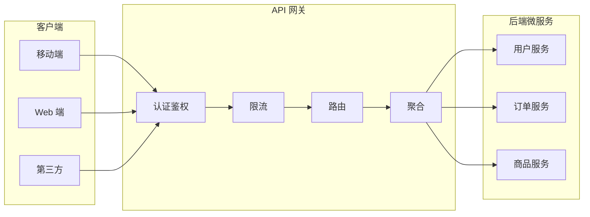
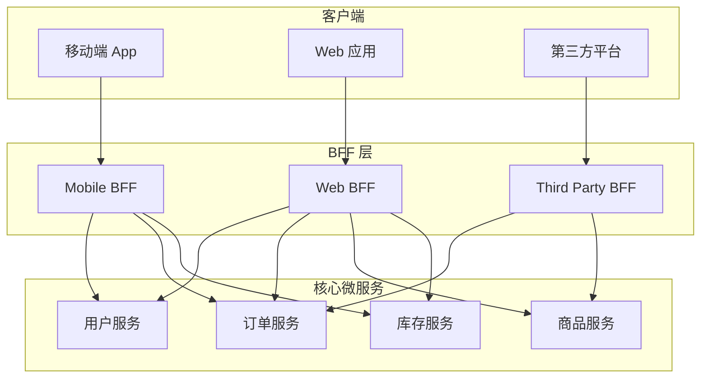

# API 网关模式

移动端需要精简的数据格式，Web 端需要完整的页面结构，第三方合作伙伴需要定制化的接口协议——当这些需求同时出现在一个系统里，你是怎么处理的？

在很多团队里，答案是「各自调各自的微服务」。结果，移动端调了 15 个接口拼成一个页面，Web 端调了 20 个接口，后端 API 调了 30 个接口。每个客户端都要理解整个微服务的调用关系，稍微改一个字段，多个客户端都要跟着改。

**问题的本质是：谁该负责接口聚合？**

API 网关模式的核心答案就是：让网关统一做这件事。客户端只跟网关通信，网关负责路由、聚合、协议转换、认证鉴权——把客户端从微服务的复杂性中解放出来。

## API 网关的核心职责

API 网关不只是「路由转发」那么简单。一个生产级 API 网关，通常承担以下职责：

**统一入口**。所有外部流量都经过网关，网关成为系统的唯一入口。这带来了统一的安全策略、统一的流量控制、统一的服务治理。没有网关的系统，���像没有门卫的小区——谁都能进，谁都能随便调服务。

**路由与负载均衡**。根据请求路径、服务名、Header 信息，将请求路由到对应的后端服务。同时基于健康检查结果，做故障转移和负载均衡。

**协议转换**。HTTP/gRPC、WebSocket、TCP——不同客户端可能使用不同协议，网关负责协议之间的转换。比如移动端用 HTTP，后端用 gRPC，网关做协议适配。

**认证鉴权**。统一在网关层验证 Token、Session、API Key。不需要每个微服务都重复实现认证逻辑。集中认证的好处不只是代码复用，更关键的是：安全策略的变更只需要改一个地方。

**限流与熔断**。在网关层识别异常流量、拦截攻击、限制高频请求。同时集成熔断器，防止故障在网关处被放大。

**请求聚合**。对于移动端等需要聚合多个微服务数据的场景，网关可以并行调用多个服务，将结果组装后返回给客户端，减少客户端的网络往返次数。



## Spring Cloud Gateway 实战

Spring Cloud Gateway 是 Spring Cloud 生态中的 API 网关组件，基于 Spring 5 的 WebFlux 框架，实现了响应式非阻塞的请求处理。相比上一代网关 Zuul，性能提升显著。

### 核心配置

```yaml title="application.yml"
spring:
  cloud:
    gateway:
      routes:
        - id: user-service
          uri: lb://user-service
          predicates:
            - Path=/api/users/**
          filters:
            - StripPrefix=2
            - name: RequestRateLimiter
              args:
                redis-rate-limiter.replenishRate: 100
                redis-rate-limiter.burstCapacity: 200
        - id: order-service
          uri: lb://order-service
          predicates:
            - Path=/api/orders/**
          filters:
            - StripPrefix=2
```

### 自定义过滤器实现认证

```java title="AuthenticationFilter.java"
@Component
public class AuthenticationFilter implements GlobalFilter {
    
    private final JwtService jwtService;
    
    @Override
    public Mono<Void> filter(ServerWebExchange exchange, 
                            GatewayFilterChain chain) {
        String path = exchange.getRequest().getURI().getPath();
        
        // 公开路径跳过认证
        if (isPublicPath(path)) {
            return chain.filter(exchange);
        }
        
        String token = extractToken(exchange.getRequest());
        if (token == null || !jwtService.validate(token)) {
            exchange.getResponse().setStatusCode(HttpStatus.UNAUTHORIZED);
            return exchange.getResponse().setComplete();
        }
        
        // 将用户信息添加到请求头，传递给下游服务
        ServerHttpRequest mutatedRequest = exchange.getRequest().mutate()
            .header("X-User-Id", jwtService.getUserId(token))
            .header("X-User-Role", jwtService.getRole(token))
            .build();
        
        return chain.filter(
            exchange.mutate().request(mutatedRequest).build()
        );
    }
    
    private boolean isPublicPath(String path) {
        return path.startsWith("/api/auth/") || 
               path.startsWith("/api/public/");
    }
    
    private String extractToken(ServerHttpRequest request) {
        List<String> headers = request.getHeaders().get("Authorization");
        if (headers == null || headers.isEmpty()) {
            return null;
        }
        String bearerToken = headers.get(0);
        return bearerToken.startsWith("Bearer ") 
            ? bearerToken.substring(7) 
            : bearerToken;
    }
}
```

### 动态路由配置

Spring Cloud Gateway 支持通过配置中心动态更新路由，无需重启网关：

```java title="DynamicRouteConfig.java"
@Configuration
public class DynamicRouteConfig {
    
    @Autowired
    private RouteDefinitionWriter routeDefinitionWriter;
    
    @Autowired
    private ApplicationEventPublisher publisher;
    
    public void addRoute(RouteDefinition definition) {
        routeDefinitionWriter.save(Mono.just(
            RouteDefinitionLocator.of(definition)
        )).flatMap(r -> Mono.empty());
        publisher.publishEvent(new RefreshRoutesEvent(this));
    }
    
    public void deleteRoute(String routeId) {
        routeDefinitionWriter.delete(Mono.just(routeId));
        publisher.publishEvent(new RefreshRoutesEvent(this));
    }
}
```

## API 网关 vs 反向代理

很多人把 API 网关和 Nginx 这类反向代理混为一谈。两者确实有重叠，但定位有本质区别：

| 维度 | API 网关 | 反向代理 |
| --- | --- | --- |
| **职责边界** | 面向微服务架构，处理业务路由、聚合、协议转换 | 面向基础设施，处理流量分发、七层负载均衡 |
| **协议理解** | 理解业务语义，可以改写请求体/响应体 | 传输层透明转发，不解析业务数据 |
| **服务治理** | 集成熔断、限流、重试、认证 | 基础的健康检查和重试 |
| **配置方式** | 通常提供 API 或 SDK 动态配置 | 配置文件，需要 reload |
| **适用场景** | 微服务入口、需要业务逻辑的场景 | 静态资源加速、四层负载均衡 |

**什么时候用 API 网关？**

- 微服务架构，需要统一入口
- 不同客户端需要不同的接口聚合方式
- 需要在入口层做认证、鉴权、限流

**什么时候用反向代理够用？**

- 单纯的流量分发，没有复杂的路由规则
- 静态资源服务，不需要理解业务
- 已经有一套成熟的微服务治理方案，只需要一个流量入口

实际生产中，两者经常组合使用：Nginx 处理四层负载均衡和静态资源，API 网关处理七层业务路由。

## BFF 模式

Backend For Frontend（BFF）是一种特殊的 API 网关模式，专门为每种客户端提供定制化的后端服务。

传统 API 网关的问题在于：它试图用一套接口满足所有客户端。但移动端的 UI 结构、数据格式、性能要求和 Web 端完全不同。BFF 的思路是：为每种客户端提供专用的 BFF 服务，各自有独立的接口定义和数据聚合逻辑。



### BFF 的权衡

**BFF 的优势**：

- 每个客户端有独立的接口定义，互不影响
- 客户端团队可以自主迭代自己的 BFF
- 聚合逻辑在服务端完成，减少客户端的网络开销
- 不同客户端的接口可以独立演进、独立发布

**BFF 的代价**：

- 多了一层服务，运维成本增加
- 如果聚合逻辑相似，可能造成代码重复
- 需要有团队为每个 BFF 负责

### BFF 实现示例

```java title="MobileBffApplication.java"
@SpringBootApplication
@EnableFeignClients
public class MobileBffApplication {
    public static void main(String[] args) {
        SpringApplication.run(MobileBffApplication.class, args);
    }
}
```

```java title="MobileProductController.java"
@RestController
@RequestMapping("/mobile/products")
public class MobileProductController {
    
    private final ProductFeignClient productClient;
    private final PriceFeignClient priceClient;
    private final InventoryFeignClient inventoryClient;
    
    // 移动端只需要精简的数据结构
    @GetMapping("/{productId}")
    public Mono<ProductSummaryVO> getProductSummary(@PathVariable String productId) {
        // 并行调用三个服务，减少总延迟
        Mono<Product> productMono = productClient.getProduct(productId);
        Mono<Price> priceMono = priceClient.getPrice(productId);
        Mono<Inventory> inventoryMono = inventoryClient.getStock(productId);
        
        return Mono.zip(productMono, priceMono, inventoryMono)
            .map(tuple -> new ProductSummaryVO(
                tuple.getT1().getId(),
                tuple.getT1().getName(),
                tuple.getT1().getThumbnail(),
                tuple.getT2().getCurrentPrice(),
                tuple.getT3().getAvailableStock()
            ));
    }
}
```

## 常见问题与反模式

### 网关单点问题

所有流量都经过网关，网关就变成了新的单点。解决方案：

- 部署多个网关实例，前置负载均衡器
- 网关无状态设计，状态信息存在 Redis 等外部存储
- 监控网关健康状态，自动摘除故障实例

### 网关过重问题

把太多逻辑塞进网关，导致网关成为性能瓶颈：

- 避免在网关层做复杂的业务逻辑计算
- 避免在网关层做大量的数据聚合（交给 BFF）
- 网关只做路由、聚合、认证，不做业务处理

### 循环依赖问题

当网关需要调用认证服务，而认证服务又需要通过网关访问时，会形成循环依赖。解决方案：

- 将认证服务作为基础服务独立部署
- 公共基础服务不经过网关直连
- 或者网关配置白名单，跳过某些路径的认证检查

## 适用场景

**应该使用 API 网关**：

- 微服务数量 `>=` 10，客户端类型多样
- 需要统一的认证、鉴���、限流策略
- 不同客户端需要不同的接口聚合方式
- 需要在入口层做日志追踪和流量监控

**暂不需要 API 网关**：

- 微服务数量少，客户端类型单一
- 已经通过 Service Mesh 处理了流量管理
- 团队规模小，先追求功能实现

API 网关是微服务架构的重要基础设施，但它不是万能药。引入网关之前，先问自己：当前最大的痛点是什么？网关能解决吗？团队能维护好几套网关吗？

如果答案是「能」，那就引入。如果答案是「不确定」，先用一个简单的 Nginx 反向代理试试水，等痛点真正出现再加码。
