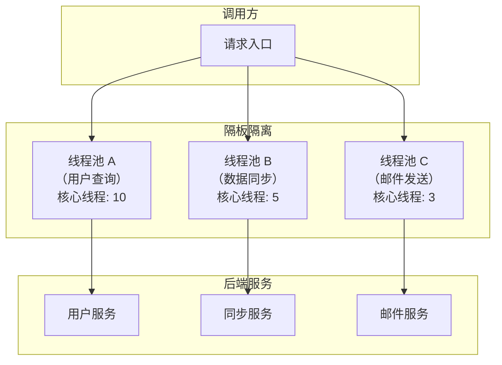
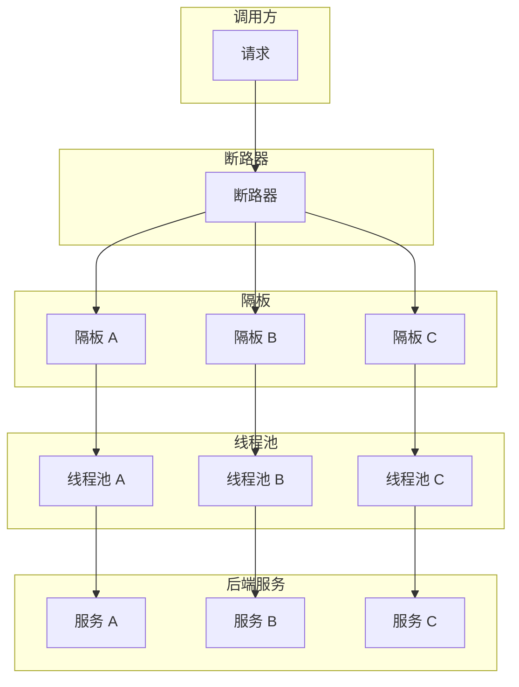

# 隔板模式

你的系统同时处理两种请求：一种是用户查询，优先级高，要求快速响应；另一种是数据同步，优先级低，可以接受稍长延迟。两种请求共享同一个线程池。

突然，数据同步请求激增，占满了线程池。用户查询请求进不来，开始超时。用户投诉：「为什么我的查询变慢了？」

问题出在哪里？**不同类型的请求共享了同一个资源池，一个类型的请求激增会影响其他类型的请求。**

隔板模式的核心思想是：**用隔板（Bulkhead）把不同的资源池隔开，一个池满了不影响其他池。** 灵感来自轮船的舱壁设计：船舱漏水时，隔板阻止水流到其他舱室，保证船不会沉没。

## 线程池隔离 vs 信号量隔离

隔板模式有两种实现方式：线程池隔离和信号量隔离。

### 线程池隔离

为每种类型的请求分配独立的线程池，线程池之间互不影响：



### 信号量隔离

不创建新线程池，而是使用信号量（Semaphore）限制并发数。不创建新线程，适合 IO 密集型任务：

```java title="SemaphoreBulkhead.java"
public class SemaphoreBulkhead {
    
    private final Semaphore semaphore;
    private final int maxConcurrentCalls;
    
    public SemaphoreBulkhead(int maxConcurrentCalls) {
        this.maxConcurrentCalls = maxConcurrentCalls;
        this.semaphore = new Semaphore(maxConcurrentCalls);
    }
    
    public <T> T execute(Supplier<T> task, Supplier<T> fallback) {
        if (!semaphore.tryAcquire()) {
            log.warn("Bulkhead rejected: {} calls in progress", maxConcurrentCalls);
            return fallback.get();
        }
        
        try {
            return task.get();
        } finally {
            semaphore.release();
        }
    }
}
```

### 两种隔离方式对比

| 维度 | 线程池隔离 | 信号量隔离 |
| --- | --- | --- |
| **资源管理** | 独立的线程池 | 共享线程池 |
| **适用场景** | CPU 密集型、耗时操作 | IO 密集型、快速操作 |
| **线程开销** | 有（线程创建/销毁） | 无 |
| **超时控制** | 线程池超时 | 需要单独处理 |
| **隔离效果** | 完全隔离 | 限流隔离 |

## Resilience4j Bulkhead 实战

Resilience4j 提供了开箱即用的 Bulkhead 实现，支持线程池隔离和信号量隔离。

### 信号量隔离配置

```yaml title="application.yml"
resilience4j:
  bulkhead:
    instances:
      userService:
        # 最大并发调用数
        maxConcurrentCalls: 10
        # 等待调用获取许可的超时时间
        maxWaitDuration: 100ms
      orderService:
        maxConcurrentCalls: 20
        maxWaitDuration: 50ms
```

### 线程池隔离配置

```yaml title="application.yml"
resilience4j:
  threadpool-bulkhead:
    instances:
      asyncService:
        # 核心线程数
        maxThreadPoolSize: 10
        # 队列容量
        queueCapacityDuration: 100
        # 保持空闲时间
        keepAliveDuration: 60s
        # 核心线程数
        coreThreadPoolSize: 5
```

### 代码使用

```java title="BulkheadService.java"
@Service
public class BulkheadService {
    
    private final BulkheadRegistry bulkheadRegistry;
    private final UserFeignClient userFeignClient;
    
    public BulkheadService(BulkheadRegistry bulkheadRegistry,
                          UserFeignClient userFeignClient) {
        this.bulkheadRegistry = bulkheadRegistry;
        this.userFeignClient = userFeignClient;
        
        // 注册事件监听
        Bulkhead bulkhead = bulkheadRegistry.bulkhead("userService");
        bulkhead.getEventPublisher()
            .onCallPermitted(event -> 
                log.debug("Call permitted"))
            .onCallRejected(event ->
                log.warn("Call rejected by bulkhead"))
            .onCallFinished(event ->
                log.debug("Call finished"));
    }
    
    public User getUser(Long userId) {
        Bulkhead bulkhead = bulkheadRegistry.bulkhead("userService");
        
        return Decorators.ofSupplier(() -> userFeignClient.getUser(userId))
            .withBulkhead(bulkhead)
            .withFallback(List.of(BulkheadFullException.class), 
                e -> User.defaultUser(userId))
            .decorate()
            .get();
    }
}
```

### 异步调用（线程池隔离）

```java title="AsyncBulkheadService.java"
@Service
public class AsyncBulkheadService {
    
    private final ThreadPoolBulkheadRegistry threadPoolBulkheadRegistry;
    
    public AsyncBulkheadService(
            ThreadPoolBulkheadRegistry threadPoolBulkheadRegistry) {
        this.threadPoolBulkheadRegistry = threadPoolBulkheadRegistry;
    }
    
    public CompletableFuture<Result> processAsync(Request request) {
        ThreadPoolBulkhead bulkhead = threadPoolBulkheadRegistry
            .bulkhead("asyncService");
        
        Supplier<CompletableFuture<Result>> supplier = () -> 
            CompletableFuture.supplyAsync(() -> process(request));
        
        Callable<CompletableFuture<Result>> decorated = Decorators
            .ofCallable(supplier)
            .withThreadPoolBulkhead(bulkhead)
            .decorate();
        
        return decorated.call();
    }
    
    private Result process(Request request) {
        // 异步处理逻辑
        return new Result();
    }
}
```

## 舱壁隔离 + 断路器组合使用

隔板模式解决的是「资源隔离」问题，断路器模式解决的是「故障隔离」问题。两者组合使用，可以实现更全面的容错保护。



### 组合配置

```yaml title="application.yml"
resilience4j:
  circuitbreaker:
    instances:
      backendA:
        failure-rate-threshold: 50
        wait-duration-in-open-state: 60s
  bulkhead:
    instances:
      backendA:
        max-concurrent-calls: 10
        max-wait-duration: 100ms
```

```java title="CombinedResilienceService.java"
@Service
public class CombinedResilienceService {
    
    private final CircuitBreakerRegistry cbRegistry;
    private final BulkheadRegistry bhRegistry;
    private final BackendClient backendClient;
    
    public CombinedResilienceService(
            CircuitBreakerRegistry cbRegistry,
            BulkheadRegistry bhRegistry,
            BackendClient backendClient) {
        this.cbRegistry = cbRegistry;
        this.bhRegistry = bhRegistry;
        this.backendClient = backendClient;
    }
    
    public Result callService(String serviceName) {
        CircuitBreaker circuitBreaker = cbRegistry.circuitBreaker(serviceName);
        Bulkhead bulkhead = bhRegistry.bulkhead(serviceName);
        
        Supplier<Result> supplier = () -> backendClient.call(serviceName);
        Supplier<Result> decorated = Decorators.ofSupplier(supplier)
            .withCircuitBreaker(circuitBreaker)
            .withBulkhead(bulkhead)
            .withFallback(List.of(
                BulkheadFullException.class,
                CallNotPermittedException.class
            ), e -> Result.degraded())
            .decorate();
        
        return decorated.get();
    }
}
```

## 资源隔离策略选择

### 按服务隔离

为每个后端服务分配独立的线程池：

```java title="PerServiceIsolation.java"
@Component
public class PerServiceIsolation {
    
    private final Map<String, ThreadPoolExecutor> executors = new ConcurrentHashMap<>();
    
    @PostConstruct
    public void init() {
        // 用户服务：核心线程 10
        executors.put("user-service", createExecutor("user-pool", 10, 50));
        
        // 订单服务：核心线程 20
        executors.put("order-service", createExecutor("order-pool", 20, 100));
        
        // 支付服务：核心线程 5（涉及资金，安全第一）
        executors.put("payment-service", createExecutor("payment-pool", 5, 20));
    }
    
    private ThreadPoolExecutor createExecutor(String name, int core, int max) {
        return new ThreadPoolExecutor(
            core,
            max,
            60, TimeUnit.SECONDS,
            new LinkedBlockingQueue<>(1000),
            new CustomThreadFactory(name),
            new ThreadPoolExecutor.CallerRunsPolicy()
        );
    }
    
    public <T> T execute(String service, Callable<T> task) throws Exception {
        ThreadPoolExecutor executor = executors.get(service);
        if (executor == null) {
            return task.call();
        }
        return executor.submit(task).get();
    }
}
```

### 按优先级隔离

根据请求优先级分配不同大小的线程池：

```java title="PriorityIsolation.java"
@Service
public class PriorityIsolation {
    
    // 高优先级线程池
    private final ExecutorService highPriorityPool = 
        new ThreadPoolExecutor(20, 50, 60, TimeUnit.SECONDS,
            new LinkedBlockingQueue<>(1000),
            new CustomThreadFactory("high-priority"),
            new ThreadPoolExecutor.AbortPolicy());
    
    // 低优先级线程池
    private final ExecutorService lowPriorityPool = 
        new ThreadPoolExecutor(5, 10, 60, TimeUnit.SECONDS,
            new LinkedBlockingQueue<>(10000),
            new CustomThreadFactory("low-priority"),
            new ThreadPoolExecutor.CallerRunsPolicy());
    
    public CompletableFuture<Result> submit(Request request) {
        ExecutorService pool = request.isHighPriority() 
            ? highPriorityPool 
            : lowPriorityPool;
        
        return CompletableFuture.supplyAsync(() -> process(request), pool);
    }
}
```

## 常见问题与反模式

### 线程池数量过多

每个服务一个线程池，当服务数量多时，线程池数量爆炸，线程切换开销大。

**正确做法**：根据实际资源情况和业务需求，合理设置线程池数量。可以按业务分组，而不是按单个服务。

### 线程池大小设置不当

线程池太小，处理能力不足；线程池太大，资源竞争激烈。

**正确做法**：根据服务 SLA、响应时间要求、调用量来评估线程池大小。可以通过压测找到最优值。

### 忽略核心线程回收

线程池配置了很大的最大线程数，但核心线程数很小，导致突发流量时线程创建慢。

**正确做法**：合理设置核心线程数，不要让核心线程长期处于空闲状态。如果需要快速扩展，可以预热核心线程。

### 降级逻辑缺失

线程池满时返回什么？如果直接抛异常或超时，会影响用户体验。

**正确做法**：提前设计好降级方案。线程池满时返回默认值、缓存数据或友好的错误提示。

## 适用场景

**应该使用隔板模式**：

- 多种类型的请求共享同一资源
- 不同请求优先级不同
- 一个服务故障可能影响其他服务
- 需要限制对后端服务的并发调用

**暂不需要隔板模式**：

- 系统只有单一类型的请求
- 资源池充足，不会相互影响
- 已经使用其他隔离机制（如进程隔离、容器隔离）

隔板模式是微服务弹性设计的重要组成部分。但它的价值在于和其他模式（断路器、重试、超时）组合使用，单一的隔板模式无法解决所有容错问题。
