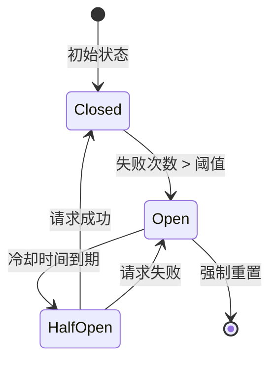
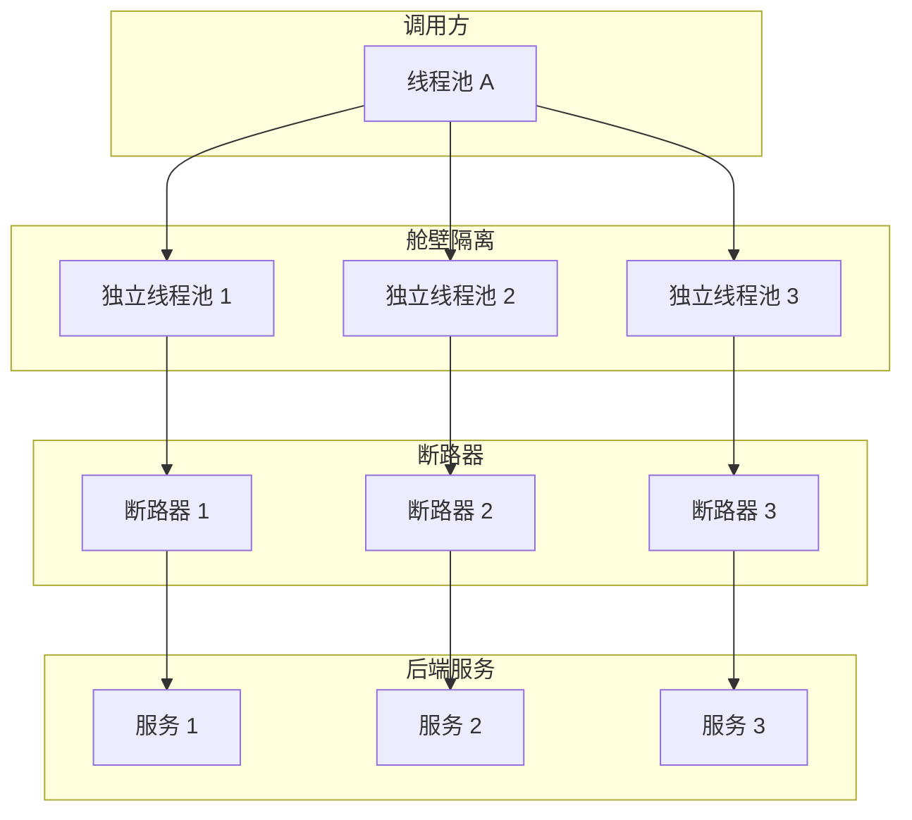

# 断路器模式

2019 年某电商平台的促销活动中，商品详情页因为依赖的推荐服务响应变慢，开始堆积请求。堆积的请求占满了线程池，线程池耗尽导致整个服务无响应。更糟糕的是，商品服务还依赖商品服务本身用于数据校验——商品服务自身的故障，通过调用链路传播回自己。最终，这场原本只需要隔离推荐服务的故障，变成了一场全站宕机。

这就是分布式系统最经典的噩梦：**一个服务的故障，是如何拖垮整个系统的？**

断路器模式的核心思想是：**不要让故障传播，不要让请求堆积，不要让资源耗尽。** 当检测到依赖服务不可用时，断路器「跳闸」，快速失败，阻止故障蔓延。

**断路器的灵感来自电路的保险丝。当电流过载时，保险丝熔断，切断电路，保护电器不被烧毁。断路器模式用同样的思路保护系统：检测到故障时，快速熔断，阻止故障传播。**

## 断路器的三种状态

断路器有三种状态，通过状态转换来控制流量：

**关闭状态（Closed）**：正常情况，断路器关闭，所有请求都能通过。如果请求失败数量或比例未达到阈值，断路器保持关闭。

**打开状态（Open）**：当失败次数超过阈值，断路器「跳闸」，进入打开状态。此时所有请求直接失败，不会发送到后端服务。

**半开状态（Half-Open）**：经过一段冷却时间后，断路器进入半开状态，允许部分请求通过。如果这些请求成功，说明后端服务已恢复，断路器关闭；如果请求继续失败，断路器重新打开。



## 状态转换逻辑

断路器的状态转换由以下参数控制：

| 参数 | 说明 | 默认值建议 |
| --- | --- | --- |
| **滑动窗口大小** | 统计失败次数的时间窗口 | 10 秒 |
| **失败阈值** | 在滑动窗口内，超过此比例或次数则跳闸 | 50% 或 5 次 |
| **打开状态持续时间** | 断路器打开后，等待多久进入半开状态 | 60 秒 |
| **半开允许请求数** | 半开状态下允许通过的请求数 | 3 个 |

### 失败率计算

```java title="CircuitBreakerMetrics.java"
public class CircuitBreakerMetrics {
    
    private final int slidingWindowSize;
    private final int failureThreshold;
    private final Double failureRateThreshold;
    
    private final AtomicInteger totalRequests = new AtomicInteger(0);
    private final AtomicInteger failedRequests = new AtomicInteger(0);
    private final Queue<Long> timestamps = new ConcurrentLinkedQueue<>();
    
    public void recordSuccess() {
        totalRequests.incrementAndGet();
        timestamps.offer(System.currentTimeMillis());
        cleanupOldTimestamps();
    }
    
    public void recordFailure() {
        totalRequests.incrementAndGet();
        failedRequests.incrementAndGet();
        timestamps.offer(System.currentTimeMillis());
        cleanupOldTimestamps();
    }
    
    public double getFailureRate() {
        if (totalRequests.get() == 0) {
            return 0.0;
        }
        return (double) failedRequests.get() / totalRequests.get();
    }
    
    public boolean shouldTrip() {
        if (failureRateThreshold != null) {
            return getFailureRate() >= failureRateThreshold;
        }
        return failedRequests.get() >= failureThreshold;
    }
    
    private void cleanupOldTimestamps() {
        long cutoff = System.currentTimeMillis() - slidingWindowSize * 1000;
        while (timestamps.peek() != null && timestamps.peek() < cutoff) {
            timestamps.poll();
        }
    }
}
```

## Resilience4j 断路器实战

Resilience4j 是目前 Java 生态最流行的断路器库，轻量级、可组合、功能丰富。相比已经停止维护的 Hystrix，Resilience4j 是更好的选择。

### 基础配置

```yaml title="application.yml"
resilience4j:
  circuitbreaker:
    instances:
      userService:
        # 滑动窗口配置
        sliding-window-type: COUNT_BASED
        sliding-window-size: 10
        # 失败率阈值
        failure-rate-threshold: 50
        # 断路器打开后的等待时间
        wait-duration-in-open-state: 60s
        # 半开状态允许的请求数
        permitted-number-of-calls-in-half-open-state: 3
        # 慢调用阈值
        slow-call-duration-threshold: 2s
        slow-call-rate-threshold: 80
        # 自动从打开状态转为半开
        automatic-transition-from-open-to-half-open-enabled: true
```

### 代码使用

```java title="UserServiceCircuitBreaker.java"
@Service
public class UserServiceCircuitBreaker {
    
    private final CircuitBreakerRegistry registry;
    private final UserFeignClient userFeignClient;
    
    public UserServiceCircuitBreaker(CircuitBreakerRegistry registry, 
                                    UserFeignClient userFeignClient) {
        this.registry = registry;
        this.userFeignClient = userFeignClient;
    }
    
    public User getUser(Long userId) {
        CircuitBreaker circuitBreaker = registry.circuitBreaker("userService");
        
        // 注册事件监听器
        circuitBreaker.getEventPublisher()
            .onStateTransition(event -> 
                log.info("Circuit breaker state changed: {} -> {}", 
                    event.getStateTransition().getFromState(),
                    event.getStateTransition().getToState()))
            .onFailureRateExceeded(event ->
                log.warn("Circuit breaker failure rate exceeded: {}", 
                    event.getFailureRate()));
        
        // 使用断路器包装调用
        return Decorators.ofSupplier(() -> userFeignClient.getUser(userId))
            .withCircuitBreaker(circuitBreaker)
            .withFallback(List.of(Exception.class), 
                e -> User.defaultUser(userId))
            .decorate()
            .get();
    }
}
```

### 异步调用支持

```java title="AsyncCircuitBreaker.java"
@Service
public class AsyncCircuitBreaker {
    
    private final CircuitBreakerRegistry registry;
    
    public CompletableFuture<User> getUserAsync(Long userId) {
        CircuitBreaker circuitBreaker = registry.circuitBreaker("userService");
        
        return Decorators.ofCallable(() -> {
                // 实际的异步调用
                return userFeignClient.getUserAsync(userId);
            })
            .withCircuitBreaker(circuitBreaker)
            .withFallback(List.of(Exception.class), 
                e -> CompletableFuture.completedFuture(User.defaultUser(userId)))
            .decorate()
            .get();
    }
}
```

## 断路器 vs 重试 vs 超时

这三个模式经常一起使用，但作用不同：

| 模式 | 作用 | 使用场景 |
| --- | --- | --- |
| **超时** | 防止无限等待 | 所有远程调用都应该设置超时 |
| **重试** | 处理瞬时故障 | 网络抖动、临时不可用 |
| **断路器** | 防止故障传播 | 依赖服务持续不可用 |

### 三者配合使用

```java title="ResiliencePattern.java"
@Service
public class ResiliencePattern {
    
    private final CircuitBreakerRegistry circuitBreakerRegistry;
    
    public Result callService() {
        CircuitBreaker circuitBreaker = circuitBreakerRegistry.circuitBreaker("backendService");
        Retry retry = Retry.of("backendService", RetryConfig.custom()
            .maxAttempts(3)
            .waitDuration(Duration.ofMillis(500))
            .retryExceptions(Exception.class)
            .intervalFunction(IntervalFunction.ofExponentialBackoff(500, 2))
            .build());
        
        return Decorators.ofSupplier(() -> backendService.call())
            .withRetry(retry)
            .withCircuitBreaker(circuitBreaker)
            .withTimeout(Duration.ofSeconds(3))
            .withFallback(List.of(Exception.class), 
                e -> Result.fallback())
            .decorate()
            .get();
    }
}
```

**为什么需要三个一起用？**

- **超时**是基础保障，防止请求无限等待
- **重试**处理瞬时故障，比如网络抖动时重试一下就好了
- **断路器**处理持续故障，当服务真的挂了，快速失败，不要白白消耗资源

## 断路器与舱壁隔离的配合

断路器保护的是「调用链」，舱壁模式（Bulkhead）保护的是「资源池」。两者配合使用，可以实现更全面的容错保护。



### 舱壁 + 断路器配置

```yaml title="application.yml"
resilience4j:
  bulkhead:
    instances:
      userService:
        maxConcurrentCalls: 10
        maxWaitDuration: 100ms
  circuitbreaker:
    instances:
      userService:
        sliding-window-size: 10
        failure-rate-threshold: 50
```

```java title="BulkheadWithCircuitBreaker.java"
public Result callService() {
    Bulkhead bulkhead = Bulkhead.of("userService", 
        BulkheadConfig.custom().maxConcurrentCalls(10).build());
    CircuitBreaker circuitBreaker = circuitBreakerRegistry.circuitBreaker("userService");
    
    return Decorators.ofSupplier(() -> backendService.call())
        .withBulkhead(bulkhead)
        .withCircuitBreaker(circuitBreaker)
        .withFallback(List.of(BulkheadFullException.class), 
            e -> Result.degraded())
        .withFallback(List.of(Exception.class), 
            e -> Result.fallback())
        .decorate()
        .get();
}
```

## 常见问题与反模式

### 断路器阈值设置不当

阈值太高，断路器反应迟钝，故障期间大量请求失败；阈值太低，断路器频繁跳闸，正常波动也会触发熔断。

**正确做法**：根据业务容忍度和历史数据调整阈值。初期可以设高一些，观察一段时间后下调到合理值。

### 所有服务共用一个断路器

把所有依赖服务的调用放在同一个断路器里，一个服务故障会导致所有服务都熔断。

**正确做法**：每个依赖服务有独立的断路器。user-service 的断路器跳闸，不影响 order-service 的调用。

### 断路器状态不监控

断路器打开了，但没人知道，直到用户开始大量投诉。

**正确做法**：监控断路器状态变化，将状态变化纳入告警。最好把断路器状态暴露在监控面板上。

### 忽略了降级逻辑

断路器打开后返回什么？如果没有好的降级逻辑，可能会返回空数据或者抛出异常，反而造成二次故障。

**正确做法**：提前设计好降级方案。断路器打开时，返回缓存数据、默认值或友好的错误提示。

## 适用场景

**应该使用断路器**：

- 调用外部服务（HTTP、RPC、数据库）
- 调用链路复杂，存在故障传播风险
- 服务 SLA 要求高，需要快速失败而不是超时等待

**暂不需要断路器**：

- 单体应用，内部调用不需要断路器
- 调用链简单清晰，故障影响范围可控
- 超时已经足够处理故障场景

断路器是微服务架构的必备容错机制。但断路器只是手段，不是目的。真正重要的是：在断路器打开时，你的后备方案是什么？
