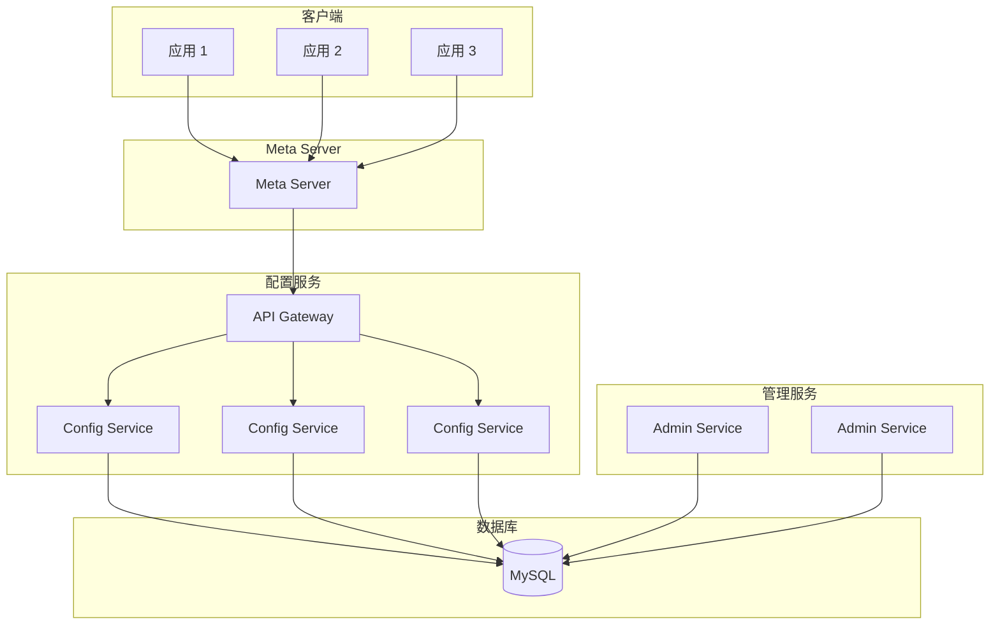

# 配置中心模式

凌晨 2 点，生产环境数据库连接池告警。你登录服务器，查到连接池大小配置写的是 10。运维同事告诉你，下午压测时改成 50 了，但是没更新文档。你现在有两个选择：重启服务让配置生效，或者先扩容顶着明天再说。

这就是配置分散管理的典型噩梦。代码和配置混在一起，配置靠人维护，一个地方改了另一个地方不知道，微服务数量一多，配置管理就成了全栈运维最头疼的事情。

**配置中心的核心价值，就是让配置从代码中独立出来，实现集中管理、环境隔离、热更新和版本控制。**

## 为什么需要配置中心

在单体时代，配置管理很简单：改配置文件，重启服务。但到了微服务时代，情况完全变了：

**配置数量爆炸**。假设你有 20 个微服务，每个服务有数据库连接、超时时间、重试次数、缓存策略等 20 个配置项，就是 400 个配置项。手动管理这些配置，几乎不可能不出错。

**环境差异大**。开发环境、测试环境、预发环境、生产环境，每个环境的配置都不同。换环境需要改一堆配置，改完后可能忘了改回来。

**改配置要重启**。在配置中心出现之前，改一个配置往往意味着重启所有服务。半夜上线改配置，运维要守着每个服务重启，生怕哪个服务没起来。

**配置泄露风险**。生产环境的数据库密码、API Key 等敏感配置，如果放在代码仓库里，就是一颗定时炸弹。谁都能看到，谁都能拿去用。

配置中心要解决的核心问题，就是把配置从代码中抽离出来，实现**统一管理、环境隔离、热更新、版本控制、安全合规**。

## 配置中心的核心功能

### 配置管理

配置中心提供统一的配置管理界面，可以：

- 集中查看所有环境的配置
- 批量编辑配置项
- 配置分组、标签、搜索
- 配置导入导出

### 版本控制

每次配置变更都有记录，可以：

- 查看历史版本，对比差异
- 一键回滚到任意版本
- 灰度发布配置，先让部分实例生效

### 热更新

配置变更不需要重启服务，可以：

- 推送配置到指定实例
- 实例监听配置变化，动态生效
- 通过 Spring Cloud Bus 广播刷新

### 环境隔离

不同环境有不同的配置空间：

- 开发环境、测试环境、预发环境、生产环境
- 每个环境独立命名空间
- 环境之间可以隔离也可以继承

### 权限控制

敏感配置需要权限保护：

- 角色分级：管理员、运维、研发只读
- 操作审计：谁在什么时间改了什么配置
- 敏感配置加密存储

## Apollo 配置中心架构

Apollo 是携程开源的配置中心，是目前国内使用最广泛的配置中心之一。Apollo 的架构设计兼顾了可用性和一致性。

### 核心架构



Apollo 采用三层架构：

**Config Service**（配置服务）：负责配置读取和推送，支持多实例部署，通过 Meta Server 做服务发现，客户端通过长轮询感知配置变化。

**Admin Service**（管理服务）：负责配置的增删改查，只有管理端可以访问，通过 Meta Server 做服务发现。

**Meta Server**：充当 Eureka，封装服务发现细节。客户端通过 Meta Server 找到 Config Service 和 Admin Service。

### Apollo 核心配置

```java title="ApolloConfig.java"
@Configuration
@EnableApolloConfig
public class ApolloConfig {
    
    @Bean
    public AppNamespace publicAppNamespace() {
        // 定义公共命名空间，可被多个应用共享
        return new AppNamespace("common-config", "yaml");
    }
}
```

```yaml title="application.yml"
apollo:
  bootstrap:
    enabled: true
    # 指定要加载的命名空间
    namespaces: application,common-config
  meta: http://apollo-meta:8080
  app:
    id: user-service
  # 启用热更新，不需要重启
  config:
    refreshable:
      enabled: true
```

### 配置热更新示例

```java title="ApolloDynamicConfig.java"
@Component
public class ApolloDynamicConfig {
    
    @ApolloConfig
    private Config config;
    
    @ApolloConfigChangeListener
    private void onConfigChange(ConfigChangeEvent event) {
        // 配置变化时重新加载
        if (event.isChanged("timeout")) {
            updateTimeout(config.getIntProperty("timeout", 3000));
        }
        if (event.isChanged("maxConnections")) {
            updateConnectionPool(config.getIntProperty("maxConnections", 100));
        }
    }
    
    @Value("${timeout:3000}")
    private int timeout;
    
    @Value("${maxConnections:100}")
    private int maxConnections;
}
```

### Apollo 管理端 API

```java title="ApolloAdminClient.java"
public class ApolloAdminClient {
    
    private final String portalUrl;
    private final String token;
    
    public void createOrUpdateConfig(String appId, String env, 
                                     String cluster, String namespace,
                                     String key, String value) {
        HttpClient httpClient = HttpClient.newHttpClient();
        String url = String.format(
            "%s/openapi/v1/envs/%s/apps/%s/clusters/%s/namespaces/%s/items/%s",
            portalUrl, env, appId, cluster, namespace, key
        );
        
        HttpRequest request = HttpRequest.newBuilder()
            .uri(URI.create(url))
            .header("Authorization", token)
            .header("Content-Type", "application/json")
            .method("PUT", HttpRequest.BodyPublishers.ofString(
                String.format("{\"key\":\"%s\",\"value\":\"%s\"}", key, value)
            ))
            .build();
        
        httpClient.send(request, HttpResponse.BodyHandlers.ofString());
    }
}
```

## Nacos 配置管理

Nacos 是阿里巴巴开源的动态服务发现和配置管理平台，相比 Apollo 更轻量，同时支持服务发现和配置管理。

### Nacos 核心配置

```yaml title="application.yml"
spring:
  cloud:
    nacos:
      config:
        server-addr: nacos-server:8848
        file-extension: yaml
        namespace: dev
        group: DEFAULT_GROUP
        refresh-enabled: true
        # 共享配置，多个应用共享同一份配置
        shared-configs:
          - data-id: common.yaml
            group: COMMON_GROUP
            refresh: true
```

### 动态配置刷新

```java title="NacosDynamicConfig.java"
@Component
@RefreshScope
public class NacosDynamicConfig {
    
    @Value("${feature.enabled:false}")
    private boolean featureEnabled;
    
    @Value("${rate.limit:100}")
    private int rateLimit;
    
    @NacosConfigListener
    public void onRateLimitChange(String config) {
        // 监听配置变化，处理业务逻辑
        log.info("Rate limit changed to: {}", config);
    }
}
```

## Spring Cloud Config 实战

Spring Cloud Config 是 Spring Cloud 官方提供的配置中心，Git 作为后端存储，支持配置版本化。

```yaml title="bootstrap.yml"
spring:
  cloud:
    config:
      label: master
      profile: dev
      uri: http://config-server:8888
      # 启用配置刷新
      bus:
        enabled: true
  rabbitmq:
    host: rabbitmq
    port: 5672
```

配置中心适合的场景：

- 已有 Git 工作流，习惯通过 Git 管理配置
- 配置变更需要严格审批流程
- 需要和现有 CI/CD 流水线集成

配置中心的局限：

- 热更新需要配合 Spring Cloud Bus
- 不支持细粒度的配置推送（只能推送给应用，不能推送给实例）
- 没有 Apollo 那样的管理界面友好

## 常见问题与反模式

### 配置项命名混乱

不同服务用不同的命名风格，有的用 camelCase，有的用 snake_case，有的用 kebab-case。结果是维护困难、容易出错。

**正确做法**：制定配置命名规范，所有服务统一遵循。建议统一用 snake_case 或 kebab-case。

### 敏感配置明文存储

数据库密码、API Key 等敏感配置明文存储在配置中心，一旦泄露后果严重。

**正确做法**：敏感配置使用对称加密或非对称加密，客户端解密后使用。配置中心记录加密后的值。

### 配置覆盖优先级不清

当配置文件、环境变量、启动参数同时存在时，哪个优先级高？如果不清楚，就会出现「改了配置不生效」的困惑。

**正确做法**：在项目文档中明确配置优先级顺序，并打印配置加载日志便于排查。

### 热更新滥用

配置热更新很方便，但滥用热更新会导致问题难以追踪。运维改了一个配置，没通知开发，下次出问题排查时，发现配置已经被改过了。

**正确做法**：敏感配置变更走审批流程，改完后记录在案。非敏感配置可以通过热更新提高效率。

## 选型对比

| 维度 | Apollo | Nacos | Spring Cloud Config |
| --- | --- | --- | --- |
| **Git 后端** | 否 | 否 | 是 |
| **管理界面** | 完善 | 完善 | 无（依赖 Git 管理） |
| **热更新** | 支持 | 支持 | 需要 Bus 广播 |
| **推送模式** | 长轮询 | 长轮询 | Pull |
| **多语言支持** | 完善 | 一般 | Java 为主 |
| **权限控制** | 完善 | 一般 | 无 |
| **适用规模** | 大型 | 中型 | 小型 |

配置中心是微服务架构的必备基础设施。选择哪个方案，取决于团队规模、技术栈和管理需求。中小规模团队，Nacos 够用且轻量；大型团队，建议上 Apollo。

但无论选择哪个，配置管理的核心原则不变：**代码和配置分离、环境隔离、版本控制、操作审计**。
