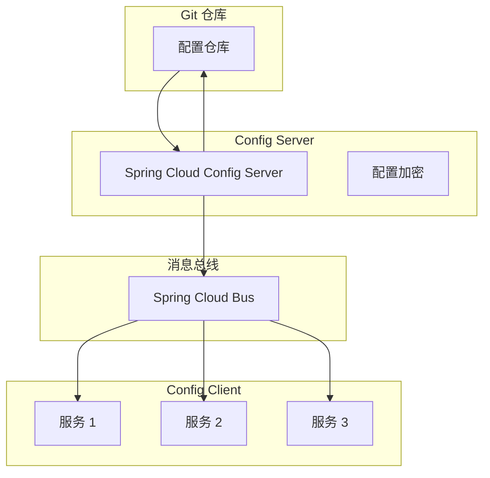
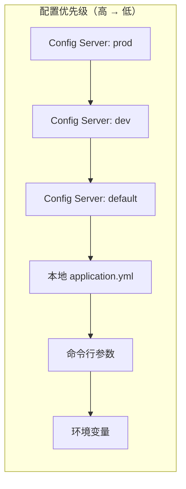

# 分布式配置

你在本地开发环境调试完毕，代码推到测试环境，测试通过，准备上线生产。凌晨 2 点，你登录生产服务器，改配置文件，改数据库连接，改 Redis 地址，然后一个一个服务重启。

这大概是微服务时代最让人崩溃的场景之一。20 个服务，每个服务有 5 个配置项要改，就是 100 处改动。手动改难免出错，改完之后还可能忘记录屏。

**Spring Cloud Config 的核心价值，就是让配置管理从「改文件 + 重启」变成「改配置 + 推送」。** 所有配置集中存储在 Git 仓库，配置变更通过消息总线广播，所有服务自动感知并刷新配置。

## Spring Cloud Config 架构

Spring Cloud Config 采用服务端-客户端架构：



**Config Server**：连接 Git 仓库，提供配置文件的 RESTful API，支持配置加密、版本控制、多环境切换。

**Config Client**：集成在每个微服务中，通过启动时拉取配置，或者监听消息总线刷新配置。

## Git 后端配置存储

Spring Cloud Config 默认使用 Git 作为后端存储。Git 的版本控制能力天然支持配置的版本管理、回滚、审计。

### 仓库结构

```
config-repo/
├── application.yml          # 公共配置，所有应用共享
├── user-service/
│   ├── user-service-dev.yml
│   ├── user-service-test.yml
│   └── user-service-prod.yml
├── order-service/
│   ├── order-service-dev.yml
│   ├── order-service-test.yml
│   └── order-service-prod.yml
└── common.yml               # 共享配置库
```

### Config Server 配置

```yaml title="config-server.yml"
server:
  port: 8888

spring:
  application:
    name: config-server
  cloud:
    config:
      server:
        git:
          uri: https://github.com/your-org/config-repo
          default-label: master
          search-paths: '{application}'
          # 如果私有仓库，需要配置认证
          username: ${GIT_USERNAME}
          password: ${GIT_PASSWORD}
          # 本地缓存配置
          basedir: /tmp/config-repo
        # 启用配置加密
        encrypt:
          enabled: true
  rabbitmq:
    host: rabbitmq
    port: 5672
```

### Config Server 启动类

```java title="ConfigServerApplication.java"
@SpringBootApplication
@EnableConfigServer
public class ConfigServerApplication {
    public static void main(String[] args) {
        SpringApplication.run(ConfigServerApplication.class, args);
    }
}
```

### 访问配置 API

```bash
# 获取默认分支的 application.yml
curl http://config-server:8888/application/default

# 获取 dev 环境的 user-service 配置
curl http://config-server:8888/user-service/dev

# 获取指定标签的配置
curl http://config-server:8888/user-service/prod?version=1.0.0
```

## 配置刷新：/refresh 端点 vs @RefreshScope

Spring Cloud Config 支持两种配置刷新方式：手动刷新和自动刷新。

### 手动刷新

使用 Spring Boot Actuator 的 `/refresh` 端点，手动触发配置刷新：

```yaml title="client-application.yml"
spring:
  cloud:
    config:
      uri: http://config-server:8888
      name: ${spring.application.name}
      profile: ${SPRING_PROFILES_ACTIVE:dev}
      # 启动时拉取配置
      fetch-on-boot: true
      # 启用 refresh
      fail-fast: true
  application:
    name: user-service
```

```bash
# 手动触发单个服务刷新
curl -X POST http://user-service:8080/actuator/refresh
```

```json
{
  "propertySources": [
    "bootstrapProperties",
    "application.yml"
  ]
}
```

### @RefreshScope 注解

```java title="RefreshScopeConfig.java"
@Component
@RefreshScope
public class RefreshScopeConfig {
    
    // 配置变更后，这个 Bean 会重新创建
    @Value("${feature.enabled:false}")
    private boolean featureEnabled;
    
    @Value("${cache.ttl:300}")
    private int cacheTtl;
    
    @Bean
    @RefreshScope
    public RestTemplate restTemplate() {
        return new RestTemplate();
    }
}
```

### @ConfigurationProperties 刷新

```java title="FeatureProperties.java"
@Component
@ConfigurationProperties(prefix = "feature")
@RefreshScope
public class FeatureProperties {
    
    private boolean newCheckoutFlow = false;
    private boolean socialLogin = true;
    private int maxItemsPerCart = 100;
    
    // getters and setters
}
```

```yaml title="application.yml"
feature:
  new-checkout-flow: true
  social-login: false
  max-items-per-cart: 50
```

## Spring Cloud Bus 广播刷新

手动调用每个服务的 `/refresh` 端点，在服务数量多的时候不现实。Spring Cloud Bus 通过消息队列广播刷新事件，所有订阅的服务自动刷新配置。

### RabbitMQ 配置

```yaml title="config-server.yml"
spring:
  rabbitmq:
    host: rabbitmq
    port: 5672
    username: guest
    password: guest
```

```yaml title="client-application.yml"
spring:
  cloud:
    bus:
      enabled: true
      trace:
        enabled: true  # 开启链路追踪，方便排查
  rabbitmq:
    host: rabbitmq
    port: 5672
```

### 广播刷新

```bash
# 刷新所有服务
curl -X POST http://config-server:8888/actuator/bus-refresh

# 刷新指定服务
curl -X POST http://config-server:8888/actuator/bus-refresh/user-service:8080

# 刷新指定环境的指定服务
curl -X POST http://config-server:8888/actuator/bus-refresh/dev/user-service:8080
```

### 自定义刷新事件

```java title="CustomRefreshListener.java"
@Component
public class CustomRefreshListener {
    
    @EventListener
    public void onRefreshRemoteApplicationEvent(
            RefreshRemoteApplicationEvent event) {
        log.info("Received refresh event from: {}, origin: {}, destination: {}",
            event.getSource(),
            event.getOrigin(),
            event.getDestination());
        
        // 自定义处理逻辑
        doCustomRefresh();
    }
}
```

## 配置加密

敏感配置（如数据库密码、API Key）不能明文存储在 Git 仓库中。Spring Cloud Config 提供配置加密功能，支持对称加密和非对称加密。

### 对称加密

```yaml title="config-server.yml"
encrypt:
  key: my-secret-key  # 生产环境应该使用环境变量
```

```bash
# 加密
curl http://config-server:8888/encrypt -d "my-database-password"

# 解密
curl http://config-server:8888/decrypt -d "encrypted-value"
```

```yaml title="application.yml"
# 使用加密后的值，格式：{cipher}加密值
spring:
  datasource:
    password: '{cipher}AQB...'
```

### 非对称加密

使用 Java KeyStore 进行非对称加密，更安全：

```bash
# 生成密钥对
keytool -genkeypair -alias config-server \
  -keyalg RSA -keysize 4096 \
  -keystore config-server.jks \
  -storepass changeit -keypass changeit \
  -dname "CN=Config Server"
```

```yaml title="config-server.yml"
encrypt:
  key-store:
    location: classpath:config-server.jks
    alias: config-server
    password: ${ENCRYPT_KEYSTORE_PASSWORD}
    secret: ${ENCRYPT_KEYSTORE_SECRET}
```

## 多环境配置管理

### Profile 切换

Spring Cloud Config 支持通过 profile 切换不同环境的配置：

```bash
# 访问 dev 环境配置
curl http://config-server:8888/user-service/dev

# 访问 prod 环境配置
curl http://config-server:8888/user-service/prod
```

### 配置优先级



### 共享配置

多个应用共享的配置可以使用 `spring.cloud.config.server.overrides`：

```yaml title="config-server.yml"
spring:
  cloud:
    config:
      server:
        overrides:
          # 所有客户端都会使用这个值
          spring.application.name: common-config
          logging.level.root: INFO
```

### 配置文件引用

```yaml title="application.yml"
spring:
  cloud:
    config:
      # 引用共享配置文件
      import: optional:file:./shared-config.yml
```

## 常见问题与反模式

### 配置热更新不生效

改完配置，推送到 Git，通过 Bus 广播刷新，但配置没生效。

**排查步骤**：

1. 检查服务是否正确订阅消息队列
2. 检查 `@RefreshScope` 是否正确标注
3. 检查 Bean 注入方式是否正确（构造函数注入 vs `@Value` 注入）
4. 查看日志是否有刷新成功的记录

### 敏感配置泄露

数据库密码、API Key 等敏感配置明文存储在 Git 仓库中。

**正确做法**：使用配置加密，所有敏感值加密后存储。或者使用 Vault 等专门的密钥管理系统。

### 配置版本混乱

多个环境、多个版本，配置不一致，不知道哪个服务用的是哪个版本的配置。

**正确做法**：配置和代码一样需要版本管理。Git 仓库的提交记录就是配置的版本历史。重要的配置变更需要通过 Code Review。

### 启动顺序依赖

Config Server 挂了，所有依赖它的服务都启动不了。

**正确做法**：Config Server 高可用部署。或者配置本地缓存 fallback，Config Server 不可用时使用本地缓存的配置。

## 适用场景

**适合使用 Spring Cloud Config**：

- Java 技术栈，使用 Spring Boot
- 已有 Git 工作流，习惯通过 Git 管理配置
- 配置变更需要严格审批流程和版本控制

**不适合使用 Spring Cloud Config**：

- 多语言环境，Config Server 只支持 Java
- 配置需要实时同步，不适合通过 Git 推送
- 已经使用 Nacos 等更完善的配置中心

Spring Cloud Config 是 Spring Cloud 生态中的配置管理方案，但它不是唯一的方案。相比 Apollo 和 Nacos，Spring Cloud Config 更轻量，但功能也更简单。选择时需要根据团队实际情况权衡。
