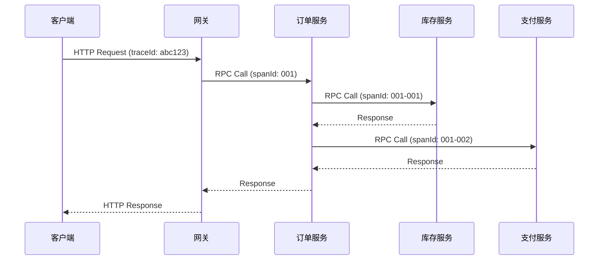

# 链路追踪模式

一个用户下单请求，跨越了 10 个微服务：网关 → 订单服务 → 库存服务 → 支付服务 → 积分服务 → 物流服务 → 短信服务……每个服务耗时 50ms，总耗时应该不到 1 秒。但用户等了 5 秒。

**哪里慢了？你怎么定位？**

在单体时代，JProfiler、YourKit 可以轻松定位性能瓶颈。但在微服务架构里，请求跨越多个进程、多个机器，一个请求的调用链路可能延伸到十几二十个服务。传统的方式是看日志：登录机器 A 看日志，登录机器 B 看日志……效率低下，定位困难。

链路追踪的核心思想是：**给每个请求一个唯一的 ID（TraceID），这个 ID 跟着请求在所有服务间传递，每个服务记录自己的处理过程（Span）。最后把所有 Span 串联起来，就能还原完整的调用链路。**

## 链路追踪核心概念

### Trace 与 Span

**Trace**：一次完整的请求调用链，从入口到出口的所有处理过程。一个 Trace 由多个 Span 组成，每个 Span 代表一个独立的工作单元。

**Span**：一个 Span 代表一个服务节点的处理过程，包含：服务名、操作名、开始时间、结束时间、SpanID、ParentSpanID。



### TraceID 传播

TraceID 需要在所有服务间传播。当服务 A 调用服务 B 时，TraceID 需要通过 HTTP Header 或 RPC 元数据传递。

| Header 名称 | 说明 |
| --- | --- |
| `X-B3-TraceId` | Zipkin/B3 格式的 TraceID |
| `traceparent` | W3C Trace Context 标准 |
| `uber-trace-id` | Jaeger 格式 |
| `X-Request-Id` | 自定义 header |

### 采样策略

每个请求都记录会占用大量存储空间。采样策略决定哪些请求需要完整记录：

| 策略 | 说明 | 适用场景 |
| --- | --- | --- |
| **全量采样** | 记录所有请求 | 低流量场景 |
| **固定比例采样** | 按固定比例（如 10%）采样 | 流量可控 |
| **头部采样** | 请求入口决定是否采样 | 统一控制 |
| **尾部采样** | 请求结束后根据结果决定采样 | 关注异常请求 |

## OpenTracing vs OpenCensus vs OpenTelemetry

链路追踪领域曾经有三个主要标准：

| 标准 | 特点 | 状态 |
| --- | --- | --- |
| **OpenTracing** | 专注链路追踪，模型清晰 | 已合并到 OpenTelemetry |
| **OpenCensus** | 同时支持 Metrics 和 Traces | 已合并到 OpenTelemetry |
| **OpenTelemetry** | 统一的可观测性标准 | 当前标准 |

**OpenTelemetry 是未来**。它是 CNCF 的官方项目，整合了 OpenTracing 和 OpenCensus，提供了统一的可观测性采集标准。

## Brave（Zipkin Java 客户端）实战

Brave 是 Zipkin 的 Java 客户端库，提供了低层次的链路追踪埋点 API。Spring Cloud Sleuth 底层就是用 Brave 实现的。

### 基本配置

```xml title="pom.xml"
<dependency>
    <groupId>io.zipkin.brave</groupId>
    <artifactId>brave</artifactId>
    <version>5.16.0</version>
</dependency>
<dependency>
    <groupId>io.zipkin.reporter2</groupId>
    <artifactId>zipkin-sender-okhttp3</artifactId>
    <version>2.16.3</version>
</dependency>
```

### 自定义埋点

```java title="TracingConfiguration.java"
@Configuration
public class TracingConfiguration {
    
    @Bean
    public Tracing tracing() {
        return Tracing.newBuilder()
            .localServiceName("user-service")
            .sampler(Sampler.create(1.0f))  // 100% 采样
            .spanReporter(ZipkinSpanReporter.create(
                OkHttpSender.create("http://zipkin-server:9411/api/v2/spans")))
            .build();
    }
    
    @Bean
    public Tracer tracer(Tracing tracing) {
        return tracing.tracer();
    }
}
```

```java title="CustomTracingService.java"
@Service
public class CustomTracingService {
    
    private final Tracer tracer;
    
    public CustomTracingService(Tracer tracer) {
        this.tracer = tracer;
    }
    
    public User getUserById(Long userId) {
        // 创建子 Span
        Span span = tracer.newChild()
            .name("getUserById")
            .tag("userId", String.valueOf(userId))
            .start();
        
        try (Tracer.SpanInScope scope = tracer.withSpanInScope(span)) {
            log.info("Fetching user with id: {}", userId);
            
            User user = userRepository.findById(userId)
                .orElseThrow(() -> new UserNotFoundException(userId));
            
            // 添加响应信息
            span.tag("userName", user.getName());
            
            return user;
        } catch (Exception e) {
            span.error(e);
            throw e;
        } finally {
            span.finish();
        }
    }
}
```

### 异步任务追踪

```java title="AsyncTracing.java"
@Service
public class AsyncTracingService {
    
    private final Tracer tracer;
    
    @Async
    public void sendNotificationAsync(Long userId) {
        Span span = tracer.nextSpan()
            .name("sendNotification")
            .tag("userId", String.valueOf(userId))
            .start();
        
        try (Tracer.SpanInScope scope = tracer.withSpanInScope(span)) {
            notificationClient.send(userId);
            log.info("Notification sent to user: {}", userId);
        } catch (Exception e) {
            span.error(e);
        } finally {
            span.finish();
        }
    }
}
```

## Sleuth 与 Zipkin 集成

Spring Cloud Sleuth 是 Spring Cloud 官方提供的链路追踪组件，与 Zipkin 深度集成。

### Sleuth 配置

```yaml title="application.yml"
spring:
  application:
    name: user-service
  zipkin:
    base-url: http://zipkin-server:9411
    # 使用 Brave Sender 发送
    sender:
      type: web
  sleuth:
    # 采样配置
    sampler:
      probability: 1.0  # 100% 采样
    # 127.0.0.1 不采样，方便本地调试
    tracelogging:
      always-sample-local-requests: true
    # 自定义需要记录的 HTTP header
    propagation:
      type: B3
      include: [x-request-id, x-b3-traceId]
```

### 拦截器配置

```java title="FeignTracingConfiguration.java"
@Configuration
public class FeignTracingConfiguration {
    
    @Autowired
    private Tracing tracing;
    
    @Bean
    public RequestInterceptor requestInterceptor() {
        return (template, request) -> {
            // 将 TraceID 注入到 Feign 请求
            Span currentSpan = tracing.tracer().currentSpan();
            if (currentSpan != null) {
                SpanContext context = currentSpan.context();
                template.header("X-B3-TraceId", context.traceIdString());
                template.header("X-B3-SpanId", context.spanIdString());
            }
        };
    }
}
```

```java title="RestTemplateTracingConfiguration.java"
@Configuration
public class RestTemplateTracingConfiguration {
    
    @Bean
    public RestTemplate restTemplate(Tracing tracing) {
        // 使用 Brave 拦截器包装 RestTemplate
        RestTemplate restTemplate = new RestTemplate();
        restTemplate.setInterceptors(
            Collections.singletonList(BraveClientHttpRequestInterceptor.create(tracing))
        );
        return restTemplate;
    }
}
```

## SkyWalking 全链路追踪

SkyWalking 是国产的全链路追踪平台，相比 Zipkin 功能更全面，提供了 APM、链路追踪、指标监控、告警等一站式能力。

### SkyWalking Java Agent

SkyWalking 采用无侵入的 Agent 模式，通过 Java Agent 字节码增强，自动埋点：

```bash
# 启动时指定 Agent
java -javaagent:/path/to/skywalking-agent.jar \
     -Dskywalking.agent.service_name=user-service \
     -Dskywalking.collector.backend_service=oap-server:11800 \
     -jar user-service.jar
```

### Docker 环境配置

```yaml title="docker-compose.yml"
version: '3'
services:
  user-service:
    image: user-service:latest
    environment:
      JAVA_OPTS: >
        -javaagent:/opt/skywalking-agent/skywalking-agent.jar
        -Dskywalking.agent.service_name=user-service
        -Dskywalking.collector.backend_service=oap-server:11800
    volumes:
      - ./skywalking-agent:/opt/skywalking-agent
```

### SkyWalking Dashboard

SkyWalking 提供了丰富的可视化界面：

- **拓扑图**：直观展示服务间的调用关系
- **Trace 列表**：查看所有请求的调用链路
- **慢查询分析**：定位耗时最长的调用
- **JVM 监控**：GC、内存、线程分析

## 常见问题与反模式

### TraceID 不传播

改了代码后，发现有些服务的 TraceID 是空的，说明 TraceID 没有正确传播。

**排查步骤**：

1. 检查 HTTP Header 是否正确传递
2. 检查 RPC 框架的拦截器是否生效
3. 检查异步任务的上下文是否传递

**正确做法**：确保所有调用（HTTP、RPC、MQ）都正确传播 TraceID。

### 采样率设置不当

100% 采样在生产环境会占用大量存储，但 1% 采样可能漏掉重要请求。

**正确做法**：生产环境建议 10%-50% 采样，或者使用尾部采样，只记录慢请求和异常请求。

### 敏感信息泄露

在 Span Tag 中记录了用户名、密码、订单号等敏感信息。

**正确做法**：Tag 中只记录必要的追踪信息，敏感数据脱敏处理或不上报。

### 过度埋点

对每个方法都埋点，导致 Span 数量爆炸。

**正确做法**：只在关键节点埋点，不要对每个小方法都创建 Span。内部调用通过日志关联即可。

## 适用场景

**应该使用链路追踪**：

- 微服务数量 `>=` 5，调用链路复杂
- 需要定位跨服务性能问题
- 需要分析请求失败的原因
- 需要监控服务间依赖关系

**暂不需要链路追踪**：

- 微服务数量少，调用链路简单
- 已经有完善的日志体系，可以手动关联
- 监控需求不高

链路追踪是微服务可观测性的重要组成部分。但它不是银弹，不要期望链路追踪能解决所有问题。日志、指标、链路追踪三者配合，才能构建完整的可观测性体系。
