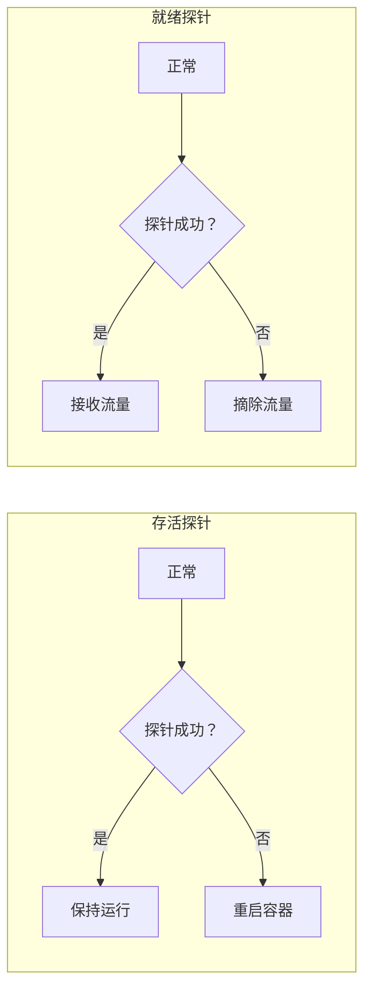

# 健康检查模式

你的微服务部署在 Kubernetes 集群里，其中一个 Pod 的容器进程崩溃了。但 Kubernetes 没有立即重启这个 Pod，因为 Docker 的默认健康检查只检测进程是否存在——而 Java 进程的进程号还在，只是 JVM 可能已经 OOM 了。

直到 5 分钟后，业务报警来了：「订单服务响应失败率上升」。排查后发现，那个「假存活」的 Pod 一直接收流量，但永远返回错误。

**健康检查的核心价值，是让平台（Kubernetes、Docker Swarm、负载均衡器）能够感知服务的真实状态，而不是只检测进程是否存在。**

## 存活探针 vs 就绪探针

Kubernetes 提供了两种健康检查机制，作用不同：

| 探针类型 | 作用 | 失败后果 | 适用场景 |
| --- | --- | --- | --- |
| **存活探针（Liveness Probe）** | 判断容器是否存活，是否需要重启 | 杀死并重启容器 | 检测无法恢复的故障 |
| **就绪探针（Readiness Probe）** | 判断容器是否就绪，是否可以接收流量 | 从 Service 摘除，不再接收流量 | 检测暂时不可用的状态 |



**何时使用存活探针**：

- 进程崩溃、无法自我恢复
- 内存泄漏、JVM 崩溃
- 应用程序进入死锁状态

**何时使用就绪探针**：

- 应用启动中，还不能处理请求
- 应用依赖数据库或缓存，连接未就绪
- 应用正在做耗时初始化

## 健康检查方式

### TCP 端口检查

最简单的检查方式，检测端口是否可连接。不需要应用暴露特定端点：

```yaml title="tcp-healthcheck.yaml"
apiVersion: v1
kind: Pod
metadata:
  name: redis-pod
spec:
  containers:
    - name: redis
      image: redis:latest
      livenessProbe:
        tcpSocket:
          port: 6379
        initialDelaySeconds: 30
        periodSeconds: 10
        timeoutSeconds: 5
        failureThreshold: 3
      readinessProbe:
        tcpSocket:
          port: 6379
        initialDelaySeconds: 5
        periodSeconds: 5
        failureThreshold: 3
```

### HTTP 健康检查

通过 HTTP GET 请求检查应用的健康状态。应用需要暴露一个健康检查端点：

```yaml title="http-healthcheck.yaml"
apiVersion: v1
kind: Pod
metadata:
  name: user-service
spec:
  containers:
    - name: user-service
      image: user-service:v1
      ports:
        - containerPort: 8080
      livenessProbe:
        httpGet:
          path: /actuator/health/liveness
          port: 8080
        initialDelaySeconds: 30
        periodSeconds: 10
        timeoutSeconds: 5
        failureThreshold: 3
      readinessProbe:
        httpGet:
          path: /actuator/health/readiness
          port: 8080
        initialDelaySeconds: 10
        periodSeconds: 5
        failureThreshold: 3
```

### 命令执行检查

执行容器内的命令，根据返回码判断健康状态：

```yaml title="exec-healthcheck.yaml"
apiVersion: v1
kind: Pod
metadata:
  name: db-pod
spec:
  containers:
    - name: postgres
      image: postgres:15
      env:
        - name: POSTGRES_PASSWORD
          value: secret
      livenessProbe:
        exec:
          command:
            - pg_isready
            - -U
            - postgres
        initialDelaySeconds: 30
        periodSeconds: 10
        timeoutSeconds: 5
      readinessProbe:
        exec:
          command:
            - bash
            - -c
            - "psql -U postgres -c 'SELECT 1' > /dev/null 2>&1"
        initialDelaySeconds: 10
        periodSeconds: 10
```

## Kubernetes 健康检查配置

### 探针参数详解

| 参数 | 说明 | 建议值 |
| --- | --- | --- |
| `initialDelaySeconds` | 容器启动后多久开始探测 | 略大于启动时间 |
| `periodSeconds` | 探测间隔 | 10-30 秒 |
| `timeoutSeconds` | 单次探测超时时间 | 1-5 秒 |
| `failureThreshold` | 连续失败多少次才判定失败 | 3-5 次 |
| `successThreshold` | 连续成功多少次才判定成功 | 1 次 |

### Spring Boot 健康检查

Spring Boot Actuator 提供了开箱即用的健康检查端点：

```xml title="pom.xml"
<dependency>
    <groupId>org.springframework.boot</groupId>
    <artifactId>spring-boot-starter-actuator</artifactId>
</dependency>
```

```yaml title="application.yml"
management:
  endpoints:
    web:
      exposure:
        include: health,info,metrics
      base-path: /actuator
  endpoint:
    health:
      show-details: always
      probes:
        enabled: true
  health:
    livenessState:
      enabled: true
    readinessState:
      enabled: true
```

### 自定义健康检查

```java title="CustomHealthIndicator.java"
@Component
public class CustomHealthIndicator implements HealthIndicator {
    
    private final DatabaseService databaseService;
    private final RedisTemplate<String, String> redisTemplate;
    
    @Override
    public Health health() {
        try {
            // 检查数据库连接
            if (!checkDatabase()) {
                return Health.down()
                    .withDetail("database", "unavailable")
                    .build();
            }
            
            // 检查 Redis 连接
            if (!checkRedis()) {
                return Health.down()
                    .withDetail("redis", "unavailable")
                    .build();
            }
            
            // 检查自定义业务规则
            if (!checkBusinessRule()) {
                return Health.degraded()
                    .withDetail("business", "threshold exceeded")
                    .build();
            }
            
            return Health.up().build();
        } catch (Exception e) {
            return Health.down()
                .withException(e)
                .build();
        }
    }
    
    private boolean checkDatabase() {
        try {
            databaseService.execute("SELECT 1");
            return true;
        } catch (Exception e) {
            return false;
        }
    }
    
    private boolean checkRedis() {
        try {
            return "PONG".equals(redisTemplate.getConnectionFactory()
                .getConnection().ping());
        } catch (Exception e) {
            return false;
        }
    }
    
    private boolean checkBusinessRule() {
        // 自定义业务规则检查
        return true;
    }
}
```

### 就绪探针的依赖检查

```java title="ReadinessCheckService.java"
@Service
public class ReadinessCheckService {
    
    private final AtomicBoolean ready = new AtomicBoolean(false);
    private final DatabaseService databaseService;
    private final RemoteConfigService configService;
    
    @PostConstruct
    public void init() {
        // 异步初始化
        CompletableFuture.runAsync(this::doInit);
    }
    
    private void doInit() {
        try {
            // 等待依赖就绪
            waitForDependencies();
            
            // 预加载配置
            configService.preload();
            
            ready.set(true);
            log.info("Service is ready to accept traffic");
        } catch (Exception e) {
            log.error("Failed to initialize service", e);
        }
    }
    
    private void waitForDependencies() {
        // 等待数据库就绪
        if (!databaseService.waitForReady(30, TimeUnit.SECONDS)) {
            throw new IllegalStateException("Database not ready");
        }
    }
    
    public boolean isReady() {
        return ready.get();
    }
}
```

```java title="ReadinessProbeController.java"
@RestController
public class ReadinessProbeController {
    
    private final ReadinessCheckService readinessCheckService;
    
    @GetMapping("/actuator/health/readiness")
    public ResponseEntity<Health> readiness() {
        if (readinessCheckService.isReady()) {
            return ResponseEntity.ok(Health.up().build());
        }
        return ResponseEntity.status(503).body(Health.down()
            .withDetail("reason", "initializing")
            .build());
    }
}
```

## 健康检查与注册中心联动

健康检查的结果需要同步到服务注册中心，确保注册中心只保留健康的实例。

### Eureka 健康检查

```yaml title="application.yml"
eureka:
  client:
    healthcheck:
      enabled: true
  instance:
    health-check-url-path: /actuator/health
    status-page-url-path: /actuator/info
```

```java title="EurekaHealthCheck.java"
@Component
public class EurekaHealthCheck implements HealthIndicator {
    
    @Override
    public Health health() {
        // 与 Eureka 健康检查逻辑一致
        if (isExternalDependencyHealthy()) {
            return Health.up();
        }
        return Health.down().withDetail("external", "unavailable");
    }
    
    private boolean isExternalDependencyHealthy() {
        // 检查数据库、Redis 等依赖
        return true;
    }
}
```

### Consul 健康检查

```yaml title="application.yml"
spring:
  cloud:
    consul:
      discovery:
        health-check-path: /actuator/health
        health-check-interval: 10s
        health-check-critical-threshold: 3
        register-with-gateway: true
```

## 常见问题与反模式

### 探针检查过于宽松

健康检查永远返回成功，即使应用已经不可用。

**正确做法**：健康检查应该检查应用的真实健康状态，包括依赖的数据库、缓存、外部服务。

### 探针检查过于严格

健康检查要求所有依赖都可用才算健康，导致启动困难。

**正确做法**：区分存活探针和就绪探针。存活探针只检查进程是否存活，就绪探针检查是否可以接收流量。

### initialDelaySeconds 设置不当

设置太小，启动还没完成就开始检查；设置太大，故障发现延迟。

**正确做法**：根据应用实际启动时间设置，略大于启动时间即可。可以通过观察应用日志确定。

### 探针超时时间太短

应用响应慢，导致探针超时被误判为失败。

**正确做法**：探针超时时间要大于应用正常响应时间。如果应用健康检查本身需要 2 秒，超时时间至少设 5 秒。

### 忽略健康检查监控

健康检查失败了，但没人知道，直到用户投诉。

**正确做法**：监控健康检查的失败率，将探针失败纳入告警。

## 适用场景

**必须使用健康检查**：

- 容器化部署（Kubernetes、Docker Swarm）
- 使用负载均衡器
- 有服务注册中心
- 需要自动故障转移

**暂不需要健康检查**：

- 单体应用，简单部署
- 没有自动化平台
- 实例数量固定，不会动态扩缩容

健康检查是微服务高可用的基础设施。它让平台能够感知服务的真实状态，自动做出决策（重启、摘除流量、扩容）。没有健康检查，微服务的自动化运维无从谈起。
