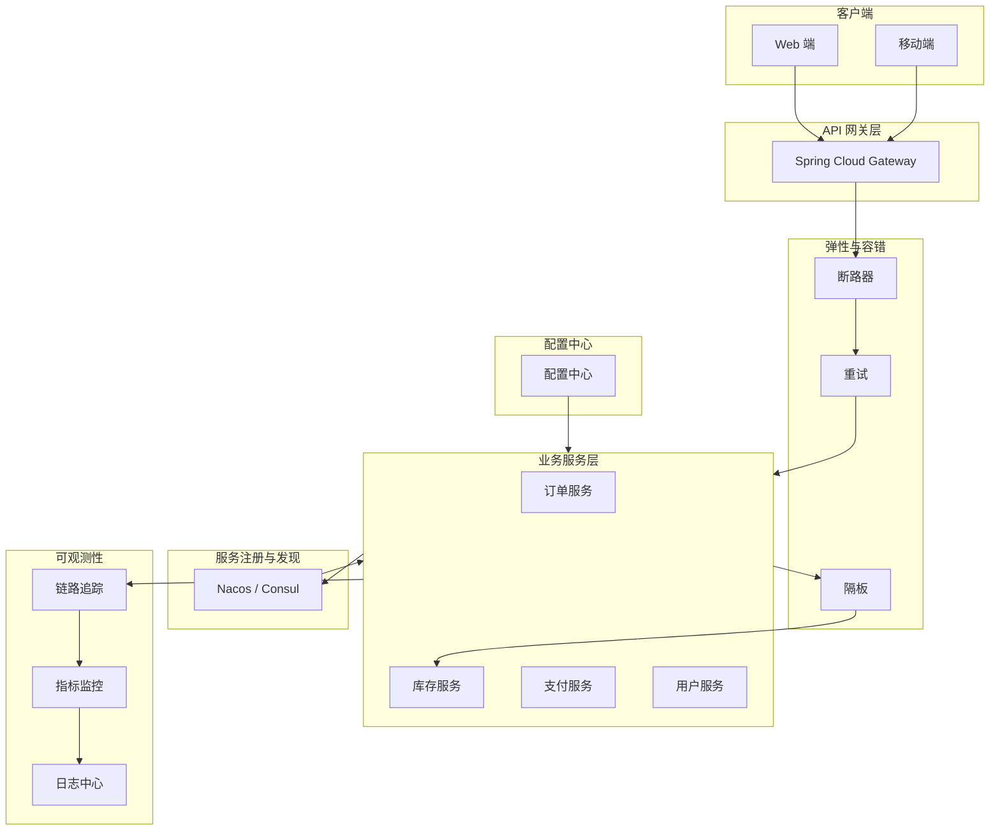
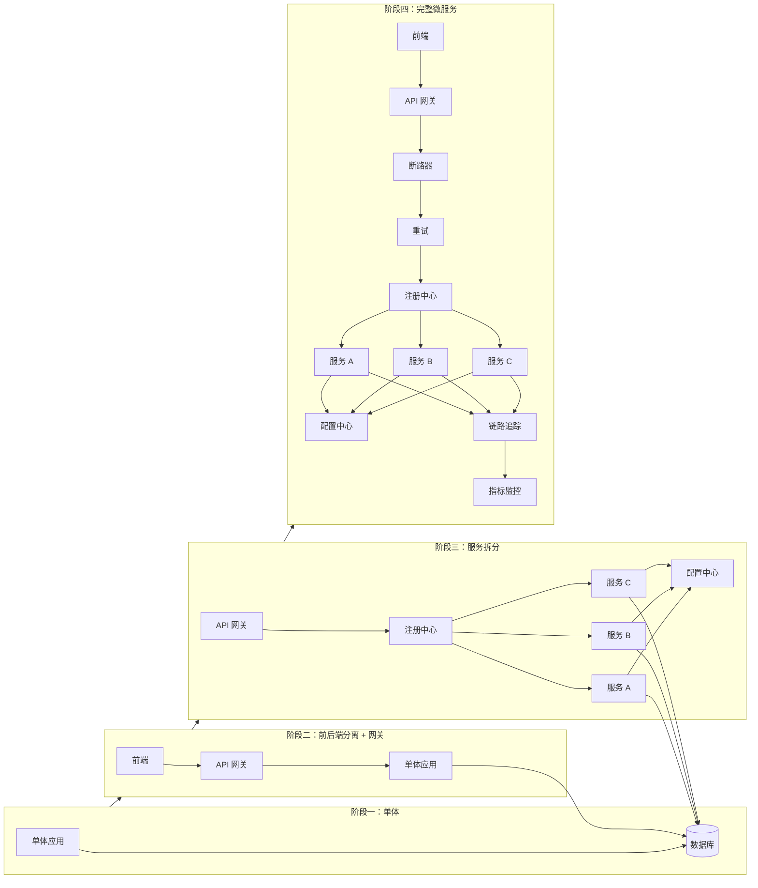

# 微服务模式

2016 年，某电商平台大促期间，用户反馈「下单页一直转圈」。技术团队排查后发现：促销服务依赖库存服务，库存服务依赖商品服务，商品服务依赖价格服务——一条五层的调用链，其中价格服务因为热点数据导致响应变慢，拖慢了整条链路。最终，这场原本预估能抗住 10 倍流量的活动，因为一个服务的 200ms 延迟，让整体下单成功率跌到了不足 30%。

这就是微服务架构最经典的噩梦：**一个服务的问题，为什么能拖垮整个系统？**

单体应用时代，所有代码在一个进程里，调用是函数调用，最多是一个方法卡住了导致 OOM。但当业务拆分成几十甚至上百个服务后，网络取代了函数调用，延迟从纳秒变成了毫秒级别，稳定性从「我的代码稳不稳」变成了「我的网络稳不稳、我的依赖稳不稳、我的基础设施稳不稳」。

微服务不是银弹。它解决了「团队协作」「独立部署」「技术异构」等问题，但也带来了分布式系统的所有复杂性。本模块要讲的，就是**如何用设计模式来管理这些复杂性**。

## 微服务架构的核心挑战

从单体到微服务，不只是把代码拆开部署那么简单。你需要面对：

**网络不可靠**。一次 HTTP 调用可能因为网络抖动而超时，因为对方服务 GC 而变慢，因为对方服务宕机而直接失败。单体时代一个空指针异常，现在可能演变成一场全链路超时。

**调用链路复杂**。一个用户请求，可能触发十几二十次服务间调用。任何一次调用失败，都可能让整个请求失败。如何追踪这棵树一样的调用关系，成了运维的噩梦。

**配置分散**。几十个服务，每个服务有自己的数据库连接池大小、超时时间、重试次数。改一个公共配置，要登录几十台机器改几十份文件。

**故障传播**。服务 A 依赖服务 B，服务 B 依赖服务 C。如果服务 C 挂了，服务 B 会被拖累，服务 A 又会被服务 B 拖垮。一个小故障，最终演变成全站雪崩。

这些挑战不是微服务独有的，而是分布式系统的共性难题。微服务模式，就是针对这些共性问题的通用解决方案。

## 核心治理模式

微服务治理是控制复杂性的关键。本模块将围绕以下几个核心维度展开：

### 入口与路由

| 模式 | 解决的问题 | 典型工具 |
| --- | --- | --- |
| API 网关模式 | 统一入口、协议转换、路由分发、认证鉴权 | Spring Cloud Gateway、Kong、Zuul |
| 负载均衡模式 | 流量分发、健康感知、故障转移 | Nginx（服务端）、Ribbon/Feign（客户端） |

### 服务注册与发现

| 模式 | 解决的问题 | 典型工具 |
| --- | --- | --- |
| 服务注册中心 | 服务实例动态注册与发现 | Eureka、Consul、Nacos |
| 客户端发现 | 消费者直接查询注册中心获取可用实例 | Ribbon、Feign |
| 服务端发现 | 通过负载均衡器统一路由 | Kubernetes Service、Nginx |

### 配置管理

| 模式 | 解决的问题 | 典型工具 |
| --- | --- | --- |
| 配置中心模式 | 集中化管理配置、动态刷新、版本控制 | Spring Cloud Config、Nacos、Apollo |
| 外部化配置模式 | 配置与代码分离、环境差异化配置 | Spring Boot external config |

### 弹性与容错

| 模式 | 解决的问题 | 典型工具 |
| --- | --- | --- |
| 断路器模式 | 故障隔离、快速失败、防止级联故障 | Resilience4j、Hystrix |
| 重试模式 | 瞬时故障恢复、指数退避策略 | Spring Retry、Resilience4j |
| 隔板模式 | 资源隔离、限制并发、防止资源耗尽 | Resilience4j Bulkhead |
| 健康检查模式 | 存活探针、就绪探针、流量调度 | Spring Boot Actuator |

### 可观测性

| 模式 | 解决的问题 | 典型工具 |
| --- | --- | --- |
| 链路追踪模式 | 请求全链路追踪、延迟分析 | Sleuth + Zipkin、Jaeger、OpenTelemetry |
| 边车模式 | 无侵入式代理、日志/监控/安全 | Istio、Linkerd |
| 遥测监控模式 | 指标采集、告警、仪表盘 | Prometheus + Grafana |

## 模式之间的协作关系

微服务模式不是孤立的，它们需要组合使用才能发挥作用。以下是典型微服务架构的模式协作图：

这张图展示了模式的协作关系：客户端请求先到网关，网关通过断路器保护调用端，断路器内部通过重试处理瞬时故障，核心业务服务通过隔板实现资源隔离。服务注册中心负责实例发现，配置中心统一管理配置，链路追踪负责可观测性。

## 典型微服务架构演进

从单体到微服务，架构不是一步到位的。下面是一个典型的演进路径：

很多团队在阶段二就停住了，因为网关解决了入口统一的问题，短期内够用。但随着团队规模扩大、服务数量增多，没有服务治理的微服务反而比单体更脆弱。

## 权衡矩阵

微服务模式能解决很多问题，但每引入一个模式，都会增加系统的复杂度和运维成本。以下是常见场景的选型建议：

| 场景 | 推荐模式组合 | 不推荐 | 理由 |
| --- | --- | --- | --- |
| 5 人以下小团队、业务复杂度低 | API 网关 + 简单配置 | 完整微服务全家桶 | 小团队维护成本过高，收益不成正比 |
| 业务复杂度高、团队 `>=` 10 人 | 全套治理模式 | 跳过核心模式 | 没有治理的微服务比单体更难维护 |
| 强一致性要求场景 | 同步调用 + 断路器 + 重试 | 异步消息优先 | 异步会带来最终一致性，电商库存等场景不适用 |
| 高并发流量入口 | API 网关 + 客户端负载均衡 | 服务端 LB 代理 | 减少一跳开销，降低延迟 |
| 多环境配置管理 | 配置中心 + 外部化配置 | 每个服务独立配置文件 | 配置分散导致运维灾难 |
| 故障排查困难 | 链路追踪 + 遥测监控 | 靠日志和经验 | 分布式环境下，日志散落在几十台机器上 |

## 过度设计的风险

微服务模式不是越多越好。我见过太多团队，引入了全套 Netflix 全家桶，结果：

- 团队里没人能说清楚每个组件的作用
- 故障时不知道该看哪个监控面板
- 配置项上百个，90% 都是默认值
- 引入的模式反而成了新的故障点

**模式的选择，应该由业务需求驱动，而不是技术炫技。** 如果你的系统每天只有几百次请求，加一个断路器不如加一个缓存。如果你的团队只有两个人，维护一套完整的服务注册中心，不如先做好代码质量和 Code Review。

引入新模式前，问自己三个问题：

1. 当前系统遇到了什么问题？这个模式能解决吗？
2. 引入这个模式会增加多少复杂度？团队能承受吗？
3. 有没有更简单的方案能达到 80% 的效果？

如果三个问题答案都是「是」，那就引入。如果有任何一个是「不确定」，先放一放。

## 本模块文章导读

本模块按照以下顺序展开，建议按顺序阅读：

**第一部分：入口与路由**（理解外部流量如何流入系统）

1. [API 网关模式](/patterns/microservices/api-gateway)——统一入口、路由、协议转换
2. [负载均衡模式](/patterns/microservices/lb-pattern)——服务端 vs 客户端负载均衡

**第二部分：服务治理基础设施**（服务如何相互找到彼此）

3. [服务注册中心](/patterns/microservices/registry)——Eureka/Consul/Nacos 对比
4. [服务发现模式](/patterns/microservices/service-discovery)——客户端发现 vs 服务端发现
5. [分布式配置](/patterns/microservices/distributed-config)——Spring Cloud Config 实战

**第三部分：弹性与容错**（如何让系统在故障时保持可用）

7. [断路器模式](/patterns/microservices/circuit-breaker)——故障隔离与快速失败
8. [重试模式](/patterns/microservices/retry)——退避策略与幂等性保障
9. [隔板模式](/patterns/microservices/bulkhead)——资源隔离
10. [健康检查模式](/patterns/microservices/health-check)——存活探针与就绪探针

**第四部分：可观测性**（如何看清系统的运行状态）

12. [链路追踪模式](/patterns/microservices/distributed-tracing)——请求全链路追踪
13. [边车模式](/patterns/microservices/sidecar)——Service Mesh 与无侵入代理

如果你是微服务架构的新手，建议从 [API 网关模式](/patterns/microservices/api-gateway) 开始，逐章阅读。如果你在项目中遇到了具体问题，可以直接跳转到对应章节。

准备好了吗？让我们从 API 网关开始，深入微服务模式的世界。
