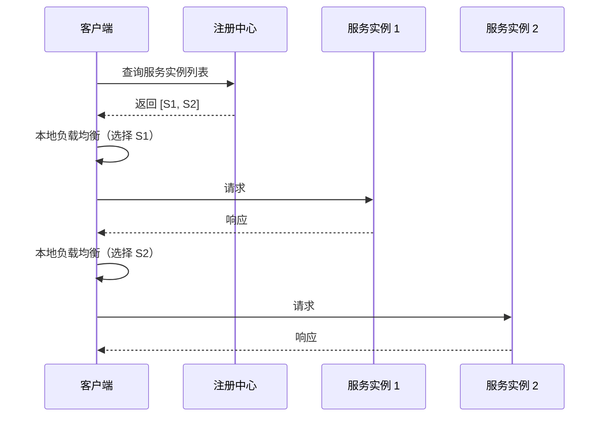
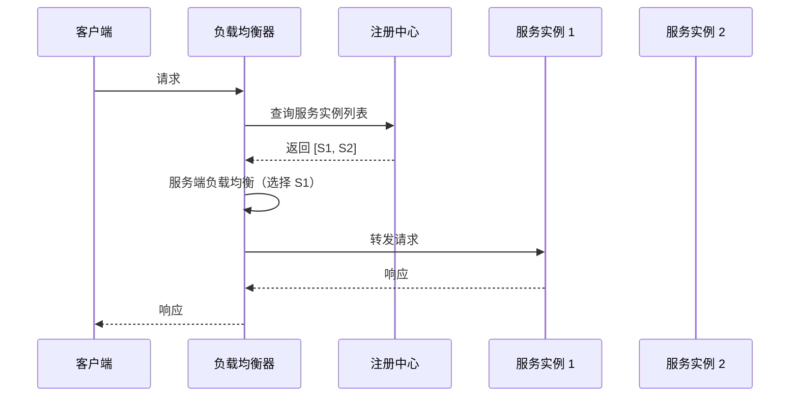

# 负载均衡模式

你的订单服务有 3 个实例，IP 分别是 192.168.1.50、192.168.1.51、192.168.1.52。现在有 100 个请求要发到这个服务，这些请求该怎么分配？

最简单的方式是轮询，每个实例各分 33-34 个请求。但如果实例 1 的机器配置更高，能扛住更多请求呢？如果实例 2 的当前负载已经很高了呢？如果实例 3 刚刚重启过，还在预热中呢？

**轮询只是最基础的负载均衡策略。真实的微服务环境里，负载均衡需要考虑服务器性能、健康状态、网络延迟、地理位置——这需要一个完整的负载均衡策略体系。**

负载均衡分为客户端负载均衡和服务端负载均衡，两种模式各有适用场景。

## 客户端负载均衡 vs 服务端负载均衡

### 客户端负载均衡

客户端直接向注册中心查询服务实例列表，自己实现负载均衡策略。客户端知道所有可用实例的地址，可以根据实时状态选择最优实例。



**优势**：

- 少一跳网络转发，降低延迟
- 客户端可以根据本地状态做更智能的路由（比如选择同机房实例）
- 去中心化，无单点故障

**劣势**：

- 客户端需要集成服务发现和负载均衡逻辑
- 多语言场景下，每个语言都要实现负载均衡器
- 本地缓存可能和注册中心不一致

### 服务端负载均衡

客户端请求发送到负载均衡器（如 Nginx、HAProxy），负载均衡器统一做路由分发。客户端只感知负载均衡器的地址，不直接访问后端实例。



**优势**：

- 客户端无需感知服务发现，架构更简单
- 适合多语言场景
- 可以做全局的流量控制和安全策略

**劣势**：

- 多一跳网络开销
- 负载均衡器是单点，需要高可用部署

## Ribbon 负载均衡器

Ribbon 是 Netflix 开源的客户端负载均衡器，Spring Cloud Netflix 对其做了集成。虽然 Ribbon 已进入维护模式，但理解其负载均衡策略仍有价值。

### 常用负载均衡策略

| 策略 | 说明 | 适用场景 |
| --- | --- | --- |
| **RoundRobinRule** | 轮询 | 默认策略，简单公平 |
| **RandomRule** | 随机 | 请求分布均匀 |
| **WeightedResponseTimeRule** | 加权响应时间 | 性能好的实例承担更多请求 |
| **BestAvailableRule** | 选择最小并发请求 | 追求低负载 |
| **ZoneAvoidanceRule** | 区域亲和 + 可用性过滤 | 多机房部署 |
| **RetryRule** | 带重试的轮询 | 临时故障自动转移 |
| **AvailabilityFilteringRule** | 过滤不可用 + 轮询 | 跳过故障实例 |

### 自定义 Ribbon 配置

```java title="RibbonConfiguration.java"
@Configuration
public class RibbonConfiguration {
    
    @Bean
    public IRule ribbonRule() {
        // 使用区域亲和策略：优先选择同区域实例，避免跨机房调用
        ZoneAvoidanceRule rule = new ZoneAvoidanceRule();
        rule.setAvailabilityPredicate(
            new AvailabilityPredicate() {
                @Override
                public boolean apply(com.netflix.loadbalancer.Server s) {
                    // 过滤掉断路器打开的服务实例
                    DiscoveryEnabledServer server = (DiscoveryEnabledServer) s;
                    return server.isReadyToServe();
                }
            }
        );
        return rule;
    }
}
```

```java title="UserServiceRibbonClient.java"
// 指定服务使用自定义 Ribbon 配置
@RibbonClient(name = "user-service", configuration = RibbonConfiguration.class)
public class UserServiceRibbonClient {
    // ...
}
```

### 带有重试的负载均衡

```java title="RetryConfiguration.java"
@Configuration
public class RetryConfiguration {
    
    @Bean
    public RetryHandler retryHandler() {
        return new DefaultLoadBalancerRetryHandler(
            3,  // 最大重试次数
            1,  // 同一实例最大重试次数
            true  // 是否对所有操作重试
        );
    }
}
```

```yaml title="application.yml"
user-service:
  ribbon:
    # 连接超时
    ConnectTimeout: 2000
    # 读取超时
    ReadTimeout: 5000
    # 最大重试次数
    MaxAutoRetries: 2
    # 同一实例最大重试次数
    MaxAutoRetriesNextServer: 1
    # 是否启用重试
    OkToRetryOnAllOperations: false
```

## Spring Cloud LoadBalancer

Spring Cloud 2020.0 版本移除了 Ribbon，推荐使用 Spring Cloud LoadBalancer。LoadBalancer 是官方推荐的替代方案，API 更简洁，与 Spring Cloud 服务发现深度集成。

### 基本使用

```java title="LoadBalancerConfig.java"
@Configuration
@LoadBalancerClient(name = "user-service", configuration = LoadBalancerConfig.class)
public class LoadBalancerConfig {
    
    @Bean
    public ReactorLoadBalancer<ServiceInstance> randomLoadBalancer(
            ServiceInstanceListSupplier supplier) {
        return new RandomLoadBalancer(supplier);
    }
    
    @Bean
    public ServiceInstanceListSupplier serviceInstanceListSupplier(
            ConfigurableApplicationContext context) {
        return ServiceInstanceListSupplier.builder()
            .withDiscoveryClient()
            .withSameInstancePreference()
            .build(context);
    }
}
```

### 自定义负载均衡策略

```java title="WeightedLoadBalancer.java"
public class WeightedLoadBalancer implements ReactorServiceInstanceLoadBalancer {
    
    private final ObjectProvider<ServiceInstanceListSupplier> supplierProvider;
    private final String serviceId;
    private final AtomicLong sequence = new AtomicLong(0);
    
    public WeightedLoadBalancer(
            ObjectProvider<ServiceInstanceListSupplier> supplierProvider,
            String serviceId) {
        this.supplierProvider = supplierProvider;
        this.serviceId = serviceId;
    }
    
    @Override
    public Mono<Response<ServiceInstance>> choose(Request<?> request) {
        ServiceInstanceListSupplier supplier = supplierProvider.getIfAvailable();
        return supplier.get(request)
            .next()
            .map(instances -> getInstanceResponse(instances, request));
    }
    
    private Response<ServiceInstance> getInstanceResponse(
            List<ServiceInstance> instances, Request<?> request) {
        
        if (instances.isEmpty()) {
            return new EmptyResponse();
        }
        
        // 根据响应时间权重选择实例
        Map<ServiceInstance, Integer> weights = calculateWeights(instances);
        int totalWeight = weights.values().stream().mapToInt(Integer::intValue).sum();
        int randomValue = ThreadLocalRandom.current().nextInt(totalWeight);
        
        int cumulative = 0;
        for (Map.Entry<ServiceInstance, Integer> entry : weights.entrySet()) {
            cumulative += entry.getValue();
            if (randomValue < cumulative) {
                return new Response<>(entry.getKey());
            }
        }
        
        // 兜底：返回随机实例
        return new Response<>(instances.get(
            ThreadLocalRandom.current().nextInt(instances.size())));
    }
    
    private Map<ServiceInstance, Integer> calculateWeights(
            List<ServiceInstance> instances) {
        Map<ServiceInstance, Integer> weights = new HashMap<>();
        
        for (ServiceInstance instance : instances) {
            // 从实例元数据获取权重，默认 100
            Integer weight = instance.getMetadata()
                .getOrDefault("weight", 100);
            weights.put(instance, weight);
        }
        
        return weights;
    }
}
```

## Spring Cloud OpenFeign 集成

OpenFeign 是声明式的 HTTP 客户端，与 Spring Cloud LoadBalancer 无缝集成。

```java title="UserFeignClient.java"
@FeignClient(name = "user-service")
public interface UserFeignClient {
    
    @GetMapping("/users/{id}")
    User getUser(@PathVariable Long id);
    
    @GetMapping("/users")
    List<User> getUsers(@RequestParam List<Long> ids);
}
```

```yaml title="application.yml"
spring:
  cloud:
    openfeign:
      client:
        config:
          default:
            connect-timeout: 2000
            read-timeout: 5000
      loadbalancer:
        # 使用 Spring Cloud LoadBalancer
        enabled: true
    # Feign 默认使用 HttpClient 连接池
    httpclient:
      enabled: true
      max-connections: 1000
      max-connections-per-route: 100
```

## 服务端负载均衡：Nginx Ingress

在 Kubernetes 环境中，Nginx Ingress 是常见的服务端负载均衡方案。

### Nginx Ingress 配置

```yaml title="nginx-ingress.yaml"
apiVersion: networking.k8s.io/v1
kind: Ingress
metadata:
  name: user-service-ingress
  annotations:
    nginx.ingress.kubernetes.io/rewrite-target: /
    nginx.ingress.kubernetes.io/proxy-connect-timeout: "30"
    nginx.ingress.kubernetes.io/proxy-read-timeout: "60"
    nginx.ingress.kubernetes.io/proxy-pass-headers: "X-User-Id,X-User-Role"
spec:
  rules:
    - host: api.example.com
      http:
        paths:
          - path: /users
            pathType: Prefix
            backend:
              service:
                name: user-service
                port:
                  number: 80
```

### 基于权重的流量分割

```yaml title="weighted-ingress.yaml"
apiVersion: networking.k8s.io/v1
kind: Ingress
metadata:
  name: user-service-weighted
  annotations:
    nginx.ingress.kubernetes.io/canary: "true"
    nginx.ingress.kubernetes.io/canary-weight: "30"
spec:
  rules:
    - host: api.example.com
      http:
        paths:
          - path: /users
            backend:
              service:
                name: user-service-v2
                port:
                  number: 80
```

## 负载均衡策略选择

| 策略 | 特点 | 适用场景 |
| --- | --- | --- |
| **轮询** | 简单公平 | 服务实例性能相近 |
| **加权轮询** | 性能好的实例承担更多 | 实例性能差异大 |
| **随机** | 分布均匀 | 无状态服务 |
| **最少连接** | 动态感知负载 | 长连接服务 |
| **一致性哈希** | 同一请求路由到同一实例 | 有缓存场景 |
| **区域感知** | 优先同机房 | 多机房部署 |
| **可用性过滤** | 跳过不健康实例 | 故障自动转移 |

## 常见问题与反模式

### 负载均衡器成为瓶颈

所有流量都经过一个负载均衡器，负载均衡器撑不住。

**正确做法**：负载均衡器集群部署 + 健康检查。或者使用客户端负载均衡，减少对中心节点的依赖。

### 忽略服务实例健康状态

负载均衡器把请求发到了已经宕机的实例上，导致大量失败。

**正确做法**：集成健康检查，及时剔除不健康实例。Ribbon 的 AvailabilityFilteringRule 可以过滤断路器打开的实例。

### 一致性哈希的哈希环不均匀

如果实例数量变化较大，一致性哈希可能导致请求分布不均。

**正确做法**：使用虚拟节点，增加哈希环的均匀性。或者选择其他更适合实例频繁变化的策略。

### 不考虑网络延迟

跨地域调用延迟高，影响用户体验。

**正确做法**：使用区域感知负载均衡，优先选择同机房实例。Spring Cloud LoadBalancer 的默认实现已经考虑了区域。

负载均衡是微服务架构的必备能力。选择客户端还是服务端负载均衡，取决于架构复杂度和运维能力。初期可以用客户端负载均衡简化架构，后期随着规模扩大，再引入服务端负载均衡做统一管理。
