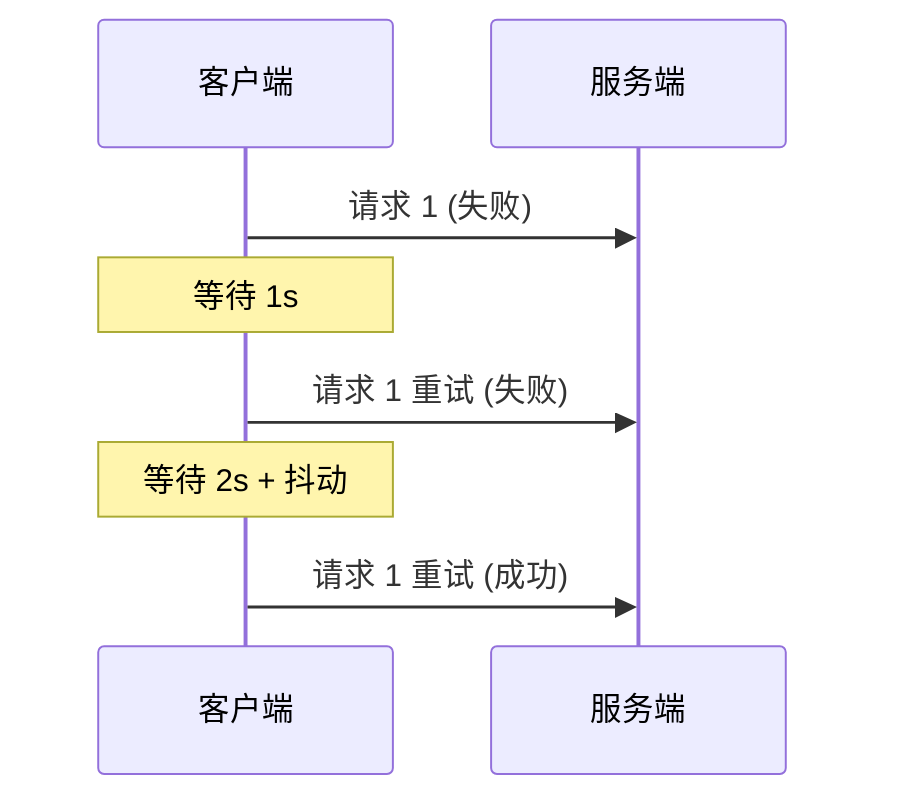
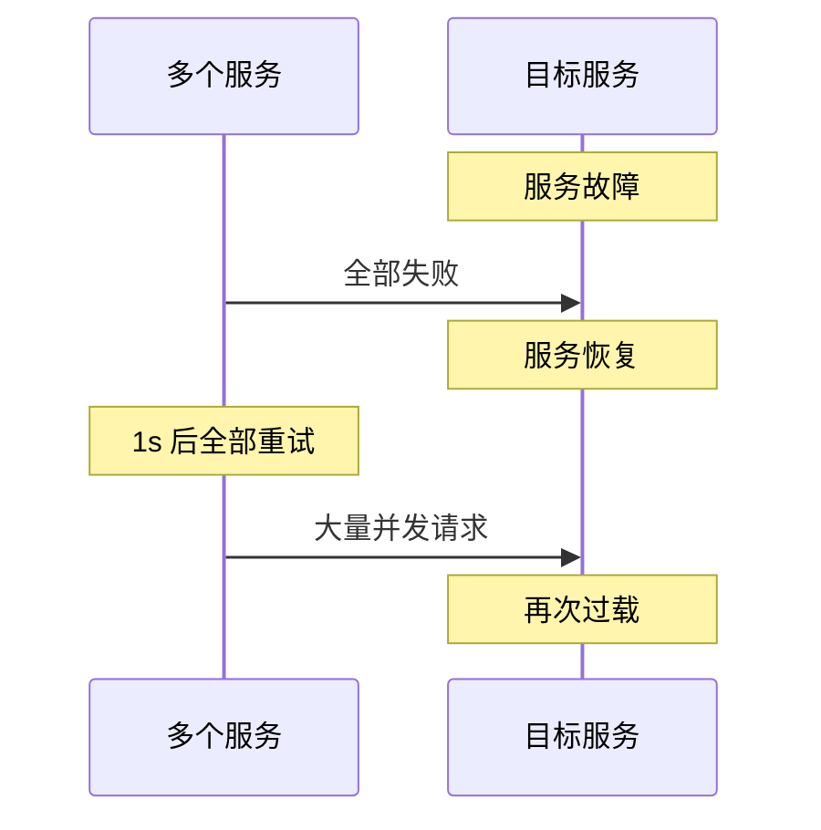

# 重试模式

凌晨 3 点，你被报警叫醒：「订单服务调用支付服务超时」。你赶紧登录监控，发现支付服务的 GC 刚刚结束，正在恢复中。这期间的几百个请求都失败了。

但实际上，如果你等几秒钟再重试，这些请求大概率都会成功。网络抖动、临时不可用、GC 暂停——这些瞬时故障重试一下就好了。但如果你没有重试机制，这些请求就只能失败告终，用户还要手动重试。

**重试模式的核心思想是：对于瞬时故障，不要立即失败，多试几次。** 但重试也不是万能的——乱重试可能造成更大问题。

## 重试策略

### 指数退避

如果立即重试，可能会和故障的服务在同一时刻再次碰撞。重试的间隔应该逐渐拉长，给服务恢复的时间。

**指数退避（Exponential Backoff）**：每次重试的间隔时间是上一次的倍数。比如：1s → 2s → 4s → 8s。

**指数退避 + 抖动（Jitter）**：如果所有请求都在同一时刻失败，它们会在同一时刻重试，形成「惊群效应」。加上随机抖动，打散重试时间。



### 退避算法实现

```java title="ExponentialBackoff.java"
public class ExponentialBackoff {
    
    private final long baseDelayMs;
    private final double multiplier;
    private final long maxDelayMs;
    private final Random random = new Random();
    
    public ExponentialBackoff(long baseDelayMs, double multiplier, long maxDelayMs) {
        this.baseDelayMs = baseDelayMs;
        this.multiplier = multiplier;
        this.maxDelayMs = maxDelayMs;
    }
    
    public long getDelay(int attempt) {
        long exponentialDelay = (long) (baseDelayMs * Math.pow(multiplier, attempt - 1));
        long jitter = random.nextLong(exponentialDelay / 2);
        long delay = exponentialDelay + jitter;
        return Math.min(delay, maxDelayMs);
    }
    
    public static void main(String[] args) {
        ExponentialBackoff backoff = new ExponentialBackoff(1000, 2, 30000);
        for (int i = 1; i <= 5; i++) {
            System.out.printf("Attempt %d: delay = %d ms%n", i, backoff.getDelay(i));
        }
    }
}
```

### Full Jitter vs Equal Jitter

两种常见的抖动策略：

| 策略 | 计算方式 | 特点 |
| --- | --- | --- |
| **Full Jitter** | `delay = random(0, base * 2^attempt)` | 完全随机，负载分散最均匀 |
| **Equal Jitter** | `delay = base * 2^attempt / 2 + random(0, base * 2^attempt / 2)` | 保证最小延迟 |

```java title="JitterStrategies.java"
public class JitterStrategies {
    
    // Full Jitter
    public static long fullJitter(int attempt, long base, double multiplier) {
        long maxDelay = (long) (base * Math.pow(multiplier, attempt));
        return ThreadLocalRandom.current().nextLong(0, maxDelay);
    }
    
    // Equal Jitter
    public static long equalJitter(int attempt, long base, double multiplier) {
        long exponentialDelay = (long) (base * Math.pow(multiplier, attempt));
        long halfDelay = exponentialDelay / 2;
        return halfDelay + ThreadLocalRandom.current().nextLong(0, halfDelay);
    }
}
```

## 幂等性保障

重试的最大风险是：**同一个请求可能被执行多次。** 如果业务不是幂等的，重试可能导致重复下单、重复扣款等问题。

幂等性保障的常见方案：

### 唯一键（Idempotency Key）

客户端生成唯一标识，服务端根据这个标识判断是否处理过：

```java title="IdempotentService.java"
@Service
public class IdempotentService {
    
    private final Map<String, Result> idempotencyCache = new ConcurrentHashMap<>();
    private final ScheduledExecutorService cleanup = Executors.newSingleThreadScheduledExecutor();
    
    public IdempotentService() {
        // 定期清理过期记录
        cleanup.scheduleAtFixedRate(() -> {
            long expired = System.currentTimeMillis() - 24 * 3600 * 1000;
            idempotencyCache.entrySet().removeIf(e -> Long.parseLong(e.getKey().split(":")[1]) < expired);
        }, 1, 1, TimeUnit.HOURS);
    }
    
    public Result processRequest(String idempotencyKey, Request request) {
        // 检查是否处理过
        if (idempotencyCache.containsKey(idempotencyKey)) {
            return idempotencyCache.get(idempotencyKey);
        }
        
        // 业务处理
        Result result = doProcess(request);
        
        // 缓存结果
        idempotencyCache.put(idempotencyKey, result);
        
        return result;
    }
    
    private Result doProcess(Request request) {
        // 实际业务逻辑
        return new Result();
    }
}
```

### 版本号控制

数据库操作使用乐观锁，通过版本号防止重复更新：

```java title="VersionControlledService.java"
@Service
public class VersionControlledService {
    
    @Autowired
    private OrderRepository orderRepository;
    
    @Transactional
    public void updateOrderStatus(Long orderId, String newStatus, Long expectedVersion) {
        int updatedRows = orderRepository.updateStatusWithVersion(
            orderId, newStatus, expectedVersion);
        
        if (updatedRows == 0) {
            throw new OptimisticLockException(
                "Order version mismatch, expected: " + expectedVersion);
        }
    }
}
```

```sql title="OrderMapper.xml"
<update id="updateStatusWithVersion">
    UPDATE orders
    SET status = #{newStatus},
        version = version + 1
    WHERE id = #{orderId}
      AND version = #{expectedVersion}
</update>
```

### 分布式锁

使用分布式锁保证同一请求只被处理一次：

```java title="DistributedLockService.java"
@Service
public class DistributedLockService {
    
    private final RedisTemplate<String, String> redisTemplate;
    
    public Result processWithLock(String requestId, Runnable task) {
        String lockKey = "lock:request:" + requestId;
        String lockValue = UUID.randomUUID().toString();
        
        try {
            // 获取锁，最多等待 0 秒，锁自动过期 30 秒
            Boolean acquired = redisTemplate.opsForValue()
                .setIfAbsent(lockKey, lockValue, Duration.ofSeconds(30));
            
            if (!Boolean.TRUE.equals(acquired)) {
                // 已有其他实例在处理
                return Result.ALREADY_PROCESSED;
            }
            
            // 执行业务逻辑
            return execute(task);
        } finally {
            // 释放锁（只能释放自己的锁）
            String currentValue = redisTemplate.opsForValue().get(lockKey);
            if (lockValue.equals(currentValue)) {
                redisTemplate.delete(lockKey);
            }
        }
    }
    
    private Result execute(Runnable task) {
        task.run();
        return Result.SUCCESS;
    }
}
```

## Spring Retry 实战

Spring Retry 提供了声明式的重试能力，可以和 Spring 项目无缝集成。

### 依赖配置

```xml title="pom.xml"
<dependency>
    <groupId>org.springframework.retry</groupId>
    <artifactId>spring-retry</artifactId>
    <version>2.0.0</version>
</dependency>
<dependency>
    <groupId>org.springframework</groupId>
    <artifactId>spring-aspects</artifactId>
</dependency>
```

```java title="RetryConfiguration.java"
@Configuration
@EnableRetry
public class RetryConfiguration {
    
    // 可选：自定义 RetryTemplate
    @Bean
    public RetryTemplate retryTemplate() {
        RetryTemplate retryTemplate = new RetryTemplate();
        
        // 配置重试策略
        ExponentialBackOffPolicy backOffPolicy = new ExponentialBackOffPolicy();
        backOffPolicy.setInitialInterval(1000);
        backOffPolicy.setMultiplier(2.0);
        backOffPolicy.setMaxInterval(30000);
        retryTemplate.setBackOffPolicy(backOffPolicy);
        
        // 配置重试次数
        SimpleRetryPolicy retryPolicy = new SimpleRetryPolicy();
        retryPolicy.setMaxAttempts(3);
        retryTemplate.setRetryPolicy(retryPolicy);
        
        return retryTemplate;
    }
}
```

### 声明式重试

```java title="RetryableService.java"
@Service
public class RetryableService {
    
    private final UserFeignClient userFeignClient;
    private final OrderRepository orderRepository;
    
    public RetryableService(UserFeignClient userFeignClient, 
                          OrderRepository orderRepository) {
        this.userFeignClient = userFeignClient;
        this.orderRepository = orderRepository;
    }
    
    // 默认重试配置
    @Retryable(value = {RemoteServiceException.class}, 
               maxAttempts = 3,
               backoff = @Backoff(delay = 1000, multiplier = 2))
    public User getUser(Long userId) {
        return userFeignClient.getUser(userId);
    }
    
    // 自定义重试策略
    @Retryable(value = {TransientDataAccessException.class},
               maxAttemptsExpression = "${retry.maxAttempts:3}",
               backoff = @Backoff(delayExpression = "${retry.delay:1000}"))
    public void saveOrder(Order order) {
        orderRepository.save(order);
    }
    
    // 包含恢复逻辑
    @Retryable(value = {Exception.class},
               maxAttempts = 3,
               recover = "recoverFallback")
    public Result callService() {
        throw new RuntimeException("Service unavailable");
    }
    
    public Result recoverFallback(Exception e) {
        log.error("All retries exhausted", e);
        return Result.fallback();
    }
}
```

### Resilience4j 重试

```yaml title="application.yml"
resilience4j:
  retry:
    instances:
      userService:
        maxAttempts: 3
        waitDuration: 1s
        enableExponentialBackoff: true
        exponentialBackoffMultiplier: 2
        retryExceptions:
          - java.io.IOException
          - feign.Feign.ServiceUnavailableException
        ignoreExceptions:
          - java.lang.IllegalArgumentException
```

```java title="Resilience4jRetryService.java"
@Service
public class Resilience4jRetryService {
    
    private final RetryRegistry retryRegistry;
    private final UserFeignClient userFeignClient;
    
    public Resilience4jRetryService(RetryRegistry retryRegistry,
                                    UserFeignClient userFeignClient) {
        this.retryRegistry = retryRegistry;
        this.userFeignClient = userFeignClient;
        
        // 注册监听器
        Retry retry = retryRegistry.retry("userService");
        retry.getEventPublisher()
            .onRetry(event -> 
                log.warn("Retrying call, attempt {} due to: {}", 
                    event.getNumberOfRetryAttempts(),
                    event.getLastThrowable().getMessage()))
            .onSuccess(event ->
                log.info("Call succeeded after {} attempts",
                    event.getNumberOfRetryAttempts()));
    }
    
    public User getUserWithRetry(Long userId) {
        Retry retry = retryRegistry.retry("userService");
        
        Supplier<User> supplier = () -> userFeignClient.getUser(userId);
        Supplier<User> decoratedSupplier = Decorators.ofSupplier(supplier)
            .withRetry(retry)
            .decorate();
        
        return decoratedSupplier.get();
    }
}
```

## 重试的边界

### 超时重试 vs 永久重试

| 类型 | 说明 | 适用场景 |
| --- | --- | --- |
| **超时重试** | 在有限时间内重试 | 大多数场景 |
| **永久重试** | 一直重试直到成功 | 异步任务、消息队列 |

### 什么情况不应该重试

- 业务逻辑错误（如参数校验失败）
- 认证鉴权失败
- 资源不存在（404）
- 超时时间过长的请求

### 重试风暴问题

当大量请求同时失败后，它们会在同一时刻重试，可能压垮正在恢复的服务：



**解决方案**：

- 添加随机抖动，打散重试时间
- 使用令牌桶限流
- 渐进式恢复（半开状态）

## 常见问题与反模式

### 无限制重试

没有设置最大重试次数，或者最大重试次数设置过大，可能导致无限重试。

**正确做法**：设置合理的最大重试次数（通常 3-5 次），配合指数退避。

### 重试非幂等操作

对非幂等操作（如支付扣款）进行重试，可能导致重复扣款。

**正确做法**：确保所有可能被重试的操作都是幂等的。使用唯一键或分布式锁防止重复处理。

### 重试所有异常

对所有异常都进行重试，包括业务异常、参数校验异常。

**正确做法**：只对可恢复的异常（如网络超时、连接失败）进行重试。

### 忽略重试代价

重试会增加接口的响应时间，可能影响用户体验。

**正确做法**：根据业务场景选择重试策略。高延迟敏感场景，考虑快速失败而非重试。

## 适用场景

**应该使用重试**：

- 调用外部服务，可能因为网络抖动临时失败
- 异步消息处理，确保消息被消费
- 幂等性有保障的业务操作

**不应该使用重试**：

- 非幂等操作（除非有幂等保障）
- 对延迟敏感的用户请求
- 业务逻辑错误

重试是容错机制的重要组成部分，但必须配合幂等性保障和合理的退避策略才能发挥作用。
