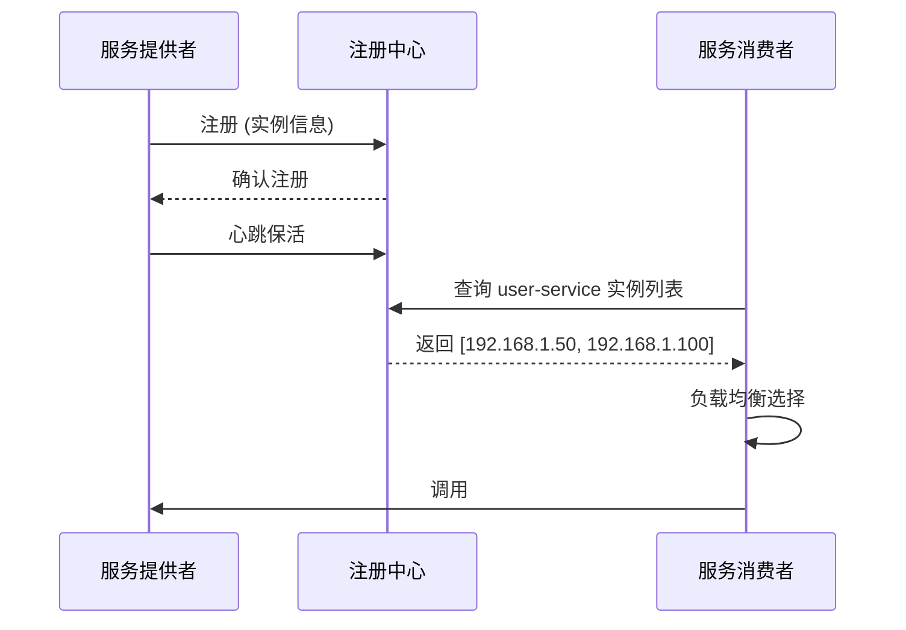
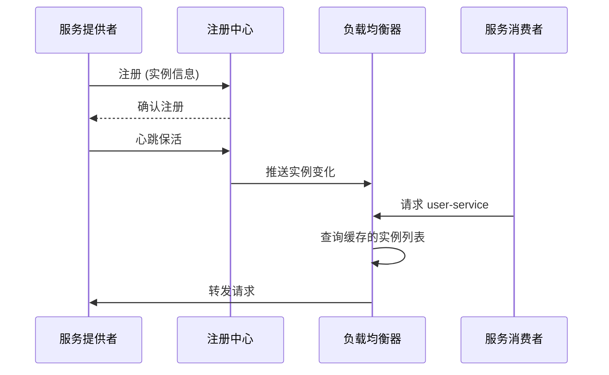
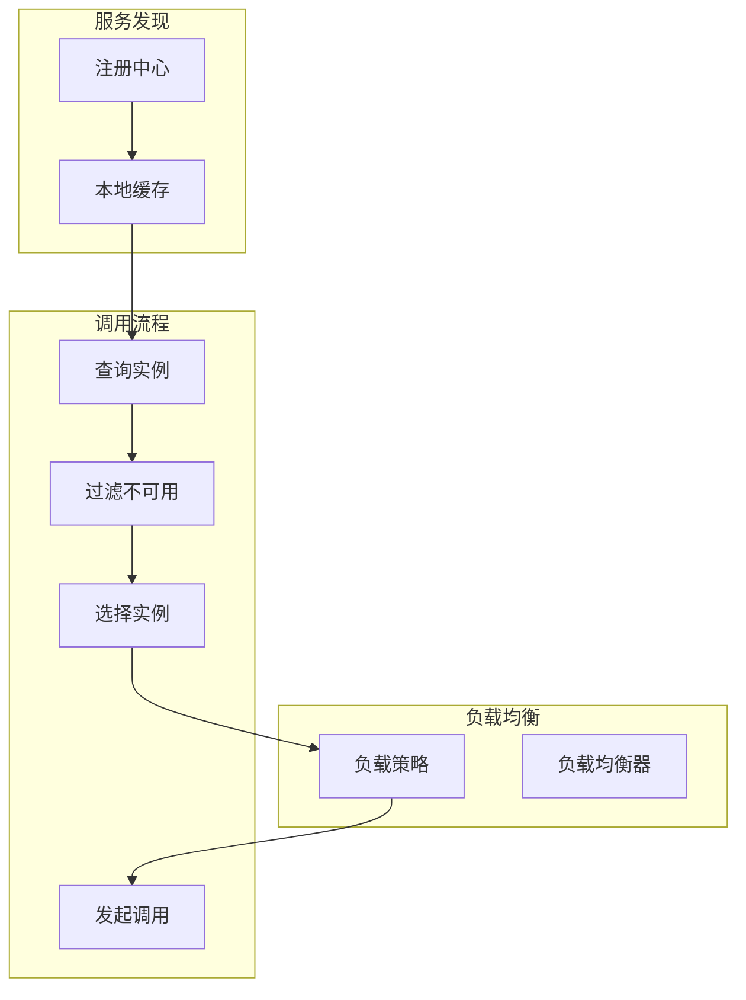

# 服务发现模式

你的订单服务刚上线了新节点，IP 是 192.168.1.100。但调用方——库存服务、支付服务、物流服务——都不知道这个新节点的存在。它们还在轮流向 192.168.1.50 发请求。这就是微服务架构的核心挑战：**服务实例的 IP 地址是动态的，靠配置文件根本管不过来。**

服务发现模式，就是让服务实例在启动时主动注册到注册中心，调用方通过查询注册中心获取可用实例列表。当服务实例变化时（新增、宕机、扩容），注册中心通知所有订阅方，调用方自动感知变化。

**服务发现的本质，是把「服务名」变成「可用的网络地址」。**

## 客户端发现 vs 服务端发现

服务发现有两种架构模式，各有优劣。

### 客户端发现

客户端直接向注册中心查询服务实例列表，自己选择调用哪个实例。典型的实现是 Netflix Eureka + Ribbon。



**优势**：

- 少一跳网络开销，消费者直接调用提供者
- 消费者可以根据本地负载情况做更智能的路由
- 去中心化，单个组件故障不影响其他消费者

**劣势**：

- 消费者需要集成服务发现逻辑，增加复杂度
- 每个消费者都要维护实例缓存，本地缓存可能和注册中心不一致
- 多语言场景下，每个语言都要实现服务发现客户端

### 服务端发现

消费者通过负载均衡器（如 Kubernetes Service、Nginx）访问服务，负载均衡器向注册中心查询实例列表。典型的实现是 Consul + Nginx 或 Kubernetes Service。



**优势**：

- 消费者无需感知服务发现逻辑，对消费者透明
- 天然适合多语言场景
- 可以做全局的负载均衡策略

**劣势**：

- 多一跳网络开销
- 负载均衡器成为新的单点（虽然可以做高可用）
- 负载均衡器的配置和注册中心的同步可能有时延

## 服务注册机制

### 心跳机制

服务实例通过心跳证明自己还活着。常见的心跳机制有三种：

**自动心跳**：服务实例定期向注册中心发送心跳，注册中心在超时阈值后移除失效实例。

```java title="HeartbeatService.java"
@Service
public class HeartbeatService {
    
    @Autowired
    private EurekaClient eurekaClient;
    
    @Autowired
    private InstanceInfo instanceInfo;
    
    @Scheduled(fixedRate = 30000)
    public void sendHeartbeat() {
        // 向 Eureka 发送心跳，默认 30 秒一次
        InstanceStatus status = eurekaClient.getInstanceRemoteStatus();
        if (status == InstanceStatus.UP) {
            // 续约成功
            log.debug("Heartbeat sent successfully");
        }
    }
}
```

**服务端探测**：注册中心主动探测服务实例的健康状态，不需要服务实例主动发送心跳。Consul 默认采用这种方式。

```yaml title="consul-agent.json"
{
  "check": {
    "id": "user-service-health",
    "name": "user-service health check",
    "http": "http://192.168.1.50:8080/actuator/health",
    "interval": "10s",
    "timeout": "5s",
    "deregister_critical_service_after": "1m"
  }
}
```

**客户端上报**：服务实例通过健康检查端点暴露自己的状态，注册中心定期请求该端点。Spring Boot Actuator + 注册中心客户端是常见实现。

### 健康检查策略

健康检查是服务发现的关键环节。健康的实例会被加入路由池，不健康的实例会被剔除。

| 检查类型 | 实现方式 | 适用场景 |
| --- | --- | --- |
| **心跳检测** | 服务主动发送心跳 | Eureka、Zookeeper |
| **HTTP 健康检查** | 请求 /health 端点 | Consul、Spring Boot |
| **TCP 端口检查** | 检测端口是否可连接 | 网络服务探测 |
| **命令执行** | 执行自定义脚本 | 复杂健康判断 |
| **Docker 容器健康** | Docker 自带的健康检查 | 容器化部署 |

## Spring Cloud Eureka 客户端发现

Eureka 是 Netflix 开源的服务注册中心，Spring Cloud 对其做了封装，是早期 Spring Cloud 项目的首选。

### 服务提供者注册

```yaml title="application.yml"
spring:
  application:
    name: user-service
  cloud:
    inetutils:
      preferred-networks: 192.168
eureka:
  instance:
    hostname: ${HOSTNAME:localhost}
    instance-id: ${spring.application.name}:${spring.cloud.client.ip-address}:${server.port}
    lease-renewal-interval-in-seconds: 30
    lease-expiration-duration-in-seconds: 90
    prefer-ip-address: true
  client:
    register-with-eureka: true
    fetch-registry: true
    service-url:
      defaultZone: http://eureka-server:8761/eureka/
```

### 服务消费者发现

```java title="UserServiceClient.java"
@FeignClient(name = "user-service", fallbackFactory = UserServiceFallbackFactory.class)
public interface UserServiceClient {
    
    @GetMapping("/users/{id}")
    User getUser(@PathVariable("id") Long id);
}
```

```java title="UserServiceFallbackFactory.java"
@Component
public class UserServiceFallbackFactory implements FallbackFactory<UserServiceClient> {
    
    @Override
    public UserServiceClient create(Throwable cause) {
        return new UserServiceClient() {
            @Override
            public User getUser(Long id) {
                log.error("Fallback: Failed to get user {}, reason: {}", id, cause.getMessage());
                return User.defaultUser(id);
            }
        };
    }
}
```

### Eureka 自我保护模式

Eureka 有一个著名的「自我保护模式」。当注册中心在 15 分钟内超过 85% 的客户端实例没有正常的心跳续约，Eureka 会认为这是一个网络分区故障，进入自我保护模式。

在自我保护模式下，Eureka 不再剔除注册列表中过期的实例，直到它认为网络恢复正常。**这会导致一个后果：已经宕机的实例可能还在 Eureka 的列表中。**

```java title="EurekaServerConfig.java"
// Eureka Server 端的自我保护配置
eureka:
  server:
    # 禁用自我保护（生产环境建议开启）
    enable-self-preservation: true
    # 清理无效实例的间隔
    eviction-interval-timer-in-ms: 5000
    # 触发自我保护的续约百分比阈值
    renewal-percent-threshold: 0.85
```

**什么时候应该关闭自我保护？**

- 你的服务实例很少（比如只有 2-3 个），自我保护可能永远不触发
- 你有更可靠的方式（如 Kubernetes）检测实例健康
- 你能接受实例短暂不可用，不会造成严重影响

**什么时候应该开启自我保护？**

- 服务实例很多，网络分区可能导致大量实例同时失联
- 你的应用对可用性要求极高，不能容忍任何误剔除

## Consul 服务端发现

Consul 是 HashiCorp 开源的服务注册中心，支持服务发现、健康检查、K/V 存储。相比 Eureka，Consul 是 CP 模型，保证一致性。

### Consul 服务注册

```yaml title="application.yml"
spring:
  cloud:
    consul:
      host: consul-server
      port: 8500
      discovery:
        service-name: ${spring.application.name}
        instance-id: ${spring.application.name}:${spring.cloud.client.ip-address}
        health-check-path: /actuator/health
        health-check-interval: 10s
        prefer-ip-address: true
        tags:
          version: v1
          zone: zone-a
```

### Consul 负载均衡

Consul-Template 可以生成 Nginx 配置，实现服务端负载均衡：

```hcl title="nginx-consul-template.ctmpl"
upstream backend {
{{ range service "user-service" }}
    server {{ .Address }}:{{ .Port }};
{{ end }}
}

server {
    location / {
        proxy_pass http://backend;
    }
}
```

## 服务发现与负载均衡的配合

服务发现和负载均衡是紧密配合的两个环节。



**完整流程**：

1. 启动时，消费者从注册中心拉取服务实例列表
2. 注册中心推送实例变化，本地缓存实时更新
3. 调用前，负载均衡器根据策略从缓存中选择实例
4. 过滤掉不健康的实例，选择最优实例
5. 发起调用，捕获异常，更新负载均衡器状态

## 常见问题与反模式

### 服务实例延迟注销

服务实例崩溃时，来不及发送下线通知就消失了。如果注册中心不能及时剔除这个实例，调用方会持续向已宕机的实例发请求，导致大量失败。

**解决方案**：使用健康检查 + 短心跳间隔。如果实例崩溃，健康检查失败，注册中心立即标记为不健康。

### 消费者缓存过期

消费者本地缓存的实例列表可能和注册中心不一致。当注册中心剔除实例后，消费者的缓存还没有更新，继续向无效实例发请求。

**解决方案**：在调用失败后主动刷新本地缓存，或者使用更短的缓存过期时间。

### 跨 IDC 服务发现

多机房部署时，每个 IDC 可能都有自己的注册中心实例。如何让服务消费者发现其他 IDC 的服务实例？

**解决方案**：

- 跨机房同步：注册中心之间同步实例信息
- 智能 DNS：根据来源 IP 返回最近的实例
- 异地容灾：每个机房至少有一个可用实例

## 适用场景

**客户端发现适合**：

- Spring Cloud 全家桶项目，Java 技术栈
- 服务实例较多，需要精细化的负载均衡策略
- 对性能要求高，不希望多一跳

**服务端发现适合**：

- 多语言环境，需要统一的服务入口
- Kubernetes 环境，直接使用 Kubernetes Service
- 已经有一套负载均衡基础设施

服务发现是微服务架构的基础设施。没有服务发现，服务实例的 IP 地址管理会变成一场噩梦。但服务发现也会引入注册中心这个新的组件，需要保证注册中心的高可用，否则整个服务网格都会受影响。
